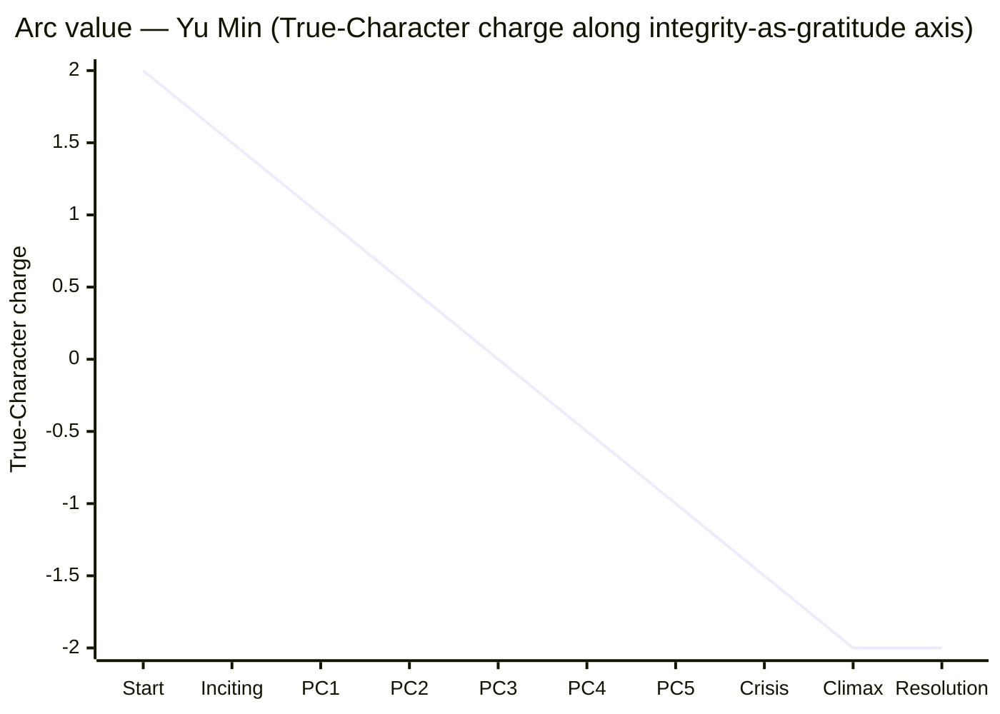

# Arc — Yu Min

## 1. Arc shape and rationale

**Negative arc.** Yu Min begins idealistic and ends corrupted. The Controlling Idea is **ironic** ("Gratitude becomes its own corruption when the saved cannot bear to ruin the savior"), and an ironic Idea sits comfortably on a negative arc *only* when the corruption is delivered as the protagonist's *honoring* of her highest value (gratitude). A negative arc that read as straightforward moral collapse would belong to a pessimist Idea, not an ironic one — the irony lives in the audience seeing what Yu Min cannot see: that her best self has been used against her.

Genre permits/forbids:
- **Crime — Institutional Drama** (primary): permits negative arcs (see *Chinatown* exemplar). Conventional.
- **Punitive Plot** (secondary): *requires* a negative arc — a good person becomes bad and is punished. The "punishment" here is ontological, not legal: she has become Wei.

The closing state must show her *not knowing* she has been corrupted — she must believe her choice was correct, even necessary. This is the negation-of-the-negation in McKee's terms: she carries the corruption *forward* by teaching it to the next inspector. Confirmed by `controlling-idea.md` §2's third row.

## 2. The five landmarks (pinned to spine)

| # | Landmark | Spine event (from spine.md) | What changes inside the character | Visible behavior in scene |
|---|---|---|---|---|
| 1 | **Initial state** | story-start (Day 1, 14:30 — ten minutes before discovery) | (baseline) Yu Min believes the saving-story unironically; her professional integrity and her gratitude to Wei are aligned. | She delivers a clean weekly summary to Wei's office; on the way out she straightens his desk calendar by half a degree. The gesture is automatic; it dramatizes alignment. |
| 2 | **First crack** | Inciting Incident (Day 1, 14:40) — she matches Wei's exemption signature against her own logbook | The alignment fractures: integrity and gratitude pull in opposite directions for the first time. The crack is not yet a wound. | She *re-checks* the match — three times. The third check is the crack: the disbelief has begun to harden into recognition. She closes the logbook and sets it on her desk *upside down* (a tic-violation; she always sets it right-side-up). |
| 3 | **Mid-arc revelation** | PC3 / Scene 14 (Day 2, 16:00 — Wei's signed endorsement) | She sees, for the first time, that **no third path exists**. The revelation is not "Wei is corrupt" — she has known that since Day 1; the revelation is that *she will not file*. The revelation is about herself, not Wei. | She accepts the endorsement letter; she does not put it down on his desk; she does not refuse it; she leaves with it in her bag. The visible behavior is her hand on the letter — and the watch tightening on her wrist as she crosses the threshold. |
| 4 | **Crisis revelation** | Crisis (Day 3, 17:35) — two manifests on her desk, dream of unreadable document returning | Self-knowledge crystallizes: she sees that she has *already authored* the third document. The falsified manifest in front of her is not a panicked draft; it is the act she has been preparing for since Day 2 evening without admitting it. The recognition is not "I will choose B"; the recognition is "I have already chosen B." | (no overt action — recognition) Her hand pauses above the falsified manifest; she does not pick up either page; she breathes; the dream returns; her hand moves. The held moment is the landmark. |
| 5 | **Climactic action** | Climax (Day 3, 17:58) | True Character is acted on: she preserves Wei by becoming Wei. The arc's negative pole is reached. | The seal lands twice — once for the inspector's stamp, once for the forged countersign. The 18:00 whistle. She walks out at 18:01 carrying nothing. |

## 3. Want / Need migration *(protagonist only)*

| Phase | Conscious want | Unconscious need | Distance |
|---|---|---|---|
| Story-start | To pass her permanent-posting review with a clean professional record and continue earning Wei's quiet approval. | To be free of the saving-story — to no longer be the daughter Wei rescued. | wide; opposite directions |
| Mid-arc (after Scene 14) | To file *something* that protects both Wei and her career. The conscious want has begun to bend — she still wants the posting, but she no longer wants the *clean* record. The compromise is forming. | To be free of the saving-story (unchanged). | closing — the want has been compromised toward what looks like pragmatism but is actually a step toward the need's *false* satisfaction |
| Crisis | The conscious want has narrowed to: *file something the institution will accept*. She is no longer asking what she wants; she is asking what is possible. | She recognizes — for one held moment — that the unconscious need is asking her to *become* Wei. She does not name this; she enacts it. | minimal — want and need converge on the falsified manifest, but for opposite reasons (want: institutional acceptance; need: ontological inheritance of Wei's position) |
| Climax / Resolution | (the want has been served — she has the permanent posting) | (the need has been *catastrophically* served — she is free of the saving-story by *becoming the next chapter of it*; she is no longer the saved daughter; she is the savior of the savior) | resolved — the irony |

**Moment of want-need flip**: between Crisis (17:35) and Climax (17:58). Specifically: *the breath she takes before her hand moves to the seal*. Before that breath she could still choose. After that breath she has already chosen, and the choice has *given her the unconscious need on the worst possible terms*.

## 4. Value progression (Mermaid)

The True-Character line declines monotonically — a clean negative arc. Compare with the spine's external value progression (also negative), which they roughly *parallel* through Acts 1–2 but **diverge subtly at the Climax**: in the institutional reading, the Climax is a "+ for the institution" (the racket is preserved, the posting is granted) — but Yu Min's True-Character charge is at its lowest point. The audience reads the irony in the divergence.

## 5. Obligatory revelation scenes (handoff to scene-architect)

| Landmark | Scene name | Setting | Whose presence is required | What action carries the revelation |
|---|---|---|---|---|
| 2 (First crack) | "The Third Check" | Third-floor inspection office, Day 1 14:40 | Yu Min alone | She re-checks the match three times; the third check, she closes the logbook *upside down*. Visible action; no dialogue. |
| 3 (Mid-arc revelation) | "The Endorsement" *(already written: scenes/14-the-endorsement.md)* | Wei's fourth-floor office, Day 2 16:00 | Yu Min, Wei | Beat 5 (Wei's pen lands square on the signed page); Yu Min's silence; the watch tightening as she leaves with the letter. |
| 4 (Crisis revelation) | "The Two Manifests" | Third-floor inspection office, Day 3 17:35 | Yu Min alone | The dream of signing an unreadable document returns. Held breath above the two pages. **Recognition is silent and held**; the next scene begins her motion. *(For `scene-architect` and `beat-miner` to design.)* |
| 5 (Climactic action) | "The Two Seals" | Third-floor inspection office, Day 3 17:58 | Yu Min alone | The seal pressing twice. The 18:00 whistle on the second press. Walking out empty-handed. **The Climax itself.** *(For `scene-architect` and `beat-miner` to design.)* |

## 6. Counterpoint with other principals

| Principal | Their arc shape | Where it intersects this arc | Effect |
|---|---|---|---|
| Wei | **flat by design** (post-arc — his choices were made years ago; the story finds him constant) | Scene 14 (PC3) is the contact point: he embodies the Counter-Idea while she is at her last opportunity for revelation. His flatness *is* the antagonism. | He sets the standard she rises (or falls) to meet. A changing Wei would soften the irony; a flat Wei is the moral mirror. |
| Lin Xue | **flat / closed** (her arc happened before the story; she is constant in this story) | PC4 (S2.4 / False Ending): her line "they escape themselves" delivers the alternate version of the negative arc — Lin Xue's negative arc *already happened* and she lives in its aftermath. | Mirror antagonism. Yu Min's Climactic action is the version of this arc *Lin Xue did not choose* — Lin Xue ran; Yu Min stayed. Both are corruptions; the difference is the *form* of the corruption, not the fact. |
| Mother | **flat / unchanged** (no arc; she is the saving-story incarnate) | Act 1 close (the bone broth, the manifest under the pillow); PC2 (the dumplings at the gate). | Personal-level antagonism by way of love. Her flatness is what makes Yu Min's negative arc invisible to her — the mother will never know. |

## 7. Seven-Point Arc Audit

- [x] **Arc shape named** — negative — **and consistent with Controlling Idea pole** — ironic. Negative arcs sit comfortably on ironic Ideas when the corruption is the protagonist's honoring of her highest value.
- [x] **All five landmarks pinned to spine events** — Initial state (Day 1 14:30), First crack (Inciting Incident), Mid-arc revelation (PC3 / Scene 14), Crisis revelation (Crisis), Climactic action (Climax). All five have specific time, location, and visible behavior.
- [x] **Mid-arc revelation earned by a Progressive Complication** — PC3 (the Private Confrontation). Earned through Wei's *refusal* to give her the dialogue she needed to file truthfully. Not a confidant's speech.
- [x] **Crisis revelation is recognition, not decision** — Crisis (Day 3 17:35) is the held moment where she sees she has *already authored* the third document. The decision-as-action is the Climax (17:58). Distinct.
- [x] **Climactic action requires this arc** — only Yu Min's specific saving-story, her specific dimensions (especially D2 and D4), and her specific fortyfold gratitude can produce *the forged countersign*. A different protagonist could file truthfully or run, but the third-document forgery requires her exact contradictions.
- [x] **Want-to-need migration named** — wide → closing → minimal → resolved (with irony). Moment of flip: the breath before the seal at the Climax.
- [x] **Other principals' arcs accounted for or deferred** — Wei flat by design; Lin Xue flat-with-prior; mother flat. All justified in §6. *Confirmed: no principal's arc is left undefined.*

## 8. Open questions for the writer

- The Crisis revelation is currently silent and held. Is there a writer-level concern that "silent and held" doesn't read on the page? *(Per `subtext-whisperer` discipline: silent revelation is permissible if the audience has been primed to read it. Acts 1–2 must build that priming.)*
- Should the dream-of-unreadable-document fragment in the Crisis be *literally* unreadable on the page (e.g., elided text, blurred image) or rendered in language? *(Recommend: rendered minimally — "she dreams of signing a page she cannot read" — and trust the reader. Visual blur belongs to film.)*
- The arc-value chart shows monotonic decline. Should there be a small *recovery beat* somewhere — perhaps in S2.4's False Ending — to show the arc is not strictly mechanical? *(Recommend: yes, a small uptick at PC4 morning when the Tianjin transfer is offered; revise the Mermaid chart from `[2, 1.5, 1, 0.5, 0, -0.5, -1, -1.5, -2, -2]` to `[2, 1.5, 1, 0.5, 0, 0.3, -1, -1.5, -2, -2]`. The 0.3 represents the moment of false hope before Lin Xue's line collapses it. This is the False Ending's signature.)*

## 9. Handoff

`→ scene-architect` (design "The Third Check" / Landmark 2 scene; "The Two Manifests" / Crisis scene; "The Two Seals" / Climax scene).
`→ beat-miner` (the Crisis scene's held breath needs beat-level design; the silence is structurally load-bearing).
`→ subtext-whisperer` (verify the Mid-arc revelation in Scene 14 is reading as revelation, not as exposition).
