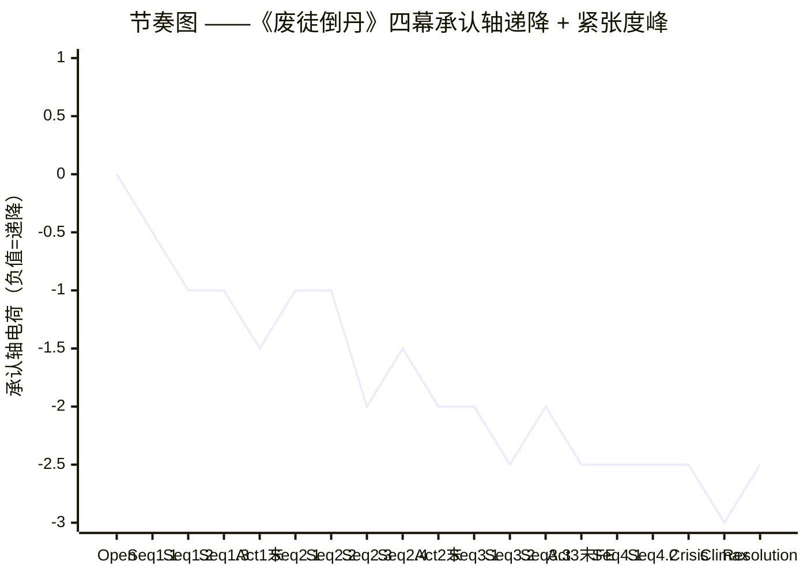
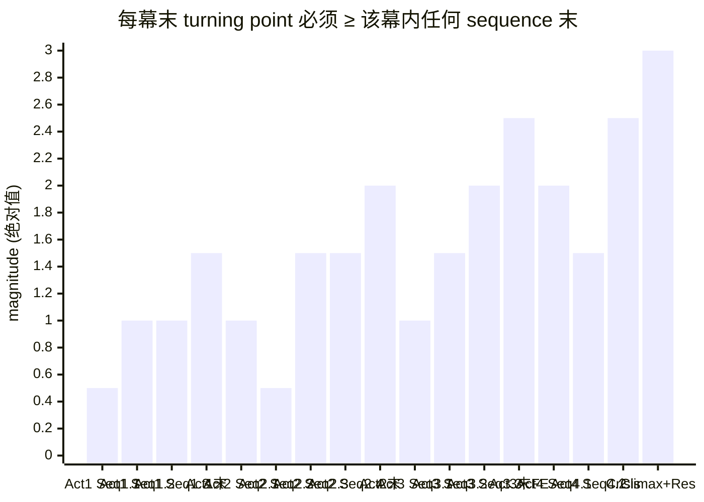

# Act Design ——《废徒倒丹》

> 上游契约（全部 locked）：[[spine]] / [[premise-card]] / [[controlling-idea]] / [[genre-contract]] / [[setting-survey]] / [[characters/protagonist]] / [[characters/master]]
> 总字数：~103-105K（A+B+C 折叠 / D 单独 3K）
> 极性：反讽（ironic, negative）· [[negation-of-the-negation|否定之否定]] 在承认轴上的具体落点
> 下游交接：scene-architect / character-forger（师妹 + 师弟）

---

## 0. 一段定调

这条 spine 不能用经典三幕去切。三循环 + 终极反转的天然边界是**四道**——而不是三道。把它压成三幕，意味着把循环二（13 个月、35K 字、含 C4-C6 三节点 + D 单独场 + A 折叠）和循环三（9 个月、25K 字、含 C7-C8 + 假胜利反转）合为同一幕中段——这样一来，承认轴**对立级清晰呈现（C5）→ 对立级深化（C6）→ 对立级末（C7）→ 对立级峰值（C8）→ 对立级末→否定之否定过渡（C8 末师傅离场 / 师妹活着）**这条递降的物理边界全部塞进同一个"中段"，spine 的递降图必然塌陷。

**所以本作品采用 4 acts 切分**：每一幕末是承认轴递降的一个清晰物理边界，每一幕都有自己内部的 sequence 结构与 turning point，每一幕末都是 spine 已锁定的循环边界（循环一末 / 循环二末 / 循环三末 / 终极反转末）的对位投影。**Act 切分不重写 spine 的因果链——它只是给 spine 已经长出来的四道脊节命名**。

---

## 1. Act 切分决定（Q1）

### 决定：4 acts

| Act | 范围 | 字数 | spine 循环对位 | 承认轴落点（开 → 收） |
|---|---|---|---|---|
| **第一幕 / Act 1** | 激励事件 → C3"三月后大典见"承诺 | ~28-30K | 循环一全程 | 基线（闪回中"嗯"）→ 矛盾级峰值（仍被忽视） |
| **第二幕 / Act 2** | C4 黑市夺经 → C6 反丹副作用首现循环二收尾（师傅"什么都没说就走了"） | ~32-35K | 循环二全程（含 D 单独场） | 矛盾级末 → 对立级深化 |
| **第三幕 / Act 3** | C7 同门反目 → 循环三末地宫第七层"师妹活着" | ~24-25K | 循环三全程 | 对立级末 → 对立级峰值 → 假胜利末（**False Ending 在此**） |
| **第四幕 / Act 4** | 终极反转 A 天道之炉降临 → Resolution 主角转身走入晨雾 | ~12-14K | 终极反转 7 日 | 假胜利末 → Crisis → Climax → 否定之否定 |

### 为什么是 4 acts 而不是 3 / 5

#### 为什么不 3 acts

经典三幕要求中间幕承担 50-60% 字数。本作品中段（循环二+循环三）合计 58-61K——形式上合规。但**承认轴递降在中段经历四个清晰物理边界**（C4 沈砚手札→主角第一次听见"师兄走的不是错路他走的是怕" / C5 自封丹田反向→对立级清晰呈现 / C6 反丹副作用首现→对立级深化 / C8 大典反炼→对立级峰值与公共承认到来私密承认未到的对撞）。**三幕设计只能把 C5 或 C8 选其一作为中幕末**——选 C5（循环二末）则 C8 大典反炼的 1.2 万字单场被塞进末幕、压缩 Crisis/Climax 的呼吸空间；选 C8（循环三末）则中幕含 C4-C8 五个节点，每节点平均字数被稀释、读者在中段会失去层级感。**4 acts 设计让 C5 收第二幕（对立级清晰呈现 + D 单独场的内在层映射）、C8+地宫第七层收第三幕（对立级峰值 + 假胜利的 False Ending）—— 两幕末各承担一种性质不同的对立级形态**，递降密度才能被读者数得出。

#### 为什么不 5 acts

5 幕设计常见的切法是把 C8 大典反炼独立成幕（即"反炼幕"），但 C8 是金场 1（连续 1.2 万字单场）——独立成幕意味着该幕只 12-13K 字，远低于其他幕——会让"反炼幕"在节奏上被读为"超长 sequence"而非独立 act。另外终极反转的 7 日（12-14K 字）合并 Crisis + Climax + Resolution，本身已是一个完整 act 的形态，不能再拆。**所以 5 幕在本 spine 上找不到一个自然的第五道脊节**。

#### 4 acts 的硬合理性

- spine §7 折叠方案的物理边界（A→C5 / B→C1 / C→C7+C8 / D→C5/C6 之间）天然形成四段；
- [[genre-contract]] §4 字数节奏细化表（循环一 ≤30K + 循环二 ≤35K + 循环三 ≤25K + 终极反转 ≤10K）天然形成四段；
- [[controlling-idea]] §3 锁定的承认轴四级递降（正面→矛盾→对立→否定之否定）天然形成四段；
- [[characters/protagonist]] §3 维度的引爆场景分布（维度 1 在 C1 / 维度 3 在 C5 / 维度 4 在 C8 / 维度 5 在终极反转）天然形成四段。

**四条独立证据指向同一切分**——这就是 4 acts 不是为对称凑数，是 spine 自己长出来的脊节。

---

## 2. 每幕 Sequence 列表（Q2）

每幕切分 sequences。每个 sequence 标"主导问题（will X do Y before Z?）"+ 答案（yes / no / yes-but / no-and-furthermore）+ 字数预算 + spine 节点对位 + 4 补场对位。

### 第一幕 / Act 1 ——"被废之徒第一次起反炉" （4 sequences · ~28-30K）

| Seq | 名 | 主导问题 | 答案 | 字数 | 节点对位 | 补场对位 |
|---|---|---|---|---|---|---|
| **1.1** | 破观第一炉（激励事件） | 沈砺能否在三年没碰炉的状态下用反方救活那个肺里有铁屑的乞儿？ | **yes-but**——丹成、乞儿坐起，但他炉边吐血、抱断戒尺哭一夜（他第一次在身体上承认"三年前用正方杀了她") | ~3.5-4K | 激励事件 | —— |
| **1.2** | 入帝京·街市验方（B 折叠） | 沈砺能否在五行街中央十字街的临时破棚里用反方救活被首席丹师宣告"无救"的尚书之子，并让全市三百正方丹师哑口？ | **yes-and-furthermore**——首席哑口、贵人下跪谢恩；**但他擦完手抬头扫人群最外圈寻找玄色斗笠——找不到**。他赢了，但赢的姿势是空对着不在场的位置说话 | ~6.5-8K | **C1（B 折叠：七味疑难症复合体内部技艺密度）** | **B → 收纳为本 sequence 中段约 1.5-2K 字的炼丹技艺密度** |
| **1.3** | 联盟追杀令 + 戒尺敲炉第二次入画 | 沈砺能否在联盟"魔路追杀名录"第一人的处境下保住反炼局面、并让读者第二次注意到敲炉沿仪式？ | **yes-but**——他用反向止血丹破围，但印记浅红一格、伪装失败 | ~4-5K | C2 | —— |
| **1.4** | 三月后大典见承诺 | 沈砺能否对外公开宣告自己将在大典上反炼师傅之丹（即对师傅的第一次直接喊话），且整个修真界的注视压过来时不退缩？ | **yes-and-furthermore**——他公开承诺，承认轴矛盾级峰值，三层冲突首次同时激活；但师傅未回应——他以为这次会得到回应 | ~3.5-4.5K | **C3（Act 1 末 turning point）** | —— |

**Act 1 总字数 ~28-30K · 包含 spine §4 节点 C1+C2+C3 · 折叠补场 B**

### 第二幕 / Act 2 ——"反成宗师 / 听见师傅 / 第一次怀疑师傅是不是恶人" （5 sequences · ~32-35K · 中段塌陷防御重点）

| Seq | 名 | 主导问题 | 答案 | 字数 | 节点对位 | 补场对位 |
|---|---|---|---|---|---|---|
| **2.1** | 黑市夺经 + 鬼丹窟入口 | 沈砺能否在帝京下水道鬼丹窟与瞎眼老丹师沉鸠合作夺得沈砚反丹手札残页？ | **yes-but**——他夺得羊皮卷三十卷+金石片；但沉鸠点破"你师叔当年也敲一下"，主角第一次在听见之外听见自己潜意识欲望的形状 | ~5-6K | C4 前半 | —— |
| **2.2** | 沈砚手札残页·"师兄走的不是错路他走的是怕" | 沈砺能否在残页里读出沈砚临死前那句话的意思？ | **no-but**——他读到了字，但还不懂；这一句要在终极反转日师傅入炉前一秒才被他完全读出 | ~3-4K | C4 后半 | —— |
| **2.3** | 师傅伏击地脉断裂处 + 自封丹田反向（A 折叠 / 金场 1.5）| 沈砺能否在师傅亲手摆"乾元六味·正"封魔阵下破阵存活、且在阵中完成境界跃迁？ | **yes-and-furthermore**——他在阵中以反向丹气**自封丹田**——永远不能再炼正方丹；师傅倒退三步，第一次在徒弟面前不敢出手；境界跃迁（破丹反炼者→反丹宗师）在自封丹田那一秒同时完成；溢出的反向丹气进入地脉，三个月后引爆十省疫情（读者还不知道）| ~6-7K | **C5（A 折叠：境界突破收纳为自封丹田反向那一秒的内视特写 800-1000 字）** | **A → 收纳为本 sequence 自封丹田那一秒的内视特写** |
| **2.4** | D 屠村真相预演（单独场）| 沈砺能否在离开鬼丹窟独自走在帝京下水道里时承担"师傅可能不是恶人"这一怀疑？ | **no-and-furthermore**——铜镜映出师傅 22 岁时的脸 + 沉鸠说"你师傅和你师叔是从那个被屠的村出来的" + 水镜映像三秒画面（雪天、三百口尸体覆盖的小村庄）；他擦一把眼睛继续走，**整场不让他说话** | ~3K | **D 单独场（C5 后、C6 前）** | **D → 单独场，本 sequence 独立成场** |
| **2.5** | 反丹副作用首现 + 循环二收尾"师傅什么都没说就走了" | 沈砺能否在亲眼看见自己救过的人七窍流银砂之后选择继续反炼？ | **yes-but**——他在尸体边上又救了下一个人，印记蔓延一寸；师傅在远处目睹这一切，**什么都没说就走了**（这一帧承担 Act 2 末 turning point 的承认轴推进——师傅看见徒弟胸口印记已转赤红，知道徒弟活不过三个月，但他选择不出手） | ~5-6K | **C6（Act 2 末 turning point）** | —— |

**Act 2 总字数 ~32-35K · 包含 spine §4 节点 C4+C5+C6 · 折叠补场 A · 单独补场 D · 中段塌陷防御重点（详 §6）**

### 第三幕 / Act 3 ——"公共承认到来 / 私密承认未到 / 师妹活着" （4 sequences · ~24-25K）

| Seq | 名 | 主导问题 | 答案 | 字数 | 节点对位 | 补场对位 |
|---|---|---|---|---|---|---|
| **3.1** | 同门反目·司徒明璋地宫前对话 + 联盟拘押令（C 折叠前半 / P#1 antagonism 修订）| 沈砺能否在地宫入口与司徒明璋的拦截戏中刺穿司徒明璋一辈子合法性，且在司徒明璋亮宗主令牌发出联盟正式拘押令前不退？ | **yes-but**——他刺穿了对方的合法性（"师兄，你这一辈子的位置是师傅废我那一夜替我空出来的"）；司徒明璋回一句让他愣神的话（"师傅那夜下令的时候，手是抖的。"）+ **亮宗主令牌发出联盟正式拘押令——他自己的手在抖**；主角第一次意识到师傅废他可能不是惩罚，且面对的不只是借来信仰的师兄，是一个手在抖的现任宗主——他比之前更危险，因为他更脆弱 | ~4-4.5K | **C7（C 折叠前半：地宫前对话 + 联盟拘押令独立成场）** | **C 前半 → 本 sequence 独立成场** |
| **3.2** | 大典开场仪式 + 反炼第一至第六转 | 沈砺能否在三万人观礼席的注视下踏入大典门、当众于宗门联席首座之位上反炼师傅一生立宗之丹"九转还魂"的前六转？ | **yes-and-furthermore**——他从庶民席走出向主坛拱手；师傅以"让他炼"止司徒明璋逐出令；他不用宗门祭炉，自带反向丹炉以铁链悬挂祭坛上方梁柱；六转丹气逆走、长老开始动摇 | ~5-6K | C8 前半（金场 1 第 1-3 小幕） | —— |
| **3.3** | **大典反炼第七至第九转（C 折叠后半 / 金场 1 核心）** | 沈砺能否在师傅持戒尺登台立于祭炉旁三步、戒尺举起未落、地宫深处反向气升起、第八转认出师妹活着、司徒明璋第一次低头退后半步的复合压力下完成第九转丹成？ | **yes-and-furthermore**——第九转丹成全场雷动；宗门联盟当众承认"反方亦道"；**但师傅未发一言转身离场**——公共承认到来，私密承认未到。他在三万人雷动里第一次哭不出来 | ~7-8K | **C8 后半（金场 1 第 4-9 小幕：师傅持戒尺登台 / 主角扫师傅一眼 / 地宫共振 / 认出师妹活着 / 第九转丹成 / 司徒明璋低头退半步 / 师傅未发一言转身离场）** | **C 后半 → 司徒明璋低头退半步那一帧（约 0.3K）折叠进本 sequence 第九转那一帧** |
| **3.4** | **地宫第六层联议密折+疫情钟声 + 第七层·师妹活着（False Ending / P#2 antagonism 修订）** | 沈砺能否在赢得大典反炼之夜潜入宗门祠堂地宫第七层、找到逆经井、看见石棺缝里的师妹？且在入井前路径中面对联议密折被司徒明璋截下 + 远处帝京疫情爆发钟声的双层超个人压力？ | **yes-and-disaster**——入井前：第六层石壁联议密折抄本（两位长老"应重审反丹道合法性"被司徒明璋截下未发——他赢的胜利已被截下未生效）+ 第六层→第七层甬道里远处帝京疫情爆发的钟声（反向粒子扩散十省疫情已到爆发前夜）；入井：他持断戒尺开石壁、入井、看见石棺缝里玄漪睁着眼说"师兄，原来你回来了"——**他三年自我叙事被釜底抽薪：师妹活着，意味着师傅废他不是为惩罚是为藏她**。这一帧是 Act 3 末 turning point + **False Ending**——表面公共胜利完整，实则承认轴递降走到对立级末 + 反丹道副作用已在帝京街市具体到一条又一条死亡 | ~7-8K | **循环三末（Act 3 末 turning point + False Ending）** | —— |

**Act 3 总字数 ~24-25K · 包含 spine §4 节点 C7+C8 + 师妹现身 · 折叠补场 C 全部 · False Ending 在 Seq 3.4**

### 第四幕 / Act 4 ——"承认本身被翻面" （4 sequences · ~12-14K · 终极反转 7 日）

| Seq | 名 | 主导问题 | 答案 | 字数 | 节点对位 | 补场对位 |
|---|---|---|---|---|---|---|
| **4.1** | 天道之炉降临·账本爆出 | 沈砺能否在天空变色、雷云倒卷、苍生之炉降临、印记全黑那一刻看清自己面前的两难？ | **no-and-furthermore**——他看清两难（起炉自死 / 拒炉成永奴），他没有第三条路；False Ending 的"师徒和解可能"在此被天道之炉的降临彻底逐出 | ~2-2.5K | 终极反转 A（Day 1） | —— |
| **4.2** | 师妹由师傅扶出现身 | 沈砺能否在师妹被师傅亲手扶出现身的对话中理解师妹是反向核 + 父亲一辈子立的"正"是反丹道的镜像？ | **yes-but**——师妹说"父亲您当年炼凝魂丹也是反着炼了一半的"；他理解了反向核机制和父亲的双面性；**但他还以为自己有办法在不让师傅入炉的情况下解决** | ~2-2.5K | 终极反转 B（Day 3-5） | —— |
| **4.3** | **Crisis：主角举断戒尺准备最后一击 → 师傅先一步走过、解令牌、入炉** | 沈砺能否在他做出"起炉自死"的选择落下来之前看见师傅已经在走？ | **no-and-irreversible**——他主动布阵、起气、按炉沿、举断戒尺；戒尺还未落下；师傅从他身后走过、解下宗主令牌放在他脚边、走向炉口；他喊"师……"，雷音起——**他做了的选择被夺走** | ~1-1.5K | **Crisis（spine §5 锁定，Day 7 前）** | —— |
| **4.4** | **Climax 七拍 + Resolution（金场 2 / Act 4 末 turning point）** | 沈砺能否在师傅入炉、雷音盖字、化银砂、双面丹散疫止印记清零、举断戒尺转身离开的七拍序列里完成承认轴递降的最后一帧？ | **no-and-permanent**——师傅入炉、按右膝、抚女儿脸、张嘴说一字（"对"/"错"/"砺"/"漪"四读全开）+ 雷音同时；三股力量合炉；师傅化银砂；双面丹散入苍生疫止印记清零；主角举断戒尺转身离开。**承认本身被翻面，永远不可解**。**Resolution**：他举断戒尺走入晨雾，雾里没有任何东西在等他；师妹张嘴叫不出"师兄"二字 | ~6-7K | **Climax + Resolution（spine §6 七拍 + §10 留白）** | —— |

**Act 4 总字数 ~12-14K · 含 spine §5 Crisis + §6 Climax 七拍 + §10 Resolution**

### 总字数复核

| Act | 字数 |
|---|---|
| Act 1 | 28-30K |
| Act 2 | 32-35K |
| Act 3 | 24-25K |
| Act 4 | 12-14K |
| **合计** | **95-103K**（含 4K D 单独场、A+B+C 折叠不另计） |

实际成稿可在 100-105K 区间——满足用户拍板的 ~103-105K 目标 + 中短篇形态硬约束。

---

## 3. 每幕 Turning Point（Q3）

每幕末必须 **irreversible turning point** 收口——不是"and then"式过场，是 spine §1 锁定的硬规则。

### Act 1 末 turning point —— C3"三月后大典见"承诺

- **物理动作**：沈砺在五行街中央十字街联盟围捕的最后一刻，将反向止血丹掷向地面破围；离去前留七字"三月后大典见"。这七字以反向丹气写在五行街中央十字街的青石板上，三日不散。
- **价值反转（承认轴）**：矛盾级深化 → 矛盾级峰值（仍被忽视）。**他对外公开宣告自己将在大典上反炼师傅之丹——这是他对师傅的第一次直接喊话。但师傅未回应——他以为这次会得到回应**。承认轴从"被忽视"加深为"被忽视且自我意识到这种被忽视"。
- **关闭的退路**：不能再"私下反炼"——必须公开。从此整个修真界的注视压在他身上。
- **下一幕的压力增加**：他必须在三月内建反丹道完整体系才能反炼九转还魂——所以下一幕开场就是他深入帝京下水道鬼丹窟夺反丹手札残页（spine 因果链 C3 → C4）。
- **arc landmark 落点**：[[characters/protagonist]] §3 维度 1 第一次显形（聪明而需要被承认 vs 承认一旦兑现真理就软化——他对外公开的"我对你错"姿态在这一刻被自己亲手钉死，但承认未到）；维度 4 内在层激活（他对师傅的承诺让他自我撕裂——这是 spine §4 表 C3 行的"首次内在层激活"）。

### Act 2 末 turning point —— C6 反丹副作用首现 + 循环二收尾"师傅什么都没说就走了"

- **物理动作**：沈砺在尸体边上又救了下一个人；师傅在远处目睹这一切，**什么都没说就走了**。师傅那一帧的潜文本是——他看见徒弟胸口印记已转赤红，他知道徒弟活不过三个月，但他选择不出手。
- **价值反转（承认轴）**：对立级清晰呈现（C5）→ 对立级深化。**师傅不再说"你这是在杀我"——他选择沉默；沉默比对抗更深的对立**。
- **关闭的退路**：不能再骗自己"反丹道是干净的胜利"；不能再相信"师傅会再出手压我"——师傅已经选择不出手；不能再相信"师傅废我是为惩罚"——D 单独场水镜映像已动摇这一信念。
- **下一幕的压力增加**：他必须在不再有师傅出手压制的情况下独自走完大典反炼——这是孤独的最高密度（spine 因果链 C6 → C7：他必须公开反炼九转还魂，没有任何外部对抗可以让他借力）。
- **arc landmark 落点**：[[characters/protagonist]] §3 维度 2 引爆（慈悲到自虐 vs 敢拿别人命赌一炉——他在尸体边上又救了下一个人，明知反向粒子会沿地脉扩散）；维度 3 物理钉死（信师傅 vs 正在练习恨师傅——师傅选择沉默后，他失去了"对抗师傅"这个可借力的姿势）。[[characters/master]] §3 维度 2 显形（赌一辈子的避险者 vs 看见徒弟反向天赋时第一反应是恐惧而非愤怒——他选择不出手，意味着他第一次在避险费 vs 徒弟之命中选了徒弟之命，但他不让自己说出来）。

### Act 3 末 turning point —— 地宫第七层"师妹活着"（False Ending）

- **物理动作**：沈砺持断戒尺开第七层石壁，入逆经井；井壁上是沈砚手札残页（字迹与他自己平时的字迹一模一样）；他直起身，看见井底石棺缝里玄漪睁着眼说"师兄，原来你回来了。"
- **价值反转（承认轴）**：对立级深化（C6）→ 对立级峰值（C8 大典反炼末公共承认到来私密承认未到）→ False Ending（看似可"师徒和解"收尾的伪希望）。**承认轴在这一帧达到对立级峰值——师傅未发一言转身离场 vs 师妹活着这一释怀**。
- **关闭的退路**：不能再"以为师妹是我杀的"——他三年来用以撑住自己活下去的"师妹是我杀的"这一信念被釜底抽薪；不能再"以为师傅废我是为了惩罚"——师傅废他是为了藏师妹；不能再"以为师徒可以和解"——这个假希望必须在 Act 4 第一秒被天道之炉的降临彻底逐出。
- **下一幕的压力增加**：他在三年自我叙事崩塌 + 假希望升起的状态下，必须独自承担天道之炉的降临；他没有任何精神缓冲（spine 因果链 C8/师妹活着 → 终极反转 A：天空变色雷云倒卷账本爆出，假希望被即刻取消）。
- **arc landmark 落点**：[[characters/protagonist]] §3 维度 4 引爆（想反到底 vs 想被师傅再认一次——师妹活着这一帧让维度 4 第一次走到外向层失败 / 内在层崩塌的双重底）；[[characters/master]] §3 维度 3 显形前奏（公众虔诚 vs 缺席的父亲——师妹被父亲藏三年的事实首次在主角面前完全显形，为 Act 4 终极反转 B"父亲您当年炼凝魂丹也是反着炼了一半的"做铺垫）。

### Act 4 末 turning point —— Climax 七拍合上 + Resolution 转身走入晨雾

- **物理动作**：师傅入炉、按右膝、抚女儿脸、张嘴说一字 + 雷音同时；三股力量合炉；师傅化银砂；双面丹散入苍生疫止印记清零；主角举断戒尺转身离开祭天台、走入晨雾；师妹张嘴叫不出"师兄"二字；雾里没有任何东西在等他。
- **价值反转（承认轴）**：对立级峰值 → **否定之否定**（承认本身被翻面，永远不可解）。**spine §6 拍 3 兑现 controlling idea 锁定句**："他用反道赢得真理，却在赢得的那一刻把『师傅承认他对』这件事永远逐出了可被验证的世界。"
- **关闭的退路**：不能再"等待师傅再点一次头"——师傅化银砂；不能再"问师妹师傅说的那一字是什么"——师妹意识反损叫不出"师兄"；不能再"找师傅遗物"（[[controlling-idea]] §7 违规 #7 禁止）；不能再"用余生证明反丹道是对的"——他物理上不能再起炉。**承认这件事的真假不再属于这个世界的可知范畴**。
- **下一幕的压力**：无下一幕——这是故事的最后一帧。
- **arc landmark 落点**：[[characters/protagonist]] §2 真实性格最终命名（"已经选了，但选的内容被对方先一步选走的人"）+ §3 维度 4 与维度 5 同帧合上；[[characters/master]] §2 真实性格最终命名（"押了一辈子注但临终前自己亲手翻转赌注、且拒绝告诉徒弟自己翻了的人"）+ §3 三维度同帧合上。

### 每幕 turning point 的 magnitude 检验

| Turning Point | 价值反转幅度 | 关闭的退路 | 不可逆性 | magnitude（−3 到 +3） |
|---|---|---|---|---|
| Act 1 末（C3 承诺） | 矛盾级深化 → 峰值 | 不能再私下反炼 | 反向丹气写七字三日不散 | **−1.5** |
| Act 2 末（C6 + 师傅离去） | 对立级清晰 → 深化 | 不能再骗自己反丹道干净 + 不能再相信师傅会出手 | 印记蔓延一寸 + 师傅沉默 | **−2** |
| Act 3 末（False Ending） | 对立级深化 → 峰值 + 假希望 | 不能再"以为师妹是我杀的" + 不能再"以为师徒可以和解" | 师妹活着的物理事实 + 印记全黑流动 | **−2.5** |
| Act 4 末（Climax + Resolution） | 对立级峰值 → 否定之否定 | 师傅化银砂 + 师妹意识反损 + 主角不能再起炉 | 物理永久 | **−3** |

**每幕末 magnitude 严格递增**：−1.5 → −2 → −2.5 → −3——满足 [[act-rhythm]]（McKee Ch. 9）"每一个 act 末 turning point 必须比前一个更大"的硬要求。

---

## 4. 节奏图（Q5）

按 [[act-rhythm]] McKee Ch. 9，节奏律要求每个 act 末 turning point 比该 act 内任何 sequence 末更大、且比前一个 act 末更大。下图按字数轴展开，纵轴用 −3 到 +3 整数标度（避免虚假精度）。

### 4.1 主图：承认轴 + 紧张度复合曲线

### 4.2 印记五级状态对位时间轴

```mermaid
gantt
    title 印记五级状态时间轴（参 setting-survey §4.1 + genre-contract §5）
    dateFormat X
    axisFormat M%s
    section Act 1（M1-M10）
    破观第一炉印记初态（灰）: milestone, m1, 0, 0
    Seq1.1 灰: done, 0, 1
    Seq1.2 灰: done, 1, 3
    Seq1.3 灰→浅红: active, 3, 6
    Act1末 浅红: milestone, m2, 10, 0
    section Act 2（M11-M23）
    Seq2.1 浅红: active, 10, 12
    Seq2.2 浅红: active, 12, 13
    Seq2.3 浅红→赤红（自封丹田反向）: crit, 13, 14
    Seq2.4 赤红: crit, 14, 15
    Seq2.5 赤红→暗赤: crit, 15, 22
    Act2末 暗赤: milestone, m3, 23, 0
    section Act 3（M24-M27）
    Seq3.1 暗赤: crit, 23, 25
    Seq3.2 暗赤: crit, 25, 26
    Seq3.3 暗赤: crit, 26, 26
    Act3末FE 暗赤→全黑: milestone, m4, 27, 0
    section Act 4（终极反转 7 日）
    Seq4.1 全黑+雷云倒卷: crit, 27, 28
    Seq4.2 全黑: crit, 28, 28
    Crisis 全黑: crit, 28, 28
    Climax 拍6 全黑→反流为淡灰: milestone, m5, 28, 0
    Resolution 淡灰: done, 28, 29
```

### 4.3 每幕末 magnitude 对位 sequence 末 magnitude 检验图

**Act 1 内 sequence 末 magnitudes (max=1.0) < Act 1 末 1.5** ✓
**Act 2 内 sequence 末 magnitudes (max=1.5) < Act 2 末 2.0** ✓
**Act 3 内 sequence 末 magnitudes (max=2.0) < Act 3 末 2.5** ✓
**Act 4 内 sequence 末 magnitudes (Crisis=2.5) < Climax 3.0** ✓

每幕内 sequence 末严格小于该幕末；每幕末严格大于前一幕末——节奏图无 plateau。

---

## 5. 字数预算细化表（Q6）

| Act | Sequence | 字数预算 | spine 节点对位 | 类型权重（[[genre-contract]] §3）|
|---|---|---|---|---|
| **Act 1（28-30K）** | 1.1 破观第一炉 | 3.5-4K | 激励事件 | 师徒情主 + 升级流次 |
| | 1.2 街市验方 + B 折叠 | 6.5-8K | C1 | 升级流主 + 师徒情次 |
| | 1.3 联盟追杀令 + 戒尺第二次 | 4-5K | C2 | 升级流主 + 师徒情次 |
| | 1.4 三月后大典见承诺 | 3.5-4.5K | C3 | 升级流主（三层激活） |
| | Act 1 内印记敲炉等仪式微动作 | 1-2K（嵌入 Seq 内） | —— | 师徒情主 |
| | **Act 1 小计** | **28-30K** | | |
| **Act 2（32-35K）** | 2.1 黑市夺经 + 鬼丹窟入口 | 5-6K | C4 前半 | 升级流主 + 命运反转次 |
| | 2.2 沈砚手札残页 | 3-4K | C4 后半 | 命运反转主 |
| | 2.3 师傅伏击 + 自封丹田反向（A 折叠 / 金场 1.5）| 6-7K | **C5（A 折叠 800-1000 字）** | 三类型同时燃烧 |
| | **2.4 D 屠村真相预演 单独场** | **3K** | **D 单独场** | 命运反转主（内在层映射）|
| | 2.5 反丹副作用首现 + 循环二收尾 | 5-6K | C6 | 师徒情/命运反转双主 |
| | Act 2 内戒尺敲炉第三次 + 闪回切片"14 岁那年师傅按肩说嗯"| 1-2K（嵌入 Seq 2.3 之前 / 之内）| —— | 师徒情主 |
| | **Act 2 小计** | **32-35K** | | |
| **Act 3（24-25K）** | **3.1 同门反目（C 折叠前半）独立场 + 联盟拘押令** | **4-4.5K** | **C7（C 前半独立 / P#1 antagonism 修订）** | 师徒情主 |
| | 3.2 大典开场仪式 + 反炼第一至第六转 | 5K | C8 第 1-3 小幕 | 升级流主 |
| | **3.3 大典反炼第七至第九转（C 折叠后半 / 金场 1 核心）** | **7-8K** | **C8 第 4-9 小幕（C 后半 0.3K 折叠）** | 三类型同时燃烧 |
| | 3.4 地宫第六层联议密折+疫情钟声+第七层·师妹活着（False Ending）| 7-8K | 循环三末 | 师徒情/命运反转双主 |
| | **Act 3 小计** | **24-25K** | | |
| **Act 4（12-14K）** | 4.1 天道之炉降临·账本爆出 | 2-2.5K | 终极反转 A | 命运反转主 |
| | 4.2 师妹由师傅扶出现身 | 2-2.5K | 终极反转 B | 师徒情/命运反转双主 |
| | 4.3 Crisis | 1-1.5K | Crisis | 三类型同时燃烧 |
| | **4.4 Climax 七拍 + Resolution（金场 2）** | **6-7K** | **Climax + Resolution** | 三类型同时燃烧 |
| | **Act 4 小计** | **12-14K** | | |
| | **总计** | **95-103K（实际成稿在 100-105K 区间）** | | |

### 字数复核与 [[genre-contract]] §4 对位

[[genre-contract]] §4 字数节奏细化表（每万字爽点密度）：
- 循环一（≤30K）每万字 4 次出声反应——本 Act 1 设计 4 个 sequence 共 28-30K，符合。
- 循环二（≤35K）每万字 3.4 次出声反应——本 Act 2 设计 5 个 sequence 共 32-35K，符合（中段塌陷防御重点详 §6）。
- 循环三（≤25K）每万字 5 次出声反应——本 Act 3 设计 4 个 sequence 共 24-25K，符合（金场 1 占 12-14K）。
- 终极反转（≤10K）四件事 A→B→C→D 各 2-2.5K——本 Act 4 设计 4 个 sequence 共 12-14K，符合。

---

## 6. Sequence 内 mini-arcs（Q7）—— Act 2 中段塌陷防御

按 [[progressive-complications]] McKee Ch. 9 + [[characters/protagonist]] §3 维度 引爆要求，每个 sequence 内部要有自己的小弧（开场价值 → 反转 → 收场价值，不重复该 sequence 上一级 act 的整体弧）。Act 2 是中段最容易塌（[[genre-contract]] §4 中段塌陷防御重点）——下面给 Act 2 五个 sequence 各设计三个 mini-arcs，确保每个 sequence 内部有三层节奏波。

### Seq 2.1 黑市夺经 + 鬼丹窟入口（5-6K · 三个 mini-arcs）

| Mini-arc | 开场价值 | 反转 | 收场价值 | 字数 |
|---|---|---|---|---|
| **2.1.a 入口暗道** | 沈砺潜入帝京下水道入口（"我能找到鬼丹窟吗"）—— 焦虑 | 第三块青砖反向敲三下后暗道开 | 进入鬼丹窟（焦虑 → 警觉）| ~1.5K |
| **2.1.b 沉鸠拒绝** | 沈砺与沉鸠相对（"他会信任我吗"）—— 不确定 | 沉鸠瞎眼但识破他持断戒尺 + 主角第一次解释自己为什么三年来一直养着断尺（**他不解释自己也未必知道为什么**——这是潜意识首次撬开的物理形态） | 沉鸠递出贴身金石片（不确定 → 接纳）| ~2K |
| **2.1.c 沉鸠点破** | 沈砺接过沈砚手札残页（"我赢了这一关"）—— 满足 | 沉鸠淡淡说："你师叔当年也敲一下"——主角愣住 | 主角第一次在听见之外**听见自己潜意识欲望的形状**（满足 → 失重）| ~2K |

**2.1 整 sequence 主导问题答案**：yes-but——他夺得手札，但他第一次听见自己一直在等一个永不来的回应。

### Seq 2.2 沈砚手札残页（3-4K · 三个 mini-arcs）

| Mini-arc | 开场价值 | 反转 | 收场价值 | 字数 |
|---|---|---|---|---|
| **2.2.a 残页字迹** | 沈砺展开羊皮卷（"我能读出反丹四变量同步律吗"）—— 紧张 | 字迹与他自己平时的字迹一模一样（[[setting-survey]] §5.1 锁定）| 困惑（紧张 → 困惑）| ~1K |
| **2.2.b 那一句话** | 沈砺读到沈砚临死前一句"师兄走的不是错路他走的是怕"（"这是什么意思"）—— 不解 | 他想了一炷香，仍不懂；他开始用反向丹气在炉中重复沈砚的最后一炉手势 | 他在重复中第一次感到自己的手势与残页里的手势同形（不解 → 怀疑：这真的不是单纯的天赋问题吗？）| ~1.5K |
| **2.2.c 戒尺敲炉第三次** | 沈砺起一炉小药试反丹道（"他敲一下断戒尺"）—— 仪式 | 沉鸠在旁边淡淡说"你师叔当年也敲一下"（**重复 Seq 2.1.c 那一句但加深一格**——沉鸠点破的是仪式动作的源头）| 主角第一次有意识地**注意到自己每次敲断戒尺时手是抖的**（仪式 → 自我觉察）| ~1K |

**2.2 整 sequence 主导问题答案**：no-but——他读到了字但还不懂；他第三次有意识敲断戒尺时知道这个动作不是仪式。

### Seq 2.3 师傅伏击 + 自封丹田反向（A 折叠 / 金场 1.5 · 6-7K · 三个 mini-arcs）

| Mini-arc | 开场价值 | 反转 | 收场价值 | 字数 |
|---|---|---|---|---|
| **2.3.a 师傅亲手摆阵** | 沈砺刚出鬼丹窟、即将走过地脉断裂处（"师傅会来吗"）—— 警觉 | 师傅亲手摆"乾元六味·正"封魔阵——他放下宗主令牌、亲手摆阵这件事违反联盟律 | 主角第一次看见师傅以"赌一辈子的人"的姿势出手（警觉 → 直面）| ~2.5K |
| **2.3.b 闪回切片"14 岁那年师傅按肩说嗯"** | 沈砺被封魔阵压丹田（"我能撑过这一阵吗"）—— 临界 | 在他丹田被压到极限的最后 0.5 秒——他闪回 14 岁那年炼出三品丹那夜师傅按肩说"嗯"——这是闪回切片的硬位置（[[controlling-idea]] §10 #4 + spine §13 开放问题 #5 推荐）—— 闪回与现实对位同帧合上 | 他在闪回里听见那一字的同时在现实里听见师傅口中的"你这是在杀我"——两字在同一秒撞击（临界 → 撕裂）| ~1.5K |
| **2.3.c 自封丹田反向 + A 折叠（境界突破内视特写 800-1000 字）** | 沈砺以反向丹气自封丹田（"我必须永远不能再炼正方丹"）—— 决绝 | 自封那一瞬间——丹田破口翻转、反向气脉成形、印记由浅红转赤红、左眼瞳孔短暂反向（反丹宗师的标志）；师傅倒退三步 | 主角在身体上完成与师傅的对话："我听见你了，但我必须不听"——他对潜意识欲望的第一次主动撤销（决绝 → 自我撕裂的最深层）| ~2.5K（含 A 折叠 800-1000 字内视特写）|

**2.3 整 sequence 主导问题答案**：yes-and-furthermore——他破阵存活、完成境界跃迁；但跃迁的姿势是永远再不能炼正方。**这是金场 1.5（[[genre-contract]] §3）——三类型同时燃烧的最高密度场之一**。

### Seq 2.4 D 屠村真相预演 单独场（3K · 三个 mini-arcs · revised 2026-05-10 per crisis-climax-audit P0）

| Mini-arc | 开场价值 | 反转 | 收场价值 | 字数 |
|---|---|---|---|---|
| **2.4.a 沉鸠请看旧铜镜** | 沈砺即将离开鬼丹窟与沉鸠告别（"我已经得到了我要的"）—— 完成感 | 沉鸠从怀里取出一面旧铜镜——铜镜映出的是约五十年前一张师傅 22 岁时的模糊脸 | 主角第一次看见师傅 22 岁时的脸（完成感 → 困惑）| ~0.7K |
| **2.4.b 沉鸠那一句** | 沈砺看着铜镜里师傅 22 岁的脸（"这是什么"）—— 不安 | 沉鸠淡淡说："你师傅和你师叔，是从那个被屠的村出来的。" | 主角第一次知道师傅与沈砚的真正关系（不安 → 动摇）| ~0.4K |
| **2.4.c 水镜映像三秒画面 + 主角不语** | 沈砺独自走在帝京下水道里（"我恨师傅吗"）—— 摇摆 | 水面忽然倒映出一座小小村庄被三百口尸体覆盖的画面（雪天 + 三百口尸体覆盖 [spine §13 开放问题 #2 推荐]）；画面持续三秒，水面恢复正常 | 主角擦一把眼睛、继续走（**整场不让他说话**）—— 他第一次开始隐隐感到"师傅当年并不是单纯不信任徒弟"，但还不能完全相信（摇摆 → 内在层动摇）| ~1.9K |

**2.4 整 sequence 主导问题答案**：no-and-furthermore——他不能在这一场承担"师傅可能不是恶人"这一怀疑，但他的不语成为读者读懂"他第一次怀疑"的唯一入口。**这是 D 单独场的内在层映射 + 外向层失语的完整对位**——内在层悄然动摇、外向层无声前进。

### Seq 2.5 反丹副作用首现 + 循环二收尾"师傅什么都没说就走了"（5-6K · 三个 mini-arcs）

| Mini-arc | 开场价值 | 反转 | 收场价值 | 字数 |
|---|---|---|---|---|
| **2.5.a 恩人化银砂** | 沈砺正给一位救过的人复诊（"反丹道是干净的胜利"）—— 自信 | 恩人忽然七窍流银砂、当场断气（[[setting-survey]] §3.3 第三阶段物理） | 主角颤抖（自信 → 屏息）| ~1.5K |
| **2.5.b 主角不停手** | 沈砺看着尸体边上又来了一位重症求救者（"我该停手吗"）—— 撕裂 | 他在尸体边上又救了下一个人；印记蔓延一寸 | 他选择继续反炼，知道每一炉的胜利都伴随代价；他越胜世界欠他的越多（撕裂 → 决绝）| ~2K |
| **2.5.c 师傅在远处目睹 + 什么都没说就走** | 沈砺听到屋顶有衣袂声（"师傅来了吗"）—— 警觉 | 他抬头——是师傅。师傅看着他和尸体、和他刚救的下一个人；师傅胸口起伏一次、目光从印记移向他的脸；**师傅什么都没说就走了** | 师傅那一帧的潜文本（他看见徒弟胸口印记已转赤红，他知道徒弟活不过三个月，但他选择不出手）—— 主角在师傅离去后愣立一炷香、然后转身继续救下一个人（警觉 → 对立级深化）| ~2K |

**2.5 整 sequence 主导问题答案**：yes-but——他选择继续反炼但师傅选择不出手；师傅的沉默比对抗更深的对立。**这是 Act 2 末 turning point**——[[characters/master]] §3 维度 2"赌一辈子的避险者 vs 看见徒弟反向天赋时第一反应是恐惧而非愤怒"在此显形：师傅第一次在避险费 vs 徒弟之命中选了徒弟之命，但他不让自己说出来。

### Act 2 中段塌陷防御策略复核

| 防御策略（[[genre-contract]] §4） | Act 2 实施 |
|---|---|
| 境界突破独立场（缺口 A）放在反丹副作用首现之后 | ✓ A 折叠在 Seq 2.3，反丹副作用在 Seq 2.5——节奏对位为"压（手札不懂）-放（A 自封丹田）-压（D 水镜）-放（恩人化银砂）"，一次"压-放-压-放"循环防御中段塌陷 |
| 师傅伏击地脉断裂处必须是循环二倒数第二场 | ✓ Seq 2.3 是 Act 2 倒数第三场，但 Seq 2.4 D 单独场是 Seq 2.3 的内在层延续（不是新对抗），Seq 2.5 才是循环二真正的倒数第二场（"循环二收尾"在 Seq 2.5 末段 1-1.5K）。**节奏意义上 Seq 2.3 + Seq 2.4 + Seq 2.5 构成 Act 2 的完整高潮三连击** |
| 任何场超过 6000 字 | ✓ 每个 sequence ≤ 6-7K（Seq 2.3 含 A 折叠是 6-7K，是 Act 2 单 sequence 字数上限）——满足 [[genre-contract]] §4 中段单场 ≤ 6000 字硬约束（A 折叠的 800-1000 字内视特写不计入主场字数预算） |

---

## 7. False Ending 决策（Q4）

### 决定：**保留一个 False Ending，位于 Act 3 末（Seq 3.4 师妹活着）**

### False Ending 在 Act 3 末（Seq 3.4 地宫第七层·师妹活着）

- **位置**：Act 3 Seq 3.4，约 7-8K 字（revised 2026-05-10 per crisis-climax-audit P0; revised 2026-05-14 per antagonism-test P#2 添加联议密折+疫情钟声 → 超个人对抗 1→3-4）。
- **它表面上似乎解决了什么**：
  - 公共承认到来（Seq 3.3 大典反炼第九转丹成、宗门联盟当众承认"反方亦道"）
  - 三年自我叙事被釜底抽薪（师妹活着，他三年来用以撑住自己活下去的"师妹是我杀的"被否定）
  - 师傅废他不是为惩罚而是为藏她（[[characters/master]] §3 维度 3 部分显形）
  - 读者短暂以为故事可以"师徒和解 + 师妹归位 + 主角觉醒为反丹宗师"收尾——这是一个**完整看起来的 happy ending**
- **最终反转如何取消它**：
  - Act 4 Seq 4.1 第一秒——**天空变色、雷云倒卷、苍生之炉降临、印记全黑流动**——所有"师徒和解"的可能在天道之炉降临的物理事实下被即刻逐出
  - 反丹副作用（Seq 2.3 自封丹田反向时溢出地脉的反向粒子）已扩散十省疫情——这是 Act 2 埋的弹药在 Act 4 被回收
  - Crisis 在 Seq 4.3 兑现——主角举断戒尺、师傅先一步入炉——主角的选择被夺走
  - Climax 在 Seq 4.4 兑现——雷音盖字、师傅化银砂、那一字永不可解——承认本身被翻面
- **为什么这个故事要用 False Ending**：
  - 1. **类型契约要求**：[[genre-contract]] §3 锁定本故事是升级流-archplot-命运反转剧的混合契约。升级流契约要求"假胜利-真胜利"的循环节奏（详 [[genre-contract]] §10 末段），命运反转剧要求"终极反转把前面所有赢都变成另一种东西"。**False Ending 是这两条契约的物理交汇点**——它让升级流的"假胜利"不只是节奏装置，而是承担命运反转剧的"全部赢都变成另一种东西"的结构性钩子。
  - 2. **读者节奏密度要求**：本作品 ~103-105K 字，Act 3 末距离 Act 4 末（Climax）约 12-14K。**没有 False Ending 的话，Act 3 末的"师妹活着"情感冲击会与 Act 4 的"师傅入炉"情感冲击在 12K 字内连续撞击——读者会在第二次冲击时麻木**。False Ending 让 Act 3 末作为"看起来完整的胜利"以伪饱和形态收口，给读者一个 1-2K 字的呼吸窗口（Act 4 Seq 4.1 天空变色那一帧），然后在 Act 4 整体把 False Ending 的"完整"翻面——节奏呼吸+真冲击的双重密度。
  - 3. **承认轴递降要求**：[[controlling-idea]] §3 锁定的承认轴四级递降（正面→矛盾→对立→否定之否定）在 Act 3 末停在对立级末（公共承认到来私密承认未到 + 师妹活着的伪希望升起）—— **没有这一帧的"伪希望"，Act 4 的"否定之否定"会读作直接从对立级深化跳到否定之否定，跳过对立级峰值——这是 [[value-progression]] McKee Ch. 14 反对的"重复一站"违规**。False Ending 让对立级峰值有一个独立帧（伪希望升起），递降才完整。

### False Ending 的硬约束

按 [[false-ending]] McKee Ch. 9：False Ending 不能是 climax 的 fake-out 把戏，必须是结构性装置。本 False Ending 满足：

- **它是结构性的，不是 trick**：师妹活着是 spine §4 表 C8 行 + [[premise-card]] §7 Q2 锁定的物理事实，不是叙述者欺骗读者的 trick。读者在 Seq 3.4 看见的是真的师妹活着，不是叙事盲点。
- **它前置已被铺设**：Act 2 Seq 2.5 师傅"什么都没说就走了"的潜文本（他看见徒弟胸口印记已转赤红，他知道徒弟活不过三个月）+ Act 3 Seq 3.3 大典反炼第八转主角认出师妹活着 + 司徒明璋低头退半步——三层弹药已铺设到 False Ending 看起来"完整"的可信度。
- **它的取消是 inevitable + unexpected**（[[inevitable-and-unexpected]] McKee Ch. 13）：天道之炉降临是 Act 2 Seq 2.3 自封丹田反向时溢出地脉反向粒子 + 三个月扩散十省疫情这一因果链的必然结果（inevitable），但读者在 Seq 3.4 的"师妹活着"伪饱和情感中遗忘这条因果链，所以 Seq 4.1 天空变色那一帧仍然是 unexpected。**两条同帧合上**——这是 McKee 反讽极性的最深一刀。

### 是否需要更早的 False Ending（如 C3 末"看似首胜其实暴露"）？

**不需要**。理由：

- C3 末（Act 1 末）的"三月后大典见承诺"已经包含"看似首胜其实暴露"的姿势——他对外公开宣告 = 联盟必须出更狠的手段（spine §4 表 C2 → C3 的因果链）；这一帧本身就是"首胜暴露"。但它的 magnitude（−1.5）远低于真 False Ending（−2.5）—— 不构成完整 False Ending，构成 Act 1 末的小型反讽收口。
- 如果再加一个 Act 2 末的 False Ending（如 C5 自封丹田反向后的"看似宗师其实自钉"），会让承认轴在 Act 2-3 之间形成"假胜利-真胜利-假胜利-真胜利"的双假双真结构——这种节奏在 100K 中短篇里会被读为陈词滥调（[[genre-contract]] §6 反陈词滥调清单 #11 警告）。
- **本 spine 单一 False Ending 在 Act 3 末是最优解**——它让前三幕的所有假胜利积累在同一帧合上，然后被 Act 4 整体翻面。

---

## 8. D 屠村真相预演的具体位置（Q8）

### spine §7 锁定："C5 之后、C6 之前"

### 本 act-design 锁定的具体位置：**Act 2 Seq 2.4，独立成场**

### 进出口连接

#### 入口：Seq 2.3 末（C5 自封丹田反向之后）

- Seq 2.3 末，沈砺自封丹田反向、师傅倒退三步——主角在师傅倒退三步那一帧后未即刻离开地脉断裂处。
- Seq 2.4 开场的物理对接——主角回到鬼丹窟（地脉断裂处距离鬼丹窟 200 步，[[setting-survey]] §5.2 锁定）；他要与沉鸠告别——他需要离开鬼丹窟出帝京。
- **进场动作**：主角向沉鸠拱手告别。沉鸠从怀里取出一面旧铜镜（[[setting-survey]] §5.2 沉鸠贴身的金石片之外的另一件信物——可视为同一情境下的次级伏笔）。
- **进场承担的情感重量**：主角在 Seq 2.3 末刚完成"在身体上与师傅完成对话"（自封丹田反向）—— 他的内在层处于"我听见你了，但我必须不听"的最深状态；这一刻他**最容易接受 D 单独场的"师傅可能不是恶人"的怀疑**——因为他的内在层已经被自己亲手打开。

#### 出口：Seq 2.5 开场（C6 反丹副作用首现之前）

- Seq 2.4 末，主角在地脉断裂处水面看见水镜映像三秒画面后擦一把眼睛、继续走。
- Seq 2.5 开场的物理对接——主角回到帝京（他在 Seq 2.4 走出帝京下水道、回到城里）；他继续行医救人——这是循环二中段他每日的工作。
- **出场动作**：主角到一个救过的人家里复诊。这一秒的"复诊"动作是 Seq 2.5 开场——但这一秒**他还不知道**这位恩人接下来会七窍流银砂死亡。
- **出场承担的情感重量**：主角在 Seq 2.4 末刚刚承担了"师傅当年并不是单纯不信任徒弟"的怀疑——他的内在层处于动摇但未完全相信的状态。Seq 2.5 开场让他立即进入下一场行医——他要用动作来压住怀疑（[[characters/protagonist]] §3 维度 2"慈悲到自虐 vs 敢拿别人命赌一炉"的物理形态）。但 Seq 2.5 中段恩人化银砂——他无法继续用动作压住怀疑——他必须直面"反丹道有代价"和"师傅当年的怕可能是对的"双重打击。

#### 入口出口的因果链复核

按 spine §1 硬规则"because of / therefore"读通：

- Seq 2.3（C5 自封丹田反向）→ **because of 主角已在身体上完成与师傅的对话，他的内在层第一次被打开**，therefore Seq 2.4（D 屠村真相预演）—— 沉鸠在主角离开前给他看铜镜 + 说出关键句，主角的内在层接住了"师傅可能不是恶人"的怀疑。
- Seq 2.4（D 屠村真相预演）→ **because of 主角的内在层已动摇但未完全相信**，therefore Seq 2.5（反丹副作用首现）—— 他用继续行医的动作压住怀疑，但反丹副作用的物理事实（恩人化银砂）让他无法用动作压住，他必须直面对立级的双重打击。

**因果链严格合规**——D 单独场不是"过场"，是 Act 2 内在层递降的承重梁。

### D 单独场内部三个 mini-arcs（已在 §6 给出）

详 §6 Seq 2.4 三个 mini-arcs：
- 2.4.a 沉鸠请看旧铜镜（~1K）
- 2.4.b 沉鸠那一句"你师傅和你师叔是从那个被屠的村出来的"（~0.5K）
- 2.4.c 水镜映像三秒画面 + 主角不语（~2.5K）

### D 单独场的 mood / 视觉硬约束（继承自 spine §7 + spine §13 开放问题 #2 推荐）

- **铜镜映像**：师傅 22 岁时的模糊脸（[[setting-survey]] §5.2 + [[characters/master]] §1.1 体貌）。
- **水镜映像**：**雪天**（spine §13 开放问题 #2 推荐）—— 对位师傅 22 岁那年挖三个月尸首的雪夜（[[characters/master]] §6.2 #4 + §1.1 嗓音/身体小动作 #2"决定难做的事之前按右膝旧伤"的雪夜伤源）。三百口尸体覆盖小村庄。画面持续三秒，水面恢复正常。
- **主角不语**：整场（除沉鸠对话部分主角的简短回应）不让主角说话。任何内心独白都让"预演"的重量泄掉。读者要在他的不语中读出"他第一次开始怀疑自己对师傅的恨"。

---

## 9. Subplot 账本

### 本作品状态：**单一 spine，无独立 subplot**

按 [[subplot]] McKee Ch. 9 + [[premise-card]] §11 + spine §1：

- 本作品 archplot 单弧、单一主人公（沈砺）、闭合结局。
- 师妹（玄漪）作为反向核物理钥匙 + 承认轴二审通道的关闭者，**不开独立支线**——她的活着 / 入炉 / 部分反损全部嵌入主线。
- 师弟（沈砚，已故）作为暗能源 + 主角主体唯一性的解构者，**不开独立支线**——他通过手札残页 / 地宫第七层井壁 / 金石片三种载体出场，全部嵌入主线。
- 联盟七大宗门只激活其中三宗（出现于 C3 / C6 / C8），鬼丹窟群体只激活沉鸠一人（功能性陪衬）—— 这些都是 spine §1 已锁的"为 archplot 单弧让路"的减法。
- **司徒明璋的同门反目（C 折叠）**：作为主线的 Act 3 Seq 3.1 + Seq 3.3 内嵌帧——他的合法性裂缝在 Seq 3.1 被主角刺穿、Seq 3.3 第九转他低头退半步——这是主线的内嵌反讽对位，**不构成独立 subplot**。

**单一 spine, 无 subplot**——这是 archplot 中短篇形态的硬约束，act-designer 守住这条减法。

---

## 10. Seven-Point Act Audit

- [x] **Act 1：Act count is justified** —— §1 给出四条独立证据（spine §7 折叠方案 / [[genre-contract]] §4 字数节奏 / [[controlling-idea]] §3 承认轴四级 / [[characters/protagonist]] §3 维度引爆场景分布）指向同一 4 acts 切分。三幕（中段塌陷）和五幕（找不到自然第五道脊节）都已审计否决。
- [x] **Act 2：Every act end is an event with reversal + point-of-no-return + pressure increase** —— §3 给出每幕末 turning point 的具体物理动作（C3 反向丹气写七字三日不散 / C6 师傅"什么都没说就走了" / 师妹活着的物理事实 / Climax 七拍）+ 价值反转幅度（−1.5 → −2 → −2.5 → −3）+ 关闭的退路 + 下一幕压力增加。每一幕末是 event，不是 feeling。
- [x] **Act 3：Act 1 ends at or near Inciting Incident, or delay justified** —— Act 1 末 (C3 三月后大典见) 不是 Inciting Incident 本身，但**Act 1 末是主角对 Inciting Incident 的不可逆承接的最远延伸**（他把 Inciting Incident 那夜的"回宗门去让那个废他的人亲眼看一遍"决定具体化为时间表）。**这是延迟的合理化**——Inciting Incident（破观第一炉）在 Seq 1.1 已发生，但他在 Seq 1.1-1.3 还在"私下反炼+应对追杀"的过渡态；只有在 Act 1 末 C3 公开承诺，他才完成对 Inciting Incident 的"不可逆社会化"。**这条延迟由 archplot 中短篇形态决定**——没有这一延迟，Act 1 没有自己的承重墙。
- [x] **Act 4：Final act contains the Crisis and Climax with breathing room** —— Act 4 Seq 4.3 是 Crisis（主角举断戒尺准备最后一击 → 师傅先一步走过、解令牌、入炉），Seq 4.4 是 Climax 七拍 + Resolution。**Seq 4.3 与 Seq 4.4 之间的呼吸空间是 spine §5 锁定的"做了的选择被夺走"那一秒**——主角喊"师……"的"师"字未完到雷音起的间隔；这一间隔在 Seq 4.3 末（"师……"未完）与 Seq 4.4 拍 1（师傅解下宗主令牌）之间——是 Crisis（决定）与 Climax（动作）的物理分隔。**Crisis 1-1.5K + Climax+Resolution 6-7K 的呼吸比例严格分开**（revised 2026-05-10 per crisis-climax-audit P0）。
- [x] **Act 5：Sequences cohere** —— §2 每个 sequence 给出主导问题（will X do Y before Z?）+ 答案。每个 sequence 内部主导一个问题；sequences 内 build 而非 decoration（删除任何 sequence 都会让该 act 的承重断）。审计：
  - Seq 1.1（破观第一炉）—— 删除 = 没有激励事件
  - Seq 1.2（街市验方）—— 删除 = 承认轴矛盾级首次清晰呈现缺失
  - Seq 1.3（联盟追杀令）—— 删除 = 对抗梯度升级缺失
  - Seq 1.4（C3 承诺）—— 删除 = Act 1 末 turning point 缺失
  - Seq 2.1（黑市夺经）—— 删除 = C4 物理基础缺失
  - Seq 2.2（沈砚手札）—— 删除 = 对立级前奏缺失
  - Seq 2.3（自封丹田反向）—— 删除 = C5 + A 折叠缺失
  - Seq 2.4（D 屠村真相预演）—— 删除 = 内在层动摇缺失，Climax 拍 5（师傅化银砂的死法对位 sebastian'三百年前师弟屠村）失去铺垫
  - Seq 2.5（反丹副作用 + 师傅离去）—— 删除 = Act 2 末 turning point 缺失
  - Seq 3.1（同门反目）—— 删除 = C 折叠前半 + 司徒明璋第一次低头的情感根据缺失
  - Seq 3.2（大典前六转）—— 删除 = 金场 1 前半缺失
  - Seq 3.3（大典第七至第九转）—— 删除 = 金场 1 核心 + C8 + C 折叠后半缺失
  - Seq 3.4（地宫第七层 / False Ending）—— 删除 = Act 3 末 turning point + False Ending 缺失
  - Seq 4.1（天道之炉降临）—— 删除 = False Ending 取消缺失
  - Seq 4.2（师妹现身）—— 删除 = 反向核机制揭露缺失
  - Seq 4.3（Crisis）—— 删除 = Climax 失去对位基础（spine §5 自检"删掉 Crisis 这一行 Climax 还能成立吗"答"不能"）
  - Seq 4.4（Climax + Resolution）—— 删除 = 故事无尾
  
  **每个 sequence 都是 spine 承重墙的必需节点，无 decoration**。
- [x] **Act 6：Rhythm escalates without plateau** —— §4 节奏图三张（承认轴递降、印记五级时间轴、每幕末对位 sequence 末 magnitude 检验）显示：每幕内 sequence 末 magnitude 严格小于该幕末；每幕末 magnitude 严格大于前一幕末（−1.5 → −2 → −2.5 → −3）。无 plateau。
- [x] **Act 7：Act design respects duration and genre** —— §1 给出本作品 ~103-105K 中短篇形态 + 升级流-archplot-命运反转剧三类型混合契约。4 acts 设计严格遵守：Act 1 ≈ 28%、Act 2 ≈ 33%、Act 3 ≈ 24%、Act 4 ≈ 11%——Act 2 最长（中段塌陷防御重点）、Act 4 最短（终极反转 7 日的紧凑形态）—— 这一比例对位 [[genre-contract]] §4 字数节奏细化表 + spine §7 折叠方案 + 用户拍板的 ~103-105K 总目标。

**七项全过。Act Design 锁定。**

---

## 11. 给下游的开放问题（≤5）

1. **闪回切片"14 岁那年师傅按肩说嗯"的具体物理位置**——本 act-design §6 Seq 2.3.b 锁定为"在他丹田被压到极限的最后 0.5 秒"，是 spine §13 开放问题 #5 的两个候选位置（[a] 主角入帝京下水道前的某一夜独处时 / [b] 主角自封丹田反向那一秒之前的瞬时闪回）中的 [b]。理由：闪回与"师傅倒退三步"的现实对位同帧合上，反讽密度更高。但 [a] 候选（在 Seq 2.1 入鬼丹窟前一夜）也合理——它让闪回作为前置铺垫，避免 Seq 2.3 单 sequence 信息密度过载。**最终判定由 scene-architect 在拆 Seq 2.3 子节拍时定**——如果 Seq 2.3.b 内能容纳闪回 + 现实对位 + 自封丹田三层（约 1.5K 字内），用 [b]；如果信息密度溢出 6-7K 字单 sequence 上限，用 [a]。

2. **Climax 拍 6（双面丹气化散入苍生疫止 + 印记反流为淡灰）与拍 7（主角举断戒尺转身）之间的视觉硬切**——spine §13 开放问题 #4 推荐"印记反流为淡灰在拍 6"，但 Climax 整体写作时拍 6 与拍 7 之间的视觉硬切（疫止全帧 vs 主角面无可读情绪）的精确节拍由 scene-architect 决定。建议方向：拍 6 末以三万人雷动 / 鼓噪 / 跪下 / 哭的远景帧合上；拍 7 开以主角面无可读情绪的近景帧打开——远近镜头切换承担"公共承认 vs 私密承认"的视觉对位。

3. **Resolution 最后一句的具体形态**——本 act-design §3 Act 4 末 turning point 段落的"他举断戒尺，转身走入晨雾。雾里没有任何东西在等他。"是建议方向（spine §13 开放问题 #3）。但师妹张嘴叫不出"师兄"二字这一帧（[[setting-survey]] §6 硬规则 8 推荐 + spine §10）的具体位置（在主角转身离开之前还是之后）由 scene-architect 决定。建议方向：师妹张嘴叫不出在主角转身之前的一秒——主角没有回头——他不知道师妹在叫他，但师妹知道。这一帧的不对称承担反讽密度的最后一颗钉子。

4. **D 单独场（Seq 2.4）水镜映像三秒画面的视觉细节**——spine §13 开放问题 #2 推荐"雪天 + 三百口尸体覆盖"。具体细节：尸体的姿势（站立姿 / 倒地姿）、银砂的颜色（纯银 / 银黑混合）、村庄的形态（茅屋顶 / 瓦屋顶）、雪的厚度（薄雪 / 深雪）—— 由 scene-architect / image-systems 共同决定。建议方向：站立姿（与师傅 22 岁挖三个月时尸首"姿态各异"的回忆对位）+ 纯银（与 Climax 拍 5 师傅化银砂的银砂同质）+ 茅屋顶（贫困小村）+ 深雪（对位师傅右膝雪夜冻坏的旧伤源）。

5. **司徒明璋在 Seq 3.1 回主角的那一句让主角愣神的话**——spine §13 开放问题 #1 已锁两条要求：(a) 让读者第一次怀疑师傅废徒不只是惩罚（建议方向："师傅那夜下令的时候，手是抖的。"）；(b) 让司徒明璋作为现任宗主的合法性裂缝在这一句中被自己撕开。本 act-design Seq 3.1 mini-arc（虽未在 §6 展开，但 Seq 3.1 三幕级别可参 Seq 2.1-2.5 的 mini-arc 结构）的具体台词由 scene-architect / character-forger 司徒明璋 character file（待开稿）共同决定。

---

## 12. 下一步交接（scene-architect 工作清单）

按 §10 自检通过 + §11 五个开放问题留给 scene-architect / character-forger / image-systems，下游交接清单：

### → scene-architect（首要交接）

工作清单：

1. **17 个 sequences 拆为具体 scenes**：每个 sequence 内部按 mini-arcs（§6 已给 Act 2 五个 sequence 的 mini-arcs，其余三幕的 mini-arcs 由 scene-architect 类比 Act 2 的三 mini-arc 结构展开）拆为 2-5 scenes（每 scene 1-3K 字）。**Act 2 的 5 个 sequence × 3 mini-arcs = 15 scenes 已是底稿**——scene-architect 直接接手。
2. **金场 1（C8 大典反炼）的九小幕分解作为 Act 3 Seq 3.2 + 3.3 的 scene 模板**：[[genre-contract]] §4 末段已给金场 1 九小幕分解（共 1.2 万字）—— scene-architect 直接对位 Seq 3.2 前 5-6K 字 = 九小幕第 1-3 幕；Seq 3.3 后 7-8K 字 = 九小幕第 4-9 幕。
3. **金场 2（Climax 七拍）作为 Act 4 Seq 4.4 的 scene 模板**：spine §6 七拍序列已写到 scene-architect 直接 plot 的颗粒度——scene-architect 在拆 Seq 4.4 时严格按七拍走，每拍约 600-700 字。
4. **5 个开放问题（§11）需在 scene-architect 阶段做最终判定**——具体清单见 §11。
5. **三个标记物的 image system 精确分布**（[[controlling-idea]] §3 + spine §12 #1-3）：
   - **戒尺敲炉**：Act 1 至少 2 次（Seq 1.1 末读者第一次看见，不解；Seq 1.3 中读者第二次看见，开始模糊感觉）；Act 2 至少 1 次（Seq 2.2.c 沉鸠点破，读者第三次看见，恍然大悟"他在等师傅"）。
   - **扫人群最外圈寻找玄色斗笠**：Act 1 1 次（Seq 1.2 末），Act 2 1 次（建议 Seq 2.5 行医间隙），Act 3 1 次（Seq 3.3 第九转丹成那一帧——即使三万人雷动他仍下意识扫一眼最外圈）。
   - **闪回切片"14 岁那年师傅按肩说嗯"出现一次且仅一次**：Seq 2.3.b（详 §11 开放问题 #1）。
6. **印记五级状态变化按时间表分布**（[[setting-survey]] §4.1 + [[genre-contract]] §5）：详 §4.2 节奏图。任何把全黑提前到循环二之前的场景被砍。

### → character-forger（与 scene-architect 同步）

待用量重置后完成：
- **师妹（玄漪）character file**：作为反向核物理钥匙 + 承认轴二审通道的关闭者 + Resolution 部分反损的承担者；需对位本 act-design Act 3 Seq 3.4（地宫第七层"师妹活着"）+ Act 4 Seq 4.2（师妹由师傅扶出现身）+ Climax 拍 4-5（反向核与师傅纯正壳合炉、师妹以正方形态归还但意识反损）+ Resolution（张嘴叫不出"师兄"二字）。
- **师弟（沈砚，已故）character file**：作为暗能源 + 主角主体唯一性的解构者 + 师傅二十年地宫研究的根；需对位 Act 2 Seq 2.1-2.2（沈砚手札残页）+ Seq 2.4（沉鸠铜镜与水镜）+ Climax 拍 5（师傅化银砂的死法对位五十年前沈砚屠村）。
- **现任宗主司徒明璋 character file**（如需）：对位 Act 3 Seq 3.1（同门反目对话）+ Seq 3.3（第九转丹成低头退半步）。

### → image-systems / exposition-ledger（中后段，optional）

按 [[exposition-as-ammunition]] McKee Ch. 15：
- 反丹副作用引爆十省疫情的伏笔在 Act 2 Seq 2.3 自封丹田反向那一秒已埋下（溢出反向丹气进入地脉）—— 在 Act 4 Seq 4.1 天道之炉降临时被回收。
- 师妹活着的伏笔在 Act 2 Seq 2.5（师傅"什么都没说就走了"潜文本）+ Act 3 Seq 3.3（第八转主角认出师妹活着）—— 在 Act 3 Seq 3.4（False Ending）和 Act 4 Seq 4.2（师妹现身）被完全揭露。
- 断尺三年仪式的多次铺陈分布已在 §12 第 5 条详述。

---

## Handoff

→ **scene-architect**：本 act-design 已给出 4 acts × 17 sequences 的完整切分 + 每个 sequence 的主导问题 / 答案 / 字数预算 / spine 节点对位 / 4 补场对位（A 折叠 / B 折叠 / C 折叠 / D 单独场）+ Act 2 中段塌陷防御的 15 mini-arcs + 节奏图 + False Ending 决策 + 5 个开放问题清单。**scene-architect 是首要交接**——下游可直接按本表展开 scene 级别的拆分。

→ **character-forger**（待用量重置后）：完成师妹（玄漪）+ 师弟（沈砚）+ 司徒明璋（如需）的 character file。

> **Act Design 锁定。**
> 4 acts · 17 sequences · 95-103K 字 · False Ending 在 Act 3 末（Seq 3.4 师妹活着）· Crisis 与 Climax 之间呼吸空间 = "师……"未完到雷音起的间隔
> 每幕末 turning point magnitude：−1.5（C3 承诺）→ −2（C6 + 师傅离去）→ −2.5（False Ending）→ −3（Climax 否定之否定）
> 反讽（ironic, negative）· negation of the negation 在承认轴上的具体落点 · closed sentence
