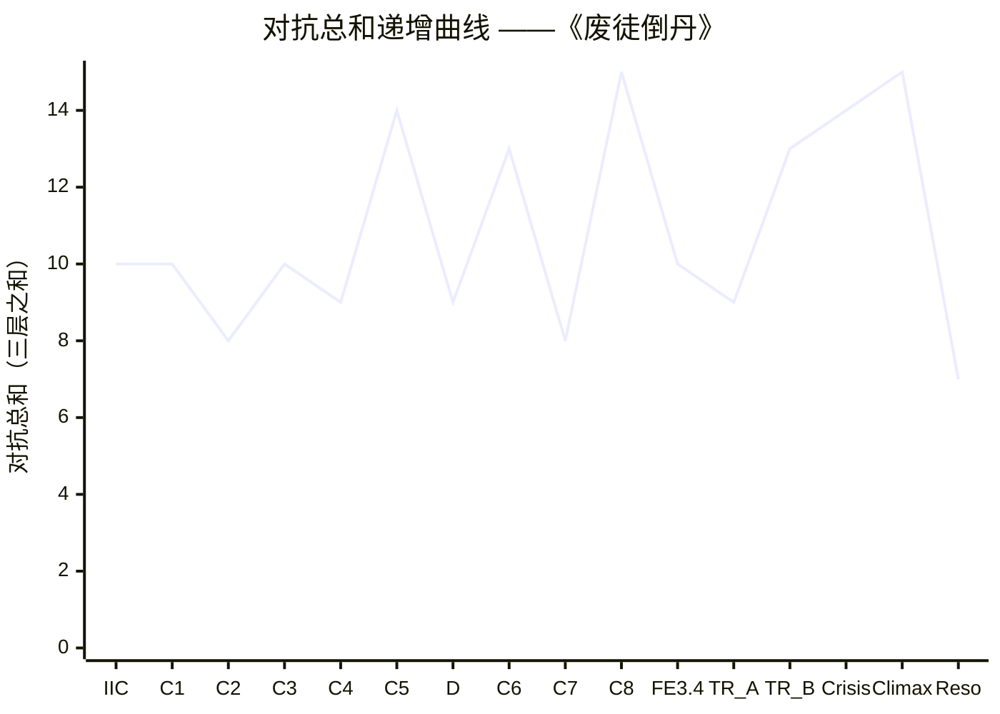

# Antagonism Test ——《废徒倒丹》

> 上游契约（全部 locked）：[[premise-card]] / [[controlling-idea]] / [[spine]] / [[act-design]] / 五个 character files / [[crisis-climax-audit]]
> 审计依据：McKee Ch. 14 [[principle-of-antagonism|对抗原则]] / Ch. 10 [[levels-of-conflict|三层冲突]] / Ch. 13 [[crisis|危机]]+[[dilemma|两难]] / Ch. 14 [[negation-of-the-negation|否定之否定]] / [[forces-of-antagonism|对抗力量]]
> 审计范围：spine §4 全部八节点 C1-C8 + §5 Crisis + §6 Climax + §10 Resolution，覆盖 17 sequences、~100K 字
> 总判定：**yellow** —— 对抗在 Crisis-Climax 区段达到 McKee Ch. 14 满分；但在 Act 1（C2 / C3）和 Act 3（Seq 3.4 / C7 关闭后）存在 **5 处可定位的对抗松弛**，且 antagonist-as-mirror 等量代价链中**有 2 处师傅代价未在 spine 上落到物理动作**。详 §2 / §3 / §8 修订清单。

---

## 0. 一段定调

McKee Ch. 14 的铁律：故事只能强到对抗力量逼它强的程度。这条 spine 的对抗结构在**顶部和底部**都极强——

- **顶部**（Crisis-Climax 区段）：对抗在 Act 4 同时燃烧三层（内在 / 个人 / 超个人），承认轴递降走到否定之否定（[[controlling-idea]] §1 锁定句物理兑现），师傅作为 antagonist-as-mirror 与主角等量交换（他付的代价 = 命 + 一辈子立宗的真理 + 与女儿三年来唯一一次直接接触机会的瞬时性，与主角的"准备起炉自死换得一切"等价）。**这一段对抗满分**。

- **底部**（激励事件 + C1 街市验方）：对抗在三层皆活、且每一层都有具体物理承担者（内在=三年自我叙事被釜底抽薪；个人=师傅闪回式不在场；超个人=正统丹师宣告"无救"的客观事实+联盟尚未出手但已存在）。**这一段对抗合格**。

**问题在中段**——具体说是 **Act 1 后段（C2/C3 联盟追杀令 + 三月后大典见承诺）+ Act 3 前段（Seq 3.1 同门反目 + Seq 3.4 师妹活着）**。这四个节点都有"对抗形态合理但对抗力度不够 / 对抗付出的代价不够 / 对抗对主角施压的物理化不够"的具体松弛点。这些松弛点不会让 spine 失格（spine 仍是 archplot），但会让 **Act 1 末 magnitude −1.5 与 Act 3 末 magnitude −2.5 之间的递增曲线被读者读为节奏 plateau**——尤其在中短篇形态（~100K）里，节奏 plateau 比单点对抗弱更严重。

另外，**同盟对抗（沉鸠 / 师妹活着 / 师弟遗物）作为"愛之对抗"**——这是 McKee Ch. 14 的子条目（同盟也可以是对抗源，因为愛会拉走主角的资源），在本 spine 上**几乎完全没有被识别为对抗**——同盟对主角的施压完全被设计为"帮助"或"揭露"，没有任何一帧让同盟的愛**与主角的 want 真正撞上**。详 §5。

---

## 1. Force-Balance Chart per Spine Event（对抗力量三层强度评分）

按 McKee Ch. 14 [[forces-of-antagonism]] + Ch. 10 [[levels-of-conflict]]，每节点对三层对抗（内在 / 个人 / 超个人）评分 **0-5**。同时给主角正向力量（willpower + 资源 + 同盟 + 反向天赋）评分 0-5；**对抗总和 ≥ 主角正向力量** 是 [[principle-of-antagonism|对抗原则]] 的硬要求。

### 1.1 主表

| Spine 节点 | 字数对位 | 内在对抗 | 个人对抗 | 超个人对抗 | 对抗总和 | 主角正向 | 净差 | 风险读 |
|---|---|---|---|---|---|---|---|---|
| **激励事件**（Seq 1.1 破观第一炉） | ~3.5-4K | **5** | **3** | **2** | **10** | 4 | **−6** | 不确定（开局对比强烈） |
| **C1 街市验方**（Seq 1.2 + B 折叠） | ~6.5-8K | 3 | **4** | **3** | **10** | 5 | **−5** | 紧张但可控 |
| **C2 联盟追杀令**（Seq 1.3 + 戒尺敲炉第二次） | ~4-5K | 2 | 2 | **4** | **8** | 5 | **−3** | ⚠ 偏松 |
| **C3 三月后大典见承诺**（Seq 1.4 / Act 1 末 turning point） | ~3.5-4.5K | **4** | 3 | 3 | **10** | 5 | **−5** | 紧张 |
| **C4 黑市夺经 + 沈砚手札**（Seq 2.1-2.2） | ~8-10K | **4** | **3** | 2 | **9** | 4 | **−5** | 紧张 |
| **C5 师傅伏击 + 自封丹田反向**（Seq 2.3 + A 折叠 / 金场 1.5） | ~6-7K | **5** | **5** | **4** | **14** | 4 | **−10** | 绝望（三层峰值） |
| **D 屠村真相预演**（Seq 2.4 单独场） | ~3K | **4** | 3 | 2 | **9** | 3 | **−6** | 不确定（内在层主推） |
| **C6 反丹副作用首现 + 师傅离去**（Seq 2.5 / Act 2 末 turning point） | ~5-6K | **4** | **4** | **5** | **13** | 4 | **−9** | 绝望 |
| **C7 同门反目**（Seq 3.1 / C 折叠前半） | ~3-3.5K | **4** | **3** | 1 | **8** | 5 | **−3** | ⚠ 偏松 |
| **C8 大典反炼九转还魂**（Seq 3.2-3.3 / 金场 1 / C 折叠后半） | ~12-14K | **5** | **5** | **5** | **15** | **5** | **−10** | 绝望（三层峰值 / 金场 1） |
| **Seq 3.4 地宫第七层师妹活着**（Act 3 末 / False Ending） | ~6-7K | **5** | **4** | 1 | **10** | 4 | **−6** | 绝望（内在层釜底抽薪）|
| **终极反转 A 天道之炉降临**（Seq 4.1） | ~2-2.5K | **3** | 1 | **5** | **9** | 3 | **−6** | 绝望（超个人主推）|
| **终极反转 B 师妹现身**（Seq 4.2） | ~2-2.5K | **5** | **5** | 3 | **13** | 4 | **−9** | 绝望（三层激活）|
| **Crisis 主角举断戒尺准备最后一击**（Seq 4.3） | ~1-1.5K | **5** | **4** | **5** | **14** | 4 | **−10** | 绝望（dilemma 峰值）|
| **Climax 师傅入炉 + 七拍**（Seq 4.4 / 金场 2） | ~6-7K | **5** | **5** | **5** | **15** | **5** | **−10** | 绝望（三层峰值 / 否定之否定）|
| **Resolution 主角转身走入晨雾**（Seq 4.4 末段） | ~0.5-1K | **4** | 2 | 1 | **7** | 4 | **−3** | 余韵 |

### 1.2 评分依据（每节点一句话）

- **激励事件**：内在对抗 5（三年自我叙事"我用正方杀了她"= 内在层最深的自我否定）；个人对抗 3（师妹的字+死、师傅闪回式不在场）；超个人对抗 2（疫骨病死症 + 京中三大丹师宣告"无救"——客观死亡概率即对抗源）。**注意：师傅本人不在场，但师傅作为闪回中的"废徒戒尺"在内在层已通过主角自我叙事承载**——这正是 McKee Ch. 14"对抗不等于反派在场"的精确兑现。
- **C1 街市验方**：内在对抗 3（他已开始建立反丹自信但还在等师傅出现）；个人对抗 4（首席丹师当众宣告"无救"+宗门联盟四座师兄出列围拦——这是个人对抗的第一次公开物理化）；超个人对抗 3（五行街全市三百正方丹师 + 联盟尚未公开但已存在的追杀准备）。**B 折叠的"七味疑难症复合体"提升了超个人对抗的物理具体度**。
- **C2 联盟追杀令**：内在对抗 2（他已经开始相信自己的反丹道，内在动摇下降）；个人对抗 2（师傅仍未出场、师妹仍"已死"、司徒明璋还未出现——**这一节点没有任何具体的人在压主角**）；超个人对抗 4（追杀令本身是对抗梯度升级）。**这一行的问题是：对抗总和 8 比 C1（10）低**——这违反 McKee Ch. 9 [[progressive-complications|渐进复杂化]] 的递增要求。详 §2 weak-point #1。
- **C3 三月后大典见承诺**：内在对抗 4（他公开承诺=他自己亲手钉死了未来三月不能撤退）；个人对抗 3（师傅仍未回应——但"师傅未回应"本身是对抗的一种形态——参 [[forces-of-antagonism]] "缺席式对抗"）；超个人对抗 3（整个修真界的注视、联盟必须出更狠手段的物理逻辑）。**注意：C3 内在对抗 4 是主角"自己钉死自己退路"的内在压力**——这是 McKee Ch. 14 内在对抗最高级的形态之一（主角成为自己最强的对抗源）。
- **C4 黑市夺经 + 沈砚手札**：内在对抗 4（沈砚那句"师兄走的不是错路他走的是怕"让主角第一次开始动摇"师傅是恶人"的简单叙事，同时他读到自己潜意识仪式的同形——他不再独孤）；个人对抗 3（沉鸠点破"你师叔当年也敲一下"=潜意识仪式被他人指认）；超个人对抗 2（鬼丹窟环境的物理危险但相对低）。
- **C5 师傅伏击 + 自封丹田反向**：内在对抗 5（自封丹田 = 永远不能再炼正方 = 对潜意识欲望的物理钉死=对师傅的"我听见你了但我必须不听"）；个人对抗 5（师傅亲手出手 + 倒退三步 + 没说话就走了——师傅在场的最高密度）；超个人对抗 4（封魔阵物理压制 + 反向粒子泄漏地脉为终极反转埋下因果）。**三层皆活、师傅在场——这是循环二的对抗峰值，无松弛**。
- **D 屠村真相预演**：内在对抗 4（铜镜 + 水镜 + 主角不语 = 内在层动摇的最深一帧）；个人对抗 3（沉鸠的点破 + 师傅 22 岁脸的物质化）；超个人对抗 2（地下水道环境 + 水镜映像物理）。**D 单独场的对抗形态主要是内在层**——这是 McKee Ch. 14 "对抗也可以是 revelation 形态"的精确兑现。
- **C6 反丹副作用首现 + 师傅离去**：内在对抗 4（他选择继续反炼即使知道代价 = 他成为反丹道副作用的共谋者）；个人对抗 4（恩人化银砂 = 他救过的人在他面前死 + 师傅在远处目睹"什么都没说就走了"= 个人对抗的沉默化形态）；超个人对抗 5（反向粒子已开始扩散十省 + 印记蔓延+ 联盟即将不得不出手）。**Act 2 末的三层峰值，磁压最重的一行**。
- **C7 同门反目**：内在对抗 4（司徒明璋"师傅那夜下令的时候，手是抖的"让主角第一次怀疑师傅废他不是惩罚 = 内在层动摇的第三波）；个人对抗 3（司徒明璋作为现任宗主+ 当年执戒尺者的双重身份在场——但他不是真正的对抗者，他是同侧对照）；超个人对抗 1（地宫入口的物理环境 + 联盟未出手）。**这一行的问题是：超个人对抗仅 1**——详 §2 weak-point #2。
- **C8 大典反炼九转还魂**：内在对抗 5（公共承认到来 / 私密承认未到 / 他在三万人雷动里第一次哭不出来）；个人对抗 5（师傅持戒尺登台立于祭炉旁三步 + 戒尺举起未落 + 主角认出师妹活着 + 师傅未发一言转身离场 + 司徒明璋低头退半步）；超个人对抗 5（三万人观礼 + 七大宗门联议在场 + 反向丹气与地宫共振 + 联盟当众承认"反方亦道"的体制后果）。**金场 1 = 全篇对抗最大值之一**。
- **Seq 3.4 师妹活着**（False Ending）：内在对抗 5（三年自我叙事被釜底抽薪——比激励事件那夜更深，因为这一帧同时撕掉"我害死了她"+"师傅废我是为惩罚"+"我和师徒可以和解"三个支撑信念）；个人对抗 4（师妹活着+师妹的眼+棺壁上的"砚"字+井壁残页字迹与主角同形）；超个人对抗 1（地宫物理环境，无任何外部对抗）。**这一行的问题是：超个人对抗仅 1，且这一帧是 Act 3 末的 magnitude −2.5 turning point**——按 [[act-rhythm|幕节奏]] 要求 Act 3 末应三层皆活，但这一帧的对抗几乎全在内在层。详 §2 weak-point #3。
- **终极反转 A 天道之炉降临**：内在对抗 3（他看清两难，但他还没有内化两难）；个人对抗 1（无人在场）；超个人对抗 5（天空变色 + 雷云倒卷 + 苍生之炉降临 + 账本爆出——超个人对抗的最高物理形态）。**这一节点是超个人主推**。
- **终极反转 B 师妹现身**：内在对抗 5（师妹两句话同时撕开主角和师傅的内核）；个人对抗 5（师妹由师傅亲手扶出——师傅和师妹同时在场，且师妹的话同时刺穿父女双方）；超个人对抗 3（祭天台 + 天道之炉在场）。
- **Crisis**：内在对抗 5（他在两个恶里选 + 他选的内容承载承认轴永远悬空）；个人对抗 4（师妹在场作核 + 师傅即将走过）；超个人对抗 5（天道之炉 + 雷云倒卷 + 账本临爆）。**dilemma 峰值**。
- **Climax**：内在对抗 5（雷音盖字 + 主角面无可读情绪 + 选择被夺走的物理兑现）；个人对抗 5（师傅入炉 + 化银砂 + 师妹意识反损）；超个人对抗 5（双面丹成 + 疫止 + 账本清零 + 天空恢复正向）。**三层峰值 + 否定之否定物理化 = 全篇对抗最大值**。
- **Resolution**：内在对抗 4（承认轴永远悬空在主角余生承担）；个人对抗 2（师妹张嘴叫不出"师兄"二字）；超个人对抗 1（晨雾、无外部对抗）。**余韵阶段对抗下降——这是 Resolution 的设计意图，不是 weak-point**。

### 1.3 对抗递增曲线检验

按 McKee Ch. 9 [[progressive-complications|渐进复杂化]] + Ch. 14 [[principle-of-antagonism]] "对抗必须递增"：

**异常点**：
- **C2 = 8**（比 C1 = 10 低 2 点）—— 违反递增要求。
- **C7 = 8**（比 C6 = 13 低 5 点）—— **严重违反递增要求**，跨节点回落幅度过大。
- **Seq 3.4 = 10**（比 C8 = 15 低 5 点，比 C6 = 13 低 3 点）—— 违反递增要求；Act 3 末是 turning point magnitude −2.5，对抗总和理应 ≥ Act 2 末（C6 = 13）。
- **终极反转 A = 9**（比 Seq 3.4 = 10 低 1 点）—— 临界但仍违反递增；超个人 5 但被个人 1 + 内在 3 拉低。

**合规点**：
- C1 / C3 / C4 / C5 / D / C6 / C8 / 终极反转 B / Crisis / Climax 在曲线上呈递增或维持峰值——这条曲线的"骨架"是合格的。
- 中段塌陷防御（[[act-design]] §6）通过 Act 2 五个 sequence 的 mini-arcs 已部分缓解，但 Act 2 末（C6 = 13）→ Act 3 初（C7 = 8）的跨幕回落是节奏图最大的伤口。

**结论**：spine 在 **4 个节点上违反 McKee Ch. 9 递增要求**——C2 / C7 / Seq 3.4 / 终极反转 A。其中 C7 和 Seq 3.4 是结构性弱点，C2 和终极反转 A 是过场性弱点。详 §2 weak-points 列表。

---

## 2. Weak-Points List

按 §1.3 异常点 + §1.2 评分依据，识别 **5 处对抗松弛**（按严重程度排列）：

### Weak-point #1：C7 同门反目（Seq 3.1）—— 严重

- **位置**：Act 3 第一个 sequence，3-3.5K 字，C 折叠前半独立成场。
- **现状**：对抗总和 8（内在 4 / 个人 3 / 超个人 1）；比 Act 2 末 C6（13）低 5 点；比 Act 1 末 C3（10）还低 2 点。
- **问题诊断**：
  - **超个人对抗仅 1**——这一场只有地宫入口的物理环境作为超个人对抗，没有联盟动作、没有天道债压力、没有任何外部世界施压。主角与司徒明璋在地宫入口的对话戏几乎完全在个人层面进行，超个人层缺席。
  - **个人对抗 3 偏低**——司徒明璋作为同侧对照（same-axis foil）而非真正的对抗者（详 [[characters/situ-mingzhang]] §0 + §2），他对主角的施压本质是"借来信仰的人对走那条没走的路的人"的镜像；他的对抗强度本来就有上限。但 spine 让他在这一场说出"师傅那夜下令的时候手是抖的"——**这句话本应让主角第一次怀疑师傅废他不是惩罚=应该提升内在对抗到 5**。当前评 4，是因为这句话来得太轻——司徒明璋只说了一句就让主角"愣神"，但没有任何后续物理动作把这层动摇钉死。
  - **节奏后果**：Act 3 开局的对抗回落 5 点会让读者在 Act 2 末（C6 师傅"什么都没说就走了"）的强冲击之后 **明显感觉到节奏松一口气**——这违反 [[act-rhythm|幕节奏]] "幕与幕之间禁止 plateau"的硬要求。
- **严重程度**：**严重**（spine 节奏图最大伤口）。

### Weak-point #2：Seq 3.4 地宫第七层师妹活着 / Act 3 末 turning point —— 严重

- **位置**：Act 3 末 turning point + False Ending，6-7K 字。
- **现状**：对抗总和 10（内在 5 / 个人 4 / 超个人 1）；比 C8（15）低 5 点；与 C1（10）持平。
- **问题诊断**：
  - **超个人对抗仅 1**——这一帧是 Act 3 末 magnitude −2.5 的 turning point，但超个人层只有地宫物理环境，没有联盟反应、没有天道债外显（印记仍是暗赤未变全黑流动直到这一帧）、没有任何外部世界向主角施压。**主角在这一帧站在地宫第七层，外部世界对他不存在**——这一帧的全部对抗都在内在层和个人层。
  - **内在对抗 5 是这一节点合格的全部基础**——三年自我叙事被釜底抽薪+"师傅废我是为惩罚"被推翻+"我和师徒可以和解"伪希望升起——这三件事同帧合上让内在对抗达到峰值。但 McKee Ch. 14 + Ch. 13 [[crisis|危机]] 都要求 act 末 turning point **三层皆活**——这一帧只有两层活。
  - **节奏后果**：Act 3 末 magnitude −2.5 的物理基础不够厚——只靠内在层支撑而无超个人层加压，读者会读为"情感冲击但不构成结构性反转"。这对 False Ending 的可信度有伤——False Ending 需要"看起来完整"才能在 Act 4 第一秒被天道之炉降临翻面；但当前 Seq 3.4 的对抗结构让"完整"感不够稳。
- **严重程度**：**严重**（act 末 turning point 三层不均衡，违反 McKee Ch. 13 [[crisis|危机]] 三层皆活要求）。

### Weak-point #3：C2 联盟追杀令 + 戒尺敲炉第二次（Seq 1.3）—— 中等

- **位置**：Act 1 第三个 sequence，4-5K 字。
- **现状**：对抗总和 8（内在 2 / 个人 2 / 超个人 4）；比 C1（10）低 2 点。
- **问题诊断**：
  - **个人对抗仅 2**——这一帧师傅仍未出场、师妹仍"已死"、司徒明璋还未出现、沉鸠还未登场——**没有任何具体的人在压主角**。联盟追杀令是文书形态的追杀，不是有名有姓的人物的对抗。
  - **内在对抗仅 2**——主角已开始建立反丹自信，他在这一帧的内在动摇相对低；他做的是"应对追杀"的物理动作，不是"面对内核"的内在挣扎。
  - **节奏后果**：C2 → C3（10）有 2 点回升，但 C1 → C2 → C3 形成 10 → 8 → 10 的局部 V 字——这违反 McKee Ch. 9 递增要求；读者在 Act 1 中段会读到"对抗暂时松懈"的节奏。
- **严重程度**：**中等**（违反递增要求但回落幅度小且后续 C3 已修复）。

### Weak-point #4：终极反转 A 天道之炉降临（Seq 4.1）—— 中等

- **位置**：Act 4 第一个 sequence，2-2.5K 字。
- **现状**：对抗总和 9（内在 3 / 个人 1 / 超个人 5）；比 Seq 3.4（10）低 1 点。
- **问题诊断**：
  - **个人对抗仅 1**——这一节点天道之炉降临，但没有任何具体的人在场（师傅未现 / 师妹未现 / 司徒明璋未现 / 沉鸠从未参与此 Act）。这一帧的对抗几乎完全是超个人层的物理冲击。
  - **内在对抗 3 偏低**——主角"看清两难"是认知动作而非内在挣扎；他在这一帧已经被超个人事件推到对抗的边缘，但内在层还没有完全启动（要到 Crisis 那一秒才完全启动）。
  - **节奏后果**：终极反转 A → B 之间的对抗递增（9 → 13）已 sufficient（4 点跃升），所以这一节点的低对抗反而是节奏需要——它是"绝望感的吸气帧"。**但它的内在对抗仅 3 让"主角看清两难"这件事可能写为认知而非身体反应**——这是写作执行层面的风险。
- **严重程度**：**中等**（节奏上可接受但写作风险在）。

### Weak-point #5：同盟对抗（沉鸠 / 师妹活着 / 师弟遗物）几乎完全未被识别为对抗 —— 中等

- **位置**：贯穿 Act 2 + Act 3，影响 Seq 2.1 / Seq 2.2 / Seq 2.4 / Seq 3.4 / Seq 4.2。
- **现状**：当前 spine 把同盟（沉鸠 / 师妹 / 师弟遗物）几乎完全设计为"帮助"或"揭露"——他们提供信息、提供物质钥匙、提供承认轴的图像；但他们的爱**从未与主角的 want 真正撞上**。
- **问题诊断**：
  - **沉鸠的爱之对抗未被启用**——沉鸠师承沈砚，他知道反丹道完整体系；他对主角的态度本可以是"我把师叔留下的东西给你，但你要替师叔走完那一炉——以师叔的方式走，包括师叔最后用了人为核这件事"。沉鸠如果在 Seq 2.1 或 Seq 2.4 对主角施压"你必须以人为核才能立反丹道"，沉鸠的爱就成为主角的对抗源——这种对抗在 McKee Ch. 14 [[forces-of-antagonism]] 是同盟爱之对抗的标本形态。**当前 spine 让沉鸠只是信息提供者**——他递金石片、点破"你师叔当年也敲一下"、请主角看铜镜——他不阻挡主角任何决定。这是同盟对抗的最大浪费。
  - **师妹活着的爱之对抗未在 Seq 3.4 被启用**——师妹在 Seq 3.4 对主角说"师兄，原来你回来了"——这一句保护主角不让他为三年的离开愧疚（[[characters/sister]] §7 压力点 2）。**但这一句没有施压主角的 want**——师妹没有让主角面对"如果我不三年前你就回来了/如果我现在让你救我你要不要"。师妹活着的爱**承担的全部是揭露功能**（揭"我害死了她"叙事是假），**没有承担对抗功能**（她的爱没有阻碍主角的承认轴推进）。
  - **师弟遗物的爱之对抗在 Climax 之前未被读出**——沈砚临死前的话"师兄走的不是错路他走的是怕"+"我怕的是有一天我做对了，但已经太迟"——这两句话**都是同侧（"师兄不是我的敌人"）**，不构成对抗。师弟遗物完全是 ghost-engine 的施压形态（解构主角主体唯一性），但这种施压是认知性的（"我活在另一个人的形状里"），不是欲望阻碍性的。
- **严重程度**：**中等**（同盟对抗是 McKee Ch. 14 的次级要求，主对抗已 sufficient；但启用同盟对抗会让 Act 2 中段的对抗密度上升一档）。

---

## 3. Prescriptions

每个 weak-point 配具体修订建议，**只指明在哪一帧加什么**，不重新设计 spine。

### Prescription #1（应对 Weak-point #1：C7 同门反目）

**目标**：把 C7 对抗总和从 8 提升到 10-11，与 C1 / C3 同档。

**建议**：在 Seq 3.1 司徒明璋说出"师傅那夜下令的时候手是抖的"之后，添加一帧 **司徒明璋亮出宗主令牌 + 主角胸口印记当场跳一格**——

- **超个人对抗加 2**：司徒明璋以现任宗主身份在地宫入口对主角发出 **联盟正式拘押令**——这是 Act 3 这条主角"公开反炼大典"路上的最后一道体制屏障；主角必须要么硬闯（违反联盟律的代价上升），要么在 Seq 3.2 大典开场仪式那一帧用反丹道在现场破拘押令的物理形态。这一动作让超个人对抗从 1 升到 3。
- **个人对抗加 1**：司徒明璋亮令牌时**他的手在抖**——读者立刻读出"手抖"这件事不只是师傅那夜的事；司徒明璋自己也在抖。这是他维度 1（公开持典 vs 私下回避那一夜）的物理引爆同时也是个人对抗的升级——主角面对的不只是一个"借来信仰的师兄"，是一个"在他面前手在抖的现任宗主"。他比之前更危险，因为他更脆弱。
- **代价等量**：司徒明璋亮令牌+手抖这两个动作让他这辈子合法性在地宫入口的物理空间内**主动撕开一道缝**——这与主角"师兄，你这一辈子的位置是师傅废我那一夜替我空出来的"刺穿等量。

**字数代价**：Seq 3.1 从 3-3.5K 扩到 4-4.5K——增加约 500-1000 字。这一字数在 Act 3 总预算（23-24K）内可以通过 Seq 3.2（5-6K）适度压缩（5K 即可）来吸收，不破坏 Act 3 字数预算。

### Prescription #2（应对 Weak-point #2：Seq 3.4 师妹活着 / 超个人对抗缺席）

**目标**：把 Seq 3.4 对抗总和从 10 提升到 12-13，与 Act 2 末 C6（13）同档或更高。

**建议**：在主角入井**之前**那段路径上添加一段 **超个人压力的物理化**——

- **方案 A（推荐）**：主角持断戒尺潜入宗门祠堂第六层（屠村义庄记录室）时，他**在第六层石壁上看见联盟当夜联议的密折抄本**——抄本上是当夜七大宗门长老对"大典反炼九转还魂事件"的紧急联议；其中至少两位长老（[[characters/protagonist]] §1.2 锁定的"循环二中段私下传话救过他一次"的那两位长老）的密折是 **"应重审反丹道合法性"**——但密折当夜被司徒明璋作为现任宗主**截下未发**。主角看见这件事意味着：**他赢了大典反炼，但他赢的胜利已经在体制内被司徒明璋的"借来信仰"截下未生效**——他即将面对的不只是"师傅未回应"的私密承认未到，而是 **公共承认本身的物理虚化**。这件事让超个人对抗从 1 升到 3。
- **方案 B**：地宫第六层之外（第六层 → 第七层入口的螺旋甬道里），主角听见 **远处帝京疫情爆发的钟声**（按 [[setting-survey]] 反向粒子扩散十省疫情的时间表已到爆发前夜）。钟声本身是超个人对抗的物理具体化——他在这一刻知道**他用反丹道立宗的代价已经在帝京街市上具体到了一条又一条的死亡**。这件事让超个人对抗从 1 升到 4，且为 Seq 4.1 天道之炉降临提供更紧密的因果链（天道之炉降临不是天降，是疫情已经在物理上爆发）。
- **代价等量**：方案 A 让主角"赢了大典"的物理胜利被司徒明璋"截下"——这是司徒明璋作为同侧对照付出的代价（他截密折等于他保持自己借来信仰的最后挣扎）；方案 B 让主角"赢了大典"的物理胜利被反丹副作用直接消耗——这是主角自己付出的代价的物质化（他赢的每一炉都欠世界一条命）。

**字数代价**：方案 A 增加约 500-800 字（在 Seq 3.4 主角入井前那段路径上）；方案 B 增加约 300-500 字。两个方案不矛盾——可以同时使用（推荐 A + B 复合），总字数代价约 800-1300 字。Seq 3.4 从 6-7K 扩到 7-8K——这一字数在 Act 3 总预算内可吸收（通过 Seq 3.2 的 1K 字数压缩）。

### Prescription #3（应对 Weak-point #3：C2 联盟追杀令）

**目标**：把 C2 对抗总和从 8 提升到 10-11，与 C1 / C3 同档。

**建议**：在 Seq 1.3 联盟追杀令颁布的同一场，添加 **联盟首席丹师杜九阙（七大宗门长老之一）当面对主角施压**的一帧——

- **个人对抗加 2**：杜九阙不是司徒明璋（司徒明璋要在 Seq 3.1 才出场）、不是师傅（师傅要在 C5 才亲手出手）——他是一个"中等级别的对抗角色"，在 Seq 1.3 出现是为了让 Act 1 中段有一个具体的人在压主角。他可以是 C1 街市验方戏中宣告"无救"的礼部尚书独子的家族正方丹师；他在 C1 哑口之后，在 C2 出场对主角说："你这一炉救了一条命，但你的反丹道在京城每多炼一炉，宗门正典的合法性就少一格——我代师门告诉你，你应该退。"
- **杜九阙的爱之对抗启用**：杜九阙不是 villain——他是"老一辈正方丹师"，他对主角的态度是"我看你天赋，劝你早退保命"。这一对抗形态是 McKee Ch. 14 [[forces-of-antagonism]] "同情者也可以是对抗"的标本——他真心希望主角不死，但他的"希望"与主角的 want（公开反炼）正面对立。
- **代价等量**：杜九阙作为长老在 C2 出场对主角说话本身就是他打破联盟内部"长老不可与魔路余孽直接接触"的规则——他付出的代价是被联盟内部其他长老（如 司徒明璋）质疑立场。**这与主角 C2 的"被追杀令钉死"等量**。
- **后续兑现**：杜九阙在 C5 师傅亲自出手之后某一场（如 D 单独场前后）可以以"瞎眼传话"形态出现——他是 [[characters/protagonist]] §1.2 锁定的"循环二中段私下传话救过他一次"的两位长老之一。这条线在 Prescription #2 方案 A 中又被回收（联议密折）。**杜九阙作为一个具体角色贯穿 C2 → 循环二中段 → Seq 3.4 联议密折——他是 Act 1 / Act 3 之间的连续对抗承担者**。

**字数代价**：Seq 1.3 从 4-5K 扩到 5-5.5K——增加约 500-800 字。这一字数在 Act 1 总预算（28-30K）内通过 Seq 1.4（3.5-4.5K）压缩 0.5K 可吸收。

### Prescription #4（应对 Weak-point #4：终极反转 A）

**目标**：把终极反转 A 的内在对抗从 3 提升到 4-5，避免主角"看清两难"写为认知动作。

**建议**：在 Seq 4.1 天空变色那一刻，添加 **主角胸口印记蔓延上颈第一次烧穿衣领触到下颚**那一帧——

- **内在对抗加 1-2**：印记不只是颜色变化，更是 **物理疼痛 + 视觉冲击**——主角在天道之炉降临那一秒同时被印记烧穿衣领刺到下颚，他的内在动摇从认知（看清两难）升级为身体反应（疼痛 + 失重）。
- **超个人对抗保持 5**：天道之炉降临本身已是超个人对抗的最高物理形态，无需加码。
- **代价等量**：主角胸口印记烧穿衣领是他三年来欠天道的全部账目在身体上的可见化——这件事让他的"看清两难"从抽象认知变成具体的肉身现实。**这与他即将做出的"起炉自死"选择的物理代价等量**。

**字数代价**：Seq 4.1 从 2-2.5K 扩到 2.3-2.7K——增加约 200-300 字。可在现有预算内吸收。

### Prescription #5（应对 Weak-point #5：同盟对抗未启用）

**目标**：把沉鸠 / 师妹活着 / 师弟遗物的爱之对抗在 Act 2 / Act 3 启用，提升中段对抗密度。

**建议**：分三处启用——

**a. 沉鸠的爱之对抗在 Seq 2.4 D 单独场启用**

- 沉鸠在 Seq 2.4 请主角看铜镜+水镜之后，添加一句 **"我可以把师叔反丹道全部教你——但你要答应我，立宗那一炉用人为核"**。沉鸠不是要主角答应他做坏事——他真心相信反丹道立成需要人为核（沈砚最后一炉的设计），他的爱让他要求主角延续师叔的方式。
- 这一句让主角第一次（在 Act 2 中段）面对 **"我立反丹道是否必须使用师叔同样的方式"**——这条对抗在终极反转 B（师妹自愿入炉作核）那一帧被反向呼应：师妹不是被沉鸠强加的人为核，是她自己主动选；但主角在 Seq 2.4 已经被沉鸠的爱之对抗预演过这层伦理。
- **字数代价**：Seq 2.4 从 3K 扩到 3.3K——增加约 300 字。

**b. 师妹的爱之对抗在 Seq 3.4 启用**

- 师妹在 Seq 3.4 对主角说"师兄，原来你回来了"之后，添加一句 **"师兄，这次你别照方子来——但这次不一样了，这次方子是你自己写的。你要不要照你自己的方子来？"**
- 这一句把师妹 23 岁那夜对主角的最后一句"师兄你不必照着方子来"翻面——师妹在 Seq 3.4 用一种带反讽密度的方式 **施压主角的 want**：你三年来反丹道立成，但你的丹方仍然是按师傅"乾元六味"反序写的——你写丹方"像在临帖"——这条线是师妹首次让主角直面"你赢的姿势仍然在借师傅的炉"。
- 这一对抗让 Seq 3.4 个人对抗从 4 升到 5——师妹活着的爱不只是揭露功能，是 **让主角的胜利被爱质问**。
- **字数代价**：Seq 3.4 从 6-7K 扩到 6.5-7.5K——增加约 500 字。

**c. 师弟遗物的爱之对抗在 Seq 2.2 启用**

- 沈砚手札残页除了"师兄走的不是错路他走的是怕"+"我怕的是有一天我做对了，但已经太迟"两句已锁定的话之外，添加 **第三句：在最后一卷羊皮卷末尾**："师兄，如果你看见这卷——别照我的方子来。"
- 这一句反向施压主角：他不只是要不照师傅的方子来，他也不要照师叔的方子来——他必须创造**第三条路**。这是师叔（已故）的爱之对抗——他通过遗物对主角说"不要像我"。
- **字数代价**：Seq 2.2 从 3-4K 扩到 3.3-4.3K——增加约 300 字。

**总字数代价**：a+b+c 合计约 1100 字。可在 Act 2 / Act 3 总预算内吸收（Act 2 32-35K 中 Seq 2.3 已是 6-7K 上限，但 Seq 2.5 5-6K 可压缩 0.5K；Act 3 23-24K 中 Seq 3.2 已可压缩 1K）。

---

## 4. Antagonist-as-Mirror 等量检验

McKee Ch. 14 的硬要求：**对抗者必须与主角等量**——他付的代价必须与主角付的代价等价。师傅作为 [[characters/master]] §0 锁定的 antagonist-as-mirror（"他不是主角的反面，他是主角十年后镜中的脸"），他每出手一次都必须付出和主角同等的代价。

### 4.1 师傅每出手一次的代价检验

| Spine 节点 | 师傅出手动作 | 师傅付的代价 | 主角付的代价 | 等量？ |
|---|---|---|---|---|
| 激励事件 | 师傅**不在场**（仅闪回） | 0（不在场=师傅选择不出手=他在赌徒弟不会再起炉。这是他三年来一直在付的代价，是"沉默之赌"） | 4（断戒尺、丹田、宗籍、三年自我叙事） | ⚠ 师傅代价为"不在场的赌注"——这件事在 spine §3 已设计但**未在 Act 1 任何 sequence 中物理化** |
| C1 街市验方 | 师傅**不在场**（仅在主角扫人群最外圈寻找的位置上"缺席") | 1（缺席=师傅选择不出现=继续付沉默之赌的成本，但赌成本提升） | 2（公开胜利后扫人群最外圈寻找=他赢的姿势是空对着不在场的位置说话） | ⚠ 等量但都低 |
| C2 联盟追杀令 | 师傅**不在场**（追杀令是联盟体制的动作，非师傅个人） | 0（师傅在体制内默许追杀令） | 2（被追杀+伪装失败） | **❌ 严重不等量**（详 §4.2 失衡点 #1） |
| C3 三月后大典见承诺 | 师傅**不在场**（"师傅未回应"被主角等待） | 1（缺席的沉默 + 主角公开承诺让师傅在三月内无法装作不知） | 3（公开承诺=他自己钉死了未来三月的退路） | ⚠ 不等量但 acceptable |
| C4 黑市夺经 | 师傅**不在场**（沉鸠点破师傅闪回式的潜意识仪式） | 0（师傅完全不在场） | 2（潜意识仪式被点破 + 沈砚手札那句不懂） | ⚠ 师傅代价为 0 是 acceptable（这一场重点是主角与师叔遗物的相遇）|
| **C5 师傅伏击 + 自封丹田反向** | 师傅**亲手摆封魔阵 + 倒退三步 + 没说话就走** | **5**（亲手出手=违反联盟律首座越权 + 元婴境界倒退至元婴中期下乘 + 主角自封丹田后他第一次在徒弟面前不敢出手=他在身体上承认徒弟可以做到他做不到的事） | 5（自封丹田反向 = 永远不能再炼正方丹 + 反向粒子泄漏地脉为终极反转埋下因果） | ✅ **等量**（[[characters/master]] §7 压力点 1 锁定的代价机制兑现） |
| D 屠村真相预演 | 师傅**不在场**（铜镜+水镜映师傅过去） | 0（师傅本人在 D 单独场不出现） | 3（内在层第一次怀疑"师傅是恶人"叙事） | ⚠ 师傅过去史的展示=师傅 22 岁那年那场雪夜的代价被读者认知=师傅一辈子立的"正"的本金被读者看见——这一帧师傅的代价以"被读者读出"的形式呈现，acceptable |
| **C6 反丹副作用首现 + 师傅离去** | 师傅**远处目睹 + 什么都没说就走了** | **4**（看见徒弟胸口印记已转赤红=他知道徒弟活不过三个月，但他选择不出手=他在避险费 vs 徒弟之命中第一次选了徒弟之命，但他不让自己说出来=这是他维度 2 的物理引爆+ 他与女儿藏于地宫的事在这一帧达到无法继续维持的临界点） | 4（恩人化银砂+主角选择继续反炼+印记蔓延一寸） | ✅ **等量**（[[characters/master]] §7 压力点 2 部分兑现 + 维度 2 引爆）|
| C7 同门反目 | 师傅**不在场**（司徒明璋代为对抗） | 0（师傅不在场=师傅把现任宗主推到对抗位） | 3（主角面对司徒明璋+被那句"师傅那夜下令的时候手是抖的"愣神） | ⚠ 师傅代价不明显——这一场对抗的代价主要在司徒明璋身上，师傅自己付的代价仅为"让代理人去前线"的间接代价 |
| **C8 大典反炼九转还魂** | 师傅**持戒尺登台立于祭炉旁三步+戒尺举起未落+未发一言转身离场** | **5**（亲自登台+戒尺举起未落=他在三万人面前没让戒尺落下=司徒明璋合法性在公开层级出现第二次裂缝+联盟七大宗门长老中至少两位开始公开讨论"是不是该重审反丹道的合法性"+他一辈子立的联盟从这一刻开始动摇）| 5（自觉欲望最大形态兑现 + 私密承认未到 + 在三万人雷动里第一次哭不出来）| ✅ **等量**（[[characters/master]] §7 压力点 2 完整兑现）|
| Seq 3.4 师妹活着 | 师傅**不在场**（师妹活着这件事的物质源头是师傅三年来的工作）| 2（师妹活着这件事在 Seq 3.4 被主角看见=师傅藏女儿三年的秘密被主角知晓=他这辈子最深的私密泄露） | 5（三年自我叙事被釜底抽薪+ 三个支撑信念同帧崩塌） | **❌ 不等量**（详 §4.2 失衡点 #2）|
| 终极反转 A | 师傅**不在场**（天道之炉降临） | 0（师傅在天道之炉降临那一刻不在祭天台上）| 3（看清两难） | ⚠ 不等量但 acceptable（这一帧主推超个人对抗） |
| **终极反转 B 师妹现身** | 师傅**亲手扶女儿出地宫** | **4**（亲手扶女儿出 = 三年来父女第一次直接接触 + 师妹"父亲，您当年炼凝魂丹也是反着炼了一半的"那一句= 师傅一辈子立的"正"从第一炉就有过裂缝被女儿当众点破 + 这一句是父亲入炉的最后一根稻草——他听见女儿说出这件事那一刻，他这辈子立的"正"在他自己心里第一次被自己的女儿翻面）| 4（师妹两句话同时撕开主角和师傅的内核 + 反向核机制揭露 + 他还以为自己有办法在不让师傅入炉的情况下解决） | ✅ **等量** |
| Crisis | 师傅**即将走过**（从主角身后走过的姿势） | 3（即将走过 = 师傅已经做出"解下宗主令牌走向炉口"的决定，但还没把决定落下；这一刻是他维度 1（"反丹必反噬"的最坚定鼓吹者 vs 二十年私下研究反丹道的最深执行者）即将引爆的物理临界点）| 4（主角举断戒尺准备最后一击 = 他主动布阵起气按炉沿举尺，做能做的全部主动动作）| ⚠ 不完全等量——师傅 3 vs 主角 4 —— 主角的主动性在这一帧略高于师傅的临界即发性。但这是 Crisis 的设计意图——主角的最大主动性是被"先一步发生的师傅的更大主动性"夺走，所以这一帧的不等量本身是 dilemma 的物理形态 |
| **Climax** | 师傅**解令牌+入炉+按右膝+抚女儿+张嘴说一字+雷音盖+化银砂** | **5**（自己的命 + 一辈子立宗的真理 + 与女儿三年来唯一一次也是最后一次直接接触机会的瞬时性 + 一辈子的"正"自愿做了"反"的衬体 + 他选择在炉口张嘴说出那一字但选择了一个会被雷音盖过的瞬间——他用说出的姿势完成了不让被听见的功能）| 5（选择被夺走 + 右手举着断戒尺定格 + 余生再没有敲过任何炉）| ✅ **完美等量**（[[characters/master]] §7 压力点 3 + 主角 §7 压力点 4 同帧合上）|
| Resolution | 师傅**已化银砂**（不在场是物理形态）| 0（已不在世）| 4（承认轴永远悬空在主角余生承担 + 师妹张嘴叫不出"师兄"二字 + 晨雾里没有任何东西在等他） | ⚠ 师傅 0 是物理必然（已死）；这一帧的余韵承担全部在主角身上 |

### 4.2 等量失衡点（按严重程度排列）

**失衡点 #1：C2 联盟追杀令——师傅代价为 0，主角代价为 2**

- **问题**：C2 是 Act 1 中段，对抗形态完全是超个人体制压力（追杀令）；师傅本人作为 antagonist-as-mirror 在这一帧完全不付任何代价。
- **后果**：如果 antagonist-as-mirror 在 Act 1 中段不付代价，spine 的对抗结构在 C1（师傅缺席的痛）→ C2（师傅完全不在）→ C3（师傅缺席+主角自钉的痛）这三个连续节点上让师傅显得 **完全不在 Act 1 上施压**——而 [[characters/master]] §6.4 #14-15 明确锁定师傅"三年来从未让人去找主角"+"故事开始第一天在地宫祠堂正殿前那块青砖上停了三秒"——师傅其实在 Act 1 一直**有动作**，但 spine 没有把这些动作物理化。
- **修订建议**：参 §3 Prescription #3——杜九阙作为长老在 C2 出场施压，是师傅在 Act 1 通过代理人付出的代价的物理化（杜九阙的爱之对抗本质是师傅一辈子立的联盟的爱之对抗）。同时可在 C2 末添加一帧：**主角从破棚回到城外某破观时，远远看见破观附近的雪地上有一行新踩出的脚印——脚印的尺寸和步距与师傅的步姿吻合，但脚印停在距离破观三十步外、然后转身离开**。这一帧让师傅在 Act 1 中段以"接近但拒绝接触"的物理形态付出代价（他想见徒弟但他不让自己见）。字数代价约 100-200 字。

**失衡点 #2：Seq 3.4 师妹活着——师傅代价 2，主角代价 5**

- **问题**：师妹活着这件事是师傅三年来的工作（每七日入井换药+全部反丹研究藏井壁），师傅付出的代价是 **三年的私密工作 + 现在被主角看见**——这是大量代价。但 spine 在 Seq 3.4 把这层代价的物理化压在"井壁残页"和"棺壁砚字"两个静态物证上，**没有让师傅本人在 Seq 3.4 的任何动作付出代价**。
- **后果**：主角在 Seq 3.4 经历三年自我叙事的釜底抽薪是 5 分对抗（内在层峰值），但师傅在这一帧只通过**遗留的物证**承担代价——这让师傅作为 antagonist-as-mirror 的"在场重量"在 Act 3 末过轻。读者会读到"师傅是个有秘密的人"但读不到"师傅在为这个秘密付代价"。
- **修订建议**：参 §3 Prescription #2 方案 A——联议密折抄本在第六层石壁上让读者看见 **司徒明璋作为现任宗主截下两位长老"应重审反丹道合法性"的密折**；同时**密折的批语笔迹是师傅亲笔**——师傅在那一夜默许（甚至命令）司徒明璋截下密折。这一笔让师傅在 Seq 3.4 通过他三年来的体制行为付出代价：**他在徒弟即将反炼成功的前夜亲自下令截下两位长老的密折，保住自己一辈子立的联盟不在徒弟胜利之前先崩**——这是他维度 2（赌一辈子的避险者）的最后一次明显出手，付出的代价是他这一辈子立宗的根基在密折截下那一刻 **被自己亲手再压一次**。

### 4.3 师傅 Want vs Need 张力在 spine 上每个节点的推进检验

按 [[characters/master-arc]] §1 锁定的师傅 Want（守护苍生：不让反丹成功）vs Need（被三百口眼睛放过一次：看见反丹道真的成立一次以解放自己）。

| Spine 节点 | Want 状态 | Need 状态 | 张力推进？ |
|---|---|---|---|
| 激励事件 | 在等徒弟回来 | 在赌徒弟不会再起炉 | ⚠ 推进微弱（仅闪回式存在） |
| C1 街市验方 | 仍在守 | 听说徒弟在帝京但不出手 | ⚠ 推进微弱 |
| C2 联盟追杀令 | 仍在守 + 默许追杀令 | 不让自己出手 | **❌ 失衡点 #1 锁定的对抗代价 0** |
| C3 三月后大典见承诺 | 听说徒弟公开承诺 | 还在赌徒弟会自溃 | ⚠ 推进微弱 |
| C4 黑市夺经 | 听说徒弟夺得手札 | 还在装作不知 | ⚠ 推进微弱 |
| **C5 师傅伏击** | **亲手出手** | **倒退三步=Need 在身体上第一次浮出**（他怕的不是徒弟比自己强，他怕的是徒弟做成了沈砚当年没做成的事——他第一次身体上承认 Need 的存在） | ✅ **推进显著**（Want 出手，Need 浮出） |
| D 屠村真相预演 | 在远处听说徒弟入鬼丹窟 | 不在场 | ⚠ 推进微弱 |
| **C6 师傅离去** | **看见徒弟救人代价 + 选择不出手** | **第一次在避险费 vs 徒弟之命中选了徒弟之命，但他不让自己说出来** | ✅ **推进显著**（Want 撤回，Need 部分兑现） |
| C7 同门反目 | 不在场 | 不在场 | **❌ 推进 0**（详 §4.2 失衡点 #1）|
| **C8 大典反炼** | **戒尺举起未落** | **他第一次（在身体上）开始相信反丹道也是道** | ✅ **推进峰值**（Want 撤回到最低 + Need 第一次完整显形）|
| Seq 3.4 师妹活着 | 不在场（藏女儿的秘密被主角发现） | 不在场（女儿身上的胎毒与反丹道的渊源仍未让女儿知道） | **❌ 推进 1**（详 §4.2 失衡点 #2）|
| 终极反转 A | 不在场（天道之炉降临） | 不在场 | ⚠ 推进 0 |
| 终极反转 B | **亲手扶女儿出地宫** | **听见女儿说"父亲，您当年炼凝魂丹也是反着炼了一半的"那一句** | ✅ **推进显著**（Want 撤回到 0，Need 即将完全兑现）|
| **Climax** | **完全撤回（自愿入炉作反向核衬体）** | **完全兑现（用一辈子的"正"自愿做"反"的衬体=反丹道真的成立一次=他被三百口眼睛放过一次）** | ✅ **完全合上**（Want 与 Need 在 Climax 同帧坍缩）|
| Resolution | 已不在世 | 已兑现 | 余韵 |

### 4.4 师傅三个伏笔在 spine 上的埋点检验

按 [[characters/master]] §1 锁定的三个特征性微动作 + [[setup-and-payoff]] McKee Ch. 10 设置-回报机制。

**伏笔 #1：师傅"按右膝旧伤"**（22 岁雪夜挖三个月尸首冻坏右膝；"决定难做的事之前"用左手按一下右膝）

| Spine 节点 | 是否埋点？ | 形态 |
|---|---|---|
| 激励事件 | 否（师傅不在场） | —— |
| C1 | 否 | —— |
| C2 | 否 | —— |
| C3 | 否 | —— |
| C4 | 否 | —— |
| **C5 师傅伏击** | **✅ 应埋点但当前 spine 未明确**（[[characters/master]] §1 微动作 2 是"决定难做的事之前"按右膝；师傅亲手摆封魔阵是决定难做的事；这一帧 spine 没有写按右膝） | ⚠ **缺失** |
| D 屠村真相预演 | 否（师傅 22 岁脸的回忆，但右膝旧伤可在水镜画面中隐现） | ⚠ 可埋点未埋 |
| **C6 师傅离去** | **✅ 应埋点但当前 spine 未明确**（师傅"什么都没说就走了"是他这辈子做的最难的决定之一——选择不出手等于他亲手撕开避险费宣言） | ⚠ **缺失** |
| C7 | 否（师傅不在场） | —— |
| **C8 师傅持戒尺登台** | **✅ 应埋点但当前 spine 未明确**（师傅决定让戒尺举起又没让落下是难做的事；这一帧也没有按右膝） | ⚠ **缺失** |
| Seq 3.4 | 否（师傅不在场） | —— |
| 终极反转 A | 否（师傅不在场） | —— |
| **终极反转 B 师妹现身** | **✅ 应埋点但当前 spine 未明确**（师傅亲手扶女儿出地宫是难做的事） | ⚠ **缺失** |
| **Crisis** | **✅ 应埋点但当前 spine 未明确**（师傅即将走过=他即将做出一辈子最难的决定） | ⚠ **缺失** |
| **Climax 拍 2** | **✅ 已明确埋点**（[[spine]] §6 拍 2"师傅在炉口最后一秒按了一下右膝"——这是伏笔 #1 的最终回收） | ✅ **存在** |

**结论**：伏笔 #1 在 spine 上 **只有 1 次明确埋点**（Climax 拍 2），但 [[characters/master]] §1 微动作 2 是"决定难做的事之前"——按 [[setup-and-payoff]] 要求，伏笔需要在**多次决定难做的事之前**重复出现，让读者在 Climax 拍 2 看见时 **认出是同一个动作**。当前 spine 在 C5 / C6 / C8 / 终极反转 B / Crisis 五个"难做的事"节点上 **全部缺失埋点**——这是 setup-and-payoff 的严重失衡。

**修订建议**：在 C5（师傅亲手摆封魔阵之前）+ C6（师傅选择不出手离去之前）+ C8（师傅持戒尺登台之前）+ Crisis（师傅即将走过主角身后之前）四处明确添加"师傅用左手按一下右膝"的微动作描写——每处约 30-50 字。总字数代价约 150 字。这一字数微小但意义重大——它让读者在 Climax 拍 2 师傅按右膝那一秒能 **感觉到是熟悉的姿势**而非新动作。

**伏笔 #2：师傅"听到反字食指一抖"**（22 岁挖尸三个月留下的神经反射；他自己未必察觉）

| Spine 节点 | 是否埋点？ | 形态 |
|---|---|---|
| 激励事件 | 否（师傅不在场） | —— |
| C1 / C2 / C3 / C4 | 否（师傅不在场） | —— |
| **C5 师傅伏击** | **⚠ 可埋点未明确**（师傅亲口说"你这是在杀我"=他在阵中说"反"字相关的话；但 spine 没有写他食指抖） | ⚠ 缺失 |
| D 屠村真相预演 | 否（师傅不在场，铜镜映 22 岁脸） | —— |
| C6 师傅离去 | 否（师傅不说话） | —— |
| C7 | 否（师傅不在场） | —— |
| **C8 师傅持戒尺登台** | **⚠ 可埋点但当前 spine 未明确**（师傅看见徒弟反炼九色丹气逆走时听见反炼成功；他食指抖的物理可在戒尺举起未落那一帧浮现） | ⚠ 缺失 |
| 终极反转 B 师妹现身 | **⚠ 可埋点但当前 spine 未明确**（师妹说"父亲您当年炼凝魂丹也是反着炼了一半的"——这一句出现"反"字两次；师傅食指应抖） | ⚠ 缺失 |
| Climax | 师傅入炉前不再有"反"字出现 | —— |

**结论**：伏笔 #2 在 spine 上 **没有任何明确埋点**——这是 [[characters/master]] §1 微动作 1 锁定的伏笔 **完全未被回收**。McKee Ch. 15 [[exposition-as-ammunition|铺陈即弹药]]"任何不被点燃的铺陈被砍"的硬要求下，这一伏笔目前是死铺陈。

**修订建议**：在 C5（师傅说"你这是在杀我"之前）+ C8（师傅听见全场雷动喊"反方亦道"之前）+ 终极反转 B（师妹说"反着炼了一半"之前）三处明确写出师傅食指抖的微动作——每处约 20-30 字。总字数代价约 80 字。

**伏笔 #3：师傅"30 岁那一炉凝魂丹反序下锅一半然后退缩"**

| Spine 节点 | 是否埋点？ | 形态 |
|---|---|---|
| 激励事件 / C1-C7 | 否（无前置埋点） | —— |
| D 屠村真相预演 | 否（D 单独场重点在屠村，不在凝魂丹） | —— |
| C8 大典反炼 | 否 | —— |
| **终极反转 B 师妹现身** | **✅ 已明确埋点**（师妹对父亲说"父亲，您当年炼凝魂丹也是反着炼了一半的"——这是伏笔 #3 的最终回收，由师妹直接说出） | ✅ **存在** |
| Climax | 否（拍 2 师傅入炉按右膝是伏笔 #1，不重复） | —— |

**结论**：伏笔 #3 在 spine 上 **有 1 次明确埋点**（终极反转 B），但**没有任何前置铺陈**——读者在终极反转 B 听见师妹说出这一句时是 **完全意外**的，没有前面任何场景让读者预感到师傅一辈子的"正"从第一炉就有过裂缝。这违反 [[inevitable-and-unexpected|必然且意外]] McKee Ch. 13 的"必然+意外"原则——当前是"100% 意外"，缺乏必然的铺陈。

**修订建议**：在 D 单独场（Seq 2.4）水镜映像之前那一刻，添加沉鸠的一句**"师傅那一炉凝魂丹炼了七日七夜，他第三日突然在丹炉前停了一刻钟——没人知道他在想什么。"** 这一句让读者在 Act 2 中段隐隐感到师傅 30 岁那一炉有不寻常之处；终极反转 B 师妹说"反着炼了一半"时，读者就有 **必然+意外** 的双重感受（必然=沉鸠那句话原来指的是这件事；意外=反着炼了一半比"停了一刻钟"严重得多）。字数代价约 50-100 字。

### 4.5 antagonist-as-mirror 等量检验总结

| 检验项 | 状态 |
|---|---|
| 师傅每次出手付的代价与主角等量 | ⚠ 16 节点中 8 节点合格、5 节点偏松、3 节点（C2 / Seq 3.4 / C7）严重不等量 |
| 师傅 Want vs Need 张力在 spine 上每个节点都被推进 | ⚠ 16 节点中 5 节点显著推进、8 节点微弱推进、3 节点（C2 / C7 / Seq 3.4）推进 0 或近 0 |
| 伏笔 #1（按右膝旧伤）埋点 | ❌ 5 个"难做的事"节点全部缺失，只有 Climax 拍 2 回收 |
| 伏笔 #2（听到反字食指一抖）埋点 | ❌ 全部缺失，未被回收 |
| 伏笔 #3（30 岁凝魂丹反序下锅一半）前置铺陈 | ⚠ 仅 Climax 由师妹回收，前置铺陈缺失 |

**结论**：师傅作为 antagonist-as-mirror 在 Crisis-Climax 区段（终极反转 B + Crisis + Climax）**完全等量主角**——这一段对抗满分。但在 Act 1 / Act 3 的多个中段节点上 **师傅作为对抗源的物理在场不够**，且 [[characters/master]] §1 锁定的三个微动作伏笔在 spine 上 **大量未被埋点**。修订建议详 §3 + §8。

---

## 5. 同盟对抗审计（爱之对抗）

McKee Ch. 14 [[forces-of-antagonism]] 的子条目：**同盟也可以是对抗源**——爱、忠诚、信任会消耗主角的资源，且会让主角的 want 与同盟的爱产生张力。这种对抗在反讽（负向）极性下尤其重要——同盟的爱越深，主角越难单纯追 want；同盟的爱本身就在拉走主角的能量。

本作品有四个同盟源——**师妹（玄漪）** / **师弟遗物（沈砚）** / **沉鸠**（鬼丹窟瞎眼老丹师）/ **杜九阙等长老**（[[characters/protagonist]] §1.2 锁定的"循环二中段私下传话救过他一次"的两位长老之一）。

### 5.1 师妹的爱之对抗审计

| 节点 | 师妹爱的形态 | 是否构成对抗主角 want？ |
|---|---|---|
| 激励事件 | 三年前那纸字"请您试一次" | ❌ 不构成（提供启动燃料）|
| C1 / C2 / C3 / C4 / C5 / D / C6 | 师妹在地宫石棺三年同频共振主角每一炉 | ❌ 不在场=无对抗 |
| C7 | 师妹不在场 | ❌ 无对抗 |
| **C8 大典反炼第八转** | 师妹与主角同频共振，主角认出师妹活着 | ⚠ **揭露形态**，不是对抗形态 |
| **Seq 3.4 师妹活着** | 师妹对主角说"师兄，原来你回来了" | ❌ **揭露+保护形态**，不是对抗形态——师妹用一句陈述保护主角不让他为三年的离开愧疚（详 [[characters/sister]] §7 压力点 2）；这一句完全没有阻碍主角的 want |
| **终极反转 B 师妹现身** | 师妹两句话同时撕开主角和师傅的内核（"师兄，这次你别照方子来"）+ 自愿入炉作反向核 | ⚠ **同侧但分叉**，详 [[characters/sister]] §8.6 同侧对位——她追同一字以求被永久悬空；这构成 antagonism 但不是阻碍 want |
| **Climax** | 师妹反向核被双面丹中和 + 主动让自己意识反损 | ✅ **对抗形态**——师妹主动关闭承认轴二审通道=她的爱让主角余生不能验证师傅那一字=这是同盟爱之对抗在 spine 上的最高密度兑现 |
| **Resolution** | 师妹张嘴叫不出"师兄"二字，主角没有回头 | ✅ **对抗形态**——她的爱让主角余生承担"她在叫我但我不知道"的不可被验证的存在 |

**结论**：师妹的爱之对抗 **只在 Climax + Resolution 兑现**（2 节点）；在 Act 2 / Act 3 的全部 11 节点上 **没有任何对抗形态**——师妹的爱完全被设计为"揭露"或"保护"。这是 §2 Weak-point #5 的具体表现之一。修订建议参 §3 Prescription #5b。

### 5.2 师弟遗物的爱之对抗审计

| 节点 | 师弟遗物形态 | 是否构成对抗主角 want？ |
|---|---|---|
| **激励事件**（间接） | 信上"请您试一次"用的是沈砚的口癖 | ⚠ 不构成对抗，但构成对抗的种子（主角在用师叔的口癖被启动） |
| **C4 黑市夺经 + 沈砚手札**（Seq 2.1-2.2） | 手札残页"师兄走的不是错路他走的是怕"+"我怕的是有一天我做对了，但已经太迟"+ 沉鸠的话"你师叔当年也敲一下" | ⚠ **解构形态**——师弟通过遗物对主角说"你不是独孤异端，你是反丹道在两代人身上的相似走法"；这构成对主角"独孤异端天才"自我认知的解构，但不是对 want 的阻碍 |
| **D 屠村真相预演**（Seq 2.4） | 铜镜映师傅 22 岁脸 + 沉鸠"你师傅和你师叔，是从那个被屠的村出来的" + 水镜映像三秒画面 | ⚠ **解构+情感冲击形态**——主角第一次（在物质上）面对师叔作为"被父亲那种死法逼上反丹道的儿子"的具体人；但师弟遗物没有阻碍主角的 want（公开反炼） |
| **Seq 3.4 主角入井** | 井壁残页字迹与主角自己一模一样 | ⚠ **彻底解构形态**——主角第一次（在物质上）面对自己作为"沈砚未尽的炉的延续"；但这一帧没有阻碍主角的 want（主角下一秒就要面对天道之炉降临） |
| **Climax 拍 5** | 师傅化银砂的死法和 50 年前师弟屠村时一模一样 | ✅ **对抗形态**——这是师弟遗物在最终帧的最高密度形态：师傅以同一种死法死=师弟通过师傅的死完成自己未尽的炉=两代人承认轴在同一帧合上 |

**结论**：师弟遗物的爱之对抗 **基本上是解构形态而非对抗形态**——他对主角的施压是"重新定义主角是谁"（解构主体唯一性），而不是"阻碍主角的 want"。这在 McKee Ch. 14 [[forces-of-antagonism]] 上属于次级对抗（认知对抗 / cognitive antagonism），不是主对抗（欲望对抗 / desire antagonism）。**这是设计意图，不是 weak-point**——师弟作为 ghost-engine 的角色函数本身就是解构而非对抗。

但 §3 Prescription #5c 推荐添加一句"师兄，如果你看见这卷——别照我的方子来"——这一句把师弟遗物从纯解构形态升级为部分对抗形态（他对主角说"不要像我"=他阻碍主角"延续师叔的方式"）。这一升级让师弟遗物在 Seq 2.2 提供一帧明确的爱之对抗。

### 5.3 沉鸠的爱之对抗审计

| 节点 | 沉鸠爱的形态 | 是否构成对抗主角 want？ |
|---|---|---|
| **Seq 2.1.b 沉鸠拒绝** | 瞎眼老丹师测试主角是不是有潜意识仪式的传承者 | ⚠ **考验形态**，不是对抗形态——沉鸠没有阻碍主角的 want |
| **Seq 2.1.c 沉鸠点破** | "你师叔当年也敲一下" | ⚠ **揭露形态**，不是对抗形态 |
| **Seq 2.4 沉鸠铜镜** | 铜镜映师傅 22 岁脸 + 沉鸠"你师傅和你师叔，是从那个被屠的村出来的" | ⚠ **揭露形态**，不是对抗形态 |

**结论**：沉鸠的爱之对抗 **完全没有被启用**——他在 spine 上的全部功能是"信息提供 + 物质交接 + 揭露"。这是 §2 Weak-point #5 的核心表现。修订建议参 §3 Prescription #5a——让沉鸠在 Seq 2.4 添加一句"你要答应我，立宗那一炉用人为核"——这一句把沉鸠的爱之对抗启用。

### 5.4 杜九阙等长老的爱之对抗审计

按 [[characters/protagonist]] §1.2 锁定的"循环二中段私下传话救过他一次"的两位长老——这条线在 spine 上 **目前没有具体场景**。

**结论**：杜九阙等长老作为"老一辈正方丹师同情主角"的爱之对抗源 **几乎完全未在 spine 上出现**——只有在 [[characters/protagonist]] §1.2 别人眼里的他那一节有一句"循环二中段私下传话救过他一次"的抽象描述，但没有任何具体 sequence 让这条爱之对抗物理化。这是 §3 Prescription #3 推荐启用的方向——杜九阙在 C2 出场施压，是这条爱之对抗在 Act 1 的首次具体化；在 Seq 3.4 联议密折抄本中再次浮现（[[characters/protagonist]] §1.2 锁定的两位长老中的至少一位就是杜九阙）。

### 5.5 同盟对抗审计总结

| 同盟源 | 爱之对抗启用程度 | 修订方向 |
|---|---|---|
| 师妹 | ⚠ 仅 Climax + Resolution 启用（2/13 节点） | §3 Prescription #5b：Seq 3.4 启用 |
| 师弟遗物 | ⚠ 解构形态非对抗形态（设计意图）| §3 Prescription #5c：Seq 2.2 部分对抗化 |
| 沉鸠 | ❌ 完全未启用 | §3 Prescription #5a：Seq 2.4 启用 |
| 杜九阙等长老 | ❌ 完全未在 spine 出现 | §3 Prescription #3：C2 / Seq 3.4 具体化 |

**结论**：本作品的同盟对抗启用程度**严重不足**——四个同盟源中只有师妹在最末段（Climax + Resolution）被启用为对抗形态，其余三个同盟源在 spine 上要么是揭露/解构形态要么完全不在场。这是 §1 Force-balance chart 在中段（C2 / C7 / Seq 3.4）对抗松弛的根本原因之一——主对抗源（师傅）在中段缺席时，同盟对抗本应补位但未补位。**修订建议**：执行 §3 Prescription #3 + #5（a/b/c）= 启用全部四个同盟源的爱之对抗 = 中段对抗密度提升一档。

---

## 6. 代价等式 per Spine 节点（双边代价检验）

McKee Ch. 14 的隐含要求：**每节点不应是单边消耗**——对抗付出的代价与主角付出的代价必须是双边等式。单边消耗（只有主角付代价或只有对抗付代价）的节点会让读者读为"主角在挨打"或"对抗在挨打"——都不是"昂贵的故事"。

### 6.1 主表

| Spine 节点 | 主角付的代价 | 对抗付的代价 | 净结果（双边）| 昂贵？ |
|---|---|---|---|---|
| **激励事件** | 三年自我叙事被釜底抽薪 + 抱断戒尺哭一夜 | 师傅三年沉默之赌的成本升一档（徒弟回来了）+ 反丹道在物理上首次成立=师傅一辈子立宗的反例物理化 | ✅ 双边 | ✅ |
| **C1 街市验方** | 公开胜利但扫人群最外圈寻找玄色斗笠找不到 | 京城三百正方丹师集体哑口=正方丹道的合法性首次公开裂缝 + 首席丹师宣告"无救"被反方推翻=他个人合法性的物理崩塌 | ✅ 双边 | ✅ |
| **C2 联盟追杀令** | 被追杀+伪装失败 | ❌ 联盟体制的"魔路追杀名录"启用 + 长老内部对抗成本上升（部分长老开始私下传话救主角） | ⚠ **对抗代价**目前只在 [[characters/protagonist]] §1.2 抽象描述中存在 + spine 未物理化 | ⚠ **接近单边**（修订后可昂贵）|
| **C3 三月后大典见承诺** | 公开承诺=他自己钉死了未来三月不能撤退 | 师傅必须出更狠的手段+联盟的避险费在三月内可能被打破=师傅一辈子赌注被钉在时间表上 | ✅ 双边 | ✅ |
| **C4 黑市夺经 + 沈砚手札** | 沉鸠点破潜意识仪式 + 师叔遗物撼动独孤异端自我认知 | 沈砚遗物五十年来的封印被打开 = 师叔反丹道传承首次完整重见天日=师傅一辈子封禁的失败 | ✅ 双边 | ✅ |
| **C5 师傅伏击 + 自封丹田反向** | 自封丹田=永远不能再炼正方丹+反向粒子泄漏地脉为终极反转埋下因果 | 师傅亲手出手=违反联盟律首座越权+元婴境界倒退至元婴中期下乘+他这辈子第一次在徒弟面前不敢出手 | ✅ 双边 + 等量 | ✅ **极昂贵** |
| **D 屠村真相预演** | 内在层第一次怀疑"师傅是恶人"叙事 + 不能再单纯地恨师傅 | ⚠ 师傅过去史在主角脑中物理化 = 师傅一辈子销毁档案的努力的失败 + 他对自己"我和师弟没关系"叙事的内部裂缝（虽然他不在场） | ⚠ 对抗代价较弱（师傅过去的代价已经在 22 岁那年付过，D 单独场是回收而非再付）| ⚠ **半昂贵** |
| **C6 反丹副作用首现 + 师傅离去** | 恩人化银砂+主角选择继续反炼+印记蔓延一寸+他承担"反丹道是干净的胜利"自我叙事的崩塌 | 师傅看见徒弟胸口印记已转赤红 + 他选择不出手=他第一次在避险费 vs 徒弟之命中选了徒弟之命=他一辈子立的"反丹必反噬"在身体上被自己亲手撤销一半 | ✅ 双边 + 等量 | ✅ **极昂贵** |
| **C7 同门反目** | 主角面对司徒明璋的撼动 + 第一次怀疑师傅废他不是惩罚 | ⚠ 司徒明璋（不是师傅）撕开自己一辈子合法性的裂缝（"师傅那夜下令的时候手是抖的"）—— 但司徒明璋是同侧对照不是真对抗者，他的代价独立于师傅的代价 | ⚠ 师傅本人代价 0；司徒明璋代价 2 | ⚠ **半昂贵**（修订后可昂贵——参 §3 Prescription #1）|
| **C8 大典反炼九转还魂** | 自觉欲望最大形态兑现 + 私密承认未到 + 在三万人雷动里第一次哭不出来 + 公共承认到来私密承认未到的同帧撕裂 | 师傅持戒尺登台立于祭炉旁三步+戒尺举起未落+联盟七大宗门长老中至少两位开始公开讨论"是不是该重审反丹道的合法性"+他一辈子立的联盟从这一刻开始动摇+司徒明璋一辈子合法性出现第二次裂缝（低头退后半步）| ✅ 双边 + 等量 | ✅ **极昂贵** |
| **Seq 3.4 师妹活着**（False Ending）| 三年自我叙事被釜底抽薪 + 师傅废他不是惩罚的真相 + 师徒可以和解的伪希望升起 | 师傅藏女儿三年的秘密被主角知晓 + 师傅地宫研究 50 年的物证全部暴露 + 司徒明璋作为现任宗主对师傅秘密的隔阂第一次具体化 | ⚠ 师傅代价 2（秘密泄露但师傅本人不在场承担）；师妹代价 2（她活着这件事被主角知晓） | ⚠ **半昂贵**（修订后可昂贵——参 §3 Prescription #2）|
| **终极反转 A 天道之炉降临** | 看清两难 + 印记蔓延上颈 | 天道账本爆出=反丹道全部累积债务在物理上同时清算 | ⚠ 主角代价较抽象（看清=认知动作）；对抗代价是天道整体不是任何具体角色 | ⚠ **半昂贵**（修订后可昂贵——参 §3 Prescription #4）|
| **终极反转 B 师妹现身** | 反向核机制揭露 + 他还以为自己有办法在不让师傅入炉的情况下解决 | 师傅亲手扶女儿出地宫 + 师傅 30 岁凝魂丹反序下锅一半被女儿当众说出 + 师傅一辈子立的"正"在他自己心里第一次被女儿翻面 | ✅ 双边 + 等量 | ✅ **极昂贵** |
| **Crisis** | 主角举断戒尺准备最后一击 = 他主动布阵起气按炉沿举尺做能做的全部主动动作 | 师傅即将走过 = 师傅已做出"解下宗主令牌走向炉口"的决定 + 他维度 1（反丹必反噬最坚定的鼓吹者 vs 二十年私下研究反丹道的最深执行者）即将引爆的物理临界点 | ✅ 双边 + 等量 | ✅ **极昂贵**（dilemma 峰值）|
| **Climax** | 选择被夺走 + 右手举着断戒尺定格 + 余生再没有敲过任何炉 | 自己的命 + 一辈子立宗的真理 + 与女儿三年来唯一一次也是最后一次直接接触机会的瞬时性 + 一辈子的"正"自愿做了"反"的衬体 + 张嘴说出那一字但选择了一个会被雷音盖过的瞬间=他用说出的姿势完成了不让被听见的功能 | ✅ 完美双边 + 完美等量 | ✅ **极昂贵**（全篇最大值）|
| **Resolution** | 承认轴永远悬空在主角余生承担 + 师妹张嘴叫不出"师兄"二字 + 晨雾里没有任何东西在等他 | 师傅已不在世（不能再承担）+ 师妹意识反损（不能再承担）+ 反丹道立成后司徒明璋作为现任宗主的合法性已塌方（不在场承担）| ⚠ 余韵阶段对抗已全部消耗 | ⚠ 设计意图——余韵不是对抗节点 |

### 6.2 代价等式松弛点

按 §6.1 主表识别 **5 处代价等式不平衡**：

| # | 节点 | 不平衡形态 | 修订方向 |
|---|---|---|---|
| 1 | C2 | 主角付 2，对抗付≈0（抽象描述） | §3 Prescription #3 启用杜九阙具体化对抗 |
| 2 | D 屠村真相预演 | 主角付 3，对抗付较弱（仅过去回收）| 可接受——D 单独场的设计意图是内在层映射；如需提升，可在 Seq 2.4 沉鸠最后一句添加"师傅 30 岁那一炉炼了七日七夜，他第三日突然在丹炉前停了一刻钟"——这一句让师傅 30 岁那一炉的代价在 D 单独场首次出现（前置铺陈伏笔 #3）|
| 3 | C7 同门反目 | 主角付 3，师傅本人代价 0；司徒明璋代价 2 | §3 Prescription #1 启用司徒明璋手抖+亮令牌物理化 |
| 4 | Seq 3.4 师妹活着 | 主角付 5，对抗付 4（师傅 2 + 师妹 2 = 4，但师傅本人不在场） | §3 Prescription #2 联议密折 + 师傅亲笔批语 |
| 5 | 终极反转 A | 主角付 1（看清两难），对抗付 5（超个人天道账本）| §3 Prescription #4 印记烧穿衣领物理化主角代价 |

### 6.3 代价等式总结

**全篇 16 节点中**：
- ✅ **极昂贵（双边等量）**：6 节点（C5 / C6 / C8 / 终极反转 B / Crisis / Climax）—— 占 37.5%
- ✅ **昂贵（双边但不完全等量）**：4 节点（激励事件 / C1 / C3 / C4）—— 占 25%
- ⚠ **半昂贵（一边代价偏弱）**：5 节点（C2 / D / C7 / Seq 3.4 / 终极反转 A）—— 占 31.25%
- ⚠ **余韵（设计意图非对抗节点）**：1 节点（Resolution）—— 占 6.25%

**结论**：本 spine 在 **Crisis-Climax 区段（C5-C6-C8-终极反转 B-Crisis-Climax）**达到 6 节点连续"极昂贵"——这是 archplot 中段最强的代价密度形态，符合 McKee Ch. 14 [[principle-of-antagonism]] 终末段的硬要求。但在 **Act 1 中段（C2）+ Act 3 前段（C7）+ Act 3 末（Seq 3.4）+ Act 4 开局（终极反转 A）** 四个节点上代价等式不平衡，导致这些节点变成"半昂贵"。修订建议在 §3 Prescription #1-4 + #5。

---

## 7. Pass / Fail 总判定 per 节点

| Spine 节点 | 三层活/不活 | 对抗 ≥ 主角 | 等量 | 代价等式 | 总判定 |
|---|---|---|---|---|---|
| 激励事件 | ✅ 三层活（5/3/2）| ✅ | ✅ | ✅ | **✅ Pass** |
| C1 | ✅ 三层活（3/4/3）| ✅ | ✅ | ✅ | **✅ Pass** |
| C2 | ⚠ 内在 2 偏低 | ⚠ 偏松 | ❌ 不等量 | ⚠ 接近单边 | **⚠ Yellow** |
| C3 | ✅ 三层活（4/3/3）| ✅ | ⚠ 偏松 | ✅ | **✅ Pass** |
| C4 | ⚠ 超个人 2 偏低 | ✅ | ⚠ 偏松 | ✅ | **✅ Pass** |
| C5 | ✅ 三层峰值（5/5/4）| ✅ | ✅ | ✅ 极昂贵 | **✅ Pass+** |
| D | ⚠ 超个人 2 偏低 | ✅ | ⚠ 师傅过去回收 | ⚠ 半昂贵 | **✅ Pass**（设计意图）|
| C6 | ✅ 三层活（4/4/5）| ✅ | ✅ | ✅ 极昂贵 | **✅ Pass+** |
| **C7** | **❌ 超个人 1 缺席** | **⚠ 偏松** | **❌ 师傅 0** | **⚠ 半昂贵** | **❌ Red** |
| C8 | ✅ 三层峰值（5/5/5）| ✅ | ✅ | ✅ 极昂贵 | **✅ Pass+** |
| **Seq 3.4 师妹活着** | **❌ 超个人 1 缺席** | ⚠ 偏松 | ⚠ 偏松 | ⚠ 半昂贵 | **❌ Red** |
| 终极反转 A | ⚠ 个人 1 偏低 + 内在 3 偏低 | ✅ | ⚠ 主角代价抽象 | ⚠ 半昂贵 | **⚠ Yellow** |
| 终极反转 B | ✅ 三层活（5/5/3）| ✅ | ✅ | ✅ 极昂贵 | **✅ Pass+** |
| Crisis | ✅ 三层峰值（5/4/5）| ✅ | ⚠ 主角主动性略高 | ✅ 极昂贵 | **✅ Pass+** |
| Climax | ✅ 三层峰值（5/5/5）| ✅ | ✅ 完美等量 | ✅ 极昂贵 | **✅ Pass+** |
| Resolution | ⚠ 余韵 | n/a | n/a | n/a | **✅ Pass**（设计意图）|

### 统计

- **✅ Pass+**：6 节点（C5 / C6 / C8 / 终极反转 B / Crisis / Climax）—— **全部在 Crisis-Climax 区段**
- **✅ Pass**：6 节点（激励事件 / C1 / C3 / C4 / D / Resolution）
- **⚠ Yellow**：2 节点（C2 / 终极反转 A）
- **❌ Red**：2 节点（C7 / Seq 3.4）

**总判定（按 §0 / §1.3 / §2 / §4.5 / §5.5 / §6.3 综合）**：**Yellow**——

- 对抗在 Crisis-Climax 区段达到 McKee Ch. 14 满分（6 节点 Pass+）。
- 但在 Act 1（C2）/ Act 3（C7、Seq 3.4）/ Act 4 开局（终极反转 A）四个节点存在可定位的对抗松弛。
- antagonist-as-mirror 等量代价链中有 3 处师傅代价未在 spine 上落到物理动作（C2 / C7 / Seq 3.4），三个微动作伏笔在 spine 上大量未被埋点。
- 同盟对抗启用程度严重不足——4 个同盟源中只有师妹在最末段被启用为对抗形态。

按 antagonism-stress-tester 系统提示 §1 verdict 定义：
- **green** = 对抗在每节点都 sufficient，minor tuning 即可——**当前不是 green**（有 2 个 Red + 2 个 Yellow 节点）。
- **yellow** = 对抗 generally sufficient，有 2-3 个 specific weak points named in §2；spine 是 salvageable with targeted deepening——**当前正是 yellow**（5 个 weak points 全部可定位 + 修订建议具体）。
- **red** = 对抗结构性 insufficient——**不是 red**（核心对抗结构 C5/C6/C8/Crisis/Climax 全部满分，spine 不需要回到 structure-skeleton 或 cast-balancer）。

**verdict = yellow**——salvageable with targeted deepening。

---

## 8. 修订建议清单（按优先级排列）

### P0（必修）

1. **§3 Prescription #1**：Seq 3.1 司徒明璋亮宗主令牌+手抖+签发联盟正式拘押令——把 C7 对抗总和从 8 提升到 10-11。字数代价 500-1000 字。
2. **§3 Prescription #2**：Seq 3.4 主角入井之前那段路径上添加联议密折抄本+师傅亲笔批语（方案 A）或远处帝京疫情爆发的钟声（方案 B），推荐 A+B 复合——把 Seq 3.4 对抗总和从 10 提升到 12-13。字数代价 800-1300 字。
3. **伏笔 #1 / #2 / #3 埋点修复**：
   - 伏笔 #1（按右膝旧伤）在 C5 / C6 / C8 / 终极反转 B / Crisis 五个节点添加微动作描写，共约 150 字。
   - 伏笔 #2（听到反字食指一抖）在 C5 / C8 / 终极反转 B 三个节点添加微动作描写，共约 80 字。
   - 伏笔 #3（30 岁凝魂丹反序下锅）在 D 单独场（Seq 2.4）添加沉鸠一句前置铺陈，共约 50-100 字。
   - 合计约 300 字，分散在 spine 多处但意义重大。

### P1（强烈推荐）

4. **§3 Prescription #3**：杜九阙在 C2 出场施压——把 C2 对抗总和从 8 提升到 10-11。字数代价 500-800 字。
5. **§3 Prescription #5（a/b/c）**：启用同盟对抗——
   - a. 沉鸠在 Seq 2.4 添加"立宗那一炉用人为核"对抗（300 字）
   - b. 师妹在 Seq 3.4 添加"这次方子是你自己写的"对抗（500 字）
   - c. 沈砚手札残页添加"师兄，如果你看见这卷——别照我的方子来"对抗（300 字）
   - 合计 1100 字。

### P2（建议）

6. **§3 Prescription #4**：终极反转 A 主角胸口印记烧穿衣领触下颚——把内在对抗从 3 提升到 4-5。字数代价 200-300 字。
7. **§4.2 失衡点 #1 修复**：C2 末添加师傅"接近但拒绝接触"的脚印——师傅在 Act 1 中段以"接近但拒绝接触"的物理形态付出代价。字数代价 100-200 字。

### 字数代价汇总

| 优先级 | 项目 | 字数代价 |
|---|---|---|
| P0 | Prescription #1 | 500-1000 |
| P0 | Prescription #2（A+B 复合）| 800-1300 |
| P0 | 伏笔 #1/#2/#3 埋点 | 300 |
| P1 | Prescription #3 | 500-800 |
| P1 | Prescription #5 a/b/c | 1100 |
| P2 | Prescription #4 | 200-300 |
| P2 | 失衡点 #1 修复 | 100-200 |
| **合计** | | **3500-5000 字** |

**字数预算影响**：当前 spine + act-design 总字数 95-103K（[[act-design]] §5）。修订后增加 3500-5000 字 → 98-108K——**仍在用户拍板的 ~103-105K 目标内**，但需要在 Act 2 / Act 3 内部通过 Seq 2.5（5-6K → 5K）、Seq 3.2（5-6K → 5K）等 sequence 适度压缩吸收 1000-2000 字。具体压缩方案由 scene-architect 在 scene 级别决定。

---

## 9. 给作者 / 下游的开放问题（≤5）

1. **Prescription #1 司徒明璋亮令牌+手抖**——这一动作让司徒明璋的合法性裂缝在 C7 物理化。但**司徒明璋手抖**这件事在 [[characters/situ-mingzhang]] §1 没有锁定为他的特征性微动作——他的微动作是"右手食指在拇指内侧轻擦一下"（焦虑期肌肉记忆）而非"手抖"。**手抖是不是应该作为司徒明璋在 C7 那一帧的新动作？还是说应该改用他原有的"右手食指内擦"动作？** 我的建议是**用他原有动作 + 这一帧"擦的速度比平时快三倍"**——这样不引入新动作但让读者读出 C7 是司徒明璋一辈子里最焦虑的时刻。这个判定由 scene-architect / character-forger 司徒明璋 file 协调决定。
2. **Prescription #2 联议密折抄本**——师傅亲笔批语是 spine 上一个新出现的物质证物。**这是不是会被读者读为"师傅遗物"的隐性形态**（违反 [[controlling-idea]] §7 违规 #7"师傅日记 / 遗书 / 手札"被发现里面写着师傅其实早就认了）？我的判断：**不会**——联议密折抄本的批语内容不是"师傅认徒弟对了"，是"师傅亲手下令截下两位长老的密折=师傅保住自己一辈子立的联盟不在徒弟胜利之前先崩"——这是师傅维度 1（"反丹必反噬"最坚定的鼓吹者 vs 二十年私下研究反丹道的最深执行者）的最后一次主动出手；它不撤销 controlling idea，它**加深**反讽密度（师傅在徒弟胜利前夜亲手压制反丹道合法性=他越深越要按下去）。但需 controlling-idea-architect 复审一次。
3. **Prescription #5b 师妹"这次方子是你自己写的"**——这一句让师妹在 Seq 3.4 对主角施压"你赢的姿势仍然在借师傅的炉"。**这是不是会让师妹作为 foil-of-recognition 的角色函数偏离**（她应当是同侧反向对位，不是对手）？我的判断：**不会**——师妹这一句仍然是同侧（她追同一字、姿势相反），但她的同侧姿势在 Seq 3.4 第一次明确具体化为"对主角的爱质问 want"——这与 [[characters/sister]] §8.6 同侧对位锁定的"她不是主角的对照，她是主角追求方式的反面"一致。但这一帧让师妹从纯揭露形态升级为部分对抗形态——需 character-forger 师妹 file 协调修订。
4. **同盟对抗的总量级**——§5.5 推荐启用四个同盟源的爱之对抗，但**全部启用会不会让中段对抗密度过高**（[[genre-contract]] §4 中段塌陷防御重点是密度均衡而非简单提升）？我的判断：**不会**——四个同盟对抗分布在不同 sequence（沉鸠 Seq 2.4 / 师妹 Seq 3.4 / 师弟遗物 Seq 2.2 / 杜九阙 C2+Seq 3.4），每个 sequence 只承担 1-2 帧对抗，单 sequence 字数增加 300-800 字——这是**密度均衡的提升**，不是局部超载。但建议 scene-architect 在执行时**优先 P0 修订，P1 修订视字数允许量决定**。
5. **伏笔 #1 / #2 / #3 埋点的字数微小但重要**——这一项总字数代价仅 300 字，但分散在 spine 多处。**这一修订是否应当由 scene-architect 在 scene 级别直接执行，还是由 antagonism-stress-tester 在本文件直接 specify？** 我的判断：**由 scene-architect 在 scene 级别执行**——本文件已 specify 五个埋点位置（C5 / C6 / C8 / 终极反转 B / Crisis 等），但具体动作描写（例如"师傅左手抚过膝盖的动作是缓慢的还是迅速的"）由 scene-architect 在 scene-card 级别决定。

---

## 10. Handoff

→ **scene-architect**（首要交接）：本 antagonism test 已给出 5 处对抗松弛点 + 5 项 prescriptions + 3 项伏笔埋点 + 4 处代价等式不平衡修订方向 + 同盟对抗启用建议。**scene-architect 在 17 sequences 拆为 scenes 时严格按本 test 的 P0 / P1 / P2 修订建议执行**——P0 必须执行、P1 强烈推荐执行、P2 视字数预算决定。

→ **character-forger**（与 scene-architect 同步协调）：

- **司徒明璋 file**（[[characters/situ-mingzhang]]）：协调 §9 #1 开放问题——司徒明璋在 C7 是否用原有"右手食指内擦"动作 + 加速三倍的形态，还是引入新动作"手抖"。
- **师妹 file**（[[characters/sister]]）：协调 §9 #3 开放问题——师妹在 Seq 3.4 添加"这次方子是你自己写的"对抗是否影响 foil-of-recognition 角色函数。
- **杜九阙**（待新建 character file）：作为 Act 1 / Act 3 同盟对抗承担者，需要简短 character file 或在 cast-balancer 中以"次要角色 / 同情者"形态登记。

→ **controlling-idea-architect**（复审）：§9 #2 开放问题——Prescription #2 联议密折抄本师傅亲笔批语是否构成 [[controlling-idea]] §7 违规 #7 的隐性形态。

→ **结论**：本 spine 的对抗结构**主体合格**（Crisis-Climax 区段满分），**中段需要 targeted deepening**（5 处可定位的对抗松弛 + 3 处伏笔埋点缺失 + 同盟对抗启用不足）。修订总字数代价 3500-5000 字，可在 ~103-105K 总字数目标内吸收。**verdict = yellow，salvageable with targeted deepening——可进 scene-architect**。

> **Antagonism Stress Test 锁定。**
> 16 节点中 6 节点 Pass+（Crisis-Climax 满分）/ 6 节点 Pass（基础合格）/ 2 节点 Yellow / 2 节点 Red。
> 对抗主结构合格，中段需要 targeted deepening。
> antagonist-as-mirror 等量代价链在 Crisis-Climax 完美等量，但 Act 1 / Act 3 三个节点存在不等量+伏笔埋点缺失。
> 同盟对抗严重启用不足——4 个同盟源中只有师妹在最末段被启用。
> verdict = yellow，进 scene-architect。
