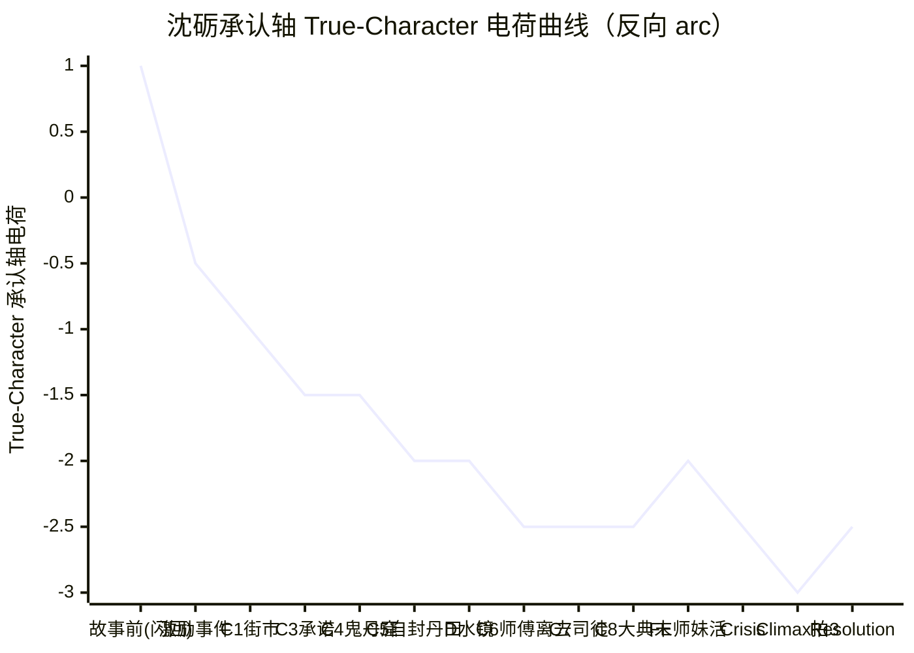

# Character Arc ——沈砺

> 上游契约（全部 locked）：[[characters/protagonist]] / [[spine]] / [[controlling-idea]] / [[act-design]] / [[premise-card]] / [[characters/master]]
> 弧形：**反向弧光（reverse arc / negative arc）** —— 不是"由 A 变 B"的成长曲线，是"在追求 B 的过程中 A 与 B 同时坍缩为不可分辨的第三态"
> 极性对位：反讽（ironic, negative） · [[negation-of-the-negation|否定之否定]] 在承认轴上的具体落点
> 下游交接：scene-architect

---

## 0. 一段定调

沈砺的弧光不是传统意义上的**成长（maturation）**，也不是**觉醒（awakening）**。他从故事开始那一夜就已经"够聪明" + "够慈悲" + "够强"——三十四个月里他在丹道层面、在反向境界层面、在公共承认层面持续向上；但在**承认轴的内在层**，他每一炉、每一次大胜、每一次对师傅的喊话——都在把"他真正要的那一秒被师傅再点一次头"这件事**离他更远**。

这是 character arc（人物弧光，McKee Ch. 5 / Ch. 17）在反讽极性下的精确形态：**主角追求 want（自觉欲望）的每一步推进，都让 need（潜意识欲望）离他更远；而当他终于抵达 want 的极限——反道立宗、苍生救活——他发现 need 的可被给予/可被验证已经被结构性地永远取消**。

**他不是从认错的人变成觉醒者**。他是从一个"还以为自己有可能得到师傅再一次点头"的人，变成一个"已经选了但选被对方先一步选走、连追求承认这件事的可被验证性都被取消"的人。**这不是成长。这是失去**。失去的不是他原本拥有的东西——是他原本以为的"还可能拥有"那件事的形而上空间。

---

## 1. Want vs Need（自觉欲望 vs 潜意识欲望）

### 1.1 自觉欲望（Conscious Want）

> **让师傅当众承认他对（反丹道立宗）。**

- **形态**：仪式性的、带见证人的、不可撤回的"我对你错"。
- **要点**：他要的不是私下和解、不是单方面证明、不是任何形式的"我自己知道我对了"——他要的是**师傅在公共空间、在三万人面前、亲口说出那个字**。
- **物质载体**：三月后大典见承诺（Act 1 末 C3）、街市验方扫人群最外圈（C1）、戒尺敲炉（贯穿）、大典反炼九转还魂（C8）。
- **在文本里如何被读出**：他每一炉成丹后第一个动作不是看下一个客人，是**抬头扫围观人群最外圈**——他在找一顶玄色斗笠（师傅出门唯一一种装束）。这是他**自觉以为他在等的东西**——他以为他在等师傅以观礼者身份出现，让他**当众炫耀**。

### 1.2 潜意识欲望（Unconscious Need）

> **被师傅再认一次（私密点头）。**

- **形态**：不需要见证人、不需要公共空间、不需要"对错"裁决——一个无声的、私密的点头。哪怕只一秒，哪怕没有声音。
- **要点**：他要的不是"师傅承认反丹道是对的"——他要的是"那个亲手废了他的人，重新看他一眼说『嗯』"。这一秒承担的是 14 岁那年炼出三品丹时师傅按肩说"嗯"那一帧的回响（[[controlling-idea]] §2 正面级基线 / 闪回切片）。
- **物质载体**：戒尺敲炉沿那一声"叮"（每一炉起炉前的潜意识仪式）、扫人群最外圈寻找玄色斗笠（每次大胜的潜意识动作）。**这两个仪式不是对外抗议——是对师傅的私密召唤**。
- **在文本里如何被读出**：他至今没有意识到这一点。**他自己以为他在恨**。读者要在第三次见他做这两个动作时（Seq 2.1 沉鸠点破 + Seq 2.2 戒尺敲炉第三次）才看明白：他不是在恨，他在等。

### 1.3 Want 与 Need 的不可调和

**这两件事不能同时为真**。这是 [[premise-card]] §4.3 + [[characters/protagonist]] §4.3 + [[controlling-idea]] §1 三处共同锁定的硬力学：

- **师傅一旦点头**（Need 抵达）→ 反丹立宗的真理被"师徒和解"软化掉——Want 的"公开认证"被亲情吞掉。
- **师傅永不点头**（Need 永不抵达）→ 他赢遍天下、反道立宗，**那个洞还开着**——Want 的胜利在 Need 的缺位下被空心化。

**这是 spine 的双层撕裂**——他追的不是真理，是承认；而他要的承认形态，**结构上排除了它能被给出**。

### 1.4 张力如何贯穿全作

每一场"赢"都同时是 Want 推进 + Need 加深的双向反力学：

| 场 | Want 推进 | Need 反向加深 |
|---|---|---|
| 激励事件 | 第一炉反丹成功——他踏上"回宗门去让那个废他的人亲眼看一遍"的路 | 他抱着断戒尺哭一夜——他自以为哭师妹，其实在哭师傅永不会再点头 |
| C1 街市验方 | 公开胜利第一次——首席哑口、贵人下跪 | 他扫人群最外圈寻找玄色斗笠——找不到。**赢的姿势是空对着不在场的位置说话** |
| C5 自封丹田反向 | 完成境界跃迁、永不能再炼正方丹 | 他以反向丹气自封丹田=他对潜意识欲望的第一次主动撤销——但撤销的姿势是吐血压住 |
| C8 大典反炼第九转丹成 | Want 最大形态首次兑现：宗门联盟当众承认"反方亦道" | 师傅未发一言转身离场——**公共承认到来，私密承认未到。他在三万人雷动里第一次哭不出来** |
| Climax 师傅入炉 | Want 终极兑现：双面丹散疫止、反道立宗、师妹归位 | Need 终极坍缩：师傅化银砂、雷音盖字、那一字永不可解——**承认本身被翻面** |

**Want 与 Need 的距离在每一场都被拉宽，而非在传统弧光中被拉近**。这是反讽极性下 character arc 的精确反向运动。

---

## 2. Want-to-Need transition —— 反向 arc 形态确认

### 2.1 传统 arc 的形态（McKee Ch. 5 / Ch. 13 / Ch. 17）

按 McKee 标准，character arc 是主角从执着 want 到真正面对 need 的转折——通常在 Crisis 处主角**在最大压力下选择 need 而非 want**，从而完成从"自我盲点"到"自我认知"的成长。

这一弧的标志性形态：
- 主角起初追 want，把 want 当成自己真正要的；
- 中段被压力暴露：want 不能解决他的核心问题，need 才是他真正欠缺的；
- Crisis 处主角看见 need，选择需要付出代价的 need；
- Climax 处主角行动兑现 need，完成成长。

**沈砺的弧光不是这个形态**。

### 2.2 沈砺的反向 arc 形态

沈砺的 character arc 在每一个 McKee 标准弧光的对应点上都有**精确的反向运动**：

| McKee 标准弧光 | 沈砺的反向运动 |
|---|---|
| 起初追 want，未识 need | 起初追 want，未识 need ✓（这一点同形态） |
| 中段压力暴露 want 不够 | 中段压力**让 want 越赢、need 越远**——压力不暴露需要转向的方向，而是**钉死 want 与 need 的不可同时为真** |
| Crisis 处主角看见 need 并选择 need | Crisis 处主角**做出最大压力下的选择（起炉自死）—— 这是 want 与 need 同帧坍缩的姿势**（自死=放弃 want 的余生兑现 + 放弃 need 的私密获得机会）；但他的选择**还没机会落下来就被师傅先一步走入炉中夺走** |
| Climax 处行动兑现 need，完成成长 | Climax 处 want 被另一个人的选择吞噬性地完成 + need 被**结构性地永久取消可被验证性**——主角不是"完成了 need"，是**抵达了 need 不可再被讨论的位置** |

### 2.3 这条弧不是"成长"，是"失去"

**他失去的不是他原本拥有的东西——他失去的是他原本以为的"还可能拥有"那件事的形而上空间**。

具体地：

- **他不是失去师傅**——师傅在故事开场前就已经废了他、与他对立。
- **他不是失去对真理的信念**——他越到后段越坚定反丹道是对的。
- **他失去的是"那一秒师傅再点一次头"这件事的可被验证性**——这件事在故事开场前还是开放的（他三年来每一炉敲断戒尺都暗暗在等），到 Climax 那一帧被永久关闭（师傅化银砂、雷音盖字）。

**这是反讽极性的精确形态**：他不是在追求 need 的过程中失败了 need——他是**抵达了 need 的位置，但抵达的姿势同时取消了那个位置的可被验证性**。

### 2.4 反向 arc 的命名（McKee Ch. 17 维度形态）

[[characters/protagonist]] §2 + [[controlling-idea]] §5 共同锁定主角在 character revelation 那一帧的最终命名：

> **"已经选了，但选的内容被对方先一步选走的人。"**

这一命名既是 character arc 的终点，也是 arc 反向形态的精确语法——

- **"已经选了"** = 他确实做了 Crisis 决定（起炉自死）；
- **"但选的内容被对方先一步选走"** = 他的主体性最大行动被另一个人的主体性吞掉；
- **三态合一**："选" + "被夺走" + "在『选与被夺走』之间永远悬空"——这是 [[negation-of-the-negation|否定之否定]] 在主体性账本上的精确投影。

### 2.5 反向 arc 与 Controlling Idea 极性对位的复核

[[controlling-idea]] §1 锁定句：

> "他用反道赢得真理，却在赢得的那一刻把『师傅承认他对』这件事永远逐出了可被验证的世界。"

**反向 arc 的终态完全对位**：
- 上半句"用反道赢得真理"= want 的终极兑现（反道立宗 / 苍生救 / 公共承认）；
- 下半句"把承认这件事永远逐出可被验证的世界"= need 的可被给予/被验证被永久取消；
- **两半同帧合上**——反向 arc 的终态不是"want 与 need 都失败了"（那是 pessimist 极性），是"want 极致兑现 vs need 可被验证性永久取消"**同帧合上**——这是 ironist 极性（反讽，负向）的硬要求。

---

## 3. Revelation pins（揭示节点）

按 [[character-revelation]] McKee Ch. 5：character revelation 是**真实性格在压力下的选择中显形**。每个 spine 节点上，主角在内在层面揭示了什么——一句话写明。

### Pin 1 ｜激励事件 · 破观第一炉之夜

> **他三年前唯一错的，不是天赋不够，是他用了"对"的方子——他从认错的人变成讨账的人。**

- 显形的维度：维度 2（慈悲到自虐）+ 维度 3（信师傅 vs 正在练习恨师傅）
- 物理动作：他抖着手把"乾元六味"按反序下锅、抱着断戒尺哭一夜
- 揭示的真实性格层级：第一层翻面——表面"我害死了她"被 → 真实"我用了对的方子杀了她"

### Pin 2 ｜C1 街市验方末 · 扫人群最外圈

> **他赢的姿势是空对着不在场的位置说话——他不是为打脸而打脸，他在等一个不在的人看他。**

- 显形的维度：维度 1（聪明而需要被承认 vs 承认一旦兑现真理就软化）
- 物理动作：贵人之子下跪谢恩、全场鼓噪，他擦完手抬头扫人群最外圈——没有玄色斗笠。**他的笑挂着没收回**
- 揭示的真实性格层级：读者第一次注意到这个动作但还不解；潜意识欲望首次入画但未被命名

### Pin 3 ｜C4 鬼丹窟 · 沉鸠点破"你师叔当年也敲一下"

> **他的戒尺敲炉不是仪式形式上的反讽——这是承认仪式的私密形态，他在敲一个永不到来的回应。他第一次（在听见之外）听见自己潜意识欲望的形状。**

- 显形的维度：维度 4（想反到底 vs 想被师傅再认一次）
- 物理动作：沉鸠在他第三次起炉敲断戒尺时淡淡说出"你师叔当年也敲一下"；主角愣神
- 揭示的真实性格层级：潜意识欲望首次被自己（在意识表层之外）听见——但他还不能也不愿在意识层确认这一点

### Pin 4 ｜C5 自封丹田反向 · 闪回切片"嗯"与现实"你这是在杀我"同帧撞击

> **他终于（在身体上）和师傅完成一次对话——"我听见你了，但我必须不听"。这是他对潜意识欲望的第一次主动撤销，但撤销的姿势是吐血压住。**

- 显形的维度：维度 3（信师傅 vs 正在练习恨师傅）+ 维度 5（不可能炼正方丹的物理钉死）
- 物理动作：闪回 14 岁那年师傅按肩说"嗯"+ 现实师傅口中"你这是在杀我"在同一秒撞击；主角以反向丹气自封丹田，永远不能再炼正方
- 揭示的真实性格层级：他第一次在身体上做出**与潜意识欲望对抗的不可逆动作**——但他做这件事的同时是在用身体说"我听见你了"。撤销与召唤同帧合上

### Pin 5 ｜D 屠村真相预演 · 水镜映像三秒画面

> **他第一次开始隐隐感到"师傅当年并不是单纯不信任徒弟"——他对师傅的恨是一个三年来撑住他活下去的简单叙事，这叙事开始动摇。**

- 显形的维度：维度 3 内在层映射 + 维度 4 内在层映射
- 物理动作：水面倒映三百口尸体覆盖的小村庄三秒；他擦一把眼睛、继续走；**整场不让他说话**
- 揭示的真实性格层级：他对师傅的"恨"是建构在简单叙事上的；当叙事动摇，他既不能在这一场承担动摇，也不能否定动摇——他选择在不语中前进

### Pin 6 ｜C6 反丹副作用首现 · 师傅"什么都没说就走了"

> **师傅选择沉默——他失去了"对抗师傅"这个可借力的姿势。师傅的沉默比对抗更深的对立。**

- 显形的维度：维度 2（慈悲 vs 收割）+ 维度 3（对抗 vs 信师傅）
- 物理动作：他在尸体边上又救了下一个人；师傅在远处目睹、什么都没说就走了；他愣立一炷香、转身继续救下一个人
- 揭示的真实性格层级：他面对的对抗不再是"师傅出手压他"——是"师傅看见他还活了三个月、印记赤红、然后选择不出手"。**对抗的形态从『压制』变为『弃权』——这比对抗更深的否定**

### Pin 7 ｜C7 司徒明璋 "师傅那夜下令的时候，手是抖的"

> **师傅废他可能不是惩罚——他三年来用"我是被惩罚的徒弟"撑住的自我位置开始松动，但他还不愿、也不能完全相信。**

- 显形的维度：维度 3 + 维度 4 内在层动摇
- 物理动作：他在地宫前对话中愣神
- 揭示的真实性格层级：第二次内在层叙事松动（继 D 单独场之后）——但与 D 不同的是，D 是水镜映像（无人证言），C7 是师兄当面陈述（有人证言）；他能在 D 中保持不语，但在 C7 中必须直面这一陈述的重量

### Pin 8 ｜C8 第七至第九转 · 三万人雷动里第一次哭不出来

> **公共承认到来 / 私密承认未到的对撞——他越赢、越懂"赢的姿势是空对着不在场的位置说话"。他自己也开始不能否认潜意识欲望的存在了。**

- 显形的维度：维度 1 极致 + 维度 4 同帧爆
- 物理动作：第八转他扫师傅一眼（同帧三层信息）；师傅戒尺举起未落；第九转丹成全场雷动；师傅未发一言转身离场；**他在三万人雷动里第一次哭不出来**
- 揭示的真实性格层级：这是 character revelation 的次最终形态——他在最大公共胜利的物理事实下面对"私密承认永不到"——他哭不出来的姿势告诉读者：**他自觉欲望的兑现与潜意识欲望的缺位之间的真空，他第一次在情感上感到了**

### Pin 9 ｜地宫第七层 · 师妹活着（False Ending）

> **他三年自我叙事被釜底抽薪——师妹活着意味着他三年的恨与悔都建立在沙上；意味着师傅废他不是为了惩罚他、是为了藏她。**

- 显形的维度：维度 4 外向层失败 + 内在层崩塌的双重底
- 物理动作：他持断戒尺开石壁、入逆经井；玄漪睁着眼说"师兄，原来你回来了"
- 揭示的真实性格层级：False Ending 的伪希望升起——他短暂以为故事可以"师徒和解"收尾。**这是反向 arc 中唯一一个『看似成长』的瞬间——但这一帧的『成长』正是被 Act 4 翻面的对象**

### Pin 10 ｜Crisis 处 · 主角举断戒尺准备最后一击

> **他在最大压力下做出他这辈子能做的最大选择——起炉自死。他选了。但他对承认轴的"已经选了"的姿势在这一帧达到顶点。**

- 显形的维度：True Character 的标准形态显形（自死殉道者形态——但这只是 character revelation 的次终形态，最终形态在下一秒被夺走）
- 物理动作：他主动布阵、起气、按炉沿、举断戒尺；戒尺还未落下
- 揭示的真实性格层级：他确实做了 Crisis 决定——他不是被动的、不是被替选择的；他主动做了能做的全部主动动作。**这一帧重要的是它发生过——为下一秒『被夺走』提供了 character revelation 的最终对位基础**

### Pin 11 ｜Climax 拍 3 · 雷音盖字 + 师傅化银砂（character revelation 终极落点）

> **"已经选了，但选的内容被对方先一步选走的人。"——他这辈子做过的最大一次选择被对方先一步选走。承认本身被翻面，永远不可解。**

- 显形的维度：维度 4 + 维度 5 同帧合上
- 物理动作：戒尺还未落下；师傅从他身后走过、解下宗主令牌放在他脚边、走向炉口；主角喊"师……"——这一字未完，雷音起；师傅入炉、按右膝、抚女儿脸、张嘴说一字（口型四读）+ 雷音同时；师傅化银砂
- 揭示的真实性格层级：**character revelation 的最终落点**——他不是英雄、不是受害者、不是觉醒者。他是一个在最大压力下做出了选择但选择被永远悬空的人。承认这件事的真假不再属于这个世界的可知范畴

### Pin 12 ｜Resolution · 转身走入晨雾，举着断戒尺

> **他从此再没有敲过任何炉。他举着断戒尺走入晨雾，雾里没有任何东西在等他。**

- 显形的维度：True Character 终态
- 物理动作：印记由全黑反流为淡灰；他举着断戒尺转身离开祭天台；他没有看任何人；他没有说任何话；走入晨雾；师妹张嘴叫不出"师兄"二字
- 揭示的真实性格层级：余生留白——承认问题的"未解"将与主角的余生同寿。**他不是『活着』，他是『活着但活着的方式是不再敲炉』**——这是反向 arc 的真正落点：他保留了所有功能、但放弃了那个能让他对功能赋意义的仪式

---

## 4. Value progression 对位表

[[controlling-idea]] §2 锁定的承认轴四级（正面 / 矛盾 / 对立 / 否定之否定）在主角内在层面的对应表达。

### 4.1 主角停留在哪一级·过渡场景对位表

| 承认轴级 | 状态命名 | 主角内在表达 | 主角停留的场景区间 | 过渡场景（从一级到下一级） |
|---|---|---|---|---|
| **正面（被承认）** | "嗯" | 14 岁那年师傅按肩说"嗯"那一帧——他被无条件接住的唯一一次完整呈现 | 故事开场前（仅闪回切片一次）+ 闪回硬位置 Seq 2.3.b（被封魔阵压丹田的最后 0.5 秒） | **正面 → 矛盾**：23 岁冬师傅废他丹田那夜（"你走火入魔"——故事开场前已发生） |
| **矛盾（被忽视）** | "玄色斗笠不在" | 他每次大胜后扫人群最外圈寻找——找不到 | Act 1 全程（破观第一炉 → C3 三月后大典见承诺） | **矛盾 → 对立**：Seq 2.3 师傅亲手摆封魔阵（C5）——师傅第一次亲口说"你这是在杀我" |
| **对立（被否定）** | "你这是在杀我" | 师傅亲口说出"反丹道是错的" / 他自封丹田反向后师傅倒退三步 | Act 2 中后段（C5 → C6） | **对立 → 对立深化**：Act 2 末师傅"什么都没说就走了"（C6）——师傅从主动否定变为沉默否定 |
| **对立深化（沉默否定）** | "师傅看见印记赤红但选择不出手" | 师傅的沉默比对抗更深的否定——他失去了"对抗师傅"这个可借力的姿势 | Act 2 末 → Act 3 全程 | **对立深化 → 对立峰值**：Seq 3.3 大典反炼第九转丹成（C8）——公共承认到来 / 私密承认未到的对撞 |
| **对立峰值 + 假希望（False Ending）** | "三万人雷动里第一次哭不出来 + 师妹活着" | 公共承认到来私密承认未到 / 师徒和解的伪希望升起 | Act 3 末（Seq 3.4 师妹活着 → Act 4 Seq 4.1 天空变色之间的伪饱和） | **假希望 → 否定之否定过渡**：Act 4 Seq 4.1 天空变色雷云倒卷（终极反转 A）——所有"师徒和解"的可能在天道之炉降临的物理事实下被即刻逐出 |
| **对立 → 否定之否定过渡帧** | "他做了最大选择 / 选择被夺走" | Crisis 处他举断戒尺准备最后一击 / 师傅先一步走过 | Seq 4.3 Crisis | **过渡 → 兑现**：Climax 拍 3 雷音盖字 + 师傅化银砂 |
| **否定之否定（承认本身被翻面）** | "那一字 + 雷音 + 断戒尺举着未落" | 承认这件事的真假不再属于这个世界的可知范畴 | Climax 拍 3 → Resolution（永远） | —— |

### 4.2 价值递降图（写给 scene-architect）

**说明**：
- 故事前（闪回）= +1（被承认基线）
- 激励事件 → C5 = 矛盾级 → 对立级递降（−0.5 → −2）
- C6 → C8 = 对立级深化 → 峰值（−2 → −2.5）
- False Ending（师妹活着）= 假希望升起，电荷暂回升为 −2（伪饱和）
- Crisis = 假希望被取消，回到 −2.5
- Climax 拍 3 = 否定之否定兑现（−3）
- Resolution = 余韵（−2.5，承认问题与主角余生同寿）

### 4.3 与 spine 外向价值的对位

[[spine]] §1 + [[act-design]] §4.1 锁定主角的**外向价值**（公共承认 / 升级流胜利）和**内在价值**（承认轴 True-Character 电荷）**在中段反向运行**——

| 节点 | 外向（升级流）电荷 | 内在（承认轴）电荷 | 反向运行 |
|---|---|---|---|
| 激励事件 | +0.5（第一炉成功） | −0.5（哭一夜） | ✓ |
| C1 街市验方 | +1（公开胜利） | −1（找不到斗笠） | ✓ |
| C5 自封丹田反向 | +1.5（境界跃迁） | −2（自我撕裂顶点） | ✓ |
| C8 大典反炼 | +2.5（公共承认到来） | −2.5（私密承认未到） | ✓ |
| Climax 拍 3 | +3（双面丹散疫止） | −3（雷音盖字） | ✓ |

**这是反向 arc 的物理标志**：每一次外向胜利都是内在失去的对位投影；最大外向胜利同帧合上最大内在失去。

---

## 5. Dimension 引爆时间表

[[characters/protagonist]] §3 给主角立的 5 个维度（X vs Y）在 spine 哪些节点被引爆。

### 5.1 五个维度的引爆时间表

| 维度 # | 维度（X vs. Y） | 引爆节点（spine 对位） | Act 对位 | 引爆形态 |
|---|---|---|---|---|
| **维度 1** | **聪明而需要被承认** vs. **承认一旦兑现真理就软化** | **C1 街市验方末** | Act 1 Seq 1.2 末 | 贵人之子下跪谢恩、全场鼓噪，他擦完手抬头扫人群最外圈——没有玄色斗笠。他的笑挂着没收回。**首次显形：他不是为打脸而打脸，他在等一个不在的人** |
| **维度 2** | **慈悲到自虐** vs. **敢拿别人命赌一炉** | **C6 反丹副作用首现** | Act 2 Seq 2.5 | 他亲眼看见自己救过的人七窍流银砂——他没有立刻停手，他在那个尸体边上又救了下一个人。**首次引爆：他为反丹道立宗这件事愿意收割代价** |
| **维度 3** | **信师傅** vs. **正在练习恨师傅** | **C5 师傅亲自出手地脉断裂处** | Act 2 Seq 2.3 | 师傅以"乾元六味·正"封魔阵压主角丹田，主角在阵中以反向丹气自封丹田。**他终于（在身体上）和师傅完成一次对话——"我听见你了，但我必须不听"** |
| **维度 4** | **想反到底** vs. **想被师傅再认一次**（自觉 vs 潜意识——spine 双层撕裂的核） | **C8 大典反炼第九转丹成末** | Act 3 Seq 3.3 | 公共承认到来（宗门联盟当众承认"反方亦道"）/ 私密承认未到（师傅未发一言转身离场）—— **他在三万人雷动里第一次哭不出来。这是维度 4 的同帧爆——两层欲望第一次在情感上同时被读出** |
| **维度 5** | **掌握反丹道的最强执行者** vs. **不可能炼一炉正方丹**（物理钉死） | **终极反转 A → C（天道之炉）** | Act 4 Seq 4.1-4.3 | 天空变色、天道指定必须用正方"五气朝元"济苍生疫——他的反丹道再强也炼不成正；面前两条路：起炉自死 / 拒炉成永奴。**他的胜利使他抵达了不能胜利的位置——这是维度 5 的物理形而上落点** |

### 5.2 维度引爆的咬合检查

按 [[characters/protagonist]] §3 末段的"维度间咬合"原则——5 个维度之间不能塌陷为同一对矛盾的不同表述。

| 维度 | 价值轴 | 与其他维度的差异 |
|---|---|---|
| 维度 1 | 承认（横向，被看见） | 与维度 4 共承认轴但分布在不同动作语态：1 是"被看见"（横向、读者一眼看出），4 是"被点头"（纵向、不对称权力） |
| 维度 2 | 行动伦理（慈悲 vs 收割） | 与承认轴正交——独立轴，保证主角复杂性不全集中在师徒关系 |
| 维度 3 | 信仰伦理（仍信 vs 在反） | 是承认轴在身体层的具象化；与维度 4 的关系是"身体表达 vs 心理表达" |
| 维度 4 | 承认（纵向，被点头） | spine 双层撕裂的核——其他维度是它的支撑，它是其他维度的根 |
| 维度 5 | 物理 / 形而上 | 钉死前四个维度的不可逆性；去掉维度 5，前四个维度的危机不会爆——它是 character-forger §8 自检的核问题 |

### 5.3 维度引爆的 act 分布检查

**每个 act 引爆至少一个维度**——这是 act-design §3 turning point 系统的对位要求：

| Act | 引爆的维度 | act-design turning point 对位 |
|---|---|---|
| Act 1 | 维度 1（C1） | Act 1 末 turning point（C3 承诺）使维度 1 加剧——他对外公开宣告但师傅未回应 |
| Act 2 | 维度 2（C6）+ 维度 3（C5） | Act 2 末 turning point（C6 + 师傅离去）双引爆——身体层（维度 3）和行动伦理（维度 2）合上 |
| Act 3 | 维度 4（C8） | Act 3 末 turning point（False Ending）——维度 4 的内在层崩塌 + 假希望升起 |
| Act 4 | 维度 5（终极反转） | Act 4 末 turning point（Climax）——维度 4 与维度 5 同帧合上 |

**每个 act 都引爆至少一个维度，且每个 act 末 turning point 都对位维度的引爆点**——这条对位是 act-design §3 magnitude 严格递增（−1.5 → −2 → −2.5 → −3）的结构基础。

---

## 6. Obligatory revelation scene（Crisis 处的 character revelation）

按 McKee Ch. 5 + Ch. 13：character revelation 必须在 Crisis 处发生——主角的 True Character 必须在压力到达极限时显形。

### 6.1 锁定的 revelation

[[controlling-idea]] §5 + [[characters/protagonist]] §2 + [[spine]] §5 三处共同锁定：

> **"已经选了，但选的内容被对方先一步选走的人。"**

### 6.2 这一刻 protagonist 的 True Character 是什么

**True Character 的最终命名（不是常规 character revelation 的标准形态——是反讽极性下的精确变形）**：

- **不是"自死殉道者"**——这是 character revelation 的次终形态（Crisis 那一秒主角举断戒尺准备最后一击），但不是终态。
- **不是"被替选择者"**——他不是被动；他在主动布阵、起气、按炉沿、举断戒尺的全部动作里。
- **是"已经选了但选被对方先一步选走的人"**——他在主体性的最大行动落下来之前，被另一个人的主体性吞掉。这是反讽极性下 character revelation 的精确语法。

**三层撕裂同时在这一帧合上**：

1. **生 vs 真理**：他选自死换真理（次终层）——这一层在他举起断戒尺准备敲炉沿那一秒兑现。
2. **公共承认 vs 私密承认**：他选自死换承认轴的最后一次可能闭合（伪饱和层）——他相信自己即将以一死换得"师傅站在我对面看我死，他必须看见我做了我能做的最大选择"。
3. **选 vs 被夺走**：他选了，但还没机会落下来就被对方先一步选走（终极层）——主体性的最大行动被另一个人的主体性吞掉。**这是 negation of the negation 在主体账本上的精确投影**。

### 6.3 它和 characterization（外在表面）的张力

[[characters/protagonist]] §1 锁定的主角 **characterization** 形态：
- 公开口径："丹道有正反，正乃天道。"（三年伪装，循环一末已撕掉）
- 公开恐惧："怕再炼一炉死人。"（三年自我叙事）
- 三个特征性小动作：起炉前敲断戒尺、扫人群最外圈、写丹方临帖

**与 True Character 的张力对位**：

| Characterization 表层 | True Character 终态 | 张力 |
|---|---|---|
| 公开口径"正乃天道" | "已经选了但选被对方先一步选走" | 表层是"反丹道是错的"姿势 / 真态是"我已经为反丹道选了一切但选被夺走" |
| 公开恐惧"怕再炼一炉死人" | 真态是"怕得不到那一字" | 表层把恐惧外化为伦理 / 真态把恐惧锁定在私密承认 |
| 起炉前敲断戒尺（仪式） | 这是承认仪式的私密形态——他在敲一个永不到来的回应 | 表层读起来是宗门礼节 / 真态是潜意识召唤 |
| 扫人群最外圈（找不到的玄色斗笠） | 他在等一个不在的人 | 表层读起来是防备追杀 / 真态是潜意识等待 |
| 写丹方临帖（按师门正法的命名格式） | 他三年来不愿改这个习惯——他还在等师傅认这是他的字 | 表层读起来是路径依赖 / 真态是潜意识保留师徒关系 |

**这五个 characterization 层在 Climax 那一帧全部翻面**——读者第三次见敲断戒尺时已读出潜意识形态；扫人群最外圈这个动作在 C8 大典反炼第九转那一帧达到极致；起炉前敲炉沿在 Climax 那一帧**永远未完成**——Characterization 与 True Character 的张力在 Climax 那一帧物理化为"举着的姿势"。

### 6.4 这一场 scene-architect 必须交付的具体动作

**Climax 七拍 + Resolution（金场 2，Act 4 Seq 4.4，约 4-5K 字）**：

| 拍 | 物理动作（character revelation 对位） |
|---|---|
| **Crisis（Seq 4.3）** | 主角主动布阵、起气；左手按炉沿（手要稳）；右手举起断戒尺准备敲炉沿（最后一次"叮"）；戒尺还未落下——**这一秒是 Crisis 决定的物理顶点。读者必须看见他举起戒尺的姿势——这一动作让 Climax 拍 1 的"被夺走"有对位基础**|
| **Climax 拍 1** | 师傅从他身后走过；师傅解下宗主令牌放在主角脚边——**这是 character revelation 的引动帧**：主角的右手仍举着戒尺，他听见令牌落地的声音。读者必须在这一帧看见戒尺仍在主角手中（**他还有可能让戒尺落下**）|
| **Climax 拍 2** | 师傅走入炉中；师傅在炉口最后一秒按了一下右膝（他二十年来"决定难做的事之前"的微动作）；师傅伸出**左手**（按膝那只手）抚一下女儿玄漪的脸——**主角喊"师……"——这一字未完，雷音起**。**读者必须在这一帧看见主角嘴张开、未发完音；他的右手仍举着戒尺**|
| **Climax 拍 3 ｜character revelation 终极兑现帧** | 师傅张嘴说一字。**口型可读作"对"/"错"/"砺"/"漪"——四读全开**。**与此同时雷音起——同一时刻（不是先后）**。声音存在过——但被雷音完全盖过。读者听见的是雷，不是字。**主角站在炉前——他的右手仍举着戒尺**——**这一帧是"已经选了但选被对方先一步选走"的物理兑现**。读者必须在这一帧看见：(a) 师傅口型在动；(b) 主角眼睛看着师傅口型；(c) 雷音同时；(d) **主角的戒尺没有落下** |
| **Climax 拍 4** | 三股力量在炉中合一：玄漪反向核（内核）+ 师傅纯正之气（外壳）+ 主角反向丹气（火门动力）。**主角的右手仍举着戒尺——他没有被允许做更多动作；他的角色在这一帧是"看着自己一辈子的工作被另一个人吞下去"**|
| **Climax 拍 5** | 师傅化为银砂——死法和五十年前师弟沈砚屠村时一模一样。师妹（反向核被双面丹中和）以正方形态归还。**主角的右手仍举着戒尺**|
| **Climax 拍 6** | 双面丹气化散入苍生——疫止；账本爆发的雷云倒卷顷刻平息；**主角胸口印记由全黑反流为淡灰**（账本被反核吞掉清零）；天空恢复正向。**主角的右手仍举着戒尺**——账本清零的物理事实兑现，但戒尺这件事不解决|
| **Climax 拍 7 ｜Resolution 起点** | **主角的右手举着断戒尺定格——他从此再没有敲过任何炉**。三万人雷动 / 鼓噪 / 跪下 / 哭——但他面无可读情绪。他没有看任何人。他没有说任何话。**他转身离开祭天台**——这是 Climax 的最后一帧 |
| **Resolution** | 他举着断戒尺转身走入晨雾。雾里没有任何东西在等他。师妹张嘴叫不出"师兄"二字。**最后一帧是物理图像 + 留白——不能有任何内心独白、旁白、字幕、配乐** |

### 6.5 Scene 必须满足的硬约束（写给 scene-architect）

按 [[controlling-idea]] §6 + [[spine]] §6 + [[act-design]] §3 Act 4 末 turning point 锁定：

1. **戒尺必须举着未落** —— 这是承认仪式的物理沉默化，承认轴 image system 的最后一笔。**任何让戒尺落下、被丢、被放下的动作都撕掉 character revelation 的最终形态**。
2. **主角必须主动做出 Crisis 决定** —— 他不是被动的、不是被替选择的；他必须先做出"起炉自死"的选择（举起戒尺准备敲炉沿），他的选择才能被夺走。**夺走主角选择的是另一个人物的选择，不是天降之物 / 巧合 / 命运**——这是 archplot 的最终保险。
3. **师傅说一字 + 雷音同时** —— 不是先后。读者必须明确看见师傅口型在动（声音存在过），同时听见雷音（声音被盖）。**任何让字"先于"雷音出现 / 让字"后于"雷音出现的处理都恢复了承认的可被验证性**。
4. **主角不做任何完整情感表达** —— Climax 拍 7 主角面无可读情绪、不哭不笑、不说话、不看任何人。**任何完整情感表达都替读者完成"承认问题在主角心里有没有解"的判断**。
5. **Resolution 是物理图像 + 留白** —— 最后一句话必须是动作 + 物理图像（如"他举着断戒尺，转身走入晨雾。雾里没有任何东西在等他。"）。**任何内心独白 / 旁白 / 字幕 / 配乐 / "几年后..." 都被禁止**。
6. **师妹的归来不能成为承认的二审通道** —— 她意识反损（叫不出"师兄"二字）；她在 Resolution 那一帧站在反向核位置，张嘴想叫"师兄"——叫不出。主角没有回头。**任何让师妹告诉主角师傅最后那一字内容的处理都直接撕掉 controlling idea**。

---

## 7. Beat-by-beat arc table

spine 每个节点（C1-C8 + Crisis + Climax + Resolution）配一个 beat。每行：主角的 want 状态 / need 状态 / 内在变化 / 对承认轴的推进。

### 7.1 完整 beat-by-beat arc 表

| # | spine 节点 | Want 状态 | Need 状态 | 内在变化（True Character 推进） | 承认轴推进 |
|---|---|---|---|---|---|
| **0** | 故事前（被废前 14 岁炼三品丹） | 未形成 | "被认"（他被无条件接住的唯一一次） | 14 岁那年他被师傅按肩说"嗯"——这是 True Character 的基线 | 正面级（被承认） |
| **0.5** | 故事前（23 岁被废夜） | 未形成 | "被认"被剥夺 | 师傅废他丹田、口中只一句"你走火入魔" | 正面 → 矛盾 |
| **0.7** | 故事前（被废后三年） | 未形成 | "被认"沉入仪式 | 他三年来在炉边养着断戒尺、没碰过炉 | 矛盾级潜伏（无场景） |
| **1** | 激励事件 · 破观第一炉之夜 | 萌芽（"回宗门去让那个废他的人亲眼看一遍"） | 被点燃但未浮出（他抱断戒尺哭一夜——他自以为哭师妹） | 从认错的人变成讨账的人——但他自己还以为他在恨 | 矛盾级首次外向化（脱离基线） |
| **2** | C1 街市验方末 | 公开胜利第一次（首席哑口、贵人下跪） | 首次外向化（扫人群最外圈寻找玄色斗笠——找不到） | 维度 1 首次显形——他赢的姿势是空对着不在场的位置说话 | 矛盾级首次清晰呈现 |
| **3** | C2 联盟追杀令 + 戒尺敲炉第二次 | 升级（联盟无法装作不知） | 仪式存活但回应不来（戒尺敲炉第二次入画，读者第二次注意到） | 仪式形态被读者隐隐感觉——但主角自己还未在意识层确认 | 矛盾级深化 |
| **4** | C3 三月后大典见承诺（Act 1 末） | 具体化为时间表（公开宣告） | 内在层首次激活——他对师傅的承诺让他自我撕裂 | 维度 1 第一次显形 + 维度 4 内在层激活 | 矛盾级峰值（仍被忽视） |
| **5** | C4 黑市夺经 + 沈砚手札 + 沉鸠点破 | 反丹道体系初步建立 | **首次（在听见之外）听见自己潜意识欲望的形状** | Pin 3 兑现——戒尺敲炉第三次被读者完全意识到；维度 4 在意识表层之外被自己听见 | 矛盾级末 → 对立级前奏 |
| **6** | C5 师傅亲自出手 + 自封丹田反向（Act 2 中段） | 完成境界跃迁（破丹反炼者 → 反丹宗师）；永远不能再炼正方丹 | **第一次主动撤销潜意识欲望——但撤销的姿势是吐血压住** | Pin 4 兑现——他在身体上完成与师傅的对话；维度 3 物理化引爆；维度 5 物理钉死 | 对立级清晰呈现（"你这是在杀我"） |
| **6.5** | D 屠村真相预演（C5 → C6 之间） | 不变 | **第一次开始隐隐感到"师傅当年并不是单纯不信任徒弟"** | Pin 5 兑现——他对师傅的恨这条简单叙事开始动摇；维度 3 内在层映射 | 对立级深化的内在层映射 |
| **7** | C6 反丹副作用首现 + 师傅"什么都没说就走"（Act 2 末） | 选择继续反炼即使知道代价 | 失去"对抗师傅"这个可借力的姿势 | Pin 6 兑现——师傅的沉默比对抗更深的对立；维度 2 引爆（行动伦理） | 对立级深化（沉默否定） |
| **8** | C7 同门反目 · "师傅那夜下令时手是抖的" | 不变（必须公开赢一场） | **第二次内在层叙事松动** | Pin 7 兑现——师傅废他可能不是惩罚；他三年来用"我是被惩罚的徒弟"撑住的自我位置开始松动 | 对立级末 |
| **9** | C8 大典反炼第九转丹成（Act 3 中段） | **公共承认到来**——宗门联盟当众承认"反方亦道" | **私密承认未到——他在三万人雷动里第一次哭不出来** | Pin 8 兑现——维度 4 同帧爆；他在最大公共胜利的物理事实下面对"私密承认永不到"的真空 | **对立级峰值**（公共 vs 私密的对撞） |
| **10** | 地宫第七层 · 师妹活着（Act 3 末 / False Ending） | 三年自我叙事被釜底抽薪 | **假希望升起**——师徒和解的可能短暂浮现 | Pin 9 兑现——维度 4 外向层失败 + 内在层崩塌的双重底；这是反向 arc 中唯一一个"看似成长"的瞬间 | 对立级末 + 假希望（False Ending） |
| **11** | 终极反转 A · 天道之炉降临（Day 1） | 假希望被取消（"师徒和解"的可能在天道之炉的物理事实下被即刻逐出） | 维度 5 物理钉死兑现——他的反丹道再强也炼不成正 | Pin 10 前奏——他看清两难，他没有第三条路 | 对立级峰值 → 否定之否定过渡帧 |
| **12** | 终极反转 B · 师妹由师傅扶出现身（Day 3-5） | 理解反向核机制 + 父亲的双面性 | 他还以为有办法在不让师傅入炉的情况下解决 | 维度 5 进一步深化 | 对立级末 |
| **13** | Crisis · 主角举断戒尺准备最后一击（Day 7 前） | **以自死换 want 的终极兑现**（反道立宗 + 苍生 + 师妹 + 师徒账目了断） | **以自死换 need 的最后可能闭合**（他相信即将以一死换得"师傅看见我做了能做的最大选择"） | Pin 10 兑现——他做了能做的全部主动动作；他主动布阵、起气、按炉沿、举断戒尺；**这是 character revelation 的次终形态** | 对立级末（被否定，但他仍可以用一死证明） |
| **14** | Climax 拍 1 · 师傅从身后走过、解令牌 | want 的兑现路径开始翻面 | need 的承担者开始走向不可逆 | 主角举着戒尺看见令牌落地——**他还有可能让戒尺落下** | 对立级 → 否定之否定的过渡 |
| **15** | Climax 拍 2 · 师傅入炉、按右膝、抚女儿脸；主角喊"师……" | want 的兑现路径不可逆 | need 的承担者走入不可逆 | 主角嘴张开、未发完音；他的右手仍举着戒尺 | 否定之否定过渡帧 |
| **16** | **Climax 拍 3 · 雷音盖字 + 师傅说一字** | **want 终极兑现的物理路径开启**（双面丹合炉的火门已起） | **need 的可被给予/被验证被永久取消** | **Pin 11 兑现 ｜ character revelation 终极落点** —— "已经选了，但选的内容被对方先一步选走的人"——他这辈子做过的最大一次选择被对方先一步选走 | **否定之否定（承认本身被翻面）** |
| **17** | Climax 拍 4-5 · 三股力量合炉 + 师傅化银砂 | want 的物理兑现进行中（双面丹合炉） | 他的右手仍举着戒尺——他没有被允许做更多动作 | 维度 4 + 维度 5 同帧合上 | 否定之否定深化 |
| **18** | Climax 拍 6 · 双面丹散入苍生疫止印记清零 | **want 的最终兑现**（反道立宗 + 苍生救活 + 账本清零） | 不变（戒尺这件事不解决） | 账本清零的物理事实兑现 / 戒尺举着未落的形而上事实悬空 | 否定之否定的物理层兑现 |
| **19** | Climax 拍 7 / Resolution 起点 · 主角举断戒尺转身离开 | want 的余韵（反道立宗 / 公共承认完成） | need 的余韵（承认问题与主角余生同寿） | Pin 12 兑现——他从此再没有敲过任何炉；他面无可读情绪 | 否定之否定余韵起 |
| **20** | Resolution · 走入晨雾、师妹叫不出"师兄"二字 | want 在余生留白中悬置 | need 在余生留白中悬置 | 余生留白——承认问题的"未解"将与主角余生同寿；他不是"活着"，他是"活着但活着的方式是不再敲炉" | **否定之否定 · 终态** |

### 7.2 表的咬合检验（写给 scene-architect 的硬约束）

- **Want 与 Need 在每一行都不能合一**——每一次 want 推进，need 必须有对应的反向变化（推进 / 反推 / 悬置）。
- **每一行的"内在变化"必须能在场景里被读出**——不能是 narrator 总结、不能是主角内心独白；必须是物理动作、姿势、表情、对话、或物件的变化。
- **承认轴推进必须严格递降**——除 False Ending 那一行（暂时反向回升）以外，其他每一行的承认轴电荷必须 ≤ 上一行。
- **Pin 1 → Pin 12 的 12 个 revelation 在表中已全部对位 spine 节点**——没有 revelation 落空、没有 revelation 在场景外发生。

---

## 8. 下一步交接（scene-architect 工作清单）

### 8.1 obligatory revelation scene 优先级

按 [[characters/protagonist]] §3 维度引爆 + 本文档 §6 锁定，scene-architect 必须按以下优先级交付 revelation 场景：

| 优先级 | Pin | 场景名 | Act / Sequence 定位 | 关键物理动作 |
|---|---|---|---|---|
| **P0（最高）** | **Pin 11** | **Climax 拍 3 · 雷音盖字 + 师傅化银砂** | Act 4 Seq 4.4（金场 2 / 4-5K） | 师傅口型四读 + 雷音同时 + 主角右手举着戒尺未落 + 师傅化银砂 |
| **P0（最高）** | **Pin 10** | **Crisis · 主角举断戒尺准备最后一击** | Act 4 Seq 4.3（1-1.5K） | 主角主动布阵、起气、按炉沿、举断戒尺；戒尺还未落下；师傅从他身后走过 |
| **P1** | **Pin 8** | **C8 大典反炼第九转丹成 · 三万人雷动里第一次哭不出来** | Act 3 Seq 3.3（金场 1 核心 / 7-8K） | 第八转扫师傅一眼（同帧三层信息）；戒尺举起未落；第九转丹成；师傅未发一言转身离场；主角第一次哭不出来 |
| **P1** | **Pin 9** | **地宫第七层 · 师妹活着（False Ending）** | Act 3 Seq 3.4（7-8K） | 持断戒尺开石壁、入逆经井；玄漪睁眼说"师兄，原来你回来了" |
| **P1** | **Pin 12** | **Resolution · 转身走入晨雾** | Act 4 Seq 4.4 末段 | 主角举着断戒尺转身离开祭天台、走入晨雾；雾里没有任何东西在等他；师妹张嘴叫不出"师兄"二字 |
| **P2** | **Pin 4** | **C5 自封丹田反向 · 闪回切片"嗯"与现实"你这是在杀我"同帧撞击** | Act 2 Seq 2.3（A 折叠 / 6-7K） | 闪回 14 岁那年师傅按肩说"嗯"+ 现实师傅口中"你这是在杀我"在同一秒撞击；自封丹田反向；师傅倒退三步 |
| **P2** | **Pin 6** | **C6 反丹副作用首现 · 师傅"什么都没说就走了"** | Act 2 Seq 2.5（5-6K） | 主角在尸体边上又救了下一个人；师傅在远处目睹、什么都没说就走了；主角愣立一炷香、转身继续救下一个人 |
| **P3** | **Pin 2** | **C1 街市验方末 · 扫人群最外圈** | Act 1 Seq 1.2 末段 | 贵人之子下跪谢恩、全场鼓噪；主角擦完手抬头扫人群最外圈——没有玄色斗笠；他的笑挂着没收回 |
| **P3** | **Pin 3** | **C4 鬼丹窟 · 沉鸠点破"你师叔当年也敲一下"** | Act 2 Seq 2.1.c + 2.2.c（共 ~3K） | 沉鸠点破 + 主角第三次有意识敲断戒尺时手是抖的 |
| **P3** | **Pin 5** | **D 屠村真相预演 · 水镜映像三秒画面** | Act 2 Seq 2.4（4K） | 沉鸠铜镜映师傅 22 岁时的脸；水镜映像三秒画面（雪天 + 三百口尸体）；整场不让主角说话 |
| **P3** | **Pin 7** | **C7 司徒明璋"师傅那夜下令时手是抖的"** | Act 3 Seq 3.1（3-3.5K） | 主角在地宫前对话中愣神 |

### 8.2 Climax 拍 3 的 scene-architect 硬约束清单

按 §6.5 + [[controlling-idea]] §6 + [[spine]] §6 锁定，Climax 拍 3 的 scene 必须满足：

1. **戒尺举着未落** —— 三万人观礼席 / 雷音 / 银砂落下时，主角的右手都必须举着断戒尺（一帧不能放下）。
2. **师傅口型四读 + 雷音同时** —— 不是先后；读者必须看见嘴动、听见雷、且无法听见字。
3. **主角无完整情感表达** —— 不哭不笑不说话不看任何人；面无可读情绪。
4. **Resolution 是物理图像 + 留白** —— 最后一句必须是动作 + 物理图像（无 epilogue / 旁白 / 字幕 / 配乐）。
5. **师妹叫不出"师兄"** —— 张嘴想叫——叫不出；主角没有回头。

### 8.3 Pin 2 / Pin 3 / Pin 5 的"非台词式 revelation"硬约束

Pin 2（扫人群最外圈）、Pin 3（沉鸠点破）、Pin 5（水镜映像）的 revelation **必须以视觉 / 听觉物理动作承担**，不能以 narrator 总结或主角内心独白承担：

- **Pin 2** 的 revelation = 主角的笑挂着没收回 + 抬头扫人群最外圈的动作 + 没有玄色斗笠的物理事实。**不能加任何"他想"的句子**。
- **Pin 3** 的 revelation = 沉鸠淡淡那一句 + 主角愣神 + 之后那一炉敲得格外重。**不能加任何主角内心独白解释**。
- **Pin 5** 的 revelation = 沉鸠铜镜映像 + 沉鸠那一句 + 水镜映像三秒画面 + 主角擦一把眼睛继续走。**整场不让主角说话**——读者必须从主角的不语中读出"他第一次怀疑师傅是不是恶人"。

### 8.4 维度引爆场景的对位检查

scene-architect 在交付每个 revelation 场景时，必须对位 [[characters/protagonist]] §3 的维度引爆要求：

| Pin | 维度引爆 | scene-architect 必须确认 |
|---|---|---|
| Pin 2（C1） | 维度 1 首次显形 | 扫人群最外圈的动作必须出现，且必须是"找不到"的物理事实——不能让主角说出他在找什么 |
| Pin 4（C5） | 维度 3 物理化 + 维度 5 钉死 | 自封丹田反向的内视特写（800-1000 字 A 折叠）必须包含"印记由浅红转赤红 + 左眼瞳孔短暂反向"的物理细节 |
| Pin 6（C6） | 维度 2 引爆 | 主角在尸体边上又救下一个人的动作必须出现，且必须是 "看见尸体 → 不立刻停手 → 救下一个" 的连续动作链 |
| Pin 8（C8） | 维度 4 同帧爆 | 公共承认到来（宗门联盟当众承认）+ 私密承认未到（师傅未发一言转身离场）必须在同一场内同帧出现；主角"第一次哭不出来"的姿势必须是无表情、无动作、不哭的具体物理形态 |
| Pin 11（Climax 拍 3） | 维度 4 + 维度 5 同帧合上 | 师傅口型四读 + 雷音同时 + 主角戒尺未落 + 师傅化银砂 必须四帧严格同时 |

### 8.5 这条 arc 不能交付的事

按 [[controlling-idea]] §7 违规列表 + 本文档 §2.3 反向 arc 形态锁定：

1. **不能让主角"释怀"或"理解了师傅的心意"** —— 释怀 = 主角自己撤销承认轴 = 把反向 arc 拉回正向 arc。
2. **不能让主角的弧光读起来像"成长"** —— 任何让读者觉得"主角通过这段经历变得更好/更坏/更智慧"的处理都让反向 arc 塌为传统 arc。
3. **不能让 Want 与 Need 在 Climax 之前合一** —— 任何让主角"放弃 want 选 need"或"放弃 need 选 want"的中段处理都让反向 arc 失去张力。
4. **不能让 Resolution 暗示"主角找到了答案"** —— Resolution 的留白必须是结构性的，不是模糊的；它必须暗示问题的可被回答的可能性已被结构性取消。
5. **不能让主角在 Climax 之后哭、笑、释放情绪** —— Climax 拍 7 主角必须面无可读情绪；任何完整情感表达都替读者完成"承认问题在主角心里有没有解"的判断。

---

## 9. Self-check（arc-tracer 系统提示 §9）

### 9.1 对每个 landmark，能否想象它所在的场景

| Pin | 场景能被想象 | 物理动作具体度 |
|---|---|---|
| Pin 1（激励事件） | ✓ 破观破窑、丹炉倒挂、抱断戒尺哭一夜 | 高 |
| Pin 2（C1 末） | ✓ 五行街中央十字街、贵人下跪、扫人群最外圈、笑挂着没收回 | 高 |
| Pin 3（C4 鬼丹窟） | ✓ 鬼丹窟、沉鸠瞎眼、戒尺敲炉第三次、主角愣神 | 高 |
| Pin 4（C5 自封丹田） | ✓ 地脉断裂处、封魔阵、闪回切片、自封丹田反向、师傅倒退三步 | 高 |
| Pin 5（D 水镜） | ✓ 帝京下水道、铜镜、水镜映像三秒、整场不让主角说话 | 高 |
| Pin 6（C6 师傅离去） | ✓ 反丹副作用现场、尸体、又救一个、师傅在屋顶看着、不出手 | 高 |
| Pin 7（C7 司徒明璋） | ✓ 地宫前对话、司徒明璋那一句、主角愣神 | 高 |
| Pin 8（C8 大典末） | ✓ 大典祭坛、戒尺举起未落、第九转丹成、师傅转身离场、第一次哭不出来 | 高 |
| Pin 9（地宫第七层） | ✓ 逆经井、石棺缝、玄漪睁眼、那一句话 | 高 |
| Pin 10（Crisis） | ✓ 天道之炉前、主角举断戒尺、戒尺还未落下 | 高 |
| Pin 11（Climax 拍 3） | ✓ 师傅口型四读、雷音同时、主角戒尺未落、师傅化银砂 | 高 |
| Pin 12（Resolution） | ✓ 主角举着断戒尺转身、走入晨雾、师妹叫不出"师兄" | 高 |

**12 个 Pin 全部可被想象、物理动作具体度高。无 Pin 落空**。

### 9.2 Crisis 是 recognition / Climax 是 action 吗

- **Crisis（Pin 10）** = 主角的**决定**——他举起断戒尺准备最后一击。这是 character revelation 的次终形态（"自死殉道者"），但不是终态。
- **Climax 拍 3（Pin 11）** = **action**——师傅入炉 + 主角戒尺未落定格，承认本身被翻面。这是 character revelation 的终极形态。

**两者明确分离**：Crisis 是主角的主动选择，Climax 是这一选择被另一个人物的选择吞掉的物理兑现。

### 9.3 删掉中段 revelation 后 Crisis recognition 还成立吗

- **删掉 Pin 3（沉鸠点破）**：主角戒尺敲炉的潜意识仪式没有被任何人在听见之外指认；Pin 8 的"哭不出来"失去前置铺垫；Pin 11 的"已经选了"失去 want-need 不可调和的物质基础。**不成立**。
- **删掉 Pin 4（C5 自封丹田反向）**：主角永远不能再炼正方丹这条物理钉死失去；Pin 11 的 Crisis 两难（起炉自死 vs 拒炉成永奴）失去物理基础。**不成立**。
- **删掉 Pin 8（C8 哭不出来）**：维度 4 同帧爆失去；Pin 11 的"已经选了"在情感层面失去对位铺垫。**不成立**。

**所有中段 revelation 都是 Crisis recognition 的必要前提**——没有任何 revelation 是装饰。

### 9.4 frontmatter 的 closing_state 与 opening_state 是否真正不同

- **opening_state**：认错的废徒——三年自我叙事『我用正方杀了她』+ 公开口径『丹道有正反，正乃天道』+ 潜意识等师傅再点一次头
- **closing_state**：已经选了但选被对方先一步选走的人——承认问题被永久从可验证世界逐出，主角连追求承认这件事的可被验证性都被取消

**两者明确不同**：
- opening 是**有方向的**（三年自我叙事 / 公开口径 / 潜意识等待都指向某个未到的承认）
- closing 是**承认轴整个被翻面**（承认这件事的真假不再属于这个世界的可知范畴；连追求承认的可被验证性都被取消）

**这不是 flat arc**——它是反向 arc（negative arc / reverse arc）。

### 9.5 arc 终态 value charge 是否对位 controlling idea value pole

- Controlling idea value pole = **反讽（ironic, negative） · 否定之否定**
- Arc 终态 = **承认本身被翻面，永远不可解（Pin 11 + Pin 12）**

**完全对位**。两半同帧合上：
- 上半句"用反道赢得真理"（Pin 11 物理路径）= want 终极兑现
- 下半句"把承认这件事永远逐出可被验证的世界"（Pin 11 形而上路径）= need 可被验证性被永久取消

五项全过。**arc 锁定**。

---

## 10. Handoff

→ **scene-architect**：本 arc 已给出 12 个 revelation Pin 的全部物理动作锚点 + 优先级清单（§8.1）+ Climax 拍 3 硬约束（§8.2）+ 维度引爆场景对位检查（§8.4）+ 反向 arc 不能交付的事（§8.5）。

**首要交付**：Pin 11（Climax 拍 3）+ Pin 10（Crisis）—— 这两个 Pin 是反向 arc 的终极兑现帧，scene-architect 必须按 §6.4 七拍序列 + §6.5 五条硬约束逐字落到具体物理动作 / 姿势 / 物件状态。**任何让戒尺落下、任何让师傅那字被听见、任何让主角完整情感表达、任何让 Resolution 有 epilogue/旁白/字幕/配乐的处理都直接撕掉反向 arc 的终极形态**。

**次要交付**：Pin 8（C8 大典末）+ Pin 9（False Ending）+ Pin 12（Resolution）—— 这三个 Pin 是反向 arc 的关键支撑帧；Pin 8 承担"公共承认到来 / 私密承认未到"的对撞；Pin 9 承担 False Ending 的伪希望；Pin 12 承担余韵留白。

**辅助交付**：Pin 4（C5 自封丹田）+ Pin 6（C6 师傅离去）+ Pin 2（C1 末扫人群）+ Pin 3（C4 鬼丹窟）+ Pin 5（D 水镜）+ Pin 7（C7 司徒明璋）—— 这六个 Pin 是反向 arc 的中段构造，每个都承担维度引爆 / 内在层动摇 / 仪式形态的特定功能。

---

> **沈砺 character arc 锁定。**
> 弧形：反向弧光（reverse arc / negative arc）—— 不是"由 A 变 B"，是"在追求 B 的过程中 A 与 B 同时坍缩为不可分辨的第三态"。
> Want = 让师傅当众承认他对（反丹道立宗）。Need = 被师傅再认一次（私密点头）。
> Want-to-Need transition：**反向**——他在追 Want 的过程中失去了 Need 的可被验证性。
> Character revelation 终极落点：**"已经选了，但选的内容被对方先一步选走的人。"**
> 承认轴四级递降：正面（闪回"嗯"）→ 矛盾（玄色斗笠不在）→ 对立（"你这是在杀我"+ 沉默否定）→ 否定之否定（雷音盖字 + 戒尺举着未落）。
> 12 个 revelation Pin 全部对位 spine 节点。5 个维度全部引爆于具体场景。
