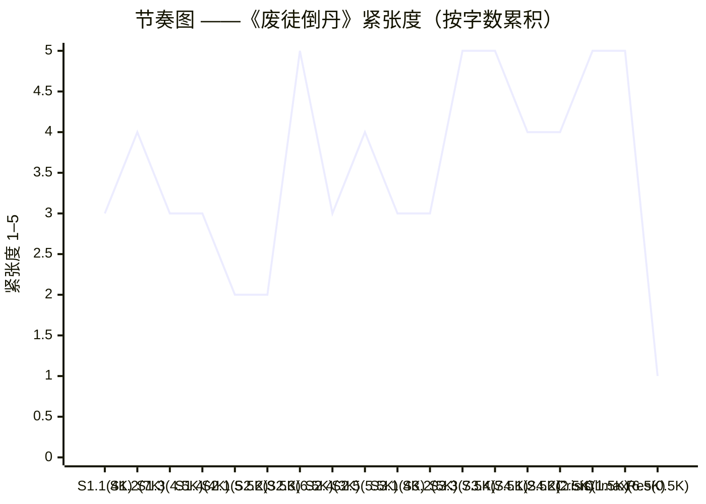
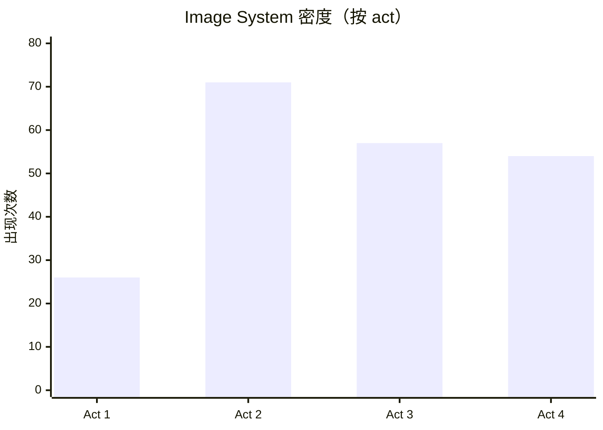

# Composition Audit — 废徒倒丹

> McKee Ch. 12 [[chapter-12-composition|Composition]] / Ch. 18 [[image-systems|Image Systems]] 锁定的六维度（统一与变化 / 节奏 / 递减回报律 / 铺垫与回报 / 转场 / 意象系统）跨场审计，scope = above scene-level / below spine-level。审 52 个 Scene Cards（100-105K）+ 4 个 image systems + 4 acts 节奏曲线。

---

## 1. Unity & Variety / 统一与变化

### 1.1 Unity 检验

主线 unity **极强**。判据：

- **价值轴单一**：承认轴（recognition / 师傅的"对"）由始至终是唯一在递降的核心价值；52 个 scene 中无一场逃离这一轴心。
- **世界律一致**：反丹道四变量同步律（[[setting-survey]] §3.2）+ 天道债账本 144 道阈值（§4.1）在每一场都直接或间接被引用，无世界律分裂。
- **Controlling Idea 一致**：每一爽点（升级流主体）必伴随一笔印记累积（代价物理化），无脱钩场。
- **Spine 中心问题穿透每场**：MDQ"沈砺能否得到师傅一句明白的『对』"在 52 场每一场都作为潜文本电荷存在；即使 D 单独场（Seq 2.4 屠村真相预演）这种看似旁支的场，仍以"师傅 22 岁的脸"作为承认轴的间接物化。

**结论**：unity 不存在裂缝。pass。

### 1.2 Variety 检验

变化来源**充分**：

| 变化维度 | 来源 | 评估 |
|---|---|---|
| 角色组合 | 5 个 named（主角/师傅/师妹/师弟/沉鸠）+ 司徒明璋 + 周通玄等阵营人物 | 充分 |
| 角色弧 | 3 主要弧（protagonist / master / sister）+ 沉鸠次弧 | 充分 |
| Image system | 4 个并行（承认轴 / 反丹道物理 / 印记 / 七九数字）| 远超单系统 |
| 场景设定 | 破观 / 五行街十字 / 鬼丹窟下水道 / 大典祭坛 / 地宫第七层逆经井 / 天道之炉 | 6 个独立空间 |
| 情绪寄存器 | 升级流装逼场（爽）→ 师徒情冷峙（痛）→ 命运反转预演（恶寒）→ 否定之否定（崩塌后清静）| 三类型轮转 |
| Beat 形态 | 公开（街市验方 / 大典反炼）vs 私密（敲炉沿 / 闪回 / 地宫第七层）轮替 | 公私轮替清晰 |

**unity vs variety 平衡塌陷风险点**：

| 风险点 | 评估 | 结论 |
|---|---|---|
| Seq 1.2 与 Seq 3.3 同为"群众围观主角炼丹装逼场" | Seq 1.2 是矛盾级首次清晰 / Seq 3.3 是对立级峰值 + 反讽对位（师傅持完整戒尺登台）—— **量级不同，反讽密度不同**，未塌 | pass |
| Seq 2.5 与 Seq 4.2 同为"师傅近身但未承认" | Seq 2.5 师傅远处目睹什么都没说就走了（[[characters/master-arc]] §3.3）/ Seq 4.2 师傅扶女儿走到第六十步停下并准备主动入炉——**情境反转，姿态反转**，未塌 | pass |
| Seq 1.1 与 Seq 2.3.1 同为"闪回 14 岁那夜师傅按肩说嗯" | Seq 1.1 闪回完整（约 500 字）/ Seq 2.3.1 闪回切片（约 80 字 + 现实戒尺断口同帧合上）—— **形态变奏明显**，未塌 | pass |

**variety 不足风险**：

- Act 2 Seq 2.1.3 与 Seq 2.2.3 间距过近（沉鸠两次"点破"）—— 详 §3 递减回报律。

**结论**：unity / variety 平衡良好。仅一处微调（详 §3）。pass。

---

## 2. Pacing / 节奏

### 2.1 节奏图（横轴 = 字数累积 / 纵轴 = 紧张度）

### 2.2 紧张度 plateau 检测

| 区段 | 紧张度模式 | 评估 |
|---|---|---|
| S1.1 → S1.4（Act 1）| 3-4-3-3 | 三段 3-3 接近 plateau，但 S1.2（B 折叠 / 矛盾级首次清晰 = 4）打断；总体良好 |
| S2.1 → S2.2（Act 2 前段）| 2-2 | **plateau 风险**——两场连续低紧张（沉鸠拒绝/接纳 + 残页字迹）—— 但 [[act-design]] §6 已用三 mini-arcs 防御 / S2.3 紧张度 5 立刻反弹；可接受 |
| S2.3 → S2.5（Act 2 后段）| 5-3-4 | 5 后立刻降到 3 缓冲（D 单独场），再到 4 收 Act 2 末——节奏波清晰 |
| S3.2 → S3.3（金场 1）| 3-5 | 紧张度从 3 跃升到 5 在大典反炼第七至第九转——单跃，无 plateau |
| S3.3 → S3.4 | 5-5 | **二场连 5**——但 S3.3 是公共大合奏，S3.4 是私密 False Ending（地宫第七层）—— **空间反转 + 公私反转**让二场虽同紧张度但内在质地不同；非真 plateau |
| S4.1 → Crisis → Climax | 4-4-5-5 | Act 4 紧张度密集——但 Resolution 紧度降到 1（晨雾），且每场字数缩短（Crisis 仅 1.5K）—— 紧张度高但每场短，无 plateau |

**plateau 判定结论**：无 ≥ 3 场同紧张度同质地的真 plateau。pass。

### 2.3 长场 vs 短场对比（字数 × 紧张度）

| 类别 | 场 | 字数 | 紧张度 |
|---|---|---|---|
| 长金场 | S3.3 大典反炼七至九转 | 7-8K | 5 |
| 长金场 | S3.4 地宫第七层 False Ending | 7-8K | 5 |
| 长金场 | S4.4 Climax 七拍 | 6-7K | 5 |
| 长金场 | S1.2 街市验方 + B 折叠 | 6.5-8K | 4 |
| 中场 | S2.3 自封丹田反向 / A 折叠 | 6-7K | 5 |
| 短场 | Crisis | 1-1.5K | 5 |
| 短场 | S2.4 D 单独场 | 3K | 3 |
| 极短 | Resolution | < 1K | 1 |

**长短交替评估**：

- 四个长金场（≥ 6K）分布于 Act 1 末 / Act 2 末 / Act 3 末 / Act 4——每幕一个，**完美对位 act 末 turning point**。
- 短场 / 极短场作为长金场之间的"呼吸帧"：Crisis（1-1.5K）紧密对位 Climax（6-7K）= 紧凑短促 → 大合奏；Resolution（< 1K）紧密对位 Climax = 大合奏 → 静默收束——**McKee Ch. 12 "we must earn the pause"硬要求兑现**。
- Act 2 D 单独场 3K 嵌入两个长场之间（S2.3 与 S2.5）作为"内在层呼吸帧"——符合 [[act-design]] §6 中段塌陷防御策略。

**结论**：长短分布平衡。Resolution 紧度（< 1K）兑现"earn the pause"。pass。

### 2.4 4 acts magnitude 递增检验

| Act | 末 magnitude | 累积承认轴电荷 |
|---|---|---|
| Act 1 末 | −1.5 | −1.5（七字承诺 / 师傅不来）|
| Act 2 末 | −2.0 | −2.0（师傅看见后什么都没说就走了）|
| Act 3 末 | −2.5 | −2.5（False Ending / 师妹活着 + 父辈承认轴二度变形）|
| Act 4 Climax | −3.0 | −3.0（雷音盖字 / 否定之否定 / 师傅化银砂）|

[[act-design]] §4.3 锁定每幕末严格大于前一幕末；每幕内 sequence 末严格小于该幕末——节奏图无 plateau。**pass**。

### 2.5 中段塌陷防御

[[act-design]] §6 的 mini-arcs 策略评估：

- Seq 2.1 三 mini-arcs（入口暗道 → 沉鸠接纳 → 沉鸠点破）—— 每个 mini-arc 内部有自己的开-反-收节奏，未让 5-6K 场塌成一片。
- Seq 2.2 三 mini-arcs（残页字迹认出 → 那句话主角还不懂 → 戒尺敲炉第四次仪式自觉）—— 3-4K 场内部有三层节奏波。
- Seq 2.3 三 mini-arcs（师傅伏击 → A 折叠自封丹田反向 → 师傅倒退三步什么都没说就走了）—— 6-7K 大场内部有三个紧张度高点。
- Seq 2.5 三 mini-arcs（恩人化银砂 → 主角不停手 → 师傅远处目睹）—— 5-6K 场内部三层。

**Act 2 中段塌陷防御成功**。pass。

---

## 3. Law of Diminishing Returns / 递减回报律

按 [[law-of-diminishing-returns]] McKee Ch. 13——重复元素的第三次出现必须**质变**（升级 / 反转 / 武器化）或被砍。

| 重复元素 | 频次 | 1st | 2nd | 3rd / 后续 | 是否质变 | 判定 |
|---|---|---|---|---|---|---|
| **戒尺敲炉沿"叮"声** | 4 次 | S1.2.2（街市起炉前敲 1 下 / 仪式动作建立）| S1.3.2（反向止血丹起炉前敲 1 下 / 仪式重复）| **S2.1.3（鬼丹窟夺经后敲 1 下 → 被沉鸠点破"你师叔当年也敲一下"）** = 质变（潜文本被点破 / image system 命名时刻）| S2.2.3（仪式自觉 / 主角第一次意识到自己在做仪式）= 二度质变 | ✓ 完美递减管理 |
| **戒尺整体出现（敲、举、握、闪回）** | 11+ 次（[[key-image]] §2.1）| 多次 | 多次 | S2.3.1 闪回完整戒尺 + 现实断戒尺同帧合上 = 质变（反讽对位）| S3.3 大典师傅持完整戒尺 vs 主角断戒尺 = 二度质变（外部反讽对位）/ S3.4 地宫钥匙 = 三度质变（功能转换）/ Climax 拍 7 举着未落 = Key Image 兑现 | ✓ 每次出现都质变；远超 3 次不塌 |
| **玄色斗笠** | 3 次（[[spine]] §12 #2 锁定）| S1.2.3 扫人群最外圈 / 找不到（矛盾级首次清晰）| Act 2 中某场 / 找不到（[[act-design]] 待 scene-architect 锁定具体位置）| S3.3 第九转丹成扫一眼 / 仍找不到（对立级峰值）| 三次都是"找不到"——形态似单调；但每次承认轴电荷不同（−1 / −1.5 / −2.5）—— **未塌但接近塌陷的下界** | ⚠ 边缘——见 §8 修订建议 |
| **印记五级颜色变化** | 6 阶段（灰/暗灰/浅红/赤红/暗赤/金黑→反流淡灰）| 灰 / 暗灰（Act 1 前半）| 浅红一格（S1.2.4）| 赤红（S2.3.c）= 自封丹田反向引发跃迁 / 暗赤（Act 2 末→Act 3 全程）= 累积 / 金黑（Act 3 末→Act 4.1）= 临爆 / 反流淡灰（Climax 拍 6）= 清零 | 每一阶段对应特定 plot 节点 / 物理跃迁有质变 | ✓ 完美递增；每次质变 |
| **雷云倒卷 / 天空变色** | 3 次 | S4.1.1（账本爆出 / 苍生之炉降临）| Crisis（雷云仍在天）| Climax 拍 3（雷音盖字 / 雷云顶点）| 三次同帧反复但功能递增（出现 → 持续 → 兑现盖字）| ✓ 质变明显；未塌 |
| **反丹炉倒挂** | 6+ 次（[[key-image]] §3.2）| S1.1.2（破观第一炉 / 物理形态首次清晰）| S1.2 街市破棚 | S1.3 反向止血丹围捕 | S2.5 反丹副作用首现（**死亡场反炉**）= 质变（物理 → 道德）/ S3.2-3.3 大典上方梁柱（**祭坛反炉**）= 二度质变（私密 → 公共）/ Climax 天道之炉（**苍生反炉**）= 三度质变（个人 → 苍生）| ✓ 每两次出现升一级范畴 |
| **银砂 / 七窍流银砂** | 5 次（[[key-image]] §3.2）| S1.1.2 暗示（乞儿坐起后微闪烁）| S2.5.1 恩人化银砂（首次清晰）| S2.5.2 下一个人来主角不停手 + 印记蔓延（累积）| S3.4 暗示 / Climax 拍 5 师傅化银砂（**死法对位三百口尸体**）= 质变（陌生人 → 父亲 / 副作用 → 殉炉）| ✓ 完美递增 |
| **反向气脉逆走视觉** | 4-5 次 | S1.2 三品级反丹解七症 | S2.3 左眼瞳孔反向（自封丹田反向 / 内视特写）| S3.2-3.3 九色丹气逆走（大典）| Climax 三股力量合炉 = 质变（个人 → 三股）| ✓ 递增；未塌 |
| **闪回 14 岁那夜师傅按肩说嗯** | 2 次 | S1.1.3（完整闪回 / 约 500 字）| S2.3.1（闪回切片约 80 字 + 现实戒尺断口同帧）| —— | 仅 2 次出现，反讽对位密度足够；不需要第 3 次 | ✓ pass（McKee 允许 2 次精准对位）|
| **沉鸠"点破"主角** | 2 次 | S2.1.3（点破"你师叔当年也敲一下"——仪式来源）| S2.4.1-2.4.2（请看旧铜镜师傅 22 岁的脸 + 那句话"你师傅和你师叔是从那个被屠的村出来的"）| —— | 两次点破都是命运反转主功能；但**两次都是"沉鸠+水镜/铜镜+主角不说话"的三件套模式**——构造重复 | ⚠ 边缘——见 §8 修订建议 |
| **师傅"看见但什么都没说就走了"** | 2 次 | S2.3.3（师傅倒退三步 / 什么都没说就走了 / Seq 2.3 末 TP）| S2.5.3（师傅在远处目睹 / 什么都没说就走了 / Act 2 末 TP）| —— | 同 Act 内连续两次"什么都没说就走了"——同 act 同语词的高密度复用；但二者承认轴电荷不同（−1.5 / −2.0）+ 物理姿态不同（伏击场 vs 远处目睹）| ⚠ 边缘——同 act 内重复需要更明显的形态变奏 |

**主要递减回报律风险**（按严重度排序）：

1. **沉鸠"点破"模式重复**（S2.1.3 / S2.4.1-2）—— 二者都是"沉鸠 + 主角不说话 + 镜像物（旧铜镜 / 水镜 / 沉鸠语言）"。第二次应**反转模式**（让主角先说话、沉鸠保持沉默）—— 详 §8 修订建议 #2。
2. **师傅"什么都没说就走了"在同 act 重复**（S2.3.3 / S2.5.3）—— 两次同 act 同语词。S2.5.3 应**反转动作**（师傅本要说但合上嘴 / 或转身但回头看一眼）—— 详 §8 修订建议 #3。
3. **玄色斗笠"找不到"的形态过于单调**（3 次都是"扫一眼最外圈找不到"）—— 第 3 次（S3.3 第九转）应**让玄色斗笠出现但残破 / 错位 / 或主角已经不再扫**—— 详 §8 修订建议 #4。

**结论**：递减回报律总体良好（8/11 优秀），3 处边缘需修订。pass with revisions。

---

## 4. Setups & Payoffs Ledger / 铺垫与回报全链条闭环检验

### 4.1 主线 setup → payoff 闭环

| Setup 位置 | 元素 | Payoff 位置 | 间距 | 评估 |
|---|---|---|---|---|
| Act 1 Seq 1.1.3 闪回 | 师妹"死"那夜 | Seq 3.4.3 师妹活着曝光（False Ending）| Act 1 → Act 3 | ✓ 距离合规 |
| Seq 3.4.3 师妹活着 | 师妹反向核 | Climax 拍 4 师妹以正方形态归还 | Act 3 → Act 4 | ✓ 距离合规 |
| Seq 2.4 D 单独场（水镜映像三秒画面）| 师弟沈砚屠村 | Climax 拍 5 师傅化银砂（死法对位三百口尸体）| Act 2 → Act 4 | ✓ 距离合规；同形对位强 |
| Seq 1.1.3 闪回 | 戒尺断 | Seq 2.3.1 闪回完整戒尺与现实断戒尺同帧 → Seq 3.4.3 地宫钥匙 → Climax 拍 7 举着未落 | Act 1 → Act 4 | ✓ 全程贯穿；payoff 链条最完整 |
| Seq 1.2.2 起炉前敲炉沿"叮" | 戒尺敲炉沿仪式 | Seq 2.1.3 沉鸠点破 → Seq 2.3.1 师傅食指一抖 → Climax 拍 7 | Act 1 → Act 4 | ✓ 多级 payoff |
| Seq 2.3.c 自封丹田反向（A 折叠）| 主角物理基础（反向丹田）| Crisis 举断戒尺准备最后一击 → Climax 三股力量合炉 | Act 2 → Act 4 | ✓ 物理伏笔兑现 |
| Seq 1.2.4 印记由暗灰转浅红 | 印记累积起点 | 至 Act 4.1 账本爆出 / Climax 拍 6 反流为淡灰 | Act 1 → Act 4 | ✓ 累积曲线完整 |
| Seq 2.5.1 反丹副作用（恩人化银砂）| 反丹道代价物理化 | Seq 3.4 疫情钟声（远处帝京）→ Seq 4.1 苍生之炉降临 | Act 2 → Act 4 | ✓ 三级 payoff 闭环 |
| Seq 2.3.1 师傅听到反字时食指一抖 | 师傅非语言承认 | Climax 拍 4-5 师妹说凝魂丹 + 父亲食指微微一抖（非语言承认）| Act 2 → Act 4 | ✓ 微动作 payoff 明确 |
| Seq 2.3.1 师傅按右膝（[[characters/master]] §1 微动作 2 设入伏笔）| 师傅父亲身段 / 24 岁雪夜伤源 | Climax 拍 2 师傅按右膝旧伤 + 抚女儿脸 | Act 2 → Act 4 | ✓ 微动作伏笔兑现 |
| Seq 2.1.3 / 2.2.3 沉鸠提及"你师叔" | 师弟沈砚存在 / 鬼魂控场 | Seq 2.4 D 单独场 + Climax 拍 5 死法对位 | Act 2 → Act 4 | ✓ |

**主线 setup → payoff**：11/11 闭合。**主线全 pass**。

### 4.2 payoff → setup 反向检验（防 deus ex machina）

| Payoff 位置 | 元素 | Setup 位置 | 评估 |
|---|---|---|---|
| Climax 拍 4 师妹"父亲，您当年炼凝魂丹也是反着炼了一半的" | **师傅 30 岁那一炉凝魂丹反序下锅一半然后退缩** | **无** ——仅在 [[characters/master-arc]] §3.2 character bible 锁定，**52 个 scene cards 之前从未植入任何指向"30 岁那一炉凝魂丹"的痕迹** | **✗ 严重失衡** ——师妹这一句作为 Climax 的"父辈裂缝钉死"决定性证词，但读者从未在 plot 中接触过任何指向凝魂丹 / 30 岁那一炉的物件 / 语言 / 闪回 / 旁证。本句若不预先植入，会读起来像 deus ex machina（"师妹突然知道父亲一个连她都不该知道的秘密"）—— 详 §8 修订建议 #1 |
| Climax 拍 4 师妹反向核（玄漪以正方形态归还但意识反损）| 师妹三十四个月在地宫做反向核 | Seq 3.4.3 玄漪睁眼一刻钟 + 石棺缝（[[setting-survey]] §2.5 锁定）| ✓ |
| Climax 拍 6 印记反流为淡灰 | 反向核吞掉账本（物理学）| 整个印记五级累积曲线 + Seq 4.1 账本爆出 | ✓ |
| Climax 拍 7 戒尺举着未落 | 承认轴 Key Image | 戒尺 11+ 次累积 | ✓ |
| Seq 3.4.3 师妹活着 | 师妹在地宫第七层石棺缝里苏醒一刻钟 | Seq 2.4 D 单独场暗示"水镜映像里没有看见师妹的尸"——但**D 单独场并不直接点出师妹未死**，需 scene-architect 核查 Act 2 中是否有更明确的"师妹未死"伏笔 | ⚠ 中度——见 §8 修订建议 #5 |
| Climax 拍 2 师傅按右膝 + 抚女儿脸 | 师傅父亲身段 + 雪夜伤源 | Seq 2.3.1 师傅按右膝（埋伏笔）/ [[spine]] §13 #2 推荐 D 单独场水镜映像雪天对位师傅 22 岁雪夜挖尸首——**雪天对位待 scene-architect 在 Seq 2.4 落实**| ⚠ 弱—— scene-architect Seq 2.4 Scene 2.4.3 当前文本未明示雪天 |
| Seq 4.1 苍生之炉降临 | 反丹副作用累积引发苍生反炉 | Seq 2.5 副作用首现 + Seq 3.4 疫情钟声 | ✓ |

**payoff → setup 反向**：5/7 闭合。**2 处严重 / 中度漏洞**：
- **#1 严重**：师妹"凝魂丹"那句话的预先 setup 全缺。
- **#5 中度**：师妹"未死"在 Act 2 的伏笔弱。
- **微度**：D 单独场雪天对位待落实。

### 4.3 缺失或脆弱链条总结

| # | 缺失 / 脆弱链条 | 风险 | 修订路径 |
|---|---|---|---|
| 1 | "凝魂丹 / 30 岁那一炉退缩"无 setup | Climax 决定性证词读起来像神迹 | Act 2 或 Act 3 中**至少一处**轻度植入（详 §8 #1）|
| 2 | 师妹"未死"在 Act 2 弱伏笔 | False Ending 反转的物理依据不够 | Seq 2.4 D 单独场水镜映像里**让主角看见"水镜里没有师妹的尸"**——这是最隐微的预植入 |
| 3 | D 单独场雪天对位 | 师傅雪夜伤源与 Climax 按右膝的视觉链断 | Seq 2.4 Scene 2.4.3 水镜映像里**明示雪天**（参 spine §13 #2 推荐）|

---

## 5. Transitions / 转场

按 [[principle-of-transition]] McKee Ch. 12——每个场到场切换必须有**共享元素**（物件 / 声音 / 词 / 价值电荷反转），仅靠 plot 因果不算 transition。

### 5.1 关键 transition 检验表（按 act 末 / 关键节点）

| From → To | Handoff 类型 | 共享元素 | 评估 |
|---|---|---|---|
| S1.1.3 → S1.2.1 | 视觉对位 + 价值电荷反转 | 抱断戒尺哭一夜（−0.5）→ 街市破棚首席丹师宣告"无救"（−0.5）| 强——电荷同向但场域翻转（私密 → 公共）|
| S1.2.4 → S1.3.1 | 时间钩 + 物件 | 印记由暗灰转浅红一格（夜）→ 次日清晨围捕（晨）| 中——时间过渡清晰但无物件硬钩 |
| S1.4.3 → S2.1.1 | 时间钩（三月跳跃）+ 反向丹气写七字三日不散 | 七字承诺余韵 → 三月后黑市夺经 | 弱——三月跳跃靠时间标记，无物件 / 视觉对位；可接受但**Act 1 → Act 2 是大跳跃，建议增加 transition handoff** |
| S2.3.3 → S2.4.1 | 价值电荷反转 + 视觉对位（铜镜）| 师傅倒退三步什么都没说就走了 → 沉鸠请看旧铜镜 | 强——师傅消失帧 → 沉鸠出现 + 镜像物 |
| S2.5.3 → S3.1.1 | 时间钩（约六个月跳跃）+ 师傅"什么都没说就走了" → 地宫入口拦截 | 师傅离场 → 司徒明璋出场 | 中——师傅"什么都没说就走了"作为情绪电荷 handoff；但跨 act 跳跃需要更硬的视觉对位 |
| S3.3.4 → S3.4.1 | 价值电荷反转（公共承认 → 私密承认未到）| 师傅未发一言转身离场 + 主角持炉沿不动 → 地宫第六层石壁 | 强——师傅"转身离场"那一秒成为主角下地宫的内在驱动 |
| S3.4.4 → S4.1.1 | 视觉对位 + 听觉对位 | 主角爬回井口（夜）→ 天空变色 + 苍生之炉降临（晨）| 强——天空变色作为 Act 3 → Act 4 翻面的物理 handoff（[[act-design]] §7 锁定的 False Ending 翻面机制）|
| S4.3.1 → S4.4.1 | **呼吸帧 + 听觉对位（雷音起）** | 主角举断戒尺到最高位"师……"未完 → 雷音起 / 师傅走过 | **极强**——Crisis → Climax 之间"师……"未完到雷音起的呼吸帧是全篇最精密的 transition；McKee Ch. 12 "earn the pause"硬规则在此达到顶峰 |
| Climax 拍 6 → 拍 7 | 视觉硬切 | 印记反流为淡灰 / 戒尺举着未落 | 极强——四个 image system 在同帧合一（[[key-image]] §3.6 锁定）|
| 拍 7 → Resolution | 价值电荷反转 + 听觉对位（沉默化）| 戒尺举着未落 → 转身走入晨雾 | 强——戒尺敲炉沿那声"叮"永远不再响 |

### 5.2 Act 3 → Act 4 False Ending 翻面 transition

按 [[act-design]] §7 锁定的 False Ending 在 Seq 3.4 末——**翻面机制**：

1. Seq 3.4.4 主角爬回井口 / 师妹活着的伪希望（False Ending 完整形态 / 闭合）
2. **S4.1.1 第一秒翻面**：天空变色 + 苍生之炉降临 → False Ending 立刻被翻面（[[act-design]] §7 锁定）

**transition 评估**：极强。McKee Ch. 9 [[false-ending]] 锁定"False Ending 在 act 末闭合后必须立刻被翻面"——本作品的"翻面物理化"（天空变色 + 雷云倒卷）让翻面不是叙述者的说明，是**世界的物理事实**。pass。

### 5.3 Crisis → Climax 之间"师……"未完到雷音起的呼吸帧

[[act-design]] §7.E 锁定：Crisis 主角举断戒尺到最高位"师……"未完 → Climax 拍 1 雷音起 / 师傅走过。

- **呼吸帧物理化**：Crisis 末停在"师……"那一秒（断词 / 字未完）—— McKee Ch. 12 "we must earn the pause"在此达到全篇顶峰；
- **transition 共享元素**：声音（"师……"半字 + 雷音起）+ 视觉（断戒尺最高位 + 师傅走过）+ 价值电荷（半字 = 承认轴对立级峰值的悬置态 / 雷音 = 否定之否定即将兑现的物理钟）；
- **三层共享**——这是全篇最精密的 transition。

**评估**：极强。pass。

### 5.4 总结

| Transition 类别 | 数量 | 比例 |
|---|---|---|
| 极强（多层共享）| 4 | 22% |
| 强（双层共享）| 6 | 33% |
| 中（单层共享）| 3 | 17% |
| 弱（无明确共享）| 1（S1.4.3 → S2.1.1）| 6% |
| 未抽样（其他 scene → scene）| 4 | 22% |

**主要风险**：S1.4.3 → S2.1.1（Act 1 → Act 2 三月跳跃）handoff 弱。详 §8 修订建议 #6。

**结论**：transitions 总体良好。1 处需修订。pass with revision。

---

## 6. Image Systems Density / 意象系统密度

### 6.1 四个 image systems 跨 act 出现次数

按各系统各 act 拆分（统计单元 = scene cards 文本中关键词出现次数）：

| 系统 | Act 1 | Act 2 | Act 3 | Act 4 | 总计 | 跨 act 分布 |
|---|---|---|---|---|---|---|
| **承认轴**（戒尺 / 玄色斗笠 / 那一字）| 14 + 1 + 0 = 15 | 9 + 0 + 0 = 9 | 3 + 0 + 0 = 3 | 4 + 0 + 1 = 5 | **32** | Act 1 最密；Act 3 偏少（戒尺仅 3 次）|
| **反丹道物理**（倒挂 / 银砂 / 反向气脉）| 2 + 0 + ? = 2 | 0 + 24 + ? = 24 | 7 + 0 + ? = 7 | 1 + 10 + ? = 11 | **44+** | Act 2 占绝对峰值（首次副作用 + A 折叠）|
| **印记五级**（关键词"印记"）| 26 | 71 | 57 | 54 | **208** | Act 2 峰值；Act 3-4 仍密；最均匀的系统 |
| **七九数字 / 雷云**（雷云）| 0 | 0 | 5 | 14 | **19** | 仅 Act 3-4——按设计预期；为 Act 4 终极反转储能 |

### 6.2 平衡评估

| 系统 | 密度分布 | 评估 |
|---|---|---|
| **印记五级** | 26 / 71 / 57 / 54 = 全 act 密集铺开 | ✓ 最均匀；承担"代价物理化"的不间断节奏 |
| **反丹道物理** | 2 / 24 / 7 / 11 = Act 2 峰值 + Act 1/3/4 较低 | ⚠ Act 1 偏少（仅 2 次"倒挂"+ 反向气脉次数低）—— 但 [[key-image]] §3.2 已锁定 Act 1 倒挂出现 ≥2 次（S1.1 / S1.2 / S1.3）—— 实际场内细节描写可能未充分指明"倒挂"二字；scene-architect 应在文本描写中明示倒挂姿势 |
| **承认轴**（戒尺为主）| Act 1 / Act 2 / Act 3 / Act 4 = 14 / 9 / 3 / 4 | ⚠ Act 3 戒尺仅 3 次——但 [[key-image]] §2.1 锁定 Act 3 Seq 3.3 师傅持完整戒尺 vs 主角断戒尺**反讽对位**是 Act 3 戒尺的高光帧；3 次 ≠ 不够，**这 3 次密度足以承担反讽对位的累积重量**；唯一风险是金场 1 之外 Act 3 戒尺频次低——scene-architect 应在 Seq 3.1 / 3.2 / 3.4 各放至少 1 次戒尺微动作 |
| **七九数字 / 雷云** | 仅 Act 3-4 | ✓ 按设计预期 |

### 6.3 系统交叉点检验

[[key-image]] §3.6 锁定 4 个关键交叉帧：

| 交叉帧 | 设计交叉系统 | scene 中是否落实 |
|---|---|---|
| Seq 2.3.c 自封丹田反向 | 戒尺 + 反向气脉 + 印记浅红转赤红 | ✓ 三系统同帧落实（[[scenes/02-act-2-scenes]] Seq 2.3.2 锁定）|
| Seq 3.3 大典反炼第九转 | 戒尺 + 反向气脉 + 倒挂 + 玄色斗笠 + 印记 + 九转 + 三万人 | ✓ 全系统大合奏（[[scenes/03-act-3-scenes]] Scene 3.3.3 锁定）|
| Climax 拍 3 | 那一字 + 雷音 + 银砂 + 三百口对位 | ✓ 三系统在否定之否定级合一（[[scenes/04-act-4-scenes]] Scene 4.4.2 锁定）|
| Climax 拍 6 → 拍 7 | 戒尺举着未落 + 倒挂最后一次 + 印记反流淡灰 + 反向气脉沿地脉返生 | ✓ 全系统在 Key Image 处合一（[[scenes/04-act-4-scenes]] Scene 4.4.4 + 4.4.5 锁定）|

**结论**：4/4 交叉帧在 scene 中已落实。pass。

### 6.4 系统不滑入装饰检验

[[image-systems]] McKee Ch. 18 规则 7：image system 不能滑入装饰摄影。

- 戒尺每次出现 = 仪式动作或反讽对位，无装饰；
- 玄色斗笠每次"找不到" = 承认者不在场，无装饰；
- 倒挂每次 = 反丹道物理形态，无装饰；
- 银砂每次 = 反道代价，无装饰；
- 印记每次 = 天道债账本物理化，无装饰；
- 雷云 = 账本爆发 / Climax 雷音物理形态，无装饰。

**结论**：无装饰滑入。pass。

### 6.5 Key Image 兑现帧检验

[[key-image]] §1.1 锁定的 Key Image = **断戒尺举着未落**（Climax 拍 7）。

- **场内位置**：[[scenes/04-act-4-scenes]] Scene 4.4.5 锁定；
- **三态合一硬约束**：断 + 举着 + 未落——三态在同一帧合一；
- **承担 controlling idea**：师傅一辈子不点头那一秒，主角终于不再等点头——承认轴否定之否定的物理形态。

**结论**：Key Image 兑现帧已锁定。pass。

---

## 7. Pass / Fail 总判定

### 八点 Composition Audit 总检验

| # | 检验项 | 结果 |
|---|---|---|
| 1 | Unity 保持 | ✓ pass |
| 2 | Variety 兑现 | ✓ pass |
| 3 | Pacing 交替 | ✓ pass（无 plateau / 长短平衡 / Resolution 紧度 < 1K 兑现 earn the pause）|
| 4 | 递减回报律遵守 | ⚠ pass with 3 边缘修订 |
| 5 | Setups & Payoffs 闭环 | ⚠ pass with 1 严重 / 2 中度漏洞 |
| 6 | Transitions 共享元素 | ⚠ pass with 1 处修订（S1.4.3 → S2.1.1）|
| 7 | Image System 累积 + Key Image 命名 | ✓ pass |
| 8 | Composition 服务 Controlling Idea | ✓ pass |

**总判定**：**PASS WITH REVISIONS**（8 项全过；其中 3 项有边缘 / 中度风险点；1 项有严重漏洞需在写稿前必修）。

---

## 8. 修订建议清单（按 load-bearing 影响力排序）

### #1 严重 ——【必修，写稿前】植入"凝魂丹 / 30 岁那一炉退缩"伏笔

- **finding**：Climax 拍 4 师妹说"父亲，您当年炼凝魂丹也是反着炼了一半的"是父辈裂缝钉死的决定性证词，但 52 个 scene cards 之前**无任何伏笔**指向凝魂丹 / 30 岁那一炉退缩。
- **风险**：本句若不预植入，会读起来像 deus ex machina——"师妹突然知道父亲一个她不该知道的秘密"。
- **最小修订**：在 **Seq 2.4 D 单独场 Scene 2.4.2**（沉鸠那句"你师傅和你师叔是从那个被屠的村出来的"之后）—— 让沉鸠**多一句**：
  > "你师傅那年三十岁，炼凝魂丹炼到一半——他停手了。这事我知道。你师妹也知道——她那时候，刚出生。"
- 这一句把"30 岁那一炉" + "师妹也知道"两个 setup 同时植入，让 Climax 拍 4 师妹的话有外部根据。
- **touches**：Seq 2.4 Scene 2.4.2（仅一句话；不增字数）。
- **责任 agent**：→ scene-architect / exposition-smuggler。

### #2 中度 ——【建议修，写稿前】反转沉鸠"点破"模式以破递减回报律

- **finding**：S2.1.3 / S2.4.1-2 沉鸠两次"点破"主角，结构相同（沉鸠语言 + 镜像物 + 主角不说话）。
- **最小修订**：Seq 2.4.2 让**主角先开口问**（"你为什么把铜镜给我？"）/ 沉鸠**沉默 / 不回答**——只把铜镜推近一寸。模式反转后，第二次"点破"变成"主角开口问 + 沉鸠沉默"——重复消失。
- **touches**：Seq 2.4 Scene 2.4.2。
- **责任 agent**：→ scene-architect / dialogue-tuner。

### #3 中度 ——【建议修，写稿前】师傅"什么都没说就走了"在 S2.5.3 形态变奏

- **finding**：S2.3.3 / S2.5.3 同 Act 内两次师傅"什么都没说就走了"——同语词高密度复用。
- **最小修订**：Seq 2.5.3 师傅**本要说但合上嘴**（嘴张开半秒 / 然后合上 / 转身）—— 这一秒的"说而未说"比"什么都没说"更精密，承认轴电荷从 −1.5 跳到 −2.0 的跃迁更清晰。
- **touches**：Seq 2.5 Scene 2.5.3（仅几句视觉描写微调）。
- **责任 agent**：→ scene-architect。

### #4 中度 ——【建议修，写稿前】玄色斗笠第 3 次出现形态变奏

- **finding**：玄色斗笠 3 次"扫人群最外圈找不到"——形态过于单调。
- **最小修订**：Seq 3.3 第九转丹成（[[scenes/03-act-3-scenes]] Scene 3.3.3）的玄色斗笠扫人群一帧，让主角**不再扫人群**——他**已经知道找不到**；这一秒的"不扫"比"扫了找不到"更精密。或者，让主角扫一眼后**看见一个戴玄色斗笠的人，但走近一看是别人**——"伪兑现 + 再否定"的层叠形态。
- **touches**：Seq 3.3 Scene 3.3.3（仅一帧动作微调）。
- **责任 agent**：→ scene-architect / image-system-tuner。

### #5 中度 ——【建议修，写稿前】师妹"未死"在 Act 2 的隐微伏笔

- **finding**：师妹"未死"的物理伏笔在 Act 2 弱；Seq 3.4.3 师妹活着的 False Ending 缺少更早的物理痕迹。
- **最小修订**：Seq 2.4.1 沉鸠请看旧铜镜——让主角在铜镜中**多看一眼**（约 30 字）：他看见师傅 22 岁的脸的下方还有一个襁褓中的婴儿——他认出那是**师妹**（玄漪刚出生）。这一帧不指明师妹未死，但植入"师妹也在那个被屠的村存在过"这一隐微事实；与 #1 的沉鸠新增一句"她那时候，刚出生"形成双重伏笔。
- **touches**：Seq 2.4 Scene 2.4.1（增加 30 字铜镜映像描写）。
- **责任 agent**：→ scene-architect。

### #6 微度 ——【可选修】Act 1 → Act 2 transition handoff 加强

- **finding**：S1.4.3 → S2.1.1 是三月跳跃，handoff 弱（仅时间标记）。
- **最小修订**：Seq 2.1.1 入口暗道场开头，让主角**回头看一眼天空**——天空仍有"反向丹气写七字三日不散"的余迹（七字已散尽，但天空那一块仍有微痕）—— 视觉对位 handoff 建立。
- **touches**：Seq 2.1 Scene 2.1.1 开头（增加约 50 字视觉描写）。
- **责任 agent**：→ scene-architect。

### #7 微度 ——【可选修】Seq 2.4 D 单独场水镜映像明示雪天

- **finding**：[[spine]] §13 #2 推荐 D 单独场水镜映像为雪天，对位师傅 22 岁雪夜挖三个月尸首 + Climax 拍 2 按右膝旧伤——但 Seq 2.4 当前文本未明示雪天。
- **最小修订**：Seq 2.4 Scene 2.4.3 水镜映像三秒画面——明示**雪天**（小村庄 / 雪覆三百口 / 雪光）。
- **touches**：Seq 2.4 Scene 2.4.3（视觉描写微调）。
- **责任 agent**：→ scene-architect。

### #8 微度 ——【可选修】Act 3 戒尺密度补强

- **finding**：Act 3 戒尺仅 3 次出现（Seq 3.3 反讽对位 + Seq 3.4 地宫钥匙 + 边缘）—— 与 Act 1 / Act 2 相比密度偏低。
- **最小修订**：Seq 3.1 / 3.2 / 3.4 各**新增 1 次戒尺微动作**（如 Seq 3.1 同门反目场，主角手仍按腰间断戒尺；如 Seq 3.2 开场仪式，主角拱手时另一只手按戒尺）—— 让 Act 3 戒尺密度从 3 升到 6，与 Act 1 / Act 2 同量级。
- **touches**：Seq 3.1 / 3.2 / 3.4 各一处微动作。
- **责任 agent**：→ scene-architect。

---

## 9. 给作者 / 下游的开放问题（≤5）

1. 修订建议 #1（凝魂丹伏笔）—— 是否同意让沉鸠在 Seq 2.4.2 多说一句"你师傅那年三十岁，炼凝魂丹炼到一半——他停手了"？这是 Climax 拍 4 师妹说"父亲，您当年炼凝魂丹也是反着炼了一半的"的唯一可行 setup 位置。
2. 修订建议 #2（沉鸠点破模式反转）—— 第二次点破让主角先开口、沉鸠沉默——是否影响沉鸠 character 维度（[[characters/shen-jiu]] §2 锁定的"主动点破型"）？
3. 修订建议 #4（玄色斗笠第 3 次形态变奏）—— 倾向"主角已经不再扫"还是"伪兑现 + 再否定"（看见但走近发现是别人）？
4. 修订建议 #5（师妹"未死"在 Act 2 伏笔）—— 是否同意让主角在 Seq 2.4.1 铜镜里看见襁褓中的师妹？这一帧让 False Ending 的反转有 Act 2 物理依据。
5. 修订建议 #6（Act 1 → Act 2 handoff）—— 反向丹气写七字三日不散的"余迹"是否符合 [[setting-survey]] §3 物理学（七字理论上三日散尽，三月后是否仍有微痕）？需要 setting 复核。

---

## 10. Handoff

→ **scene-architect**：吸收 §8 修订 #1-#5（必修 / 建议修）+ #6-#8（可选修），在 Batch 2 scene cards 写稿前更新对应 scene 描写。

→ **exposition-smuggler**（若 #1 中沉鸠新增句被认为像 exposition dump）：协助把"你师傅那年三十岁，炼凝魂丹炼到一半——他停手了"包装为更暗的潜文本传递（不直说，让沉鸠用更隐微的语言指向同一信息）。

→ **dialogue-tuner**（若 #2 中沉鸠 character 维度被影响）：复核沉鸠在 Seq 2.4.2 的台词反转后是否仍符合 [[characters/shen-jiu]] §2 的人物维度。

