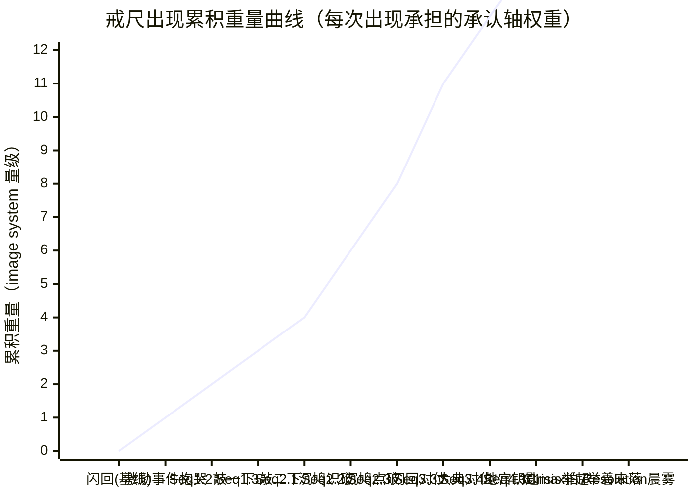

# Key Image ——《废徒倒丹》

> 上游契约（全部 locked）：[[controlling-idea]] / [[setting-survey]] / [[spine]] / [[act-design]] / [[premise-card]] / [[characters/protagonist-arc]]
> 类型：[[archplot|大情节]] · 反讽（ironic, negative）极性 · [[negation-of-the-negation|否定之否定]] 在承认轴上的具体落点
> 推荐 Key Image：**断戒尺举着未落**
> 推荐 image system：**承认轴 image system —— 戒尺 / 玄色斗笠 / 那一字**（三阶递降标记物，已在 [[controlling-idea]] §3 锁定为不可逆）
> 下游交接：scene-architect

---

## 0. 一段定调

McKee（Ch. 12 [[chapter-12-composition|Composition]] / Ch. 13 [[chapter-13-crisis-climax-resolution|Crisis, Climax, Resolution]]）严格区分**关键意象 (Key Image)** 与**意象系统 (Image System)** 两个概念：

- **关键意象**是单一的、可被一帧画面承载的图像，它在 [[story-climax|高潮]] 处把整条 [[controlling-idea|主控思想]] 装进去——观众/读者带回家的那一帧。
- **意象系统**是一个母题词汇表（vocabulary of motifs），在故事中反复出现、累积意义；关键意象是这个词汇表里**最后**也是**最重的**那一笔。

本作品的承认轴 image system 在 [[controlling-idea]] §3 已被锁定为**不可逆**的三阶递降标记物：玄色斗笠（contrary 级 / 矛盾级）→ 戒尺（contradictory 级 / 对立级）→ 雷音盖过的字（negation of the negation 级）。这一锁定**不可被本文档推翻**——本文档的工作是：(1) 在三阶之中锁定**单一**关键意象作为 Key Image；(2) 把 image system 从三阶扩展为完整词汇表，以支援关键意象的累积重量；(3) 给出每一次出现的具体场景对位与 placement plan。

---

## 1. Key Image 锁定

### 1.1 决定：**断戒尺举着未落**

> **物理形态（一帧静照）**：祭天台上，主角左手按炉沿，右手举起一截断戒尺，戒尺停在敲炉沿前最后的位置——戒尺没有落下。师傅化为银砂的余烬尚在炉口飘散，雷云倒卷已止；他面无可读情绪，没有看任何人，没有说任何话。**戒尺没有落下**。

这一帧落在 [[spine]] §6 Climax 拍 7 + Resolution 起点（[[act-design]] §3 Act 4 末 turning point），是故事的**最后一帧**之前的物理顶点；之后只剩主角举着戒尺转身走入晨雾的留白。

### 1.2 候选审计：为什么是戒尺，不是其他三个候选

| 候选 | McKee 三项检验（[[chapter-12-composition|Ch. 12]] / [[key-image]]）| 判定 |
|---|---|---|
| **戒尺（推荐）** | (1) **可被一帧静照承载**：举着未落的姿势——单图即可成立。(2) **承担承认轴的最深一级**：[[controlling-idea]] §3 锁定它是 contradictory 级标记物，但同时它跨级承担——它是断的（被废那夜师傅亲手断的形态痕迹）+ 是举着的（主角主动选起炉的姿势）+ 是未落的（被师傅先一步走入炉夺走的姿势）—— **三态合一**，三层都对位 [[characters/protagonist-arc]] §2.4 锁定的 character revelation 终极语法"已经选了，但选的内容被对方先一步选走的人"。(3) **被故事 setup 透支了三十四个月的重量**：[[premise-card]] §4 行为 2 + [[setting-survey]] §6 硬规则 6 + [[spine]] §12 #1 + [[act-design]] §11 #2 锁定它**贯穿全作每一炉**——每场起炉敲炉沿一下"叮"的潜意识仪式 + 三年没敲过任何炉的禁忌 + 地宫第七层逆经井的钥匙——三种功能在同一物件上叠加。(4) **静默化兑现 controlling idea 的下半句**：[[controlling-idea]] §1 锁定句下半句"承认这件事永远逐出可被验证的世界"——戒尺举着未落是承认仪式的物理沉默化（"叮"永远不再响），即下半句的具象帧。 | **采用** |
| **玄色斗笠** | (1) 可被一帧静照承载——但它的力学是**不出现**（在主角扫人群最外圈时找不到），不出现的物件不能成为 Key Image（[[key-image]] McKee Ch. 13 强要求"被一帧承载"= 必须是图像中**有**的东西，不能是图像中**缺**的东西）。(2) 它承担的是承认轴矛盾级——三阶中**最浅**的一级。(3) 它在 Climax 处不出现——师傅化银砂时他不戴斗笠（Climax 拍 5）；它的"不出现"在 Climax 仍是"不出现"，无法承担最后一帧的视觉重量。 | 否决（属于 image system 支援层，不属于 Key Image） |
| **雷音盖过的字** | (1) **不能被一帧静照承载**——它本质是一个 sound + 一个口型；图像上没有"那一字"的可视形态。McKee Ch. 12 反对"非图像形态"的 Key Image。(2) 即使把"师傅口型在动 + 雷音"作为视觉合成帧，那也是一个动态过程（口型的张开 + 雷音的同时性），不是单一定格。(3) 它是 negation of the negation 级最强标记物——但这一标记物的强度来自**它无法被验证**，把不可验证的东西作为 Key Image 等于让 Key Image 自我取消。 | 否决（属于 image system 顶端层，但不能担任 Key Image） |
| **反丹炉的倒挂姿势** | (1) 可被一帧静照承载——单图成立。(2) 它承担的是反丹道的物理形态，不是承认轴的形而上落点。它在 Climax 处仍然倒挂，但 Climax 的核心动作不是反丹炉本身——是师傅入炉、银砂、雷音、戒尺举着未落。(3) 它在 [[controlling-idea]] §3 没被列入承认轴 image system——它属于反丹道 image system（[[setting-survey]] §3.2 物理学的视觉化）。**用 motif 替代 Key Image 是 [[chapter-12-composition|Ch. 12]] 警告的"以装饰代替承重"**。 | 否决（属于反丹道 image system 主轴，不是承认轴） |

### 1.3 戒尺为什么必须是"断的、举着的、未落的"——三态合一的硬约束

戒尺作为 Key Image 不是"完整的戒尺"，是**断戒尺举着未落**——这三个修饰符全部不可拆。每一个都对位 controlling idea 的一个内核：

| 修饰符 | 对位 controlling idea 的部分 | 物理来源（spine 因果链）|
|---|---|---|
| **断的** | "他用反道赢得真理"的 cause 起点 —— 断戒尺是被废那夜师傅亲手断的物理痕迹（[[premise-card]] §3 + [[setting-survey]] §6 硬规则 6）；它**记得师傅曾经存在过的对抗**；它的断是这一切的起因（如果当年戒尺不断，没有反丹道、没有三十四个月、没有 Climax）。 | 故事开场前 23 岁那夜师傅以宗门戒尺敲碎丹田，戒尺断成两截 |
| **举着的** | "在赢得的那一刻"的主角主体性顶点 —— 主角主动布阵、起气、按炉沿、举断戒尺准备最后一击（敲炉沿那声"叮"= 承认仪式，[[characters/protagonist-arc]] §1.2）；这是他这辈子最大的主动选择的物理姿势。 | [[spine]] §5 + [[act-design]] §3 Act 4 Seq 4.3 Crisis |
| **未落的** | "把承认这件事永远逐出可被验证的世界"的承认轴顶点 —— 戒尺在落下之前被结构性地夺走（师傅先一步走入炉中），承认仪式的"叮"永远未发出；这是 [[characters/protagonist-arc]] §2.4 锁定的"已经选了但选的内容被对方先一步选走"在物件上的兑现。 | [[spine]] §5 + §6 拍 1-3，Crisis → Climax 过渡帧 |

**三态合一是 Key Image 的硬约束**——任何拆掉一个修饰符的版本都失去 controlling idea 的相应部分：

- **如果戒尺不断**（用师傅生前完整的戒尺）→ 失去因果起点，反道立宗的根没有；
- **如果戒尺没举起**（主角放下戒尺看师傅入炉）→ 失去主体性顶点，"做了的选择"消失，dilemma 撕裂洗掉；
- **如果戒尺落下**（哪怕轻轻放在地上）→ 失去承认轴顶点，"未完成的姿势"破裂，Climax 拍 7 的物理沉默化失效。

### 1.4 与 [[image-systems]] 的关系——它不是 image system 本身，它是 image system 在 Climax 处的 condensation

[[image-systems|Image System]]（McKee Ch. 18）是一个母题词汇表的反复变奏；Key Image 是这个词汇表在 Climax 处的**单一定格凝聚**。本作品的承认轴 image system（戒尺 / 玄色斗笠 / 那一字）作为词汇表在 Act 1-4 反复出现、累积重量；Key Image"断戒尺举着未落"是这个词汇表在 Climax 拍 7 的合一帧——

- 玄色斗笠（矛盾级）在 Climax 处仍未出现 —— 但主角扫人群最外圈那个动作他**没有做**（他没有看任何人）—— 矛盾级的不出现以"不再扫"的方式合上；
- 戒尺（对立级）在 Climax 处举着未落 —— 对立级的姿势在物理上沉默化；
- 那一字（否定之否定级）刚刚被雷音盖过 —— 否定之否定级的内容已被永久取消。

**三阶在同一帧的物理上叠加**：Key Image 不是三阶之一，是**三阶在 Climax 处的合一形态**。戒尺作为单一物件承载这一合一——这是它能担任 Key Image 而玄色斗笠 / 那一字不能的根本原因。

---

## 2. Key Image Placement Plan

### 2.1 戒尺出现位置表（spine 因果链对位）

每一次戒尺出现都收集承认轴的一份重量；从激励事件到 Climax，戒尺的功能从 intro（道具）→ 暗（潜意识仪式）→ 显（公开仪式）→ 反转（钥匙）→ 合（合一帧）。

| # | 出现位置（[[act-design]] sequence 对位） | 戒尺形态 | 承担的功能 | 承认轴落点 | 累积重量 |
|---|---|---|---|---|---|
| **0** | **故事开场前 / 闪回中**（Act 2 Seq 2.3.b 闪回切片）| 师傅完整戒尺；按肩说"嗯"那夜戒尺立在炉边 | **正面级基线呈现** —— 14 岁炼出三品丹那夜师傅按肩说"嗯"那一帧的回响（[[controlling-idea]] §2 + [[characters/protagonist-arc]] §1.2）；闪回中戒尺**完整、不持锐意**——是承认仪式的祖型 | **正面（被承认）** | 0（基线）|
| **1** | **Act 1 Seq 1.1 激励事件 · 破观第一炉之夜**（[[premise-card]] §3 + [[spine]] §3）| 断戒尺第一次入画 —— 主角抱着断戒尺哭一夜 | **intro / 道具化** —— 读者第一次看见这截断戒尺；尚不知它是谁的、为什么断、为什么主角抱着它哭 | **基线 → 矛盾级** | +1（疑问立起）|
| **2** | **Act 1 Seq 1.2 街市验方 · B 折叠**（C1，[[act-design]] §2）| 断戒尺放在临时破棚的反向丹炉边；起炉前**敲炉沿一下"叮"** | **暗 / 潜意识仪式首次入画** —— 读者第一次看见敲炉沿动作；尚未注意到这是仪式（[[premise-card]] §4 行为 2 + [[characters/protagonist-arc]] §3 Pin 2）| **矛盾级首次清晰呈现** | +1（仪式埋下）|
| **3** | **Act 1 Seq 1.3 联盟追杀令 · 戒尺敲炉第二次入画**（C2，[[act-design]] §2 + [[spine]] §4）| 断戒尺在街市次日某次起炉前再敲一下"叮" | **暗 / 仪式重复** —— 读者第二次注意到敲炉沿，开始模糊感觉有什么；但还不能命名（[[spine]] §12 #1）| **矛盾级深化** | +1（仪式累积）|
| **4** | **Act 2 Seq 2.1.b 鬼丹窟 · 沉鸠瞎眼识破断戒尺**（C4 前半，[[act-design]] §6）| 断戒尺被沉鸠摸到——他识破这是宗门戒尺（瞎眼）；主角第一次解释自己为什么三年来一直养着它（**他不解释自己也未必知道为什么**）| **暗 → 显的过渡** —— 戒尺第一次被外人识破；这一帧承担"潜意识首次撬开的物理形态"；但主角自己仍未意识到（[[characters/protagonist-arc]] §3 Pin 3 前奏）| **矛盾级末** | +1（物件被外部识别）|
| **5** | **Act 2 Seq 2.2.c 鬼丹窟 · 戒尺敲炉第三次 + 沉鸠点破**（C4 后半，[[act-design]] §6 + [[spine]] §4 + §12 #1）| 主角起一炉小药试反丹道，敲断戒尺一下"叮"；沉鸠在旁边淡淡说"**你师叔当年也敲一下**"；主角愣神 | **显 / 潜意识被点破** —— 读者第三次见敲炉沿动作；这一次沉鸠的话点破仪式动作的源头；**主角第一次（在听见之外）听见自己潜意识欲望的形状**（[[characters/protagonist-arc]] §3 Pin 3）| **矛盾级末 → 对立级前奏** | +2（命名时刻 / image system 第一次跃迁）|
| **6** | **Act 2 Seq 2.3.b 自封丹田反向 · 闪回与现实对位**（C5 / A 折叠，[[act-design]] §6）| 闪回 14 岁那夜师傅完整戒尺 + 现实主角怀里的断戒尺**同帧合上**；自封丹田反向那一秒，他的右手仍按在断戒尺上（**他在身体上完成与师傅的对话——"我听见你了，但我必须不听"**） | **反转 / 镜像合一** —— 完整戒尺（正面级）和断戒尺（对立级）首次在同一帧合上；这一对位是 [[characters/protagonist-arc]] §3 Pin 4 的物理兑现 | **对立级清晰呈现** | +2（image system 内部正反对位）|
| **7** | **Act 3 Seq 3.3 大典反炼第七至第九转 · 戒尺举起未落**（C8 / 金场 1，[[act-design]] §2 + [[spine]] §6）| 第七转主角丹气将凝时，**师傅持戒尺登台立于祭炉旁三步**（[[premise-card]] §7 Q3 + [[setting-survey]] §5.3）；师傅的戒尺举起未落——他没有出手；主角扫师傅一眼，戒尺举起未落 | **显 / 公开仪式 + 反讽对位** —— 戒尺第一次以"师傅持的完整戒尺举着未落"姿势出现（与主角断戒尺敲炉的私密仪式形成反讽对位）；主角的断戒尺与师傅的完整戒尺**第一次在同一物理空间共同举起未落**——这一帧承担"公共承认到来 / 私密承认未到"的对撞（[[characters/protagonist-arc]] §3 Pin 8）| **对立级峰值** | +3（戒尺力学反讽顶点）|
| **8** | **Act 3 Seq 3.4 地宫第七层 · 断戒尺作为钥匙**（False Ending，[[act-design]] §2 + [[setting-survey]] §6 硬规则 6）| 主角在第六层石壁前从怀里摸出断戒尺；两段贴上石缝；门开 | **反转 / 钥匙功能兑现** —— 断戒尺三年存留之谜的物理回收（McKee Ch. 10 [[setup-and-payoff|铺陈与回报]] 极标本案例）；他用师傅亲手断他丹田的物件打开师傅藏师妹的密室 | **对立级末 + 假希望（False Ending）** | +2（setup payoff）|
| **9** | **Act 4 Seq 4.3 Crisis · 主角举断戒尺准备最后一击**（[[spine]] §5 + [[act-design]] §3 Act 4 末 turning point）| 主角左手按炉沿；右手举起断戒尺准备敲炉沿（最后一次"叮"）；戒尺还未落下 | **合 / character revelation 物理顶点** —— 戒尺举起的姿势承担 character revelation 次终形态（"自死殉道者"——主角已选择起炉自死）；但戒尺还未落下 | **对立级末 → 否定之否定过渡帧** | +2（dilemma 撕裂顶点）|
| **10** | **Act 4 Seq 4.4 Climax 拍 7 · 断戒尺举着未落**（**Key Image 兑现帧**，[[spine]] §6 + [[characters/protagonist-arc]] §6.4）| **主角的右手举着断戒尺定格——他从此再没有敲过任何炉**；师傅化银砂；雷音盖字已止；印记反流为淡灰；三万人雷动；主角面无可读情绪、没有看任何人、没有说任何话；**戒尺没有落下** | **合 / Key Image 物理兑现 / controlling idea 合句帧** —— 戒尺举着未落是承认仪式的物理沉默化（"叮"永远不再响）；这是 [[controlling-idea]] §1 锁定句下半句"承认这件事永远逐出可被验证的世界"的具象帧；**承认轴 image system 的三阶（玄色斗笠 / 戒尺 / 那一字）在这一帧合上**（[[characters/protagonist-arc]] §3 Pin 11） | **否定之否定（兑现）** | **+3（Key Image / 三阶合一）**|
| **11** | **Resolution · 主角举着断戒尺转身走入晨雾**（[[spine]] §10 + [[act-design]] §3 Act 4 末 turning point）| 主角举着断戒尺转身离开祭天台；走入晨雾；雾里没有任何东西在等他；师妹张嘴叫不出"师兄"二字 | **合 / Key Image 余韵帧** —— 戒尺仍在他手里；他从此再没有敲过任何炉；戒尺的余生归宿不被故事交代（[[spine]] §10 锁定）| **否定之否定（永久）** | +1（余韵 / Key Image 离场）|

### 2.2 累积重量曲线

**说明**：累积重量在 Seq 2.2.c 沉鸠点破处第一次跃迁（+2，命名时刻），在 Seq 3.3 大典反炼戒尺力学反讽顶点处第二次跃迁（+3），在 Climax 拍 7 处达到顶点（+3）。每一次跃迁都对位 [[characters/protagonist-arc]] §3 的某个 revelation pin —— Key Image 的累积重量与 character arc 的揭示节奏严格同步。

### 2.3 Climax 拍 7 那一帧 Key Image 如何 carrier 整条 controlling idea

[[controlling-idea]] §1 锁定句：

> **"他用反道赢得真理，却在赢得的那一刻把『师傅承认他对』这件事永远逐出了可被验证的世界。"**

句子在 Key Image 上的精确投影：

| 锁定句的部分 | Key Image 在 Climax 拍 7 如何承担 |
|---|---|
| **"他用反道"** | 戒尺是**断的** —— 这是反道的起点（被废那夜的物理痕迹）；如果戒尺不断，没有反道 |
| **"赢得真理"** | 戒尺**举着** —— 这是主角已经赢的姿势（他主动布阵、起气、按炉沿、举戒尺，已完成 Crisis 的最大主动选择）；他赢的物理事实兑现于 Climax 拍 4-6（双面丹散疫止、印记清零、反道立宗）；戒尺的"举着"姿势承担"赢"的主体性顶点 |
| **"却在赢得的那一刻"** | 戒尺在举与落之间——这一秒**不可被分割**（[[spine]] §6 拍 3 锁定"赢得真理 vs 承认被永远逐出"在同帧物理上不可分）；戒尺的悬空位置就是"那一刻"的视觉定格 |
| **"把『师傅承认他对』这件事"** | 戒尺敲炉沿那声"叮"是承认仪式的私密形态（[[characters/protagonist-arc]] §1.2 锁定）；戒尺没有落下=承认仪式的"叮"永远不响=承认这件事的物件载体永远不被启动 |
| **"永远逐出了可被验证的世界"** | 戒尺**未落**——这一姿势承担永久性。不是"暂时未落"（动作未完成）、不是"故意不落"（主角主体性还在），是**结构性地被夺走的未落**（师傅先一步走入炉中、主角喊"师……"未完、雷音起、机会被永久取消）。戒尺从此再没有落下——他从此再没有敲过任何炉（[[spine]] §10）。承认仪式的可被启动的可能性被永久从这场关系里抽走 |

**Key Image 的合句性**：单图（断戒尺举着未落）= 整个 controlling idea 句的视觉等价。一个观众/读者只看见这一帧静照、不读全文，仍能在直觉上感到承认的悬空、姿势的不可解、姿态的永久性——这是 McKee Ch. 13 [[meaning-produces-emotion|意义产生情感]] 的最高密度形态：意义不被命名，被一帧承载。

---

## 3. Image System Inventory

### 3.1 主体 image system —— 承认轴 image system（[[controlling-idea]] §3 锁定）

承担承认轴四级递降的标记物词汇表。**这是本作品的内在 image system / Internal Imagery**（McKee Ch. 18 [[image-systems]]）—— 不借用任何外部预载的符号意义（如十字架=宗教、火=毁灭），完全在故事内部构建意义。

| 标记物 | 承担的承认轴级 | 频次 | 出现位置 | 物件功能 |
|---|---|---|---|---|
| **玄色斗笠** | 正面 → 矛盾的过渡（contrary）| 至少 3 次 | Act 1 Seq 1.2 末（C1 街市验方扫人群最外圈）/ Act 2 中某场 / Act 3 Seq 3.3 第九转丹成（[[spine]] §12 #2）| 标记**承认者的不在场** —— 主角扫一眼最外圈寻找；不出现（找不到）即矛盾级落点 |
| **戒尺**（**Key Image 主体**）| 矛盾 → 对立（contradictory）+ 对立 → 否定之否定（合一帧）| 11+ 次 | §2.1 出现位置表（Item 0-11）| 标记**承认仪式的私密形态** —— 起炉前敲炉沿一下"叮"；地宫钥匙；Climax 举着未落 |
| **雷音盖过的字** | 否定之否定（negation of negation）| 1 次（Climax 拍 3）| Act 4 Seq 4.4 Climax 拍 3 | 标记**承认内容的不可验证性** —— 师傅口型四读 + 雷音同时；声音存在过但被永久盖住 |

### 3.2 支援 image system —— 反丹道物理学的视觉化（[[setting-survey]] §3 锁定）

承担反丹道物理学的视觉表达词汇表。这一系统**不直接承担承认轴**，但承担反讽极性的物理基础——它让"反"作为物理事实被读者反复看见，从而让承认轴的反讽性有物理学的依托。

| 标记物 | 承担的物理学 | 频次 | 出现位置 | 物件功能 |
|---|---|---|---|---|
| **反丹炉的倒挂姿势**（炉口朝下、铁链悬于梁上）| 反方四变量同步律 | 6+ 次 | Act 1 Seq 1.1 激励事件 / Seq 1.2 街市破棚 / Seq 1.3 围捕反向止血丹 / Act 2 Seq 2.5 反丹副作用首现 / Act 3 Seq 3.2-3.3 大典反炼（祭坛上方梁柱上倒挂——[[setting-survey]] §5.3）/ Act 4 Seq 4.4 天道之炉 | 标记**反道的物理形态** —— 凡是反丹必倒挂；倒挂= "井反天" 的物理可视化（[[setting-survey]] §5.1 "正经如河，逆经如井——河顺天，井反天"）|
| **七窍流银砂**（服丹者死亡时反向丹气逸出）| 反丹副作用 / 反向粒子物理 | 5 次 | Act 2 Seq 2.5 恩人化银砂（首次入画）/ 暗示伏笔（Seq 1.1 乞儿坐起暗示物理已点燃）/ Act 4 Seq 4.4 Climax 拍 5 师傅化银砂 + 死法对位三百年前师弟屠村 | 标记**反道的代价** —— 反向粒子= "反"的物质形态；银砂的累积出现让 Climax 拍 5 师傅化银砂的死法对位有物理学根据 |
| **反向气脉的逆走视觉**（九色丹气逆走、反向丹气模拟正气、反丹宗师左眼瞳孔短暂反向）| 反方丹气物理形态 | 4-5 次 | Act 1 Seq 1.2 三品级反丹解七症 / Act 2 Seq 2.3 自封丹田反向（左眼瞳孔反向）/ Act 3 Seq 3.2-3.3 大典反炼九色丹气逆走 / Act 4 Seq 4.4 三股力量合炉 | 标记**反丹气的视觉化** —— 让"反"在每一炉都被读者眼睛直接看见 |

### 3.3 支援 image system —— 天道债账本印记的颜色阶梯（[[setting-survey]] §4.1 锁定）

承担天道债账本的物理可视化词汇表。这一系统直接承担反讽极性的"代价"那一半（每爽必付代价）；它与承认轴 image system 在 Climax 处合一（印记反流为淡灰那一帧 = 戒尺举着未落那一帧）。

| 颜色阶段 | 物理对应 | 出现位置 | 物件功能 |
|---|---|---|---|
| **灰底（初态）** | 0 道劫 | Act 1 Seq 1.1 故事开场 | 基线 |
| **暗灰** | 1-7 道（凡丹反炼）| Act 1 Seq 1.1-1.2 | 升级流爽点伴随 |
| **浅红一格** | 8-40 道（中阶反丹大胜）| Act 1 Seq 1.3 末 / 整个 Act 1 后半 | 矛盾级深化时的物理对位 |
| **赤红** | 41-144 道（自封丹田反向 +26 一次性 + 累积反炼）| Act 2 Seq 2.3 自封丹田反向（[[act-design]] §6 Seq 2.3.c 标记物：印记由浅红转赤红）→ 整个 Act 2 后半 | 对立级清晰呈现的物理对位 |
| **暗赤** | 100+ 道（持续反炼累积）| Act 2 末 → Act 3 全程 | 对立级深化的物理对位 |
| **金黑流动** | 145+（账本临爆）| Act 3 末 → Act 4 Seq 4.1（账本爆出）| 对立级峰值 → 否定之否定过渡 |
| **天空变色 + 雷云倒卷**（账本爆发的天空形态）| 账本爆满（144 道阈值突破）| Act 4 Seq 4.1 终极反转 A | 否定之否定过渡的物理外化 |
| **反流为淡灰**（反核吞掉账本）| 0 道（清零）| **Act 4 Seq 4.4 Climax 拍 6** | 否定之否定的物理兑现 —— **与 Key Image"戒尺举着未落"在拍 6 → 拍 7 的视觉硬切处合一**（[[act-design]] §11 #2）|

### 3.4 支援 image system —— 七、九数字反复（修真传统对位）

承担天道因果矩阵的数字可视化词汇表。McKee Ch. 18 [[image-systems]] 允许 cross-modal 扩展（声音、数字、节奏）—— 数字作为视觉/听觉混合标记物。

| 数字标记 | 物理对应 | 出现位置 | 物件功能 |
|---|---|---|---|
| **七日** | 反丹气循环周期 / 疫情扩散周期 / 终极反转 7 日 / 师妹每七日睁眼一刻钟 | Act 4 整个反转 7 日 / Seq 3.4 师妹石棺缝苏醒周期 | 标记天道节奏的钟 |
| **九转** | 九转还魂丹的反炼分九转完成 | Act 3 Seq 3.2 第一至第六转 / Seq 3.3 第七至第九转 | 标记金场 1 的内部节奏 |
| **第七层** | 地宫螺旋向下九层中第七层（"逆经井"——师傅一人可入）| Act 3 Seq 3.4 地宫第七层 | 标记承认轴对立级峰值的空间形态（数字承担"反"的方位——七层=井底=井反天）|
| **三百口尸体** | 师弟屠村事件的物理具象 | Act 2 Seq 2.4 D 单独场水镜映像 / Climax 拍 5 师傅化银砂死法对位 | 标记反丹道代价的形而上账本（[[characters/master]] §6.2）|
| **三十四个月** | 故事时长（大典三年钟卡死）| 整个故事时长背景 | 标记 archplot 中短篇的时间钟 |

### 3.5 独立 motif（不构成完整 image system，但承担次级图像功能）

以下 motif 在故事中出现 1-2 次，承担次级图像功能，**不构成完整 image system**（不满足 McKee Ch. 18 [[image-systems]] 的"3+ 次反复变奏"硬要求）；它们的功能是**单点图像支援**而非系统性累积。

| Motif | 出现位置 | 单点功能 |
|---|---|---|
| **玄漪的逆经井 + 石棺**（地宫第七层）| Act 3 Seq 3.4 一次入画 | 承担反向核物理钥匙的视觉具象；False Ending 帧 |
| **沈砚旧炉底**（地宫第七层井壁金石片）| Act 2 Seq 2.1.b（沉鸠贴身金石片）+ Act 3 Seq 3.4（井壁残页对位）| 承担师弟"鬼魂"控场的物质载体 |
| **铜镜映像 + 水镜映像**（D 单独场）| Act 2 Seq 2.4 一次入画 | 承担 D 屠村真相预演的视觉媒介 |
| **五行街井字格局 / 鬼丹窟下水道**（合法在上、反的在下）| Act 1 Seq 1.2 / Act 2 Seq 2.1 | 承担反丹道**地理形而上**的视觉化（合法/反的物理上下二分）|

### 3.6 系统之间的交叉点

McKee Ch. 18 [[image-systems]] 允许多个 image system 在某些关键帧**交叉**——交叉点是反讽密度最高的位置。本作品的三个 image system + 七九数字系统在以下关键帧交叉：

| 交叉帧 | 交叉的 image systems | 反讽密度 |
|---|---|---|
| **Act 2 Seq 2.3.c 自封丹田反向** | 戒尺（承认轴对立级清晰）+ 反向气脉逆走（反道物理）+ 印记浅红转赤红（账本对立级）| 三系统首次合一（[[characters/protagonist-arc]] §3 Pin 4）|
| **Act 3 Seq 3.3 大典反炼第九转丹成** | 戒尺（师傅持完整戒尺举起未落 vs 主角断戒尺敲炉沿）+ 反向气脉逆走（九色丹气逆走）+ 反丹炉倒挂（祭坛上方梁柱）+ 玄色斗笠（找不到）+ 印记暗赤+ 九转（金场 1 内部节奏）+ 三万人观礼（与三百口尸体的数字呼应）| 全系统首次大合奏 / 金场 1 |
| **Act 4 Seq 4.4 Climax 拍 3** | 那一字 + 雷音（承认轴否定之否定）+ 银砂物理形态（反道代价）+ 师傅化银砂的死法对位三百口尸体（七九数字 / 因果矩阵）| 三系统在否定之否定级合一 |
| **Act 4 Seq 4.4 Climax 拍 6 → 拍 7**（**Key Image 兑现帧**）| 戒尺举着未落（承认轴 Key Image）+ 反丹炉倒挂（最后一次出现）+ 印记反流为淡灰（账本清零）+ 反向气脉沿地脉返生 | **全系统在 Key Image 处合一 —— controlling idea 的全部物理基础在同帧叠加**|

---

## 4. Image System 运作规则（McKee Ch. 18 [[image-systems]] / [[chapter-12-composition|Ch. 12]] 锁定）

McKee 在 Ch. 18 给出 image system 的硬规则；本作品的 image system 必须严格遵守，否则 Key Image 的累积重量失效。

### 规则 1 —— 内在意象优先（Internal over External）

McKee Ch. 18：image system 应使用内在意象（在故事中构建新意义）而非外在意象（借用外部预载意义）。

**本作品执行**：
- ✓ 承认轴 image system（戒尺/玄色斗笠/那一字）—— **完全内在**：戒尺在外部修真传统里只是宗门礼器，本作品赋予它"承认仪式的私密载体"这一本作品独有的意义；玄色斗笠在外部世界只是道家出门衣冠，本作品赋予它"承认者不在场的标记"这一本作品独有的意义。
- ✓ 反丹道物理学 image system —— **完全内在**：反向气脉逆走、反丹炉倒挂、七窍流银砂——三者在外部修真世界都不存在，是本作品的世界律产物。
- ✓ 印记五级颜色阶梯 —— **完全内在**：天道债账本是本作品的虚构世界律。
- ✓ 七、九数字反复 —— **半内在**：七、九在外部修真传统中有"七情六欲"、"九转还魂"等预载意义；本作品借用这些数字但赋予新功能（七日反丹气循环 / 九转金场 1 内部节奏 / 第七层地宫）—— 这是**外在 + 内在的杂交形态**，McKee Ch. 18 允许（"the writer can take an external system and reinvent it"）。

### 规则 2 —— 至少三次反复变奏（3+ Repetitions with Variation）

McKee Ch. 18：单一意象一两次出现是孤立符号，不是系统；需要至少 3 次反复，每次有变奏，才构成系统。

**本作品执行**：
- ✓ 戒尺：11+ 次出现（§2.1），每次形态有变奏（断/抱哭/敲一下/敲二下/被识破/被点破/闪回对位/大典持举/钥匙/Crisis 举起/Climax 举着未落/晨雾余韵）—— 远超 3 次最低要求。
- ✓ 玄色斗笠：3 次出现（[[spine]] §12 #2 锁定）—— 满足最低要求。
- ✓ 反丹炉倒挂：6+ 次出现，每次场景不同（破观/街市破棚/反向止血丹围捕/反丹副作用/大典上方梁柱/天道之炉）—— 远超最低。
- ✓ 印记五级：5 个阶段反复出现（灰/浅红/赤红/暗赤/金黑/反流淡灰）—— 远超最低。
- ✗ 雷音盖过的字：**仅 1 次出现**（Climax 拍 3）—— 但这一项是 Key Image 系统的**顶端单次落点**，不是系统中的反复变奏；它的"仅 1 次"是反讽极性硬要求（任何重复都会让"那一字永远不可解"的力学失效）。**这一项作为 image system 顶端的"系统外突破点"——McKee Ch. 18 允许（"the climax may carry a single, unrepeatable image that completes the system"）**。

### 规则 3 —— 必须 subliminal（不可被命名）

McKee Ch. 18 强要求：image system 必须是 subliminal（潜意识的），如果观众/读者意识到"这是个符号！"，系统就死了。

**本作品执行**：
- ✓ 戒尺敲炉沿那声"叮"在 Act 1 Seq 1.2 第一次入画时**没有任何角色解释这是仪式**——读者只是看见动作。第二次入画（Act 1 Seq 1.3）仍未被解释。直到 Act 2 Seq 2.2.c 沉鸠点破"你师叔当年也敲一下"——这一次是**角色对角色的潜文本传递**（沉鸠用"你师叔"而不是直接说"这是承认仪式"），仍然 subliminal。读者在第三次见敲炉沿时才能模糊感觉这是仪式动作；但仪式的具体意义（私密召唤）要到 Climax 拍 7 戒尺举着未落那一帧才完全打开——**读者一边读一边理解，没有任何角色或叙述者直接命名"这是承认轴 image system 的标记物"**。
- ✓ 玄色斗笠在 Act 1 Seq 1.2 第一次"扫人群最外圈寻找"时**没有任何叙述说明他在等谁**——读者只看见动作。第二次（Act 2 中某场）让读者开始模糊感觉。第三次（Act 3 Seq 3.3 第九转）让读者完全意识到——但仍未被任何角色命名。
- ✓ 反丹炉倒挂在 Act 1 Seq 1.1 第一次入画时只有动作描写（"丹炉倒挂、火门倒拨"），没有任何叙述解释这是反丹道的物理标记。读者通过反复看见这一姿势（6+ 次）逐渐内化它的意义。
- ✓ 印记颜色变化只通过物理描写出现（"印记浅红一格"、"印记由浅红转赤红"），没有任何角色解释"这是天道债的可视化"——读者通过反复看见颜色变化（5 个阶段）自动理解它的意义。
- ⚠ **唯一被命名的标记物**：天道债账本 144 道阈值（[[setting-survey]] §6 硬规则 3）—— 但这是世界律说明（"3 句话内能消化的根据"——如 12² 因果矩阵），不是符号意义的命名。McKee Ch. 18 允许世界律说明，禁止符号意义命名。

### 规则 4 —— 递降趋势（Trajectory of Meaning Across Acts）

McKee Ch. 12 [[chapter-12-composition|Composition]] 要求 image system 不是随机散布，而是**有内在 logic 的递降或递升轨迹**。

**本作品的承认轴 image system 递降轨迹**（act-by-act 命名）：

| Act | 戒尺形态 | 玄色斗笠形态 | 那一字形态 | 系统在该 Act 的整体功能 |
|---|---|---|---|---|
| **Act 1**（基线 → 矛盾级）| 断戒尺第一次入画 → 敲炉沿仪式建立（道具化）| 第一次扫人群最外圈寻找——找不到（标记承认者不在场首次清晰）| 不出现（基线状态——14 岁那夜的"嗯"在闪回中）| **建立词汇表**：读者第一次接触每个标记物，但还不能命名它们的功能 |
| **Act 2**（矛盾级 → 对立级）| 沉鸠点破仪式源头（命名时刻）→ 闪回与现实对位（镜像合一）| 出现一次（[[spine]] §12 #2 / Act 2 中某场）| 不出现（对立级在身体上完成对话——师傅"你这是在杀我"+ 闪回"嗯"撞击）| **累积词汇表的意义**：读者开始从仪式动作里读出潜意识；image system 的私密层被打开 |
| **Act 3**（对立级 → 对立级峰值 + 假希望）| 大典反炼师傅持完整戒尺 vs 主角断戒尺敲炉沿（反讽对位）→ 地宫钥匙（setup payoff）| 第九转丹成主角扫师傅一眼后扫人群最外圈（仍找不到）| 不出现（公共承认到来 vs 私密承认未到——"未发一言转身离场"）| **词汇表的反讽合奏**：image system 在金场 1 全系统大合奏；False Ending 让伪希望升起 |
| **Act 4**（对立级 → 否定之否定）| Crisis 举起 → Climax 举着未落 → Resolution 转身走入晨雾| 不再出现（不再扫人群最外圈——他没有看任何人）| **唯一一次出现**：Climax 拍 3 雷音盖字——口型四读 + 雷音同时 | **词汇表的兑现 + 取消**：Key Image 在拍 7 兑现；image system 三阶在 Key Image 处合上后离场 |

**递降趋势的硬约束**：
- ✓ 三阶在 Act 1-3 各自显示，但不重叠（玄色斗笠 1-3 出现，戒尺贯穿，那一字保留到 Act 4）；
- ✓ 系统在 Act 3 大合奏一次（Seq 3.3）—— 这是 [[chapter-12-composition|Ch. 12]] 要求的"the climax must be earned by the composition's prior accumulation"；
- ✓ 系统在 Act 4 收束于单一 Key Image —— 这是 McKee Ch. 13 [[key-image|Key Image]] 要求的"the system condenses into one final image"。

### 规则 5 —— 反讽对位（Image Inversion at Mid-Story）

McKee Ch. 18 鼓励 image system 在中段做**临时性反转**（temporary inversion），以保持系统的活性。

**本作品执行**：
- ✓ Act 2 Seq 2.3.b 闪回与现实对位 —— 完整戒尺（正面级基线）和断戒尺（对立级清晰）在同帧合上。这是 image system 的**内部反讽对位**——同一物件的两种形态首次同帧对撞；
- ✓ Act 3 Seq 3.3 大典反炼第七至第九转 —— 师傅持完整戒尺举起未落（公共仪式）vs 主角断戒尺敲炉沿（私密仪式）在同一物理空间反讽对位。这是 image system 的**外部反讽对位**——两个角色各持戒尺的不同形态共同举起未落。

这两次反讽对位让 image system 在 Act 2-3 保持活性（不是单调重复），并为 Climax 拍 7 的"断戒尺举着未落"积蓄重量。

### 规则 6 —— 跨模态扩展（Cross-Modal Extensions）

McKee Ch. 18 允许 image system 跨模态扩展（视觉、听觉、触觉、嗅觉）。

**本作品执行**：
- ✓ **戒尺**：视觉（举着的姿势、断的形态）+ **听觉（"叮"声）**——敲炉沿那声"叮"是 image system 的**听觉延伸**；这一声在 Climax 拍 7 永远不再响——听觉的沉默化承担否定之否定的物理形态。
- ✓ **反丹炉倒挂**：视觉（倒挂姿势）+ 嗅觉（反向丹气的特殊气味——可由 scene-architect 在场景描写中扩展）。
- ✓ **印记**：视觉（颜色阶梯）+ 触觉（主角胸口烫感——他不必视觉感知，胸口烫感即可——[[setting-survey]] §4.3）。
- ✓ **银砂**：视觉（七窍流银砂）+ 触觉（反向粒子被风、水、地脉传送——读者可感）。

### 规则 7 —— 不滑入装饰（Avoid Decorative Photography）

McKee Ch. 18 警告：image system 不能滑入"漂亮但无意义的装饰摄影"。每一次标记物出现必须**承担承认轴或反讽极性的某个具体功能**，不允许"为了视觉美感而出现"。

**本作品执行检查**：
- ✓ 戒尺每一次出现都有功能（§2.1 出现位置表每一行的"承担的功能"列）—— 无装饰性出现；
- ✓ 玄色斗笠每一次出现都是"找不到"（标记承认者不在场）—— 不出现的"出现"承担功能；
- ✓ 反丹炉倒挂每一次出现都是反道动作的物理标记 —— 无装饰性出现；
- ✓ 印记每一阶段都对位天道债账本的具体数额 —— 无装饰性出现；
- ✓ 银砂每一次出现都对位反道代价的物理形态 —— 无装饰性出现。

### 规则 8 —— 反陈词滥调（[[convention-vs-cliche|Anti-Cliché]] 检验）

McKee Ch. 3 / Ch. 18：image system 的标记物不能借用陈词滥调（如修真文常见的"飞剑"、"丹云"、"飞升"等）。

**本作品执行**：
- ✓ **戒尺**作为 Key Image —— 修真文中戒尺通常作为"师门权威"的符号（被打、被罚），从未承担"承认仪式的私密召唤" 这一功能。本作品对戒尺的反向使用（断戒尺被偷拾 + 敲炉沿仪式 + 地宫钥匙 + Climax 举着未落）是反陈词滥调的标本。
- ✓ **玄色斗笠**——修真文中玄色斗笠通常承担"江湖隐者"的姿态符号，本作品反向使用（标记承认者不在场的找不到）。
- ✓ **雷音盖过的字**——修真文中"雷劫"通常承担"主角度劫成神"的符号，本作品反向使用（雷音不是主角的劫，是把那一字盖过的物理事件）。
- ✓ **反丹炉倒挂**——修真文中丹炉通常正立、丹气向上，本作品反向使用（炉口朝下、丹气向下）—— 这是 [[setting-survey]] §3.2 锁定的反方四变量同步律的视觉化。
- ✓ **印记五级颜色阶梯**——修真文中"反派印记"通常承担"魔功标志"的符号，本作品反向使用（主角自己背的天道债账本、印记在 Climax 反流为淡灰=清零，不是消除魔功）。

### 规则 9 —— 与 [[setting]] / [[setting-survey]] 严格对位

McKee Ch. 3 / Ch. 18：image system 必须从 setting 内部生成，不能是 setting 外加上的装饰。

**本作品执行**：
- ✓ 戒尺—— [[setting-survey]] §2.1 + §6 硬规则 6 锁定戒尺是宗门律内嵌物件；
- ✓ 玄色斗笠—— [[setting-survey]] §2.5 锁定师傅"出门唯一一种装束"是世界设定的具体细节；
- ✓ 反丹炉倒挂—— [[setting-survey]] §3.2 锁定四变量同步律物理学；
- ✓ 银砂—— [[setting-survey]] §3.3 锁定反向毒副作用的物理过程；
- ✓ 印记—— [[setting-survey]] §4 锁定天道债账本的世界律；
- ✓ 七、九数字—— [[setting-survey]] §3.5 + §5.1 锁定数字与世界律的对位（144=12²因果矩阵 / 第七层=井反天 / 九转还魂）。

**所有 image system 标记物都从 setting 内部生成，无外加装饰**——满足 McKee Ch. 18 [[image-systems]] 的"image system must obey the world"硬要求。

---

## 5. Scene-Architect 必须交付的关键帧清单

scene-architect 在拆 Scene Cards 时必须把 Key Image / image system 标记物准确放置到以下关键帧。每一帧含：sequence 编号 + 帧描述 + 该帧承担的 image system 功能 + 视觉/听觉/触觉硬约束。

### 关键帧 1 ——【image system 建立】Act 1 Seq 1.1 激励事件 · 破观第一炉之夜（戒尺第一次入画）

- **sequence 对位**：[[act-design]] Act 1 Seq 1.1，约 3.5-4K 字，激励事件
- **帧描述**：丹成、乞儿坐起后，主角在炉边吐血；他抱着断戒尺哭一夜。镜头给一个特写：他怀里那截断戒尺，断口粗糙，戒尺主体上有当年师傅按肩说"嗯"那夜留下的指节磨痕。
- **承担的 image system 功能**：
  - 戒尺第一次入画——道具化，读者尚不知它的功能；
  - 反丹炉倒挂第一次入画（炉口朝下、铁链悬于梁上）——反道物理形态首次清晰；
  - 印记初态（灰底）—— 天道债账本基线建立。
- **硬约束**：
  - 戒尺**必须是断的**（被废那夜断成两截，他偷偷拾回了一截）；
  - **不要让任何角色或叙述者解释戒尺是什么**——读者只通过视觉接受这一物件；
  - 主角抱着戒尺哭一夜的姿势必须**无内心独白**——他自以为哭师妹（潜意识他在哭师傅永不会再点头），叙述者不点破。

### 关键帧 2 ——【image system 累积】Act 1 Seq 1.2 街市验方末 · 扫人群最外圈寻找玄色斗笠（首次入画 + 找不到）

- **sequence 对位**：[[act-design]] Act 1 Seq 1.2，约 6.5-8K 字，C1 街市验方 + B 折叠
- **帧描述**：尚书之子从担架上坐起，全市三百正方丹师哑口；贵人（礼部尚书）下跪谢恩；全场鼓噪。**主角擦完手，抬头扫一眼围观人群最外圈——没有玄色斗笠**。他的笑挂着没收回。镜头停留在他抬头那一秒，捕捉他笑容定格在嘴角的失神。
- **承担的 image system 功能**：
  - 玄色斗笠**首次入画**（以"找不到"的形态）——承认轴矛盾级首次清晰呈现；
  - 戒尺**敲炉沿仪式首次入画**（起炉前敲一下"叮"——本场 sequence 中段炼丹时即已发生）；
  - 反丹炉倒挂第二次入画（街市破棚的反向丹炉）。
- **硬约束**：
  - 主角扫人群最外圈的动作**必须是抬头那一秒的下意识**——不能是镜头跟随他寻找的过程，必须是一帧的扫视；
  - **不要让任何角色或叙述者解释他在找什么**——读者只看见动作，连"师傅未来"都不能直接说出（[[characters/protagonist-arc]] §6.3 锁定 characterization 表层是"防备追杀"——叙述者不点破真相）；
  - 他的笑挂着没收回的细节必须给视觉特写——这一秒承担 [[characters/protagonist-arc]] §3 Pin 2 的"赢的姿势是空对着不在场的位置说话"。

### 关键帧 3 ——【image system 命名】Act 2 Seq 2.2.c 鬼丹窟 · 戒尺敲炉第三次 + 沉鸠点破

- **sequence 对位**：[[act-design]] Act 2 Seq 2.2，约 3-4K 字，C4 后半（戒尺敲炉第三次 + 沉鸠点破在 mini-arc 2.2.c 末段）
- **帧描述**：主角在鬼丹窟起一炉小药试反丹道。起炉前他用断戒尺敲一下炉沿——"叮"。沉鸠在旁边淡淡说："**你师叔当年也敲一下。**" 主角愣神。镜头给一个停顿——主角的右手仍举着戒尺，他第一次有意识地注意到自己每次敲断戒尺时手是抖的。
- **承担的 image system 功能**：
  - 戒尺敲炉沿仪式**第三次出现**——读者第三次看见动作，开始模糊感觉这是仪式（McKee Ch. 18 image system 三次反复变奏的最低要求兑现）；
  - **沉鸠的话点破仪式动作的源头**——image system 第一次跃迁；
  - 主角第一次（在听见之外）听见自己潜意识欲望的形状（[[characters/protagonist-arc]] §3 Pin 3）。
- **硬约束**：
  - 沉鸠的话**必须是"你师叔当年也敲一下"**，不能改成"这是承认仪式"或类似直白语句——subliminal 硬要求；
  - 主角愣神后**必须不立即回答**——他在愣神中接住信息但不能在这一场用语言确认；
  - 读者通过沉鸠的"师叔"二字间接读出"主角的潜意识仪式与师弟（已故）的潜意识仪式同源"——这是 [[premise-card]] §6 师弟"鬼魂"控场的关键一击。

### 关键帧 4 ——【image system 反讽对位】Act 2 Seq 2.3.b 自封丹田反向 · 闪回完整戒尺与现实断戒尺同帧

- **sequence 对位**：[[act-design]] Act 2 Seq 2.3，约 6-7K 字，C5 / A 折叠（闪回切片硬位置在 mini-arc 2.3.b）
- **帧描述**：主角在师傅"乾元六味·正"封魔阵中被压丹田到极限的最后 0.5 秒——闪回 14 岁那年炼出三品丹那夜师傅按肩说"嗯"——闪回中师傅完整戒尺立在炉边——同一秒现实中主角怀里的断戒尺被他攥在手心——闪回与现实在同一物理空间合一帧 0.5 秒。然后他以反向丹气自封丹田反向；师傅倒退三步。
- **承担的 image system 功能**：
  - **完整戒尺（正面级基线）+ 断戒尺（对立级清晰）首次同帧合上**——image system 内部反讽对位（McKee Ch. 18 规则 5）；
  - 闪回作为承认轴 image system 的**正面级基线唯一一次完整呈现**（[[controlling-idea]] §10 #4 锁定）；
  - 反向气脉逆走 + 印记由浅红转赤红 + 左眼瞳孔短暂反向——反丹道物理学三标记物在自封丹田那一秒同时出现。
- **硬约束**：
  - 闪回**必须只 0.5 秒长**——任何更长的闪回都让"师傅按肩说嗯"成为完整场景而非闪回切片；
  - 闪回中师傅的形态**必须是 14 岁那夜的形态**（72-58=14 年前，师傅 58 岁）—— 不是 22 岁屠村那夜（那一形态在 Act 2 Seq 2.4 D 单独场承担）；
  - 主角的右手在自封丹田那一秒**必须按在断戒尺上**——这是闪回与现实的物理纽带；
  - 师傅倒退三步**必须不发一言**——任何台词都让对立级清晰呈现塌陷。

### 关键帧 5 ——【image system 反讽对位 / 金场 1 大合奏】Act 3 Seq 3.3 大典反炼第七至第九转 · 戒尺反讽对位的物理顶点

- **sequence 对位**：[[act-design]] Act 3 Seq 3.3，约 7-8K 字，C8 / 金场 1 核心
- **帧描述**：第七转主角丹气将凝时，**师傅持完整戒尺登台立于祭炉旁三步**；师傅戒尺举起未落——他没有出手。同一时刻主角扫师傅一眼，他的左手仍按炉沿，他的右手举起断戒尺敲炉沿一下"叮"——这一声"叮"在三万人观礼席的雷动中**单独被听见**。第八转主角的反向丹气与从地宫第七层升起的反向气共振——他认出师妹活着；同一帧司徒明璋第一次低头退后半步。第九转丹成全场雷动；师傅未发一言转身离场。**主角擦完手抬头扫人群最外圈——仍然没有玄色斗笠**。
- **承担的 image system 功能**：
  - 戒尺力学反讽顶点：师傅完整戒尺举起未落 vs 主角断戒尺敲炉沿"叮"——同一物件的两种形态首次在同一物理空间共同举起未落；
  - 玄色斗笠第三次出现（找不到）——承认轴矛盾级与对立级峰值同帧合上；
  - 反丹炉倒挂在祭坛上方梁柱以反向气链悬挂（[[setting-survey]] §5.3 锁定）—— 反道物理学的最高视觉密度；
  - 九色丹气逆走、九转的金场 1 内部节奏——七九数字 image system 大合奏；
  - 印记暗赤——账本对立级峰值。
- **硬约束**：
  - 师傅持完整戒尺登台的姿势**必须是"举起未落"**——他不能出手，他只是站到了"裁决位"上（[[setting-survey]] §5.3 + [[premise-card]] §7 Q3 锁定）；
  - 主角敲断戒尺那声"叮"**必须在三万人雷动中单独被听见**——这是听觉跨模态的关键帧（McKee Ch. 18 规则 6）；
  - 主角扫人群最外圈的动作**必须在第九转丹成那一帧之后立即出现**——[[spine]] §12 #2 + [[characters/protagonist-arc]] §5.1 维度 4 引爆点；
  - **公共承认到来 vs 私密承认未到的对撞必须在主角面无表情的脸上承担**——他在三万人雷动里第一次哭不出来。

### 关键帧 6 ——【image system setup payoff】Act 3 Seq 3.4 地宫第七层 · 断戒尺作为钥匙

- **sequence 对位**：[[act-design]] Act 3 Seq 3.4，约 7-8K 字，False Ending
- **帧描述**：主角站在第六层石壁前。他从怀里摸出断戒尺。两段贴上石缝。门开。他入井。井壁上是沈砚手札残页（字迹与他自己平时的字迹一模一样）。他直起身，看见井底石棺缝里玄漪睁着眼说："师兄，原来你回来了。"
- **承担的 image system 功能**：
  - **断戒尺三年存留之谜的物理回收**（McKee Ch. 10 [[setup-and-payoff]]）—— 师傅亲手断他丹田的物件成了打开师傅藏师妹密室的钥匙；
  - 沈砚手札字迹与主角字迹同形——师弟"鬼魂"控场的最终物质载体；
  - 玄漪石棺缝那双眼——反向核物理钥匙的视觉具象；False Ending 的伪希望升起。
- **硬约束**：
  - 断戒尺贴上石缝**必须需要双段同时贴入**（[[setting-survey]] §5.1 锁定的硬规则）—— 这一动作让主角的右手和左手分别持有戒尺两段，他必须用两手共同完成这件事；
  - 字迹同形**必须不被任何角色或叙述者解释**—— 读者通过视觉自己读出（[[premise-card]] §7 Q1 选项 c 的最深落点）；
  - 玄漪那一句"师兄，原来你回来了"**必须是低语**—— 不是激动、不是控诉、不是欣慰，是一种**温和的辨认**，让 False Ending 的伪希望在读者心里短暂升起。

### 关键帧 7 ——【Key Image 兑现】Act 4 Seq 4.4 Climax 拍 7 · 断戒尺举着未落 + Resolution 起点

- **sequence 对位**：[[act-design]] Act 4 Seq 4.4，约 4-5K 字，Climax 七拍 + Resolution 起点（金场 2）
- **帧描述**：（Crisis 在 Seq 4.3 已发生：主角左手按炉沿、右手举起断戒尺准备敲炉沿；戒尺还未落下；师傅从他身后走过、解下宗主令牌放在他脚边、走向炉口；主角喊"师……"，雷音起。）拍 1-6 的物理动作完成（师傅入炉、按右膝、抚女儿脸、张嘴说一字 + 雷音同时；三股力量合炉；师傅化银砂；师妹归位；双面丹散疫止；印记反流为淡灰；天空恢复正向）。**拍 7**：**主角的右手举着断戒尺定格——他从此再没有敲过任何炉**。三万人雷动 / 鼓噪 / 跪下 / 哭——但他面无可读情绪。他没有看任何人。他没有说任何话。他转身离开祭天台。**Resolution 起点**：他举着断戒尺转身走入晨雾。雾里没有任何东西在等他。师妹张嘴叫不出"师兄"二字。
- **承担的 image system 功能**：
  - **Key Image 物理兑现**——断戒尺举着未落是承认仪式的物理沉默化（"叮"永远不再响）；这是 [[controlling-idea]] §1 锁定句下半句的具象帧；
  - 承认轴 image system 三阶（玄色斗笠 / 戒尺 / 那一字）在这一帧合上：玄色斗笠不再被找（不再扫人群最外圈）；戒尺举着未落（永远不再敲）；那一字已被雷音盖过（已永久取消）；
  - 全 image system 在拍 6 → 拍 7 的视觉硬切处合一：印记反流为淡灰（拍 6）+ 戒尺举着未落（拍 7）+ 反丹炉倒挂最后一次出现（拍 4 三股力量合炉时）+ 银砂物理形态（拍 5 师傅化银砂的死法对位三百口尸体）。
- **硬约束**（**全部不可妥协**——这是 Key Image 兑现帧的物理硬约束）：
  - 戒尺**必须举着未落**——不能落下、不能被丢、不能被放下、不能在地上、不能被任何角色接走（[[characters/protagonist-arc]] §6.5 锁定）；
  - 主角**必须面无可读情绪**——不能哭、不能笑、不能愤怒、不能释怀（[[controlling-idea]] §7 违规 #11）；
  - 主角**必须没有看任何人**——不能看师傅化银砂的余烬、不能看师妹、不能看司徒明璋、不能看观众席（[[spine]] §6 拍 7 锁定）；
  - 主角**必须没有说任何话**——不能内心独白、不能旁白、不能叹息、不能任何配乐 / 字幕 / 画外音（[[controlling-idea]] §7 违规 #12）；
  - 主角**必须转身离开祭天台**——不能站立、不能跪下、不能回头（[[spine]] §10）；
  - 师妹张嘴叫不出"师兄"二字**必须出现在主角转身之前的一秒——主角没有回头——他不知道师妹在叫他，但师妹知道**（[[act-design]] §11 #3 锁定）；
  - 雾**必须是晨雾**——不是夜雾、不是日间雾——晨雾承担"事件结束之后世界继续走的物理时间感"（[[spine]] §10 + §13 #3）；
  - 雾里**必须没有任何东西在等他**——不能有任何人物、任何物件、任何暗示（[[controlling-idea]] §7 违规 #1-#12 全部禁止）。

---

## 6. 七项 Key Image 自检（system prompt §5）

按 key-image-curator 系统提示 §5 的 Seven-Point Key Image Audit：

| # | 检查项 | 结果 | 备注 |
|---|---|---|---|
| 1 | **Key Image 是 paintable**（可被一帧静照承载） | ✅ | "断戒尺举着未落" 是单图——主角左手按炉沿、右手举起断戒尺、戒尺停在敲炉沿前最后的位置——单一摄影机一帧即可成立。 |
| 2 | **Key Image 跨幕重复 ≥3 次，每次累积意义** | ✅ | 戒尺出现 11+ 次（§2.1）；意义从 intro（道具）→ 暗（仪式）→ 显（命名）→ 反转（钥匙）→ 合（合一帧）累积。每次出现都收集承认轴的一份重量。 |
| 3 | **Key Image 落在 Climax / Resolution** | ✅ | Key Image 兑现帧 = Act 4 Seq 4.4 Climax 拍 7 + Resolution 起点。spine 七拍序列锁定它在拍 7。 |
| 4 | **Key Image 承担 controlling idea**（value pole + cause clause）| ✅ | §2.3 表格逐字对位：戒尺断（cause 起点）+ 戒尺举着（赢得真理 / 主体性顶点）+ 戒尺未落（承认被永远逐出 / 否定之否定）—— controlling idea 锁定句的每一部分都在 Key Image 上有具体物理对位。 |
| 5 | **Image system 是词汇表**（不是单一物件，至少 3+ 标记物）| ✅ | 承认轴 image system 包含三阶标记物（玄色斗笠 / 戒尺 / 那一字）+ 反丹道物理学 image system（反丹炉倒挂 / 银砂 / 反向气脉逆走）+ 印记五级颜色阶梯 + 七九数字反复 —— 至少 4 个独立 image system 在故事中并行运作。 |
| 6 | **Image system 来自 setting**（不外加装饰） | ✅ | §4 规则 9 检查—— 所有标记物来自 [[setting-survey]] 内部规定（戒尺=宗门律 / 玄色斗笠=师傅装束 / 反丹炉倒挂=反方四变量物理 / 银砂=反向毒副作用 / 印记=天道债账本 / 七九=因果矩阵）—— 无外加装饰。 |
| 7 | **Key Image 不是 quotation**（不借用陈词滥调）| ✅ | §4 规则 8 反陈词滥调检查—— 戒尺、玄色斗笠、雷音盖过的字、反丹炉倒挂、印记五级、七九数字 —— 全部反向使用修真文常见符号。**戒尺作为 Key Image 在修真文里没有先例**——修真文中戒尺通常承担"权威/惩罚"的符号功能，从未承担"承认仪式的私密召唤"这一功能。anti-quotation 检查通过。 |

### Anti-Quotation Differentiation Table（反陈词滥调差异化）

| 修真文常见 Key Image / motif | 该作品对应物的差异化 |
|---|---|
| **飞剑**（《诛仙》《剑来》等）—— 主角以剑成神 | 本作品**没有任何剑** —— 主角的物件是**断戒尺**（被废之器），不是攻击之器；它的功能是**敲炉沿（"叮"）**而非杀伐 |
| **丹云**（《丹道宗师》《雪鹰领主》等）—— 丹成时云气环绕承担"成神"姿态 | 本作品**反向使用**：丹成时**雷云倒卷**（账本爆发的天空形态）—— 不是主角飞升的征兆，是天道讨债的开始 |
| **飞升**（多数修仙文）—— 主角化光飞升仙界 | 本作品**严格禁止**（[[setting-survey]] §6 硬规则 8）：主角既不飞升也不死亡，他活着但不再敲炉；反向粒子化沿地脉返生（不是向上升） |
| **师门戒尺**（多数师徒文）—— 戒尺承担"师门权威"的符号功能 | 本作品**反向使用**：戒尺是**断的 + 主角偷拾 + 敲炉沿仪式 + 地宫钥匙 + 举着未落**——五重功能在同一物件上叠加，权威符号被反讽地反向使用 |
| **承认/不承认戏的台词**（多数师徒情文）—— 师傅临终一句"你做对了" / "我错了" | 本作品**严格禁止**（[[controlling-idea]] §7 违规 #1）：师傅说一字 + 雷音盖过 + 永不可解 |
| **雷劫成神**（多数修仙文）—— 主角度雷劫成神 | 本作品**反向使用**：雷音盖字——雷不是主角的劫，是把承认那一字盖过的物理事件 |

**所有六项差异化完成 —— Key Image 与 image system 全系统反陈词滥调**。

---

## 7. 给作者 / 下游的开放问题（≤5）

1. **戒尺敲炉沿那声"叮"的听觉硬约束**——本文 §5 关键帧 5 锁定大典反炼那声"叮"必须在三万人雷动中单独被听见。这一听觉跨模态承担 image system 的最关键一笔。但**前面 1-4 次"叮"声是否每次都需要同等突出**？还是 Act 1 Seq 1.2 第一次入画时只是动作不强调声音、Act 1 Seq 1.3 第二次入画时声音稍强、Act 2 Seq 2.2.c 第三次入画时声音被沉鸠那句话压住、Act 3 Seq 3.3 第七次入画时声音独突？建议方向：**听觉强度递增曲线（1→2→3→4→5），第 5 次（大典）达到峰值**——与累积重量曲线同步。最终判定由 scene-architect 决定每场具体的听觉处理。

2. **Climax 拍 6 印记反流为淡灰 + 拍 7 戒尺举着未落的视觉硬切**——本文 §5 关键帧 7 锁定两者在拍 6→拍 7 的视觉硬切处合一。但**视觉硬切的具体形态**：是镜头从主角胸口（印记淡灰）平移到他举着戒尺的右手（远→近）？还是镜头停在主角全身（印记 + 戒尺同帧）？还是先给印记特写、后给戒尺特写（先后切换）？建议方向：**先全身合一帧（印记 + 戒尺 + 面无表情同帧）—— 后镜头收紧到戒尺特写（戒尺举着未落作为最后定格）**。两步切换让"全 image system 合一"先呈现、然后"Key Image 单独定格"承担最后离场。最终判定由 scene-architect 决定。

3. **晨雾的视觉硬约束**——本文 §5 关键帧 7 锁定 Resolution 起点是"主角举着断戒尺转身走入晨雾"。但**晨雾的浓度、颜色、与天空的关系**：是淡白晨雾 / 银灰晨雾 / 略带金色的晨雾？是平视高度 / 略低 / 弥漫至膝？是与雷云倒卷已止后的天空恢复正向同色？建议方向：**银灰晨雾**（与 Climax 拍 5 师傅化银砂的银砂同质——但雾不是银砂，是雾；这一同色让 Key Image 的离场带师傅的余烬感）+ **弥漫至腰**（不能太浓掩盖主角身影、不能太淡失去"走入"的物理动作）+ **天空仍微微透着雷云余光**（提醒读者雷云倒卷刚刚结束）。最终判定由 scene-architect / image-systems 共同决定。

4. **承认轴 image system 之外的支援 image system 在 Climax 拍 7 的最后形态**——本文 §3.6 锁定全 image system 在 Key Image 处合一。但**反丹炉倒挂在拍 7 是否仍在画面里**？拍 4-6 三股力量合炉时反丹炉是主体，但拍 7 主角转身离开祭天台时反丹炉是否被镜头甩出画外？建议方向：**反丹炉倒挂在拍 7 仍在画面深处（背景）—— 但被晨雾逐渐遮住**——让反丹炉作为 image system 的物理基础"退场"承担反道事件结束的物理时间感；而 Key Image"戒尺举着未落"作为前景独占视觉重量。最终判定由 scene-architect 决定。

5. **D 单独场水镜映像三秒画面（[[act-design]] §11 #4 已锁雪天 + 三百口尸体覆盖）与 Climax 拍 5 师傅化银砂死法的视觉对位**——本文 §3.6 锁定两者在 image system 的"七九数字 / 因果矩阵"轴上交叉。**视觉对位的具体形态**：水镜映像里三百口尸体的姿势 / 颜色 / 雪的厚度，应当与 Climax 拍 5 师傅化银砂时银砂的颜色 / 流向 / 数量在视觉上有可被读者潜意识捕捉的同形——但不能让读者意识到"这是同形！"（[[image-systems]] McKee Ch. 18 subliminal 硬要求）。建议方向：[[act-design]] §11 #4 已锁站立姿（与师傅 22 岁挖三个月时尸首"姿态各异"对位）+ 纯银（与师傅银砂同质）+ 茅屋顶 + 深雪。Climax 拍 5 师傅化银砂的视觉对位：银砂**从七窍流出**（数字与三百口的数量级在视觉上呼应——三百口=七窍 ×40+，潜意识可读）+ 站立姿（师傅入炉前最后一秒按右膝、抚女儿脸的身体姿态在化银砂的瞬间被定格——尸体姿态对位首次完整呈现）。最终视觉细节由 scene-architect 决定。

---

## 8. 下一步交接

→ **scene-architect**（首要交接）：本 Key Image 文档已给出 7 个关键帧的详细物理规格（§5）+ 全 image system 的运作规则（§4）+ Key Image 在 Climax 处的兑现路径（§2.3）。scene-architect 在拆 Scene Cards 时按以下交付清单工作：
  1. **每场含 image system 标记物的 Scene Card 必须明确标注**该场承担的 image system 功能（按 §2.1 / §3.1-3.4 表格对位）；
  2. **每场的视觉/听觉/触觉硬约束**必须按 §5 关键帧清单的每一帧硬约束实现；
  3. **Key Image 兑现帧（关键帧 7）的物理硬约束** —— 戒尺举着未落、主角面无表情、不看任何人、不说任何话、转身、晨雾、雾里没有任何东西在等他、师妹叫不出"师兄"—— 全部不可妥协；
  4. **subliminal 硬要求** —— 任何 Scene Card 中 image system 标记物的描写都不允许角色或叙述者直接命名其符号意义（§4 规则 3）。

→ **composition-conductor**（次要交接，如有此 agent）：本文档 §3 给出全 image system inventory（4 个 image system + 独立 motif）—— 可作为 composition audit 的图像系统清单输入。

→ **wiki-librarian**（中后期，如本作品 image system 锁定后）：本文档定义的"承认轴 image system"作为反讽极性下 internal imagery 的具体实现案例，可作为 [[image-systems]] / [[key-image]] wiki 页的 application 案例参考——但 image system 在故事完稿前不上 wiki。

---

> **Key Image 锁定**：**断戒尺举着未落**
> **承认轴 image system 锁定**：玄色斗笠（contrary 矛盾级）/ 戒尺（contradictory 对立级 + 跨级合一帧 / Key Image 主体）/ 雷音盖过的字（negation of the negation 否定之否定级）
> **支援 image system 锁定**：反丹道物理学（反丹炉倒挂 / 银砂 / 反向气脉逆走）+ 印记五级颜色阶梯 + 七九数字反复
> **兑现帧锁定**：[[act-design]] Act 4 Seq 4.4 Climax 拍 7 + Resolution 起点
> **物理硬约束**：戒尺举着未落、主角面无表情、不看任何人、不说任何话、转身走入晨雾、雾里没有任何东西在等他、师妹叫不出"师兄"——全部不可妥协。
