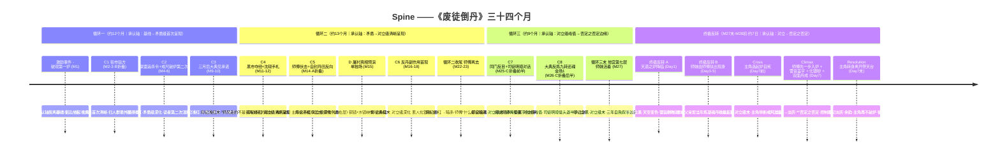

# Spine ——《废徒倒丹》

> 上游契约（全部 locked）：[[premise-card]] / [[controlling-idea]] / [[genre-contract]] / [[setting-survey]] / [[characters/protagonist]] / [[characters/master]]
> 字数预算：~103-105K（折叠 A+B+C 进现有大场，单独写 D，3-5K）
> 结构形态：archplot 单弧 / 三循环 + 终极反转 / 反讽（负向）极性 / negation of the negation 在承认轴上的具体落点
> 下游交接：act-designer / character-forger（师妹+师弟）/ scene-architect

---

## 0. 一段定调

这条 spine 不是事件链。它是**承认轴**在场景上的递降图——主角每过一场关键戏，"被师傅认"这件事就离他更远一格；他每反成一炉，他能得到那一字的可能性就被结构性地削掉一层。

按 McKee Ch. 7 [[spine]] 的硬要求，spine 是**主人公追逐欲望对象的生命线**，从激励事件被点燃到高潮被授予/拒绝/翻面。本作品 spine 的特异之处在于——**自觉欲望与潜意识欲望被反向锁死**：他追的是公开承认（自觉），他真正要的是私密点头（潜意识），而后者的结构性形态规定它**只能在前者抵达的那一刻被永久取消**。所以 spine 走到 climax 时，主角同时经历：自觉欲望最大形态兑现（反道立宗、苍生救活、宗门联盟当众认"反方亦道"）+ 潜意识欲望以**承认本身被翻面**的形态归零（雷音盖字、师傅化银砂、断戒尺举着未落）。

这就是 [[negation-of-the-negation]]（Ch. 14）在承认轴上的物理落点：**承认这件事的真假不再属于这个世界的可知范畴**。

---

## 1. Position on the Story Triangle

**[[archplot]]（大情节）/ closed ending**。

按 McKee Ch. 2 [[the-story-triangle]] 三角的三条边检验：

- **因果性 (causality)**：每一场推进皆由"因为...所以..."连结——激励事件因师妹三年前那纸字 → 沈砺起反炉 → 救人 → 入帝京 → 街市验方 → 联盟下追杀令 → ... → 天道之炉降临。**禁止 "and then" 因果**。Ch. 14 反对 [[deus-ex-machina|天降神兵]] 的硬要求被严守——天道之炉的爆账由循环二地脉断裂处主角自封丹田时反向粒子泄漏 + 三个月扩散十省疫情这一条因果链触发，**不是天降的劫**。
- **单一主人公 (single active protagonist)**：沈砺是唯一 spine 主体；师傅是 antagonist-as-mirror（次主体配额）；师妹是反向核物理钥匙（不竞争主人公地位）；师弟（已故）通过遗物入场（不在场）。
- **闭合结局 (closed ending)**：[[major-dramatic-question]] 在 climax 收口（详 §2）；承认轴四级递降在 §6 终极反转的最后一帧合上；不留追问的口子。

**这个项目不能写成 [[miniplot]]**：miniplot 要求主人公被动、内心剧、模糊结局——本作品主角主动反炼三十四个月、每一炉都是动作、climax 由 [[crisis|危机]] 决定的具体动作触发。**也不能写成 [[antiplot]]**：antiplot 要求因果倒置、巧合驱动——本作品所有事件因果链可数。

**archplot 在中短篇里的代价**：archplot 一般匹配长篇（200K+）。压在 105K 内的代价是——**所有支线、群像、世界观奇观必须为主线让路**。本 spine 已为这个代价做过减法：联盟七大宗门只激活其中三宗（场 3 / 6 / 9 出现），鬼丹窟群体只激活沉鸠一人（功能性陪衬），师弟沈砚通过手札残页和地宫物证三种载体出场（不开独立支线）。**这条妥协必须被 act-designer 守住**——任何把次要人物写丰满到喧宾夺主的处理，都会让 archplot 的"单一主人公因果链"崩。

---

## 2. Major Dramatic Question

> **中文**：**沈砺能否在反丹道立宗的那一炉里得到师傅一句明白的『对』？**
>
> **English**: Will Shen Li, at the very furnace that proves the reverse-dao right, win from his master one unambiguous word — *"yes"* — before that master is silenced forever?

### 为什么是这一句而不是更宽

候选过的三句：

| 候选 | 形态 | 为什么否决 |
|---|---|---|
| "沈砺能否反炼成功苍生之炉、止疫救十万？" | 自觉欲望版（公开真理） | 太浅。这是表层欲望，但读者第一炉之后就已经知道答案是"能"——升级流契约保证。这一句不能撑悬念三十四个月 |
| "沈砺能否让师傅认错？" | 错位版 | 错——主角自己以为这是他要的，但 [[premise-card]] §4 + [[controlling-idea]] §5 已锁：他不要"认错"，他要"再被认一次"。"认错"读起来像和解剧；本作品反讽极性禁止和解剧 |
| **"沈砺能否在反丹道立宗的那一炉里得到师傅一句明白的『对』？"** | **承认轴+物理钟+不对称权力的合并版** | **采用** |

### 这一句必须能在每一帧悬着

- 第一帧（破观第一炉之夜）：他抱着断戒尺哭一夜——读者第一次模糊感到：**他想要的不只是赢一炉**。
- 中段（戒尺敲炉每次起炉前的"叮"）：仪式存活——读者反复被提醒**他在等一个回应**。
- 大典反炼第七转（金场 1 的咬合帧）：戒尺举起、未落——这一句的张力达到峰值；读者在三万人雷动里和主角一样开始问"师傅会不会说点什么"。
- 终极反转炉前（金场 2）：**这一句被回答**——但回答的形态是"师傅说了一字 + 雷音盖过 + 永不可解"。**问题被回答的姿势同时取消了答案的可被验证性**——这是反讽（负向）极性合句的具体物理形态。

### 答案的形态

- **自觉层**：是。反道立宗、苍生救、师妹归位（场 6 + 终极反转 ABCD）。
- **潜意识层**：**不可知**。师傅说了一字，但雷音盖过，永远不可解。
- **承认轴最终态**：负向（ironic, negation of the negation）—— 不是"未被承认"（contradictory），而是"承认本身被翻面，永远无法被确认"（[[controlling-idea]] §1 锁定句的物理兑现）。

---

## 3. Inciting Incident

### 锁定形态

按 [[premise-card]] §3，激励事件是 spine 的第一根钉子，**已被 premise-card 完整描述**。本节作 spine 角度的精确化（不复述）：

**事件**：26 岁初冬某夜，破观破窑，乞儿被推入；信上是师妹三年前的字"请您试一次"；沈砺三年来第一次起反炉，丹炉倒挂、火门倒拨、按"乾元六味"反序下锅，丹成、乞儿坐起。**炉边他吐血——不是反噬，是因为如果他更早一步敢反，师妹本来不必死**。

### 它如何打破主角心理平衡

- **被废后三年的平衡形态**：他活在"我害死了她、我是异端、我活该"这一自我叙事里——这是他能在破观漏雪栖身、给死人写碑文的物质形态下保持每天起床的唯一支撑信念。
- **激励事件如何打破**：第一炉反丹成功的物质事实**直接否定**了这一自我叙事——"我用反方子能救人"等价于"三年前我用正方子杀了她"。**他三年来用以撑住自己活下去的信念在这一炉里被釜底抽薪**。
- **不可逆性**：他从此不可能回到"在破观给死人写碑文"的自己——即使他想退回去，那个自己已经被这一炉的物质证据消解了。这是 [[inciting-incident]]（Ch. 8）的硬要求"unrecoverable"的精确形态。

### 它如何唤醒潜意识欲望

主角自觉层的欲望在事件那夜瞬间形成（"回宗门去，让那个废他的人亲眼看一遍"——讨账）。但同时，**激励事件唤醒一个他自己尚未意识到的潜意识欲望**——

那夜他在炉边吐血时，他以为自己在哭师妹。但读者要在循环二第三次见他敲断戒尺时才回头明白：**他在哭的同时其实在等师傅出现在破观门口**。三年前那夜师傅废他丹田时口中只一句"你走火入魔"——这是承认轴 contradictory 级的清晰呈现；激励事件之后他要追的不是"翻案"，是"让师傅再说一次话"。**潜意识欲望在激励事件那夜被点燃，但要到循环二中段才浮出**。

### 它如何为后续系钩

激励事件埋下五条钩，每一条都对应后续场景的燃料（[[exposition-as-ammunition]] Ch. 15）：

| 钩 | 形态 | 在哪场被回收 |
|---|---|---|
| 1. 信上是师妹的字 | 三年前死的人留下的字何以能在三年后塞入乞儿手中——读者潜意识知道这是疑问 | 终极反转 B（师妹现身），读者第一次完全明白这字是谁递的 |
| 2. 断戒尺在炉边 | 他三年来一直养着断戒尺——这一道具的存留成因 | 循环二中段戒尺敲炉第三次（沉鸠一句话点破"师叔当年也敲一下") + 循环三末入逆经井（断戒尺是钥匙） |
| 3. 反向毒副作用的物理已被点燃 | 乞儿喉咙铁屑停了——但读者还不知道反向粒子的存在 | 循环二中段场 4（反丹副作用首现） + 循环三末（疫情爆发） |
| 4. 主角不知道自己当年用了正方杀了她 | 他在炉边吐血时第一次直面这件事，但还没敢全看 | 循环二中段（黑市夺经 + 沈砚手札"师兄走的不是错路他走的是怕"）/ 循环三末（地宫看见师妹活着——三年自我叙事的釜底抽薪） |
| 5. "回宗门去让那个废他的人亲眼看一遍"的承诺 | 他做了第一个不可逆决定——这是 spine 的钟开始走 | 循环一末"三月后大典见"承诺 / 循环三大典反炼 |

### Spine 角度的承认轴落点

激励事件**把承认轴从基线（正面级"嗯"——只在闪回中）推到矛盾级**——主角第一次以"白身废徒"的形态做出能被外界看见的反道动作；从此他每一次大胜都会扫人群最外圈寻找玄色斗笠。**承认轴在这一夜从基线脱出，进入循环一的"被忽视"。**

---

## 4. Progressive Complications

按 McKee Ch. 9 [[progressive-complications|渐进复杂化]] 硬要求：每一次复杂化必须**(a) 升级 [[forces-of-antagonism|对抗力量]]**、**(b) 关闭一条不可恢复的退路（[[points-of-no-return]]）**、**(c) 价值轴极性距离推进**。任何"and then"被禁止——下表每一行的"因果连结"列必须用"because of / therefore"读通。

### 八个关键复杂化节点

| # | 节点 | 因果连结（because of / therefore） | 自觉欲望推进 | 潜意识欲望推进（反方向） | 承认轴推进 | [[levels-of-conflict]] | 关闭的退路 |
|---|---|---|---|---|---|---|---|
| **C1** | **街市验方戏**（场 1，循环一中段） | **Because** 激励事件他做了"回宗门去"的决定，**therefore** 他入帝京寻找一个公开的舞台；五行街中央十字街临时破棚里给被首席丹师宣告"无救"的尚书之子起炉成功——**首席哑口、贵人下跪谢恩、全市三百正方丹师不能复刻**。**B 折叠点**：丹道试炼进此场——尚书之子病例本身即七味疑难症的复合体，主角同一炉内反炼三品级反丹解七症（B 缺口的"丹道试炼独立场"被收纳为本场的内部技艺密度而非独立场） | +1（公开胜利第一次） | -1（第一次扫人群最外圈寻找玄色斗笠——找不到。读者第一次看见这个动作但还不解） | 矛盾级首次清晰呈现 | 个人 + 超个人 | 不能再做"无名废徒" |
| **C2** | **联盟下追杀令 + 戒尺敲炉第二次入画** | **Because** C1 的公开胜利让宗门联盟无法装作不知，**therefore** 联盟正式将其列入"魔路追杀名录"第一人；同时主角在街市次日某次起炉前敲断戒尺一下——读者第二次注意到，开始模糊感觉有什么 | +1（追杀令=对抗梯度被升级=他确实威胁到联盟）| -1（仪式存活但回应不来）| 矛盾级深化 | 个人 + 超个人 | 不能再"低调避世" |
| **C3** | **循环一末"三月后大典见"承诺** | **Because** 联盟围捕中他用反向止血丹破围 + 留七字承诺，**therefore** 整个修真界的注视压在他身上；他对外公开宣告自己将在大典上反炼师傅之丹——**这是他对师傅的第一次直接喊话**；印记由灰转浅红一格 | +2（承诺把自觉欲望具体化为时间表）| -2（他知道这一炉如果成，意味着他与师傅的对抗将无可挽回）| 矛盾级峰值（仍是被忽视——师傅未回应）| 个人 + 超个人 + 内在 | 不能再"私下反炼"——必须公开 |
| **C4** | **黑市夺经 + 沈砚手札残页"师兄走的不是错路他走的是怕"** | **Because** C3 让他必须建反丹道完整体系才能反炼九转还魂，**therefore** 他深入帝京下水道鬼丹窟夺反丹手札残页；与瞎眼老丹师沉鸠合作——沉鸠说出"你师叔当年也敲一下"，主角第一次（在听见之外）听见自己潜意识欲望的形状；同时他在残页里读到沈砚临死前一句"师兄走的不是错路他走的是怕"——还不懂。**D 单独场（屠村真相预演）位置候选 1**——但本表把 D 单独场拆出（详 §7） | +1（反丹道体系初步建立）| -2（戒尺敲炉第三次被读者完全意识到——他在等师傅）| 矛盾级末 → 对立级前奏 | 个人 + 内在 | 不能再"以为自己是独孤异端"——他是传承余脉 |
| **C5** | **场 3 师傅亲自出手地脉断裂处 + 主角自封丹田反向**（循环二中段，**A 折叠点**） | **Because** 主角夺经将出，师傅二十年监视的地脉断裂处终于被踏入，**therefore** 师傅亲手摆"乾元六味·正"封魔阵——他放下宗主令牌、亲手摆阵这件事违反联盟律；主角在阵中以反向丹气**自封丹田**——**永远不能再炼正方丹**（[[setting-survey]] §6 硬规则 4 兑现）；师傅倒退三步，第一次在徒弟面前不敢出手；溢出的反向丹气进入地脉，三个月后引爆十省疫情（读者还不知道）。**A 折叠点**：境界突破不独立成场，被收纳为"自封丹田反向"那一刻的内视特写——这本身就是境界跃迁（破丹反炼者→反丹宗师）的物质形态，省掉一场独立成场的奢侈 | +2（对抗最高级首次直接交锋；他打到了师傅的底线）| -3（他在身体上完成与师傅的对话——"我听见你了，但我必须不听"——这是他对潜意识欲望的第一次主动撤销，但撤销的姿势是吐血压住）| **对立级清晰呈现**——师傅亲口说"反丹道是错的" / "你这是在杀我" | 三层皆活，根扎内在 | 不能再炼正方丹（物理钉死）；不能再回头说"我其实是在等师傅认错"（他自封丹田这件事就是断绝） |
| **C6** | **场 4 反丹副作用首现** | **Because** C5 的反向丹气泄漏 + 他过去一年反炼救过的人开始变质，**therefore** 他亲眼看见自己救过的人七窍流银砂——他没有立刻停手，他在那个尸体边上又救了下一个人；印记蔓延一寸 | +1（他选择继续反炼即使知道代价）| -1（他每一炉都付代价，他的胜利越多世界欠他的越多）| 对立级深化 | 个人 + 超个人 | 不能再骗自己"反丹道是干净的胜利" |
| **C7** | **同门反目 + 司徒明璋地宫前对话 + 联盟拘押令**（循环三初，**C 折叠点的对话部分 + P#1 antagonism 修订**） | **Because** C5/C6 让主角必须公开反炼九转还魂，**therefore** 他与司徒明璋在宗门地宫入口的拦截戏——主角一句话刺穿司徒明璋的合法性："师兄，你这一辈子的位置，是师傅废我那一夜替我空出来的。" 司徒明璋回一句让主角愣神的话（"师傅那夜下令的时候，手是抖的。"）+ **亮宗主令牌发出联盟正式拘押令——他自己的手在抖**（P#1 修订：超个人对抗 1→3 + 个人对抗 3→4）。**C 折叠点的初始**：同门反目作为"大典反炼前的同门论道"前置场，但 C 的真正质变（司徒明璋的转身）折叠到大典反炼第八转的现场——详 C8 | 0（他没有赢得对方，但他破了对方）| -1（司徒明璋的最后一句让他第一次意识到师傅废他可能不是惩罚 + 联盟拘押令让他面对体制屏障升级）| 对立级末 | 个人 + 超个人 | 不能再把司徒明璋当脸谱化反派；不能让司徒明璋说"师弟你对了"（替代承认者违规）|
| **C8** | **场 6 大典反炼九转还魂**（循环三中段，**金场 1 / C 折叠点的质变**） | **Because** C7 让主角必须公开赢一场宗门联盟无法装作不知的反炼，**therefore** 他于大典联席首座之位上当众反炼师傅一生立宗之丹"九转还魂"——丹炉倒挂、火门倒拨、九色丹气逆走；师傅持戒尺登台立于祭炉旁三步、戒尺举起未落；地宫深处反向气升起；主角认出师妹活着；第九转丹成全场雷动；师傅未发一言转身离场。**C 折叠点的质变**：司徒明璋在第八转那一刻——他看见师傅没让戒尺落下，他一辈子合法性的根开始动摇；他在第九转丹成那一帧**第一次低头**——这是他作为现任宗主对反丹道的物理承认，但他不能公开承认（联盟律），所以他低头同时退后半步。这一帧承担"同门反目"的真正质变——不是争斗，是合法性的让位 | +3（自觉欲望最大形态兑现：宗门联盟当众承认"反方亦道"；C 折叠点完成）| **-3（公共承认到来；私密承认未到——他在三万人雷动里第一次哭不出来）** | **对立级峰值 → 否定之否定的过渡帧** | 三层皆活 | 不能再"私下" + 不能再"对抗未公开"——一切都已经在三万人面前发生 |

### 因果链 vs "and then" 检验

每一节点都连结上一节点的具体行为后果——**没有任何"过了几日他听说..."的接洽**。从 C1 到 C8，每一行都能用"because of [上一节点的具体动作]，therefore [本节点不可避免地发生]"读通。**这条因果链是 archplot 的承重墙**——act-designer 在切分 act / sequence 时不得插入任何"过场" / "时间跳转" / "并行支线"打断这条因果。

### 复杂化的层级递进检验

按 McKee Ch. 9 levels-of-conflict 硬要求：复杂化必须**同时向外（超个人）和向内（内在）推进**，不能两次连续在同一层。检验如下：

| 节点 | 主推层级 | 是否与上一节点同层 |
|---|---|---|
| C1 | 个人+超个人 | —— |
| C2 | 个人+超个人 | 同层但深化（首胜→追杀令是同层升级） |
| C3 | 三层 | 三层引入（首次内在层激活——他对师傅的承诺让他自我撕裂） |
| C4 | 个人+内在 | 切到内在层主推 |
| C5 | 三层皆活 | 三层峰值（C5 是循环二的硬高潮）|
| C6 | 个人+超个人 | 切回外向层 |
| C7 | 个人 | 切到关系层 |
| C8 | 三层皆活 | 三层第二次峰值（C8 是循环三的硬高潮，也是 [[crisis|危机]] 之前最后一次大场）|

层级分布图（内/个/超）：(个+超)→(个+超)→**三**→(个+内)→**三**→(个+超)→(个)→**三**——三次三层峰值（C3 / C5 / C8），其余在外向与内向之间交替；**没有连续两个节点停在同一层同等强度**。复杂化进展层级合规。

---

## 5. Crisis（危机 / [[dilemma|两难]]）

按 McKee Ch. 13，crisis 是**主人公的终极两难**：在两个不可调和的善之间选 / 在两个恶里选较轻的一个；它是**决策**，不是动作；动作是 climax。

本作品的 crisis **位置**：天道之炉降临之后、主角举起断戒尺敲炉沿之前的那一段（在终极反转 A 之后、C 之前）。

### Crisis 的标准形态（在主角身上）

- **选项 1**：起炉用正方"五气朝元"济苍生疫——但他丹田已自封反向（C5 钉死），强行起正方=反噬当场炸炉=必死。
- **选项 2**：拒炉——疫情爆发死十万 + 账本永远清不掉 + 永世天道债奴。

两个选项都是恶（lesser of two evils），且**两选都让承认轴的可能闭合方式被消解**：起炉自死他得不到师傅亲口说"对"；拒炉他成债奴更得不到——两选都让师傅永不在他面前认。

### Crisis 的真实形态——按 [[controlling-idea]] §5 锁定

**主角选择起炉自死。** 这是他的 [[character-revelation|character revelation]] 的标准形态——他在最大压力下选择以自死换苍生 + 真理 + 师妹 + 师徒账目了断。**但他的选择被师傅先一步选走**——

- 主角左手按炉沿、右手举断戒尺准备最后一次"叮"。
- 戒尺还未落下——
- **师傅从他身后走过、解下宗主令牌放在他脚边、走向炉口**。
- 主角喊"师……"——这一字未完，雷音起。
- 师傅入炉。

**所以 Crisis 的真正形态是**：主角在炉前的选择**被夺走**。他做出了最大压力下的选择，但他的选择**没有机会落下来就被另一个人的选择吞掉**。

### Value charge 怎么翻转

| 时点 | 主角 value charge | 承认轴落点 |
|---|---|---|
| Crisis 之前一秒 | 他已选起炉自死——他相信自己即将以一死换得"师傅站在我对面看我死，他必须看见我做了我能做的最大选择" | 对立级末（被否定，但他仍可以用一死证明 / 翻转） |
| **Crisis 那一秒** | **师傅从身后走过**——主角的选择**还没机会发生就被吞掉**。他从"以自死换被看见"变为"已经选了但选被对方先一步选走" | **对立级 → 否定之否定的过渡帧**——承认轴的可被验证性开始崩 |
| Climax（详 §6）| 师傅化银砂、那一字被雷音盖、断戒尺举着未落 | **否定之否定**（承认本身被翻面） |

### Crisis 不可被妥协的硬约束

按 McKee Ch. 13 + [[controlling-idea]] §7 违规列表：

- **Crisis 不能消失**——任何让主角"突然找到第三条路"的写法都把两难洗掉，spine 失重。
- **Crisis 不能被外力解除**——任何天降之物（雷劫忽然停了、师傅赶到带来正方丹方等）都是 [[deus-ex-machina]]，archplot 失格。
- **Crisis 不能让位给 Climax**——它必须在 Climax 之前以独立的"决定"形态出现；如果决定与动作合并（主角想都没想就做了），就没有 Crisis，只有反应。
- **Crisis 必须显示主角真实性格**——他选起炉自死这一选项本身就是 character revelation 的标准形态；他选被夺走是 character revelation 的最终形态。

### Crisis 自检

> 如果删掉 Crisis 这一行，Climax 还能成立吗？

**不能。** 如果主角没有先做出"起炉自死"的选择，师傅入炉就只是"师傅替徒弟死"——一个普通的师徒情戏。**主角必须先做出最大选择，他的选择才能被夺走**——dilemma 的撕裂感来自"他已经选了"，而不是"他被替选择了"。这是 §5 character revelation"已经选了但选被对方先一步选走"的物理基础。

> 主角在 Crisis 那一秒是被动的吗？

**不是。** 他主动布阵、主动起气、主动按炉沿、主动举断戒尺——他在做能做的全部主动动作。但他还没把最后那一击（敲炉沿的"叮"）落下，师傅就先入炉了。这一刻他的主动性在物理上没有失败（他没被打败），是被**结构性地夺走**——这是 spine 从 archplot 朝 antiplot 边缘擦过的一点（但仍站在 archplot 这一边，因为夺走选择的是另一个人的选择，不是命运/巧合/天降）。

---

## 6. Climax（高潮）

按 McKee Ch. 13 + [[story-climax]]：Climax 是 spine 的**最后一次**也是**最大的一次**价值反转——它从 Crisis 的决定流出，**控制思想 (controlling idea) 在此被屏幕上证明**。

本作品的 Climax = 天道之炉成丹的瞬间（终极反转 C 末段 + D 整段）。

### 七拍序列（写给 act-designer 直接 plot）

| 拍 | 物理动作 | 承认轴落点 | 三类型同时燃烧 |
|---|---|---|---|
| **1** | 师傅解下宗主令牌放在主角脚边——他二十八年首座任期的物理终止 | 仍在对立级 | 师徒情主 |
| **2** | 师傅走入炉中。**他在炉口最后一秒按了一下右膝**（他二十年来"决定难做的事之前"的微动作——[[characters/master]] §1 微动作 2 的最终回收）；然后伸出**左手**抚一下女儿玄漪的脸（玄漪此刻已在炉中作反向核——这是他和女儿三年来唯一一次也是最后一次直接接触；左手是按膝那只手——同时回收微动作 2 与维度 3） | 对立级 → 否定之否定过渡 | 三类型同时燃烧 |
| **3** | 师傅张嘴说一字。**口型可读作"对"/"错"/"砺"/"漪"——四读全开**。**与此同时雷音起**——同一时刻（不是先后）。**声音存在过——但被雷音完全盖过**。读者听见的是雷，不是字 | 否定之否定（承认本身被翻面） | 三类型同时燃烧（金场 2 核心） |
| **4** | 三股力量在炉中合一：玄漪反向核（内核）+ 师傅纯正之气（外壳）+ 主角反向丹气（火门动力）。五气朝元由外向内汇聚，反核反吃秩序，秩序反回去——**生成物理为正、形而上为反的双面丹** | 否定之否定 | 升级流主（视觉奇观） + 命运反转主 |
| **5** | 师傅化为银砂——**死法和五十年前师弟沈砚屠村时一模一样**（[[characters/master]] §6.1 #3 的最终回收）。师妹（反向核被双面丹中和）以正方形态归还——肉身重新顺长，意识恢复（但意识反损——见 §6 Resolution 子决定） | 否定之否定深化 | 命运反转主 |
| **6** | 双面丹气化散入苍生——疫止；账本爆发的雷云倒卷顷刻平息；主角胸口印记由全黑反流为淡灰（账本被反核吞掉清零）；天空恢复正向 | 否定之否定（物理层兑现）| 升级流主（终极境界） + 命运反转主（世界观翻面完成）|
| **7** | **主角的右手举着断戒尺定格——他从此再没有敲过任何炉**。三万人雷动 / 鼓噪 / 跪下 / 哭——但他面无可读情绪。他没有看任何人。他没有说任何话。**他转身离开祭天台**——这是 Climax 的最后一帧 | 否定之否定的余韵起 | 师徒情主（潜意识欲望最后一帧）|

### 控制思想在屏幕上 closes 的瞬间

按 [[controlling-idea]] §1 锁定句：

> "他用反道赢得真理，却在赢得的那一刻把『师傅承认他对』这件事永远逐出了可被验证的世界。"

**句子合上的物理帧** = 拍 3（雷音盖字 + 师傅化银砂的瞬间——上半句"赢得真理"在拍 4-6 兑现，下半句"承认被永远逐出可验证世界"在拍 3 完成）。**两半在 spine 上同时发生**——他得到真理的那一刻 = 他失去得到承认的可能的那一刻 = 物理上不可分割的同一瞬。这是 [[aesthetic-emotion|审美情感]]（Ch. 6）的最高密度形态。

### Climax 自检（按 [[controlling-idea]] §1 锁定的子句法验证）

- [x] **句子合上**：上半句（赢得真理）+ 下半句（承认被永远逐出）在 spine 同帧合上 — 拍 3 兑现。
- [x] **三股力量合一**：拍 4 玄漪反核 + 师傅纯正壳 + 主角反向丹气 — 物理合炉。
- [x] **雷音盖字**：拍 3 同一时刻发生（不是先后）—— 反讽（负向）的物理形态。
- [x] **师傅化为银砂**：拍 5 兑现 —— 死法对位五十年前师弟屠村的死法（[[premise-card]] §12 (c) 候选最终落点）。
- [x] **断戒尺举着未落**：拍 7 兑现 —— 承认仪式的物理沉默化（[[controlling-idea]] §6 #4）。

### Climax 不可被妥协的硬约束（违规即 spine 失格）

- **不能补一帧"主角终于哭出"或"主角终于笑"**——主角在拍 7 必须面无可读情绪。
- **不能补一帧"师妹苏醒后告诉主角师傅说的是什么"**——师妹在拍 5 已被反向核中和、意识反损（见 §10 Resolution 子决定）；她不能成为承认的二审通道。
- **不能补一帧"师傅遗物（日记/遗书/手札）被发现"**——任何后置物证恢复承认可验证性 = [[deus-ex-machina]] 情感版（[[controlling-idea]] §7 违规 #7）。
- **拍 7 是 Climax 的最后一帧**——之后只剩 §10 Resolution 的留白形态。**任何 epilogue 配乐 / 字幕 / 旁白 / 画外解释都被禁止**（[[controlling-idea]] §7 违规 #12）。

---

## 7. 4 个补场在 spine 中的位置

按用户已锁定的字数预算方案：A+B+C 折叠进现有大场，D 单独写 3-5K。

### A 境界突破 → 折叠进 C5（循环二中段，主角自封丹田反向）

- **位置**：循环二中段，场 3（师傅亲自出手地脉断裂处）的后半段。
- **折叠形态**：A 不独立成场，而是**收纳为"自封丹田反向"那一刻的内视特写**——主角在阵中以反向丹气自封丹田的物理瞬间，本身就是境界跃迁（破丹反炼者→反丹宗师）。读者看到的是一段约 800-1000 字的内视镜头：他丹田破口翻转、反向气脉成形、印记由浅红转赤红、左眼瞳孔短暂反向（反丹宗师的标志）。
- **为什么折叠而不独立**：境界突破独立成场会让 [[genre-contract]] §3 升级流爽点节奏多出一场，破坏中段塌陷防御的节奏（中段单场 ≤6000 字硬约束）；折叠进 C5 则让境界突破与"完成与师傅在身体上的对话"同帧——升级流爽点（视觉奇观）和师徒情情感重量（"我听见你了，但我必须不听"）在同一帧合上，三类型咬合密度最高。

### B 丹道试炼 → 折叠进 C1（循环一中段，街市验方）

- **位置**：循环一中段，场 1（街市验方戏）的中段。
- **折叠形态**：B 不独立成场，而是**收纳为街市验方戏的内部技艺密度**——尚书之子的病例本身被设计为七味疑难症的复合体（咳血、肺铁、骨痛、目赤、寒颤、谵语、胃倒），主角同一炉内反炼三品级反丹解七症。读者看到的是一段约 1500-2000 字的炼丹技艺展示：他对每味药的反序处理 + 火门倒拨的物理细节 + 七症逐一被解的视觉描写。
- **为什么折叠而不独立**：丹道试炼独立场（七位地下丹师轮番出题）会让循环一多出一场 4000-4500 字的纯技艺密度——但这一场没有承认轴的推进（纯升级流），与本 spine"承认轴在场景上的递降图"原则冲突；折叠进 C1 则让丹道技艺密度直接服务于"街市第一炉打脸"的承认轴矛盾级首次清晰呈现。

### C 同门反目 → 折叠进 C7（循环三初）+ C8（大典反炼第八转，司徒明璋的转身）

- **位置**：分两段——C7（同门反目对话部分）+ C8（大典反炼第八转的现场转身）。
- **折叠形态**：
  - **C7（地宫前对话部分，约 3000 字）**：主角与司徒明璋在宗门地宫入口的拦截戏。主角一句话刺穿司徒明璋的合法性："师兄，你这一辈子的位置，是师傅废我那一夜替我空出来的。" 司徒明璋回一句让主角愣神的话——这一句要让读者愣神，要让主角动摇——具体台词由 act-designer / scene-architect 决定，但一定是让主角第一次意识到"师傅废我可能不是惩罚"的暗示（建议方向："师傅那夜下令的时候，手是抖的。" 或类似）。
  - **C8 中的转身（大典反炼第八转那一刻，约 200-300 字）**：司徒明璋作为现任宗主，看见师傅没让戒尺落下；他在第九转丹成那一帧第一次低头——这是他作为现任宗主对反丹道的物理承认。但他不能公开承认（联盟律），所以他低头同时退后半步。这一帧承担"同门反目"的真正质变——不是争斗，是合法性的让位。
- **为什么这样折叠**：用户已拍板 C 折叠进大典反炼，但实际操作中需要前置对话场（C7）作为铺垫，否则 C8 中的转身没有情感根据。所以"同门反目"本身被切为两半——前半（对话）独立但收纳进循环三初，后半（转身）折叠进大典反炼的第八转。两半合起来才是完整的 C 补场。

### D 屠村真相预演 → 单独场，3-5K

- **位置推荐**：**循环二末段**（C5 师傅伏击与 C6 反丹副作用首现之间，约 4000 字）。
- **理由**：
  - 1. **不能更早**——D 的功能是让读者**先于主角隐隐感到"师傅当年并不是单纯不信任徒弟"**（[[genre-contract]] §2 缺口 D 的硬要求）；如果放在循环一，读者还没有足够的师徒对抗情感累积，D 的暗示重量被稀释；
  - 2. **不能更晚**——如果放在循环三，读者已被 C7 / C8 的同门反目 + 大典反炼带入下一阶段，D 的"屠村真相预演"功能会被"师妹活着"（场 5）的更大反转吞掉；
  - 3. **不能放在 C5 之前**——师傅亲自出手必须是读者第一次完整地看见师傅的对抗强度；如果 D 放在 C5 之前，师傅在 C5 中的"压制者"形态就会被 D 中"屠村幸存者"的悲情冲淡；
  - 4. **不能放在 C6 之后**——C6 已是承认轴对立级深化的兑现，D 应在对立级之前完成它的"预演"功能（让读者先嗅到师傅废徒可能不是单纯惩罚，但还不能完全相信）。
- **故选定循环二末段（C5 之后、C6 之前）作为 D 的单独场位置**——这一位置让 D 在主角已经"听见师傅"（C5 自封丹田反向那一刻）但还没"理解师傅"（终极反转 B 师妹现身揭露 + 终极反转 C 师傅入炉揭露）的窗口期完成它的预演功能。
- **D 单独场的核心物理**（写给 act-designer / scene-architect）：
  - 主角在循环二中段（C5 之后某夜）于鬼丹窟与沉鸠告别离开时，**沉鸠请主角看一面旧铜镜**——铜镜映出的是约五十年前一张师傅 22 岁时的模糊脸。沉鸠说出 §5 #1 的关键句："你师傅和你师叔，是从那个被屠的村出来的。"
  - 主角离开鬼丹窟之后独自走在帝京下水道里，他想起 C4 沈砚手札残页上那句"师兄走的不是错路，他走的是怕"——他第一次开始隐隐感到这两句话之间的连结，但还不能完全相信。
  - 镜头给一个**预演**：主角在地下水道某处停下，眼前的水面忽然倒映出一座小小村庄被三百口尸体覆盖的画面（这是反丹粒子顺地脉传播的水镜映像——他作为反丹道执行者第一次在物质上看见屠村）。画面持续三秒，水面恢复正常。主角擦了一把眼睛，继续走。
  - **不让主角在这一场说话**。他离开鬼丹窟后整场只有动作和短促呼吸；任何内心独白都让"预演"的重量泄掉。读者要在他的不语中读出"他第一次开始怀疑自己对师傅的恨"——但这一怀疑要在终极反转日师傅入炉前最后一秒抚女儿的脸时主角回想起这一帧水镜画面时才完全打开。
- **D 单独场的承认轴落点**：对立级深化的内在层映射——主角在外向层正与师傅对抗（C5），但在内在层他第一次开始动摇"师傅是恶人"的简单叙事；这是承认轴递降在内在层的精确同步。

### 折叠后的循环字数预算复核

按 [[premise-card]] §7 + [[genre-contract]] §4 + 用户拍板的折叠方案：

| 循环 | 原始预算 | 折叠后实际字数 | 包含的补场 |
|---|---|---|---|
| 循环一 | ≤30K | 28-30K | B 折叠进 C1（街市验方戏从 5-6K 扩到 6.5-8K）|
| 循环二 | ≤35K | 33-35K | A 折叠进 C5（场 3 从 5-6K 扩到 6-7K）+ D 单独场 4K |
| 循环三 | ≤25K | 24-25K | C 折叠进 C7（独立 3K）+ C8（折叠 0.3K）|
| 终极反转 | ≤10K | 9-10K | —— |
| **合计** | **≤100K** | **94-100K** | 加 D 4K = **98-104K** |

总字数约 98-104K，对应用户拍板的"~103-105K"目标（D 实际可写到 4-5K，循环二可适当上浮 1-2K 至 35K-36K）。**满足中短篇形态硬约束**。

---

## 8. Mermaid Timeline

### 印记五级状态变化时间轴（细化）

```mermaid
gantt
    title 印记五级状态时间轴（参 setting-survey §4.1 + genre-contract §5）
    dateFormat X
    axisFormat M%s
    section 印记颜色阶梯
    初态（灰）: done, 0, 1
    1格（浅红）: active, 1, 14
    2格（赤红）: crit, 14, 22
    3格（暗赤）: crit, 22, 25
    4格（全黑流动）: milestone, m4, 25, 0
    全黑持续: crit, 25, 28
    爆发→反流为淡灰（清零）: milestone, m5, 28, 0
    section 关键场景对位
    破观第一炉: milestone, 0, 0
    C5自封丹田反向: milestone, 14, 0
    C8大典反炼: milestone, 26, 0
    天道之炉降临: milestone, 27, 0
    Climax炉成: milestone, 28, 0
```

---

## 9. Eight-Point Skeleton Audit

- [x] **Five slots filled with concrete events**：激励事件（破观第一炉乞儿坐起）/ Progressive Complications（八节点 C1-C8 每个对应具体场景）/ Crisis（主角举断戒尺准备敲炉沿那一秒）/ Climax（师傅入炉+雷音盖字+化银砂+双面丹成的七拍序列）/ Resolution（主角转身离开祭天台 + 余生留白）。每一个都是**具体的、可被演员演的、可被镜头拍的动作**，不是标签。
- [x] **Inciting Incident commits the protagonist**：破观第一炉成功后，主角的"在破观给死人写碑文"自我叙事被釜底抽薪，三年来用以撑住自己活下去的"我害死了她"信念被否定；他做出"回宗门去让那个废他的人亲眼看一遍"的决定——这是不可逆的（即使他想退回去，那个自己已经被这一炉的物质证据消解）。McKee Ch. 8 inciting-incident 的"unrecoverable"硬要求满足。
- [x] **Major Dramatic Question 在 Climax 答得出**：MDQ"沈砺能否在反丹道立宗的那一炉里得到师傅一句明白的『对』？"——Climax 拍 3 给出答案：**师傅说了一字（自觉层"是"——他说了），但雷音盖过永远不可解（潜意识层"否"——他没得到明白的『对』）**。答案在屏幕上可见——读者听见雷音、看见师傅化银砂、看见断戒尺举着未落——这一帧就是答案。**反讽（负向）极性的标志性收束**——MDQ 不是被回答了"是"或"否"，是被以"承认本身被翻面"的形态消解。
- [x] **Crisis 是真两难**：起炉自死（必死）vs 拒炉（永奴+死十万）——两者都是恶（lesser of two evils）；两选都让承认轴的可能闭合方式被消解。**符合 McKee Ch. 13 dilemma 硬要求**。
- [x] **Climax 由 Crisis 决定流出，无 deus ex machina**：主角先做出起炉自死的选择（Crisis），师傅作为另一个角色（不是天降之物、不是巧合、不是命运）做出与主角呼应的镜像选择（自愿入炉作衬体）——师傅入炉是**他自己作为人物的选择**（按 [[characters/master]] §4 师傅的潜意识欲望"被三百口眼睛放过一次"+ 维度 1 "懂了仍不押"的最后引爆）。师傅二十年地宫私下研究反丹道（[[characters/master]] §5 弹药 #3）+ 妻子 30 岁那年炼凝魂丹反序下锅一半然后退缩（[[characters/master]] §5 弹药 #2）+ 与沈砚同村幼年玩伴（[[characters/master]] §5 弹药 #1）——三条因果链已完整铺设到他能在炉前做出这一选择。**整条 Climax 因果链可数，无任何天降**。
- [x] **Progressive Complications 在层级上真的进展**：§4 表格已检验 — 八节点中三次三层峰值（C3 / C5 / C8），其余在外向与内向之间交替；没有连续两个节点停在同一层同等强度；每一节点的"because of / therefore"因果连结可通。
- [x] **Triangle position 内部一致**：本 spine 全程符合 archplot 的三条边——因果性、单一主人公、闭合结局。**没有 archplot 所禁止的内部不一致**（被动主角 / 巧合 climax / 模糊结局 / 多主人公 / 内心剧 / 反讽因果）。
- [x] **Spine 证明 controlling idea**：[[controlling-idea]] §1 锁定句"他用反道赢得真理，却在赢得的那一刻把『师傅承认他对』这件事永远逐出了可被验证的世界"——上半句在 Climax 拍 4-6 物理兑现（双面丹成、疫止、反道立宗），下半句在 Climax 拍 3 物理兑现（雷音盖字、师傅化银砂、那一字永不可解）；**两半在同一帧（拍 3）合上**——这正是 [[controlling-idea]] §1 self-check 锁定的"句子在最后一帧合上"形态。八点全过。

---

## 10. Resolution（结局 / 余韵）

按 [[controlling-idea]] §6 锁定的"结构性的不可验证"形态。

### 主角的状态

按 [[setting-survey]] §6 硬规则 8（飞升时反向消失）+ [[controlling-idea]] §6 #5（主角余生留白形态）：

**推荐落点：主角既不飞升也不死亡——他活着，但活着的形态是"账本永远清不掉"或"承认本身被翻面"——他活着的方式是不再敲炉**。

具体物理形态：
- 主角在 Climax 拍 7 转身离开祭天台后，**消失于人群**——不是飞升（升级流陈词滥调 #2），不是死亡（破坏 Crisis 的"做出最大选择被夺走"重量），是**消失为一个"被反道改变身份"的人**。
- 印记由全黑反流为淡灰（账本被反核吞掉清零）——他从此**不再欠天道债**，但他也**永远不能再炼任何丹**（左手举断戒尺定格那一帧之后，他物理上已不可能再起炉）。
- 余生形态留白——故事不交代他活了多久、做了什么、去了哪里。**这种留白不是 epilogue 缺席，是结构上的留白**：它告诉读者，承认问题的"未解"将与主角的余生同寿（[[controlling-idea]] §6 #5 锁定）。

**禁止：**任何"主角在某地隐居"、"主角余生收徒"、"多年后某地有人说起一个反丹道的隐者"等具体后续描写——任何具体后续都恢复了承认问题被消解的余生时间感。**留白必须是结构性的，不是模糊的**。

### 师妹的状态（setting-survey 留给作者的开放问题之一，本节给推荐）

按 [[setting-survey]] §10 开放问题 #2 三候选：(a) 完全恢复 / (b) 部分反损 / (c) 完全反损。

**spine 角度推荐：(b) 部分反损——记得师兄但叫不出"师兄"二字**。

理由：
- (a) **完全恢复**：师妹会成为承认问题的二审通道——她可以告诉主角"我父亲临终前说的那一字其实是..."；这违反 [[controlling-idea]] §7 违规列表 #4（"师妹在结尾醒来对主角说『师傅其实一直认你对』或类似台词"）。**这一选直接撕掉 controlling idea**。
- (c) **完全反损**：师妹与师兄如陌路——这一选最冷，但**让 Climax 拍 5 师妹"以正方形态归还"的物理回报变成空头支票**（她活了三年又活回来，但活回来的形态是不认师兄——这一情感落差太重，会冲掉师傅入炉的反讽密度，把主角的"承认被永远夺走"洗淡为"师妹也丢了"）。**这一选让反讽密度被悲剧密度过度饱和**。
- (b) **部分反损（记得师兄但叫不出"师兄"二字）**：师妹活着、记得三年前那段从墙缝塞窝头给被罚跪的师兄的关系，**但她叫不出"师兄"那两个字**——她的口在动，发不出声。这是师傅那一字的口型四读的对偶在师妹身上的余韵——**他和她都说了，但都被取消了内容**。师妹与主角余生可以相视，但不可以言喻。**这一选最深、最冷、最对位反讽极性**。

师妹的具体落点：**她在 Resolution 那一帧站在祭天台的反向核位置上，看着主角转身离开。她张嘴想叫"师兄"——叫不出。主角没有回头**。这是 Resolution 留给读者的最后一帧的视觉。

### 师弟（已故沈砚）的状态

师弟通过遗物入场（手札残页、地宫第七层井壁、金石片）——他在 Resolution 中**不出场，不被回收，不被解释**。这是 [[exposition-as-ammunition]] 的终末形态——师弟作为 spine 的暗能源已全部输出（让读者明白师傅二十年地宫研究的根 + 主角与师弟形似的物理基础）；他的存在不需要任何 Resolution 帧来收尾。**任何"沈砚的衣冠冢被立"或"宗门联盟为沈砚平反"的后续都是冗余**——把暗能源拉到表层只会稀释 spine 的反讽密度。

### 戒尺的最终位置

按 [[controlling-idea]] §6 #4 锁定（戒尺响声永远沉默）+ §10 image system 对位：

**戒尺定格在主角举着未落的姿势——它没有落下**。

具体物理：
- Climax 拍 7 主角转身离开祭天台时，他**没有放下戒尺**——他举着断戒尺转身。
- 戒尺在他离开祭天台后仍在他手里——但他不再用它敲任何炉（他物理上已不能再起炉）。
- **戒尺的余生归宿不被故事交代**——它可能被他随身带、可能被他丢在某条河里、可能被他埋在某座山里——**故事不交代**。
- 这件断戒尺三年来被他养在炉边的仪式（[[premise-card]] §4 行为 2）从此变成**永久未完成的姿势**——他从此再没有敲过任何炉（[[characters/protagonist]] §7 压力点 4 的最终落点）。

### 余生留白的具体形式

按 [[controlling-idea]] §6 #5 + 本节"主角的状态"部分：

故事的最后一句话由 act-designer / scene-architect 决定，但必须满足以下硬约束：
- **不能是主角的内心独白**——任何内心活动都替读者完成"承认问题在主角心里有没有解"的判断（[[controlling-idea]] §7 违规 #11）。
- **不能是任何旁白 / 叙述者总结 / 暗示**（[[controlling-idea]] §7 违规 #12）。
- **不能是任何配乐 / 字幕 / 画外音**——纯文字小说也禁止任何"几年后..."的省略号式收尾（这是隐性 epilogue）。
- **必须是动作 + 留白**——例如：

> "他举着断戒尺，转身走入晨雾。
>
> 雾里没有任何东西在等他。"

或类似。**最后一句必须是一个具体物理图像，且图像本身保留承认问题的悬空**——晨雾、空荡的祭天台、没有任何回应的方位——任何物理图像都可以，只要它不暗示主角"找到了答案"或"没找到答案"。**它必须暗示问题的可被回答的可能性已被结构性取消**。

**这是 Resolution 的最后一句话——之后是空白。空白是结构的一部分**。

---

## 11. 这条 spine 禁止的事

按 [[controlling-idea]] §7 违规列表 12 条 + [[genre-contract]] §6 反陈词滥调 14 条 + 本 spine 自身的硬约束，spine 禁止以下 8 条：

1. **不能让师傅在临终前清楚地说出"对"或"错"或"我错了"** —— 任何被听见的、可被解读的字都把否定之否定退回到对立级或正面级，反讽极性塌方。
2. **不能让主角在结尾"释怀"或"理解了师傅的心意"** —— 释怀=主角自己撤销承认轴，等于结构性把 controlling idea 抹掉。承认必须永远悬空。
3. **不能让师妹在结尾对主角说出师傅最后那一字的内容** —— 师妹是唯一可能的内部证人，她必须在反核中和过程中意识反损（叫不出"师兄"二字），不能成为承认的二审通道。
4. **不能让主角"飞升仙界"或"成神"或"立宗为反丹道首座"** —— 升级流陈词滥调 #2 / #8——任何境界式封顶都把反讽极性洗成爽文味。
5. **不能让"师傅日记 / 遗书 / 手札"在 Resolution 被发现里面写着师傅其实早就认了** —— 任何后置物证恢复承认可验证性 = [[deus-ex-machina]] 情感版。
6. **不能让 Crisis 出现"第三条路"** —— 主角必须在两个恶里选一个，而且他的选择必须被夺走；任何"突然找到救苍生而不死的办法"都把 dilemma 洗掉。
7. **不能让主角抢先入炉做反向核衬体（替师傅死）** —— 这把反讽倒置成 idealist：主角以自死救师傅=师徒和解的最高形态。但 controlling idea 要求承认被夺走，不是关系被救活。
8. **不能让 Progressive Complications 之间用"and then"接洽** —— 任何"过了几日他听说..."的接洽都把因果链断掉，archplot 失格。每一节点必须用"because of [上一节点]，therefore [本节点]"读通。

---

## 12. 这条 spine 强制的事（与 genre-contract 类型契约对位）

按 [[genre-contract]] §2 必备场景交叉表 + §3 金场识别 + 本 spine 八节点强制以下事项必须出现：

1. **戒尺敲炉的潜意识仪式至少出现 3 次**：循环一第一炉之后某一场（读者第一次看见，不解）、循环二中段沉鸠点破（读者第二次看见，开始模糊感觉）、循环二中段或循环三初某一场（读者第三次看见，恍然大悟"他在等师傅")。**这是承认轴矛盾级 → 对立级的 image system 标记物**（[[controlling-idea]] §3 锁定）。
2. **扫人群最外圈寻找玄色斗笠至少出现 3 次**：循环一末（C1）+ 循环二某场+ 大典反炼第九转丹成那一帧（即使三万人雷动他仍然下意识扫一眼最外圈）。**这是承认轴正面 → 矛盾级的 image system 标记物**。
3. **闪回切片"14 岁那年师傅按肩说嗯"出现一次且仅一次**：必须出现在读者已经看过至少 2 次"扫人群最外圈"之后——这样闪回的功能才是**回填承认轴正面级的基线**，而不是预告（[[controlling-idea]] §10 #4 锁定）。建议位置：循环二中段（C5 之前），主角入帝京下水道前的某一夜独处时。
4. **印记五级状态变化按时间表分布**：灰 → 浅红（循环一末）→ 赤红（循环二中段）→ 暗赤（循环二末）→ 全黑（循环三末）→ 反流为淡灰（Climax 末）。任何把全黑提前到循环二之前的场景被砍（[[genre-contract]] §8 硬约束 7）。
5. **金场 1（C8 大典反炼）连续 1.2 万字单场**：[[genre-contract]] §8 硬约束 4——不允许中断切到副线。
6. **金场 2（Climax 拍 1-7）连续 2500-3000 字单场**：同上。
7. **师傅在前 9 万字戏份合计 ≤ 1.2 万字**：[[genre-contract]] §8 硬约束 5——师傅是稀缺品。
8. **每一场主角"赢"之后两场内必须有印记变色 / 反丹副作用 / 关系裂痕之一**：[[genre-contract]] §8 硬约束 3——爽点连续超过两场无代价 = 升级流契约违约。

---

## 13. 给作者 / 下游的开放问题（≤5）

1. **C7 司徒明璋回主角的那一句让主角愣神的话**——具体台词由 act-designer / scene-architect 决定，但必须满足两条：(a) 让读者第一次怀疑师傅废徒不只是惩罚（建议方向："师傅那夜下令的时候，手是抖的。"）；(b) 让司徒明璋作为现任宗主的合法性裂缝在这一句中被自己撕开（他承认师傅有过动摇 = 他自己一辈子的合法性根基有过动摇）。
2. **D 单独场水镜映像三秒画面的具体视觉细节**——三百口尸体覆盖的小村庄是什么样？是夕阳下、月夜中、还是雪天里？建议**雪天**——对位师傅 22 岁那年挖三个月尸首的雪夜（[[characters/master]] §6.2 #4），让主角在水镜里看见的画面与师傅一辈子"决定难做的事之前按右膝旧伤"的雪夜伤源同帧——这一对位让 D 的"屠村真相预演"与师傅的全部潜意识在物理上连结。
3. **Climax 拍 7 主角转身离开祭天台之后的最后一句话**——按 §10"余生留白的具体形式"，故事的最后一句必须是动作+留白的纯物理图像。具体形态由 scene-architect 决定，但建议方向："他举着断戒尺，转身走入晨雾。雾里没有任何东西在等他。" 或类似。
4. **印记反流为淡灰那一帧的具体物理时间**——是 Climax 拍 6（双面丹气化散入苍生那一瞬，与疫止同时）还是 Climax 拍 7（主角转身离开那一秒）？建议**拍 6**——印记清零与疫止同帧让读者看到反向核物理钥匙的兑现（设定层）；拍 7 主角转身时印记已是淡灰背景，他的"转身离开"姿势承担的是承认轴永久悬空的情感重量（情感层）——两层分开承担不同重量。
5. **闪回切片"14 岁那年师傅按肩说嗯"的具体位置**——本 spine §12 #3 建议放在循环二中段（C5 之前，主角入帝京下水道前的某一夜独处时）。但另一候选位置是**主角自封丹田反向那一秒之前的瞬时闪回**（C5 中段，他在阵中以反向丹气自封丹田前的最后 0.5 秒）——这一位置让"师傅按肩说嗯"的闪回与"师傅倒退三步"的现实对位同帧合上，反讽密度更高。建议由 act-designer 在 act 设计阶段做最终判定。

---

## 14. Self-check（structure-skeleton 系统提示 §8）

> 如果删除 Crisis 那一行，Climax 还能"earned"吗？

**不能。** 详 §5 末段——主角必须先做出"起炉自死"的选择，他的选择才能被夺走。师傅入炉如果没有主角先做出最大选择的对位，就只是普通的师徒情戏（"师傅替徒弟死"）。Crisis 是 Climax 的对位基础。

> Climax 能否在第三个 Progressive Complication 之前发生并仍然 work？

**不能。** Climax 的"承认本身被翻面"要求承认轴已经走过基线（闪回）→ 矛盾级（C1）→ 对立级（C5）→ 对立级峰值（C8）的全部递降——只有走过这条递降，否定之否定才能在物理上落下。如果 Climax 在 C3 之前发生，承认轴还停在矛盾级，Climax 顶多是 contradictory 级（被否定，但轴还在），不是 negation of the negation。**复杂化是必须的，不是装饰**。

> Resolution 那一帧的最终 value charge 是否对位 controlling idea 的 value clause？

**对位。** Controlling idea 的 value clause："承认这件事被永远逐出可被验证的世界"——Resolution 那一帧（主角举断戒尺转身走入晨雾，雾里没有任何东西在等他 + 师妹张嘴叫不出"师兄"二字）的 value charge 是 negation of the negation（承认本身被翻面，不可验证）。两者同帧。

> 主角是在做出 Climax 的选择，还是世界替他在做？

**他在做选择，但选择被另一个人的选择夺走。** 主角主动布阵、主动起气、主动按炉沿、主动举断戒尺——他做的是能做的全部主动动作；但他还没把最后一击落下，师傅就先入炉了——是**师傅作为另一个人物**做出选择，不是世界 / 巧合 / 命运。这一点是 spine 站在 archplot 这一边的最终保险——夺走主角选择的是另一个角色的选择，不是任何外力。

四项全过。**spine 锁定**。

---

## Handoff

→ **act-designer**：本 spine 已给出 archplot 单弧的全部承重墙（激励事件 + 八节点 + Crisis + Climax 七拍 + Resolution）；act 切分按 [[premise-card]] §7 + [[genre-contract]] §4 字数节奏表（循环一 ≤30K + 循环二 ≤35K + 循环三 ≤25K + 终极反转 ≤10K + D 补场 4K = ~104K）。三循环 + 终极反转的 act 边界已自然给出；act-designer 需在每个 act 内做 sequence 切分（建议每 act 3-5 sequence），并把八节点 C1-C8 + Crisis + Climax 分配到具体 sequence 上。**act-designer 是首要交接**。

→ **character-forger**（待用量重置后完成师妹+师弟）：师妹（玄漪）作为反向核物理钥匙 + 承认轴二审通道的关闭者 + Resolution 部分反损的承担者，需要 character file 完整化；师弟（沈砚，已故）作为暗能源 + 主角主体唯一性的解构者 + 师傅二十年地宫研究的根，需要 character file 完整化（含他与师傅同村幼年玩伴的具体过往、反丹屠村事件的物理还原、临死前手札残页的具体内容）。

→ **scene-architect**（在 act-designer 输出之后）：本 spine 已给出 §6 Climax 七拍序列（写给 scene-architect 直接 plot）+ §7 四个补场的具体折叠物理 + §10 Resolution 的留白形态；scene-architect 在 act-designer 切分 sequence 之后接手具体场景设计。

> **Spine 锁定。**
> Major Dramatic Question：沈砺能否在反丹道立宗的那一炉里得到师傅一句明白的『对』？
> 答案在 Climax 拍 3：师傅说了一字（自觉层"是"——他说了），但雷音盖过永远不可解（潜意识层"否"——他没得到明白的『对』）。**承认本身被翻面。**
> 反讽（负向）极性 · negation of the negation 在承认轴上的具体落点 · closed ending · archplot 单弧。
