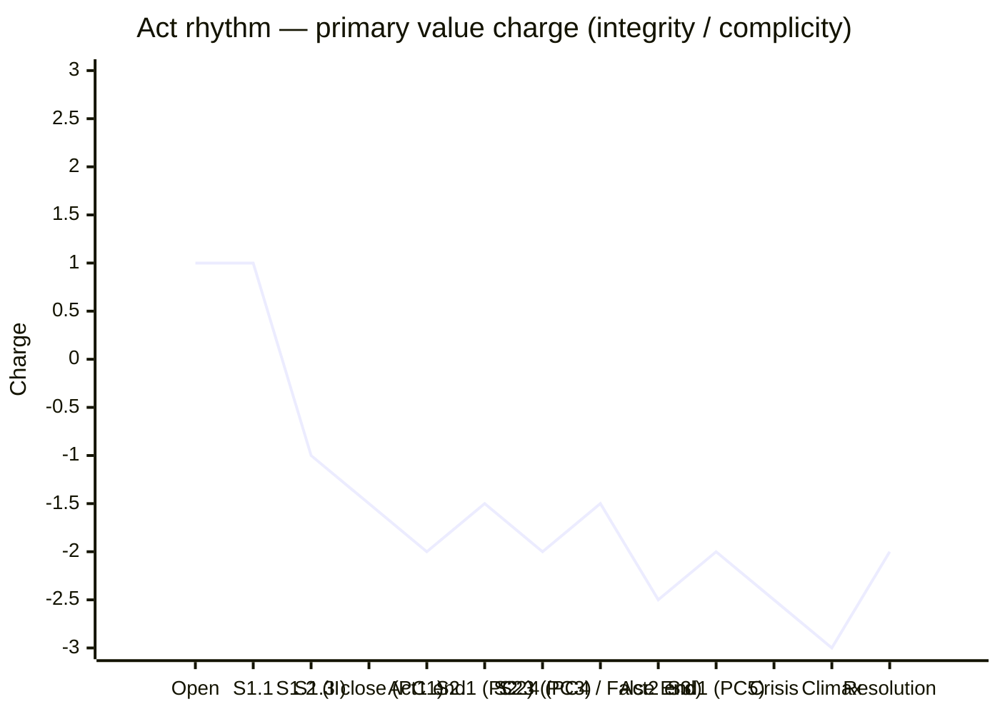

# Act Design — The Third Day

## 1. Why this act count

**Three acts.** The spine has a single ticking clock (three days = three acts feels mechanical and is *avoided* — the days do **not** map 1:1 to acts; the acts cut *across* days at the structurally correct turning points). At four acts the work would soften into novelistic sprawl that the institutional-claustrophobia tone cannot survive; at two acts the Crisis-Climax distinction collapses. Three acts gives us: Act 1 = the trap closes; Act 2 = the protagonist tries every door; Act 3 = the final day. Genre-aligned: institutional procedural drama at feature-length almost always reads cleanest in three.

## 2. Act-by-act map

### Act 1 — *The Trap Closes Around Her*

- **Sequences (3 total)**:
  1. **Sequence 1.1 — The morning of Day 1.** Dramatic question: *Will Yu Min get through the day's manifests cleanly?* Answer: yes-but (she finds the discrepancy in the last manifest of the afternoon).
  2. **Sequence 1.2 — The Discovery.** Dramatic question: *Can the discrepancy be explained without implicating Wei?* Answer: no (her own logbook holds his signature; the match is unambiguous).
  3. **Sequence 1.3 — The first night.** Dramatic question: *Will she file the 24-hour report by morning?* Answer: no-and-furthermore (Lin Xue reveals the office already knows; the reporting rule is itself the racket's mask).
- **Spine events covered**: Inciting Incident (S1.2 close), PC1 (S1.3 close).
- **Act-end turning point**: **Day 1, 22:30 — Yu Min returns to her apartment, sets the manifest copy beside her bed, and her mother knocks with bone broth; Yu Min hides the manifest under her pillow.** The visible event is the hiding; the irreversible turn is that the secret has *crossed the threshold of her home*. Now there is no clean institutional venue for filing — the issue lives in her body.
- **Value reversal at act end**: institutional confidence + → −, large magnitude. Inner: belonging in the family + → − (she has her first secret from her mother).
- **Point of no return closed**: "I can return to Day 0 — the day before discovery." The discovery is now domestic; it cannot be re-institutionalized cleanly.
- **Pressure increase for next act**: the 24-hour reporting clock has expired without a clean filing; everything she does in Act 2 is now retroactively suspicious.
- **Arc landmarks landing here**: Yu Min's **First Crack** (Landmark 2) lands at the Inciting Incident — the moment her hand on her mother's shoulder is the same hand that holds the manifest copy under the pillow.

### Act 2 — *Every Door She Tries*

- **Sequences (4 total)**:
  1. **Sequence 2.1 — Day 2 morning.** Dramatic question: *Can Yu Min draft the report under cover of routine work?* Answer: no (her mother arrives at the customs gate with dumplings; the saving-story is redoubled in front of Wei).
  2. **Sequence 2.2 — Day 2 noon to mid-afternoon.** Dramatic question: *Can Yu Min find a non-confrontational route — a pliable peer, an outside auditor, a procedural workaround?* Answer: no (Lin Xue raises the prior look-the-other-way moments; her moral high ground erodes).
  3. **Sequence 2.3 — The Private Confrontation (PC3, Scene 14).** Dramatic question: *Will Wei give her the dialogue she needs to file?* Answer: no — and the endorsement is in her bag.
  4. **Sequence 2.4 — Day 2 evening through Day 3 dawn.** Dramatic question: *Can she file truthfully tonight, alone, before anyone else acts?* Answer: no — Lin Xue arrives at 06:30 with the Tianjin transfer offer.
- **Spine events covered**: PC2 (S2.1), PC3 (S2.3 = Scene 14), beginning of PC4 (S2.4 close).
- **Act-end turning point**: **Day 3, 09:15 — Yu Min refuses the Tianjin transfer and asks Lin Xue why; Lin Xue's reply: "I took it once. Nobody escapes Wei. They escape themselves."** The visible event is the refusal; the irreversible turn is that the *escape itself* has been revealed as the corruption Lin Xue chose. There is no clean "leave."
- **Value reversal at act end**: agency + → −, largest magnitude yet (greater than Act 1 end). She entered Act 2 believing she had four or five doors; she leaves it knowing every door she has tried *was* the trap.
- **Point of no return closed**: "I can leave." Combined with Act 1's closed door, no escape route remains.
- **Pressure increase for next act**: the only path remaining is forward — into Act 3's final day, with the bureau security officer about to arrive.
- **Arc landmarks**: Yu Min's **Mid-arc revelation** (Landmark 3) lands at S2.3 close (Scene 14, Wei's signed endorsement) — she sees, for the first time, that no third path exists.

### Act 3 — *The Final Day*

- **Sequences (3 total)**:
  1. **Sequence 3.1 — Day 3 morning to early afternoon.** Dramatic question: *Will Yu Min find a fourth path the previous acts missed?* Answer: no — she drafts and re-drafts; the bureau security officer arrives at 14:00 (PC5) and asks the question that closes the timeline.
  2. **Sequence 3.2 — Day 3 14:00 to 17:35: the Crisis.** Dramatic question: *Which manifest will Yu Min file?* Answer: she sees, at 17:35, that she has authored a third document — a falsified manifest with her own retroactive exemption, ready to be sealed; she has no name for what she is about to do, but she has prepared for it without admitting to herself she was preparing.
  3. **Sequence 3.3 — Day 3 17:35 to 18:01: the Climax.** Dramatic question: *Will the seal land?* Answer: yes. The 18:00 whistle. She walks out at 18:01 carrying nothing.
- **Spine events covered**: PC5 (S3.1), Crisis (S3.2), Climax (S3.3). Resolution coda follows.
- **Act-end turning point**: **The Climax itself.** The two stamps, the whistle, the empty-handed walk-out.
- **Value reversal at act end**: integrity / complicity + → −, **largest magnitude in the story** (greater than Act 1 end *and* Act 2 end). Confirmed by `crisis-climax-audit.md` §2.
- **Point of no return closed**: institutional record is permanent; the seal is irrevocable.
- **Arc landmarks**: Yu Min's **Crisis revelation** (Landmark 4) at S3.2 (the manifests on the desk, the dream returning) and her **Climactic action** (Landmark 5) at S3.3 (the second seal landing).

### Resolution coda — *Six Months Later*

Single sequence, single scene, ~2 minutes. Outside the act count proper. Carries Obligatory Scene 6 (Replication Image) and the Key Image candidate.

## 3. False Ending

- **Location**: end of Act 2 — Sequence 2.4's morning beat, Day 3 06:30. The Tianjin transfer offer.
- **What it appears to resolve**: it appears to offer Yu Min a clean exit — leave the city, leave the institution, leave the trap. For ~ five minutes of screen time the audience believes the spine could resolve via *escape*: the protagonist disappears into Tianjin and the racket goes uncovered but Yu Min is morally unstained. This is a complete-feeling resolution.
- **What the final reversal then overturns**: Lin Xue's line — "I took it once. Nobody escapes Wei. They escape themselves." — overturns the False Ending by revealing that *the escape itself was Lin Xue's corruption*. Lin Xue is who Yu Min would have become if she had taken the offer. The "clean exit" is exposed as another version of the same trap.
- **Why this story earns it**: the Genre Contract demands an Offered Escape obligatory scene. Without the False Ending, the offered escape is procedural — *with* it, it becomes the story's most painful beat: the audience felt the relief and now sees the relief as compromised. This deepens the Idea: gratitude becomes its own corruption *because* every escape route is itself a corruption. The False Ending is structurally necessary, not flourish.

## 4. Rhythm chart (Mermaid)

Each act-end magnitude beats every sequence-end inside it: Act 1 end (−2) > Inciting Incident & PC1 (−1, −1.5); Act 2 end (−2.5) > PC2 & PC3 & PC4 (−1.5, −2, −1.5); Act 3 end / Climax (−3) > PC5 & Crisis (−2, −2.5). Monotonic act-end escalation: −2, −2.5, −3. No plateau longer than 2 sequences at the same charge. The False Ending in S2.4 produces a temporary recovery (−1.5) before the Act 2 close drives deeper than the recovery's high point — exactly what makes a False Ending function rather than ornament.

## 5. Subplot accounting

| Subplot | Carrier characters | Where it threads in/out | How it amplifies the main spine |
|---|---|---|---|
| Lin Xue's prior corruption (her past escape and what it cost her) | Lin Xue | Threads in: S1.3 (the dumplings revelation). Threads out: Act 2 end (the line "they escape themselves"); cameo absence in Resolution. | Embodies the Counter-Idea on a *different axis* than Wei. Wei represents loyalty as the reason for corruption; Lin Xue represents *escape* as itself a corruption. The two together close the moral perimeter. |
| Yu Min's mother's unwitting alliance with Wei | Mother | Threads in: S2.1 (the dumplings at the gate). Threads out: implicit in Resolution (mother is not in the coda; her absence is felt). | Personal-level antagonism by way of love. The mother's role is to make the saving-story irrevocable in the present. |

No romance subplot — recommended omission per `yu-min.md` §10.

## 6. Seven-Point Act Audit

- [x] **Act count justified** — three acts; not by genre default but by the spine's content (the trap, the doors, the final day).
- [x] **Every act end is an event** — Act 1: hiding the manifest under the pillow; Act 2: refusing the Tianjin transfer + the line "they escape themselves"; Act 3: the seal landing.
- [x] **Act 1 ends at or near Inciting Incident** — Inciting Incident is at S1.2 close; Act 1 end is at S1.3 close (one sequence later). The slight delay is justified: the Inciting Incident is the *discovery*, but the irrevocable commitment is the *hiding*, when the secret crosses the domestic threshold. McKee permits this when the protagonist's commitment lags the inciting event by less than one sequence.
- [x] **Final act contains Crisis and Climax** with breathing room — Crisis at S3.2 (17:35), Climax at S3.3 close (17:58). 23-minute story-time gap; ~ 8 minutes of screen time. *Confirmed by crisis-climax-audit.md*: the gap must be filled with small physical actions designed at the beat level.
- [x] **Sequences cohere** — each has one dramatic question with a single answer.
- [x] **Rhythm escalates** — act-ends: −2, −2.5, −3, monotonic. False Ending recovery is internal to Act 2 and does not flatten across acts.
- [x] **Respects duration and genre** — three acts at ~ 110 minutes feature length, institutional procedural texture; nothing overspent.

## 7. Open questions for the writer

- Confirm the Resolution coda is a *single* scene cutting to one ambient final image, not two scenes. (Per crisis-climax-audit.md §5: layered single beat.)
- Sequence 2.2's "non-confrontational route" search currently has Lin Xue raising prior look-the-other-way moments. Should a peer-inspector other than Lin Xue carry that beat to keep Lin Xue's role focused on the False Ending? *(Recommend: Lin Xue carries both. She is Yu Min's foil; concentrating the foil amplifies it.)*
- Sequence 3.1 is currently 4 hours of story-time (10:00–14:00) with a single PC. Should it be broken into 2 sequences? *(Recommend: keep as one sequence; the texture of "she drafts and re-drafts" is the point.)*

## 8. Handoff

`→ scene-architect` to break each sequence's dramatic question into 2–5 scenes (Scene 14 already exists for S2.3).
`→ beat-miner` to design the 23-minute Crisis→Climax window at the beat level.
`→ key-image-curator` to formalize the stamps-and-seals image system across all three acts.
