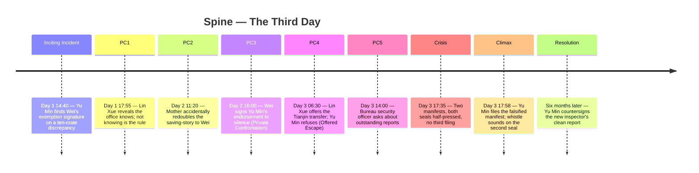

# Spine — The Third Day

## 1. Position on the Story Triangle

**Archplot.** Single active protagonist (Yu Min); causal chain (each Progressive Complication closes off escapes that the previous opened); closed ending (the Climax delivers a final, irrevocable choice). External time is linear; consistent reality (no flashbacks beyond a single dream-fragment in Crisis). The ironic Controlling Idea is *compatible* with archplot — irony lives in the *content* of the Climax, not in structural fragmentation. (We considered miniplot for the inner-conflict bias, but the institutional procedural texture and the ticking three-day clock want archplot's causal rigour.)

## 2. Major Dramatic Question

> **Will Yu Min file the truthful manifest report and end Wei's racket — or will she protect him at the cost of becoming the new face of the corruption?**

The MDQ is answered at the Climax, **ironically**: she "protects" him by *taking the racket onto herself*. She does not simply suppress the truth; she actively re-files the manifests so that the racket's next cycle runs through *her* signature. The MDQ closes; the Idea proves.

## 3. The Five Load-Bearing Events

| Slot | Event (one concrete in-world action) | Value charge before → after | Level of conflict reached |
|---|---|---|---|
| **Inciting Incident** | **Day 1, 14:40.** Yu Min, cross-checking a re-routed bonded shipment from Hong Kong, finds a ten-crate discrepancy that resolves only one way: the prior night's exemption letter was Wei's. She matches the letter to his signature in her own logbook. | + (institutional confidence, professional pride) → − (institutional confidence shattered; she is alone with knowledge that implicates the man who saved her family) | inner + extra-personal |
| **Progressive Complications** | **PC1 — Day 1, 17:55.** She intends to file the 24-hour discrepancy report by morning; at the dumplings restaurant after work, peer-inspector Lin Xue tells her, casually, about Wei's "arrangements" — Lin already knows; the office already knows; not knowing is the rule. (Forces of antagonism reach **personal** level — colleague pressure.)  **PC2 — Day 2, 11:20.** Yu Min tries to draft the report; her mother arrives at the customs gate to bring her dumplings and accidentally mentions to Wei (who passes) that the father's last wish was for Yu Min to apply on Wei's recommendation. The saving-story redoubles. (Personal antagonism intensifies; backstory weaponized.)  **PC3 (Mid-Act 2) — Day 2, 16:00.** Wei calls Yu Min into his fourth-floor office for the routine pre-posting interview. He does not mention the discrepancy. He talks about her father. He signs her endorsement letter in front of her. **The Private Confrontation** (Obligatory Scene 2) — the truth between them, held in silence; he neither denies nor pleads; she cannot extract dialogue. (Inner level fully engaged; extra-personal compounds — the endorsement is now a condition of her posting.)  **PC4 — Day 3, 06:30.** Lin Xue finds Yu Min before shift and tells her there's a transfer slot in Tianjin she could take, no questions asked, leave by tonight; Wei would not be told. **The Offered Escape** (Obligatory Scene 3). At 09:15 Yu Min realizes she will not take it. She asks why; Lin Xue says, "I took it once. Nobody escapes Wei. They escape themselves." (False ending of agency: she sees that the offered escape is itself the corruption Lin Xue chose.)  **PC5 — Day 3, 14:00.** A bureau security officer arrives at the customs house unannounced and asks Yu Min directly whether she has any reports outstanding from the past 48 hours. Surveillance has caught up. She has **less than four hours** until the 18:00 whistle to file something — true or false. (All three levels of conflict simultaneously engaged for the first time.) | each PC: alternating value charge with escalating magnitude, ending PC5 at deepest negative | inner / personal / extra-personal — by PC5 all three at once |
| **Crisis** | **Day 3, 17:35, third-floor inspection office, alone.** Yu Min sits with two manifests on her desk. The first is the truthful one — Wei's exemption signature visible, the racket exposed. The second is one she has drafted herself in the last hour — a falsified manifest that closes the discrepancy by reassigning the ten crates to her own signed exemption, retroactively dated. Both have her seal half-pressed. The Crisis is the moment she sees that **both** possible filings will destroy what she came into the office to protect. (She entered the office to protect *herself* — her professional integrity. She now sees that integrity is the artefact of the saving-story; protecting it means filing the truthful report and ruining Wei; protecting Wei means becoming him. There is no third filing.) The dream from her college years returns: signing a document she cannot read. | poised at full negative; both options carry permanent loss | inner + personal + extra-personal |
| **Climax** | **Day 3, 17:58.** Yu Min files the *falsified* manifest. The image: her seal pressed twice — once for the inspector's stamp, once forging Wei's countersign by re-using a paper she pulled from his earlier endorsement. The 18:00 whistle sounds as the second seal lands. She walks out at 18:01 carrying nothing. | final flip — she has crossed; the value charge is now − at maximum, but in the institutional reading it is "+" (the racket is preserved, the posting is hers). The irony lands in this exact mismatch. | all three |
| **Resolution** | **Six months later, March 1990, third-floor office, morning.** Yu Min, now permanent, watches a new young inspector hand her a clean report on a routine shipment. Yu Min reads it, picks up her pen, *signs alongside* — her seal next to the new inspector's. Wei, in the corridor, glances in and nods once. The young inspector smiles at the recognition. Yu Min meets her eyes for one beat too long. Cut to: the harbor, the same 18:00 whistle, sounding over an empty third floor. | settled at the corruption's perpetuation; the Idea is dramatized | personal → extra-personal (the system absorbing the next person) |

## 4. Timeline (Mermaid)

## 5. Eight-Point Skeleton Audit

- [x] **Five slots filled with concrete events** — every slot is a single, datable, in-world action.
- [x] **Inciting Incident commits the protagonist** — once she has matched Wei's signature in her own logbook, she cannot un-know; the institutional rule (24-hour reporting) commits her irrevocably.
- [x] **Major Dramatic Question answerable at Climax** — the MDQ is answered ironically by the seal pressing down.
- [x] **Crisis is a true dilemma** — both filings cause permanent loss of what she came in to protect; removing either horn destroys the meaning of the other.
- [x] **Climax flows from Crisis decision** — she has *recognized* in Crisis that there is no third filing; the Climax is the action that follows from that recognition. No coincidence, no rescue.
- [x] **Progressive Complications progress** — each PC closes an escape (PC1 closes "the office will help me"; PC2 closes "the personal cost is small"; PC3 closes "I can confront him"; PC4 closes "I can leave"; PC5 closes the timeline itself). Each PC reaches further into the levels of conflict; PC5 engages all three.
- [x] **Triangle position is internally consistent** — single active protagonist, causal chain, closed ironic ending; archplot affirmed.
- [x] **Spine proves the Controlling Idea** — the value clause ("gratitude becomes its own corruption") is dramatized by the seal pressing the false signature; the cause clause ("when the saved cannot bear to ruin the savior") is dramatized by the chain of refusals (PC4) leading to that act.

## 6. What this spine forbids

1. **No Beijing-inspector-arrives** in any act — the dilemma is hers.
2. **No public exposure scene** — concealment is the Climax.
3. **No final reconciliation between Yu Min and Wei** — they cannot speak in the Resolution; he must merely *nod* and pass.
4. **No mother's-eye coda** — the family must not learn the truth; ironic Resolution requires their continued belief in the saving-story.
5. **No widening to the smuggling network's HQ** — the racket-broker is named once and never seen.
6. **No 18:01 reprieve** — the whistle has authority; the Climax's exact timing is non-negotiable.

## 7. What this spine demands

1. **Three uses of the 18:00 whistle** as time-marker (PC1 close, Climax, Resolution coda).
2. **The dumpling restaurant** appears in PC1 and is implicit in PC2 (mother brings dumplings) — the only neutral ground; it must look identical in both scenes.
3. **The two-seal motif**: setup at Inciting Incident (Wei's exemption signature), payoff at Climax (Yu Min forging the countersign).
4. **Lin Xue (peer-inspector) requires real screen time** in PC1, PC4, and the Resolution coda — `cast-balancer` must promote her to principal.
5. **The dream-fragment** (backstory fact 5) returns in the Crisis as a present-tense moment — `scene-architect` must design that beat.
6. **Wei must speak the Counter-Idea persuasively** in PC3; he must be a credible moral antagonist, not a villain.

## 8. Open questions for the writer

- Should the Resolution coda include any sound from Yu Min — a single line — or remain silent on her side? *(Recommend silent. Her voice in the Resolution would soften the irony.)*
- Is the dream-fragment in Crisis kept abstract (an unreadable document) or made specific (the falsified manifest itself)? *(The unreadable version is stronger; the audience completes the symbol.)*
- Does Wei know what Yu Min did at the Climax, or does he believe she found the network without him in it? *(Per Controlling Idea §6: he does **not** know. The Idea sharpens.)*
- Final image: Yu Min countersigning the new inspector's report (current draft), or the harbor empty at 18:00 (alternate)? *(Both. Layer them — the countersign as the literal final beat, the empty harbor as the cut-to.)*

## 9. Handoff

`→ act-designer` to slice this spine into 3 acts (recommended: 3, with PC3 as the Mid-Act 2 / End-of-Act 2 turn depending on how the duration distributes; lean Act 2 end at PC4 so that Act 3 = the final day's morning + afternoon + the Crisis/Climax).
`→ arc-tracer` to pin Yu Min's five landmarks onto these spine events.
`→ cast-balancer` to formalize Wei, Lin Xue, the mother, and the bureau security officer as the principal cast.
`→ antagonism-stress-tester` once the cast is locked.
