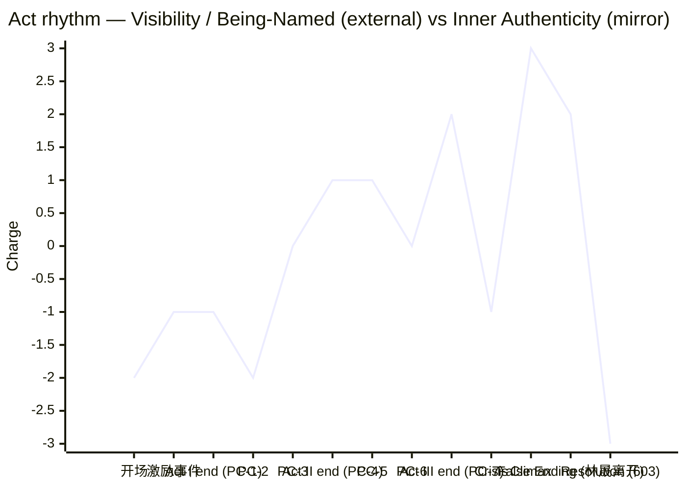

# Act Design — 错号 / Wrong Account

## 1. 为何采用四幕 / Why four acts

中篇小说体量（6–8 万字）对单一三幕结构而言第二幕过长——典型的 50–60% 中段会形成节奏塌方；但五幕又会让本剧的内心独白线（PC-3 → PC-5 → PC-6 的递进）被切断成碎片。**四幕**让我们把经典三幕的 Act 2 在 **中点反转（PC-4，玄机阁招募）** 处一切为二，把"否定之否定走上舞台"的 PC-5/PC-6/PC-7 单独成幕——这是本剧最深、最不能压缩的部分。三幕会把 PC-5 埋掉；五幕会把楼道危机的逼近感稀释。四幕也对齐了 McKee Ch.9 关于"长篇小说的 Act 2 可在 Midpoint 处升格为新的幕界"的提示。

幕数选择由脊椎内容决定，不是类型默认：仙侠—幻灭—身份讽刺的混合契约要求 **PC-5 的诱惑章独立成幕**，这是本剧的结构必要条件。

---

## 2. 幕节奏总览 / Act-by-act overview

| 幕 | 功能 | 场景跨度 | 入幕电荷 | 出幕电荷 | 出幕转折点 |
|---|---|---|---|---|---|
| 第一幕 / Act I | 不可见 → 被错认却被看见（合同签订） | 激励事件 → PC-1 | −2（不可见） | −1（被错名但首次被看见，矛盾态） | PC-1：美团账号冻结，**陈默**这个凭证被世界回收 |
| 第二幕 / Act II | 矛盾深化 → 出现"成为魔尊"的真实路径 | PC-2 → PC-4 | −1 | +1（外部）／ −2（内部）（中点反转：路径打开） | PC-4：苏寒留下他送餐区的菜单，**第二条门打开** |
| 第三幕 / Act III | 否定之否定走上舞台 → 旁观者受伤迫使他必须二选一 | PC-5 → PC-7 | +1／−2 | +2（外部上升）／ −3（内心最深，几乎接受） | PC-7：陌生老太太被卷入殃及——**他不能再悬置** |
| 第四幕 / Act IV | 危机 → 高潮 → 结局 | 危机 → 高潮 → 结局 | −3 | 表层 +3 / 真实 −3（讽刺） | 高潮：他在对讲机里说出工号；结局：603 室门关上 |

---

## 3. 逐幕地图 / Act-by-act map

### 第一幕 / Act I — *合同签订：被错名却首次被看见*

- **跨度**：开场（pre-Inciting 隐形铺垫）→ 激励事件（6 楼门口） → PC-1（账号冻结）
- **入幕电荷**：−2（前期隐形）
- **出幕电荷**：−1（被错名 = 矛盾态：有名字但不是他的）

**序列 1.1 — "没有人在等的城市" / The city no one waits in**（2 场景）
- 戏剧问题：*Will Chen Mo 在第三年的隐形里坚持完今天这两单外卖？*
- 答案：yes-but——他完成订单，但**被惩罚式遗忘**（差评、客户不抬头、夜雨）
- 包含场景：开场送餐蒙太奇（一单）；他在车上吃冷掉的别人的饭（一单）
- 序列结束转折：他接到 6 楼那一单的派单提示
- **种植**：契约 §9 第 6 条要求的 pre-incident 隐形戏（必须在结局回响）；App 名字栏第一次出现（背景中）

**序列 1.2 — "你好，请问你是魔尊·墨渊吗？" / Hello, are you Demon Lord Mò Yuān?**（3 场景）
- 戏剧问题：*Will Chen Mo 让七位修真者相信他不是魔尊，今晚在这条走廊里？*
- 答案：no-and-furthermore——他不仅没说服他们，连**自我陈述权**都被系统剥夺
- 包含场景：激励事件本身（敲门 → 林晟摘耳机 → 那句台词）；走廊对峙；他试图打开美团 App 自证
- 序列结束转折：**PC-1**——App 显示"账号已冻结·身份冲突·关联账号「墨渊」·评级 0"
- **种植**：林晟摘耳机的慢动作（误导锚 #1）；App 名字栏第二次（这次是冻结画面，主轴第 1 次有意义出现）

**Act I 出幕转折点 / Act I end**：PC-1 —— **美团账号冻结**
- 不可逆性：他失去的不是工作机会，而是"我是陈默"的唯一行政凭证。回到隐形也不再可能——隐形需要凭证；他现在连隐形都不被允许。
- 主价值翻转：可见性 −2 → 矛盾态 −1（被错名 = 半可见）。Magnitude ↑↑
- 关闭的回头路：他不能再做那个"什么都不算"的送餐人；旧身份已被世界单方面注销
- 下一幕压力升级：他必须**外向寻找人证**（→ 姐姐 → 林晟 → 苏寒），每一次寻找都让他离"魔尊"路径更近
- 弧光落点：**陈默"我是谁"的本能反应仍是出示凭证**——这是他的旧自我，第四幕高潮时他会再用同一种工具（工号），但意义已经被掏空

**场景数估计**：5 场景 × 3,000–4,500 字 ≈ 15,000–22,500 字（约占总量 22–28%）

---

### 第二幕 / Act II — *寻找证人，反而打开了反派的门*

- **跨度**：PC-2（姐姐认不出）→ PC-3（拉面馆 47 分钟）→ PC-4（苏寒登门）
- **入幕电荷**：−1
- **出幕电荷**：外部 +1（被认真对待）／内部 −2（饥渴暴露，路径打开）—— **这是中点反转**

**序列 2.1 — "姐，你是不是压力很大？" / Sis, are you under stress?**（2 场景）
- 戏剧问题：*Will 陈佳在屏幕和弟弟的脸之间认出陈默？*
- 答案：no-and-furthermore——她不仅没认出，还**温柔地误诊**他精神状态
- 包含场景：他去陈佳的公寓楼下买水果（前置：他在小区门口被保安拦——又一次身份失败）；姐姐家客厅，电视上的悬赏直播在背景里循环
- 序列结束转折：他离开姐姐家，第一次意识到"血亲也不构成人证"
- **种植**：契约 §10 第 6 条要求的"血亲不会再回来"承诺；隐形的范围从陌生人扩张到至亲

**序列 2.2 — "否认阶段。预期。" / Denial stage. Expected.**（3 场景）
- 戏剧问题：*Will Chen Mo 在凌晨三点的拉面馆把林晟说服，让他承认抓错了人？*
- 答案：yes-but——他成功表达了否认，**but 林晟把"否认"写成了魔尊的台词**；他没说服任何人，却第一次被认真听
- 包含场景：他被林晟跟踪到拉面馆；47 分钟的盘问（中段 Moleskine 翻页特写）；他答完第三个问题后没起身——他坐直了，喝了水
- 序列结束转折：**PC-3** 完成；他走出拉面馆时已经感到饥渴的开口，但还未意识到
- **种植**：Moleskine 物理展示（不展示无名字）；契约 §9 第 4 条的诊断"惯例规则——系统对宣告性言语作出响应"必须在此或下一序列首次浮现（建议：林晟在记录时复诵答句，系统短暂震一下——为高潮的对讲机机制铺垫）

**序列 2.3 — "墨渊大人，您不必装" / Lord Mò Yuān, you needn't pretend**（2 场景）
- 戏剧问题：*Will 玄机阁说服陈默他们的招募是真的，而不是另一种威胁？*
- 答案：yes-but——他们不是威胁，但提供的是**另一个错名**；这反而比威胁更危险
- 包含场景：苏寒和两个玄机阁成员在他出租屋门口（不是冲进来，是按门铃）；她递出那张外卖菜单；她说完那句话，留电话，不等回答就走
- 序列结束转折：**PC-4**——他独自留在屋里，菜单放在桌上；他没扔
- **种植**：菜单背面的电话（误导锚 #4）；契约 §9 第 1 条要求的**魔尊力场首次浮现**——建议放在本序列结尾：苏寒离开后，屋内的某件小物（一只碗、一盏灯）短暂呈现魔尊覆盖层的视觉痕迹（非他主动施为）。这建立"力场存在"的事实，为 Act 4 高潮"放弃力场"提供有重量的对照。

**Act II 出幕转折点 / Act II end**：PC-4 —— **苏寒留下他送餐区的菜单**
- 不可逆性：他现在拥有"成为魔尊"的**具体电话号码**——这不是隐喻，是一张纸。即便他不打，那张纸的存在本身就把"路径"变成现实地理。
- 主价值翻转：外部从矛盾态被推升一格（被一个理解他的人识别）；内部从矛盾态下沉一格（饥渴有了具体出口）。**外部上 / 内部下** = 中点反转的双向运动。Magnitude ↑↑（净加深）
- 关闭的回头路：他不能再假装"只有一边在抢我"。两边都来过了，他必须选——或者第三条路。
- 下一幕压力升级：他会打那个电话（→ PC-5）。读者也知道他会打——这是误导强化点 #2。
- 弧光落点：**饥渴从隐喻变成动词**——他真的伸手摸过那张菜单

**场景数估计**：7 场景 × 3,000–4,500 字 ≈ 21,000–31,500 字（约占总量 30–38%）

---

### 第三幕 / Act III — *否定之否定走上舞台*

- **跨度**：PC-5（天台）→ PC-6（早餐）→ PC-7（公寓楼大战 + 旁观者受伤）
- **入幕电荷**：外部 +1 / 内部 −2
- **出幕电荷**：外部 +2（被两边都视为关键人物）／内部 −3（接近接受错名）

**序列 3.1 — "你做的事，世界终于看见了" / The world has finally seen what you do**（3 场景）
- 戏剧问题：*Will 陈默在停车场天台对苏寒说"是"？*
- 答案：yes-but（**这是误导的最高潮**）——他没说不，他也没说是；他说了"你们什么时候要我？"。文本上这不是"是"，但读者的期待会把它读作"是"
- 包含场景：他打电话（极短）；爬天台的过程（电梯故障 → 楼梯 → 屋顶门，他第一次走上自己城市的某个高处）；天台主戏：苏寒的台词、文件夹（被改写为反派编码的善行）、那根烟的沉默
- 序列结束转折：**PC-5**——他下天台，下行电梯里他没看自己的手机；这是他第一次"不在工作中"的等待
- **种植**：苏寒的诊断台词（误导锚 #5 + 真实读法浮现点 #2）；那根烟的时长（误导锚 #6）；契约 §8 第 2 条要求"沉默是他的"——苏寒必须在中段停止说话

**序列 3.2 — "墨渊先生，你愿意吃豆浆还是咸豆浆？" / Mr. Mò Yuān, would you like sweet or savory soy milk?**（2 场景）
- 戏剧问题：*Will 林晟在道歉、在送早餐、在认真对待陈默之后，问出他的名字？*
- 答案：no-and-furthermore——他不仅没问，他**带来了一个"人道主义投降方案"**，整个方案里依然没有"陈默"这个词
- 包含场景：早晨 6:30，林晟在他楼下；他们坐在小区花坛边吃早餐，林晟翻 Moleskine 给他看"我们重新评估了你的行为模式"
- 序列结束转折：**PC-6**——林晟离开，陈默看着自己手里的豆浆杯，第一次意识到"温柔的版本仍然是消除"
- **种植**：Moleskine 第二次出现（依然没有名字）；契约 §9 第 5 条要求的"善意 = 同等抹除"在此完成；这是 **False Ending 的前置情绪点**——读者在此感到"故事好像在向温和方向收束"

**序列 3.3 — "楼里有人受伤了" / Someone in the building is hurt**（3 场景）
- 戏剧问题：*Will 两派的冲突在陈默的公寓楼里以"无人受伤"的方式收场？*
- 答案：no-and-furthermore——一位老太太（他送过几十次餐的客户）被殃及；并且**陈默在混乱中短暂触发了魔尊力场，仍然没能救她**
- 包含场景：正道联盟突袭（白天，七人或更多）；玄机阁赶来"护主"（建筑里的对峙）；交火 → 老太太受伤 → 陈默冲上前 → 力场短暂被动激活（仙侠力场展示，契约 §9 第 1 条主要落点）→ 仍然不够 → 救护车 → 老太太在担架上看了他一眼，**没认出他**
- 序列结束转折：**PC-7**——他在救护车关门时握了门把手；这是全书第一个"血"的时刻
- **种植**：契约 §9 第 1 条的核心交付（力场被使用、被见证、然后被否定其有效性，为 Climax 的"放弃力场"积累分量）；契约 §6 第 3 条要求的"派系对决"必须在这里做足类型奖赏

**Act III 出幕转折点 / Act III end**：PC-7 —— **老太太被殃及，魔尊力场失效**
- 不可逆性：(1) 已经有第三者流血——他不能假装这只是关于"名字"的问题了；(2) 他用过了力场——他已经知道力场是什么、做不到什么；这取消了"接受魔尊身份就能保护人"的最后说服力
- 主价值翻转：外部从 +1 升至 +2（两派都把他当主角）；内部从 −2 降至 −3（他理解到两条路都无法保住他人）。**Magnitude ↑↑↑（迄今为止最大）**
- 关闭的回头路：他不能再悬置在两个电话之间——一个无辜的人已经付出代价
- 下一幕压力升级：危机的两通电话立即开始响（Act IV 开场即 02:14 楼道）
- 弧光落点：**他第一次真正知道魔尊力场是什么——并且知道它救不了那个不认识他的人**

**场景数估计**：8 场景 × 3,000–4,500 字 ≈ 24,000–36,000 字（约占总量 35–40%，**全书最深最长的一幕**）

---

### 第四幕 / Act IV — *危机 → 高潮 → 结局*

- **跨度**：危机（楼道）→ 高潮（对讲机）→ 结局（14 天后 603 室）
- **入幕电荷**：外部 +2 / 内部 −3
- **出幕电荷**：表层 +3（正确命名 / 行政胜利）；真实 −3（讽刺的空洞已完全显形）

**序列 4.1 — "六分钟没动" / Six minutes without moving**（2 场景）
- 戏剧问题：*Will Chen Mo 在六分钟的楼道沉默里选择哪一个名字？*
- 答案：yes-and（双重）——他选择陈默，并且**选择的方式不在两个电话里，而在第三个媒介——对讲机**
- 包含场景：02:14 楼道（烟雾、苏寒在一个手机上、林晟的方案在另一个手机上）；他下蹲，靠墙，把两个手机放下；他看墙上的对讲机
- 序列结束转折：**危机解决** —— 他站起来按对讲机
- **种植**：契约 §9 第 3 条要求的"宣告性语言响应系统"规则在 Act 2 已铺设——此处兑现；契约 §9 第 4 条的对讲机不能是首次出现（要在 Act 1 序列 1.2 走廊里被一笔带过——可加入"楼内对讲机故障"的小广告作为视觉锚）

**序列 4.2 — "我是陈默。外卖员。工号 887423." / I am Chen Mo. Delivery rider. ID 887423.**（2 场景）
- 戏剧问题：*Will 系统接受他的自我宣告，让魔尊覆盖层脱落？*
- 答案：yes（外部完全胜利，**这是 False Ending 触发点**）—— 系统响应，覆盖层脱落，林晟说出"……陈默先生？对不起。"，两派撤退
- 包含场景：他对着对讲机说话（A 段）；楼下空了，林晟在楼梯上对他说出名字然后离开（B 段，**False Ending 的高峰**）
- 序列结束转折：**Climax 完成（外部）**；情感曲线在此处给读者一个"故事结束了"的错觉——错觉持续约一个序列长度
- **种植**：契约 §6 第 1 条的最高优先必备场景（与最强对手面对面）兑现，但以反类型方式（不是决斗）；契约 §10 第 3 条"夺回的名字不能感觉胜利"——林晟离开的节奏是关键

**序列 4.3 — "放门口就行" / Just leave it at the door**（2 场景）
- 戏剧问题：*Will 14 天后回到岗位的陈默，在 603 室那扇门口被认出来？*
- 答案：no——结构上**回答的是另一个戏剧问题**：故事的真实主控思想问题——"被正确命名能否填上无名的伤口？"。回答：no。
- 包含场景：14 天后接单蒙太奇（极短，App 上名字栏第 3 次出现，停留时间最长）；603 室门口（敲门、开门、"放门口就行"、关门、楼道里一口气、下楼、再接单）
- 序列结束转折：**结局** —— 主控思想以图像形式落地；不被任何角色说出
- **种植**：契约 §6 第 6 条的**不可让步必备场景**；契约 §9 第 5 条"结局必须是完整场景而非尾声"——必须给陈默一个微小的内在动作（建议：他在门关上后，差点对着关闭的门说自己的名字，然后没说）

**Act IV 出幕转折点 / Act IV end**：结局图像 —— **App 名字栏 = 陈默；门关上**
- 不可逆性：主控思想被戏剧化；故事问题被回答；两极同时落地
- 主价值翻转：表层胜利已在 Climax 兑现；本幕真正的转折是**意义的翻转**——读者发现 Climax 不是高潮的位置，结局才是。这是 [[false-ending]] 的对偶完成。
- Magnitude：**全书最大**——Climax 给出 +3（外部），结局把内部曲线压到 −3 并把两条曲线之间的"裂口"显形为主控思想本身

**场景数估计**：6 场景 × 2,500–4,000 字 ≈ 15,000–24,000 字（约占总量 22–28%）

---

## 4. False Ending — 位置与机理

- **位置**：序列 4.2 末尾——**林晟在楼梯上说出"……陈默先生？对不起"然后离开**
- **它表面上解决了什么**：故事的外部戏剧问题（"陈默能否洗清自己不是魔尊？"）以**完全胜利**的方式解决。系统纠错、敌方撤退、第一次有人叫出他的真名。所有合同里的外部约定都履约完毕——契约 §6 的必备场景 #1 已交付。
- **结局的最终反转推翻了什么**：推翻的不是"他赢了"——他确实赢了。推翻的是**"赢"这个词在本剧中意味着什么**。603 室那扇门的回应（"放门口就行"，不抬头）证明：他赢回的不是"被认识"，而是"重新有资格不被认识"。这是讽刺极性的最终戏剧化。
- **为何本剧配得上 False Ending**：
  1. 主控思想要求两极同时在场——单一 Climax 无法承担"夺回 / 空洞"的并置；
  2. 类型契约同时承诺仙侠胜利和幻灭终局——必须**先交付胜利**才能让幻灭有重量；
  3. 误导计划（misdirection-plan.md）的所有种植项的"回读触发"都被安排在第二触发点——结局的 603 室门口；如果没有 False Ending，那些种植项无法获得共同的兑现舞台。

False Ending 的风险：林晟离开的节奏（不能太快——残忍；不能太慢——戏剧化）；Climax 与结局之间的 14 天跳跃必须以蒙太奇方式呈现，**不能用旁白填空**。

---

## 5. 节奏图 / Rhythm chart

主价值（"可见性 / 被命名" — 用 −3 到 +3 表示：+3 = 被真正认识；0 = 中性；−3 = 完全无名）

**读法**：外部"可见性"线（上述折线）在 PC-3 后开始上升，到 Climax 触顶（+3）；False Ending 略降（林晟离开本身就是再一次被遗弃）；结局**断崖式**跌至 −3——这是讽刺。读者主观期待的曲线（与本曲线在 PC-5 处分叉）会假设 +3 路径来自"接受魔尊"，结果真实曲线给了 +3 又收回 +3，并暴露 0 才是 Chen Mo 真正能拿到的最高位置——而 0 就是他开场的状态。

**节奏检查**：
- Act I 出幕（PC-1）幅度：+1 单位反转
- Act II 出幕（PC-4，中点反转）幅度：+2 单位反转（双向：外部上 / 内部下）
- Act III 出幕（PC-7）幅度：+1 外部 / −1 内部，但**情境的不可逆性**最强（流血）—— **质性的升级**
- Act IV 出幕（结局）幅度：从 Climax 的 +3 跌至结局的 −3 = **6 单位的纵深**，全书最大

每一幕的幕终幅度都大于该幕内任一序列终，且每一幕终的幅度不小于前一幕——满足 [[act-rhythm]] 要求。

---

## 6. 副情节核算 / Subplot accounting

| 副情节 | 承担角色 | 进 / 出 | 如何放大主脊椎 |
|---|---|---|---|
| 林晟的"善意之眼" / Lin Sheng's well-meaning blindness | 林晟 | 激励事件入 → Act III 序列 3.2 完成 → Climax 落地 | 把"被错名却被看见"具象化为单人弧；他的不问名字是主控思想的**人格化载体** |
| 苏寒的"准确诊断" / Su Han's accurate diagnosis | 苏寒 | Act II 序列 2.3 入 → Act III 序列 3.1 完成 | 把"否定之否定"具象化为人；她的台词是误导计划的最高承载 |
| 陈佳的"温柔误诊" / Chen Jia's gentle misreading | 陈佳 | Act II 序列 2.1 一次性 → 不再回归 | 兑现契约 §10 第 6 条；让"血亲不构成人证"被戏剧化而非陈述 |
| 老太太（603 楼附近） / The old woman | 无名邻居 | Act III 序列 3.3 入（首次有戏） → 结局回响（**不是同一人**——结局的 603 是新住户） | 让"路人也不会认识他"在 PC-7 显形为流血；让结局的"放门口就行"显形为同一种结构的常态版本 |

无浪漫副情节（契约 §10 与脊椎 §8 禁止）。

---

## 7. 七点幕审计 / Seven-Point Act Audit

- [x] **幕数有理由**：四幕由 PC-5 必须独立成幕这一脊椎要求决定；三幕会埋掉中部，五幕会切碎否定之否定。
- [x] **每个幕终都是事件**：PC-1（账号画面）、PC-4（菜单）、PC-7（受伤的老太太）、结局（关上的门）—— 全部是具体可见的物理事件，含主价值反转 + 关闭回头路 + 提升下一幕压力。
- [x] **Act I 在激励事件附近闭幕**：Act I 闭于 PC-1，正是激励事件激起的第一个不可逆后果（系统冻结）。McKee Ch.9 允许的"激励事件 + 紧跟的首个 Point of No Return"模式。
- [x] **最后一幕含危机 + 高潮，留有呼吸**：危机在序列 4.1（六分钟沉默）；高潮在序列 4.2 开头（对讲机宣告）；False Ending 在序列 4.2 末（林晟离开）；结局在序列 4.3。**Crisis → Climax 之间的"六分钟"是脊椎要求的呼吸**。
- [x] **序列内聚**：每个序列只问一个戏剧问题，并以 yes / yes-but / no / no-and-furthermore 之一作答。
- [x] **节奏递进无平台期**：四个幕终幅度依次为 +1、+2、+2（质性升级）、+6（纵深）；无相邻幕终幅度相等。
- [x] **匹配体量与类型**：6–8 万字中篇精确容纳 26 场景；类型契约的七项必备场景全部落入具体序列；False Ending 位置由仙侠胜利 + 幻灭终局的双契约共同要求。

**审计结果：PASS**。无失败项。

---

## 8. 场景数与字数估计 / Scene & wordcount estimate

| 幕 | 序列数 | 场景数 | 字数范围 | 占比 |
|---|---|---|---|---|
| Act I | 2 | 5 | 15,000–22,500 | 22–28% |
| Act II | 3 | 7 | 21,000–31,500 | 30–38% |
| Act III | 3 | 8 | 24,000–36,000 | 35–40% |
| Act IV | 3 | 6 | 15,000–24,000 | 22–28% |
| **合计** | **11** | **26** | **75,000–114,000（目标 60,000–80,000）** | — |

**调整方向**：目标 60,000–80,000，则每场景平均 2,300–3,100 字。具体配比建议 Act III 维持最长（其内部曲线承载最多），Act I 与 Act IV 压缩至 5–6 场景偏短，Act II 居中。**Act IV 的序列 4.3（结局）必须是完整场景而非压缩**——宁可在 Act II 减场景，不可在结局压字数。

---

## 9. 种植项落地核对 / Misdirection plant tracking

| 种植项 | 设置场景 | 兑现场景 | 落入序列 |
|---|---|---|---|
| 林晟摘耳机（慢） | 激励事件 | Climax（林晟说出名字） | 1.2 / 4.2 |
| Moleskine 本子（无名字） | PC-3 | PC-6（再次无名）+ 高潮回读 | 2.2 / 3.2 / 4.2 |
| App 名字栏 = 第 1 次（冻结） | PC-1 | App 第 2 次（恢复）+ 第 3 次（无人等） | 1.2 / 4.2 / 4.3 |
| 苏寒的菜单电话 | PC-4 | 第二遍读时浮现"她最了解他的世界" | 2.3 |
| 苏寒诊断台词 | PC-5 | 结局门关上时回响 | 3.1 / 4.3 |
| 一根烟的沉默 | PC-5 | （无显式回响——这是误导的强化点） | 3.1 |
| 林晟从未问名字 | PC-3 / PC-6 | Climax 第一次叫名字（迟到的姓名） | 2.2 / 3.2 / 4.2 |
| 楼内对讲机（次要锚） | Act I 序列 1.2 / Act III 序列 3.3 | Climax 机制（系统响应宣告） | 1.2 / 3.3 / 4.1 |
| 魔尊力场（被动小痕迹 → 旁观者救援失败） | Act II 序列 2.3 末 | PC-7 + 结局"放弃力场"的重量 | 2.3 / 3.3 |
| 系统对宣告性语言响应（规则铺设） | Act II 序列 2.2（林晟复诵答句时系统抖动） | Climax 兑现 | 2.2 / 4.2 |

所有种植项都被分配了**设置场景**和**兑现场景**。误导计划无遗漏。

---

## 10. 给写作者的开放问题 / Open questions

1. **第三幕长度确认**：Act III 占总量 35–40% 是否可接受？这是脊椎设计的必然，但作者需要确认在中篇体量里允许这个比例。
2. **力场展示的可见性**：契约 §9 第 1 条要求"力场可见"。建议方案是 PC-4 末（被动小痕迹）+ PC-7（旁观者救援失败）。是否接受这个分配？另一个方案是只放在 PC-7，但 PC-7 会变得过载。
3. **System rule planting**：建议在 Act II 序列 2.2（拉面馆）中加一个 1–2 行的小细节——林晟复述陈默的话时系统短暂抖动——以铺设 Climax 的对讲机机制。是否接受？（替代方案：放在 PC-4 末，让苏寒留言时系统抖动。）
4. **False Ending 的节奏**：林晟离开 → 14 天跳跃 → 603 室开场，这中段是否需要一个非常短（200–400 字）的过渡场景（例如：陈默回到出租屋，看着账号被恢复评级）？还是用纯蒙太奇？
5. **场景 1.1（开场隐形蒙太奇）的人数**：建议 2 场景（两单不同的"不被看见"），但也可以压成 1 个长场景。哪种更符合作者节奏？

---

## 11. Handoff

→ **`scene-architect`** — 把本文档的 11 个序列、26 个场景分解为场景卡。每张卡必须标注：所属序列、戏剧问题贡献、入场电荷 / 出场电荷、与种植项的对应关系。

如审计阶段发现 PC-5 或 PC-7 无法在 8 场景内承载（特别是 PC-7 的派系战 + 老太太受伤 + 力场展示三件事），先回到 `structure-skeleton` 重审脊椎，**不要**在场景层悄悄移动 PC-5 或 PC-7。

McKee 引用：Ch.9 [[act-rhythm]] / [[false-ending]] / [[progressive-complications]]、Ch.13 [[crisis]] / [[story-climax]] / [[resolution]]、Ch.14 [[negation-of-the-negation]]、Ch.10 [[setup-and-payoff]]。
