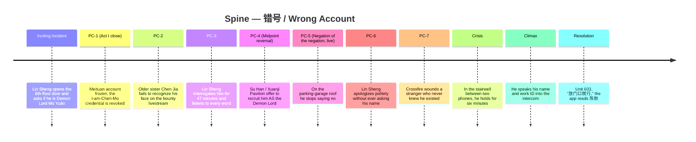

# Spine — 错号 / Wrong Account

> **Genre contract warning**: `drafts/wrong-account/genre-contract.md` does not exist. The genre stack (modern xianxia / game-invades-reality / identity satire / ironic dark comedy) is honored by this spine on the basis of the user brief, but obligatory-scene compliance is **unverified**. Recommend running `genre-cartographer` before locking.

---

## 1. Position on the Story Triangle

This spine sits on **[[archplot]]** with one deliberate tilt toward **[[miniplot]]** in the [[resolution]]. Archplot because: single active protagonist (Chen Mo), causal chain driven by his choices, closed ending in the sense that the [[major-dramatic-question]] is answered on the page, consistent reality (one fused game-and-city world).

The miniplot tilt: the [[resolution]] is **quiet, internal, and open-ended in affect** — the [[controlling-idea]] is ironic, so the closure is *value-wise* unresolved even though the *plot-wise* question is resolved (Ch.2, Ch.13). The final image is a non-event (no one waits at the door), which McKee allows under archplot only because the irony is *earned by causal pressure*, not by withholding.

Trade-off: a pure archplot reader who expects the "hero earns recognition" payoff will feel cheated. That is correct — the [[idea-vs-counter-idea]] requires it.

---

## 2. Major Dramatic Question

> 陈默能否在林晟与正道联盟的剑下、在系统冻结的外卖账号的逼迫下、在"终于被人看见"的诱惑面前，**证明自己不是魔尊墨渊**——代价是重新变回那个无人记得的送餐人？
>
> Will **Chen Mo** **prove he is not Demon Lord Mò Yuān** against **Lin Sheng's hero-narrative, the Righteous Alliance's blades, and his own dawning hunger to be seen**, at the cost of **returning to invisibility**?

The Climax answers this **yes — and the answer is hollow**. (See Ch.6 ironic ending; Ch.13 [[meaning-produces-emotion]].)

---

## 3. The Five Load-Bearing Events

### Act structure overview (4 acts for novella)

| Act | Function | Charge at exit |
|---|---|---|
| I | Inciting Incident → first commitment | − → contradiction (misnamed but seen) |
| II | Progressive complications, world closes in | contradiction → temptation rising |
| III | Negation of the negation as live choice | temptation → near-acceptance |
| IV | Crisis → Climax → Resolution | flips to + externally, − internally |

### The Spine Table

| Slot | Event (concrete in-world action) | Value charge: before → after | Level of conflict reached |
|---|---|---|---|
| **Inciting Incident** | Day 3 of the invasion, 6th floor walk-up, 18:47. Chen Mo knocks three times holding two bubble teas and one box of fried chicken. Lin Sheng opens the door, removes his earbuds, and says: *"你好，请问你是魔尊·墨渊吗？我们想和你谈一谈。"* Seven Righteous Alliance cultivators stand in the hallway behind him. | invisible (−) → misnamed-but-seen (contradiction) | extra-personal (system) + personal (Lin Sheng) |
| **PC-1** (Act I close) | Chen Mo tries to log back into 美团 to prove he is a delivery worker. The app shows: *账号已冻结·身份冲突·关联账号「墨渊」·评级 0*. His only "I am Chen Mo" credential has been revoked by the world. He sits on a curb and eats the cold fried chicken meant for unit 602. | contradiction → contradiction deepens (no exit door) | extra-personal (system locks him in) |
| **PC-2** (Act II early) | Chen Mo goes to his older sister Chen Jia (陈佳)'s apartment to ask her to vouch for him. She opens the door, sees his face on a livestream behind her — *正道联盟悬赏墨渊真人现身视频* — and asks, gently, *"你最近……是不是压力很大？"* She does not recognize that the face on the screen is his. | contradiction → contradiction deepens (kin fails to see) | personal (family) |
| **PC-3** (Act II mid) | Lin Sheng tracks Chen Mo to a 24-hour 兰州拉面 at 03:00, sits across from him, and conducts a 47-minute interrogation about Demon Lord lore Chen Mo has never heard of. Lin Sheng records every answer in a Moleskine. When Chen Mo says *"我真的不是,"* Lin Sheng nods seriously and writes: *"否认阶段。预期。"* For the first time someone is *listening to every word Chen Mo says.* Chen Mo answers two more questions before he realizes he doesn't want to leave the table. | contradiction → temptation surfaces (inner) | inner (first crack) + personal |
| **PC-4** (Act II close / mid-point reversal) | A second cultivator faction — the 玄机阁 (Xuanji Pavilion), a smaller, older sect run by a 52-year-old woman named **Su Han (苏寒)** — arrives at Chen Mo's rented room. They do not want to kill him. They want to *recruit him* as the Demon Lord. Su Han says: *"墨渊大人，您不必装。装得越像，他们越觉得您本来就是。"* She leaves a phone number on the back of a takeout menu. The menu is from his own dispatch zone. | temptation surfaces → temptation viable (an actual path opens) | extra-personal (faction) + inner |
| **PC-5** (Act III early — the negation-of-the-negation scene, live) | Chen Mo calls Su Han. They meet on the roof of a parking garage. She does not ask him to perform; she hands him a paper folder of "Demon Lord" deeds attributed to him over the past 72 hours — kindnesses, refusals, small mercies the world has rewritten as villain-coded. She says: *"你做的事，世界终于看见了。只是它叫你魔尊。"* Chen Mo opens his mouth to say *"我是陈默"* — and does not. He stands there for the length of one cigarette. He says, finally: *"你们什么时候要我?"* This is not yet a yes. It is the moment he *stops saying no.* | temptation viable → near-acceptance (the negation of the negation walks on stage as a real option, not a passing thought) | **inner (deepest)** |
| **PC-6** (Act III mid — the unexpected wedge) | Lin Sheng appears at Chen Mo's apartment building, alone, at 06:30, in his school uniform, holding two breakfasts from 永和大王. He has come to apologize: he has reviewed footage and admits Chen Mo *might not be performing.* He still believes Chen Mo is the Demon Lord — but he now believes the Demon Lord is *also* a person, and offers a "humane" surrender plan. He does not know Chen Mo's actual name. He has never asked. He says, brightly, *"墨渊先生，你愿意吃豆浆还是咸豆浆?"* | near-acceptance → the trap of the negation becomes visible (even the kind version still erases him) | personal + inner (clarification) |
| **PC-7** (Act III close — the squeeze) | The Righteous Alliance leadership, impatient with Lin Sheng's delay, attacks Chen Mo's apartment building. The 玄机阁 arrives to defend "their" Demon Lord. A bystander on the 4th floor — a stranger, an old woman Chen Mo has delivered to dozens of times — is hurt in the crossfire. She does not recognize him either, in the ambulance, when he holds the door. The world's fight over his name has produced a wound on someone who never knew he existed. | near-acceptance → forced to choose (he cannot stay between names) | extra-personal (catastrophe) + personal |
| **Crisis** (Act IV open) | 02:14 in a stairwell between the 8th and 9th floor of his own building, smoke in the hallway, Su Han on one phone, Lin Sheng's surrender protocol on the other. The dilemma — **two irreconcilable goods, not lesser evils**:  **(a)** Accept the Demon Lord identity, walk out with Su Han, gain the only form of being-seen ever offered him, save no one but himself, ratify that 陈默 was never real.  **(b)** Refuse both names — speak the words *"我是陈默，外卖员，工号 887423"* into the building's emergency intercom that the system is forced to register — recover the legal identity, but accept that the recovery is *administrative*, that the people who came for him will leave, that the seven faces that knew his face will forget it within a week.  Chen Mo does not move for 6 minutes. | poised between contradiction and negation-of-the-negation | **inner (terminal)** — all three levels collapse into this one choice |
| **Climax** | Chen Mo presses the intercom and says, calmly, *"我是陈默。外卖员。工号 887423. 北区站点。这个楼里没有魔尊。"* The building system pings the platform, which pings the game-system fusion layer; the identity conflict resolves in his favor; the Demon Lord overlay drops from his account. The Righteous Alliance lowers weapons. Lin Sheng, on the stairs, says — for the first time — *"……陈默先生?"* and then, after a pause, *"对不起。"* The 玄机阁 retreats. The value-charge of the spine flips: misnamed-but-seen → correctly-named. | flips to **+** externally; the **−** undertow begins to surface | extra-personal resolved; inner now exposed |
| **Resolution** | 14 days later. The platform reinstates Chen Mo's account at evaluation 4.7. He accepts an order: 麻辣烫, two cups of 柠檬茶, delivery to a 6th floor walk-up — the same building, a different door, unit 603. He climbs the stairs. He knocks three times. The door opens. A woman in her 40s glances at the bag, takes it without looking at his face, says *"放门口就行,"* and closes the door. Chen Mo stands in the hallway for one breath. He checks the app. The name on the screen reads: **陈默**. He walks down. He accepts the next order. | settled: **+** externally (correctly named), **−** internally (invisible again) — **ironic** | all three levels resolved into the steady-state hollow |

---

## 4. Timeline (Mermaid)

---

## 5. The Gap — what Chen Mo expected vs. what happened, per event

(Per Ch.7 [[the-gap]]: every event must open a gap between subjective expectation and objective result. The gap is the engine.)

| Event | Expected (subjective) | Got (objective) | Gap-fuel for next event |
|---|---|---|---|
| Inciting Incident | A normal delivery. Tip or no tip. | Seven cultivators, his face misnamed, the door opens *for him.* | Disorientation forces him to test the system → PC-1 |
| PC-1 | Logging in proves he is Chen Mo. | The system has *withdrawn his only proof.* | He must seek a human witness → PC-2 |
| PC-2 | Family will see him. | His sister sees the *livestream Chen Mo* and not the real one — and is gentle in the wrong way. | He stops trusting his own face → PC-3 |
| PC-3 | Lin Sheng is the enemy; he should escape. | Lin Sheng is *listening to him,* the first listener in years. | The inner crack opens → PC-4 |
| PC-4 | The hunt is one-sided. | A second faction wants him alive *as the Demon Lord.* The trap door opens downward. | A path now exists → PC-5 |
| PC-5 | He will refuse on the roof. | He does not refuse. He pauses. The pause is the choice not-yet-made. | The negation-of-the-negation is on the table → PC-6 |
| PC-6 | If anyone returns to the truth, it will be Lin Sheng. | Lin Sheng returns — *and still does not ask his name.* The kind version is the same erasure. | He understands no path through "being the Demon Lord" preserves Chen Mo → PC-7 |
| PC-7 | The fight is about him. | The fight is about *the name*; bystanders take wounds; he is a venue, not a subject. | He is forced into Crisis |
| Crisis | One of the two options will be obviously right. | Both are losses. The choice is between *being seen and being false* or *being true and being gone.* | He has to act → Climax |
| Climax | Naming himself will restore him. | Naming himself *administratively succeeds* but the room empties of the only people who came for him. | The hollow opens for Resolution |
| Resolution | (No expectation — that is the point.) | Unit 603, no recognition, the app reads 陈默. | (Spine closes. Controlling Idea lands.) |

---

## 6. Causal Chain (therefore / but — no "and then")

- Inciting Incident **— therefore —** Chen Mo tries to log in to prove who he is (PC-1).
- PC-1 reveals his credential is gone **— therefore —** he goes to his sister for human proof (PC-2).
- PC-2 reveals even kin do not see him **— but —** Lin Sheng *does* find him (PC-3), because to the world he is now the Demon Lord and the Demon Lord is findable.
- PC-3 plants the first crack **— therefore —** when Su Han arrives offering recruitment (PC-4) the offer is not absurd.
- PC-4 opens a real path **— therefore —** Chen Mo calls Su Han, climbs to the parking garage roof, and does not say no (PC-5).
- PC-5 puts him at the edge **— but —** Lin Sheng arrives with the kind, *humane* surrender that still does not include his name (PC-6), exposing that even the soft version of the Demon Lord identity erases Chen Mo.
- PC-6 reframes the choice **— therefore —** when the two factions collide (PC-7) Chen Mo cannot remain ambivalent: a bystander is wounded over his name.
- PC-7 forces him into the stairwell **— therefore —** the Crisis dilemma is unavoidable.
- Crisis **— therefore —** Climax: he speaks his name into the intercom.
- Climax **— therefore —** Resolution: the world returns to the steady state, but now we see what that steady state actually is.

No "and then" appears in this chain. Each link is *because-of*. (Ch.2, Ch.13.)

---

## 7. Eight-Point Skeleton Audit

- [x] **Five slots filled with concrete events.** Each has a named place, time, and physical action.
- [x] **Inciting Incident commits the protagonist.** After Lin Sheng asks the question, the platform freezes his account (PC-1), making retreat impossible. The world has already renamed him; he cannot un-be the Demon Lord by walking away.
- [x] **Major Dramatic Question answerable at Climax.** Answer is *yes, he proves it* — the system flips, Lin Sheng says his name — but the *value-charge* simultaneously inverts: ironic answer. Visible on the page in the intercom moment.
- [x] **Crisis is a true [[dilemma]].** Two irreconcilable goods: (a) be seen as the Demon Lord, or (b) be true as Chen Mo. Both have real positive content; both cost the other. Not lesser evils — *two genuine goods.* (Ch.13.)
- [x] **Climax flows from Crisis decision, not coincidence.** The intercom is set up at PC-7 (building emergency systems active because of the fight) and the choice to use it is *Chen Mo's,* not a deus ex machina. (Ch.13, Ch.16 [[coincidence]].)
- [x] **Progressive Complications progress.** Levels of conflict trace: extra-personal (II) → personal-extra (PC-2) → personal-inner (PC-3) → extra+inner (PC-4) → **inner-deepest** (PC-5) → personal+inner clarification (PC-6) → extra-personal catastrophe (PC-7) → **inner terminal** (Crisis). Each closes a [[points-of-no-return]]: account frozen, kin failed, listener found, path offered, no-not-said, name unasked, bystander wounded.
- [x] **Triangle position internally consistent.** Active single protagonist; causal chain; closed plot-question; consistent fused-reality world. The miniplot tilt is *only* in resolution affect — declared, not smuggled.
- [x] **Spine proves the Controlling Idea.** Climax dramatizes "身份被夺回" (he reclaims Chen Mo); Resolution dramatizes "却空洞" (door 603 does not see him) and "无名才是真正的伤口" (the wound was always invisibility, not misnaming). PC-5 dramatizes the negation-of-the-negation as a live option. The counter-idea (Lin Sheng's "authentic self underneath") is defeated by PC-6: Lin Sheng's *kind* version still erases Chen Mo.

**Audit: PASS** with the caveats listed in §10.

---

## 8. What this spine forbids

1. **No third-party rescue at the Climax.** The system cannot self-correct without Chen Mo's act. (Ch.16 — no [[coincidence]] at climax.)
2. **No villainous Lin Sheng.** Lin Sheng's earnestness is the engine of the irony; if he is cruel, the story degrades into melodrama. (Ch.16 [[melodrama]].)
3. **No on-screen Demon Lord powers used by Chen Mo for spectacle.** He may *manifest* small effects (the world is rewriting him), but the spine forbids a power-fantasy beat. The xianxia is the *frame,* not the payoff. Doing so would convert the negation-of-the-negation into wish-fulfillment and break the ironic polarity.
4. **No romantic subplot with Su Han or Lin Sheng.** The pull toward the Demon Lord identity must be *being-seen,* not love. A romance would re-route the desire and break the Controlling Idea.
5. **No final speech.** The Controlling Idea must be *dramatized* in the unit-603 image. No character may articulate it. (Ch.6 [[dramatize-dont-explain]].)
6. **No reunion with the sister Chen Jia after PC-2.** Returning to her would suggest there is a personal-life cure for invisibility. The spine's argument forbids that.
7. **No reveal that Chen Mo "always was" the Demon Lord.** That is the genre-conventional move and would *prove the counter-idea.* Forbidden.

---

## 9. What this spine demands (obligatory beats)

(Cross-reference forbidden until `genre-contract.md` exists. These are the spine's internal demands; genre obligations are separate.)

1. A scene in which Chen Mo physically *holds* a delivery he cannot deliver (PC-1's fried chicken; the unit-603 麻辣烫 at the end). The bag is the [[image-systems]] motif of his pre-Inciting identity. Recurs minimum 3 times.
2. A scene in which Lin Sheng *takes notes* on Chen Mo. (PC-3, plus echo in PC-6.) The notebook is the [[image-systems]] motif of being-seen-while-misnamed.
3. The phrase *"你好，请问你是魔尊·墨渊吗?"* must recur, transformed, at Climax (*"……陈默先生?"*). [[setup-and-payoff]] Ch.10.
4. The app interface — the literal name field on the delivery platform — must be shown at: Inciting (or PC-1: frozen), Climax (restored to 陈默), Resolution (still 陈默, still nobody waiting). It is the spine's tracked [[story-values]] indicator.
5. The bubble tea + fried chicken from Inciting Incident must be referenced or echoed in Resolution (the 麻辣烫 + 柠檬茶 to unit 603 is the deliberate mirror, one floor up, one door over).
6. A genre-obligatory **xianxia confrontation scene** — sect-vs-sect with swords/spells — must appear (PC-7 satisfies). Without it the modern-xianxia contract is broken.
7. A genre-obligatory **identity-satire scene** where the protagonist's institutional record contradicts his face. PC-1 (frozen account) and PC-2 (sister failing to match face to livestream) satisfy. Recommend at least one more in Act II/III.

---

## 10. Predicates that feel weak — diagnosis

This is the structure-skeleton's self-flagging. Each item below is *not yet broken,* but is a load-bearing predicate that the prose can fail.

1. **PC-2 (sister fails to recognize):** The spine asks the reader to accept that Chen Jia cannot match a livestream face to her own brother. **Risk:** reads as contrived; reads as melodramatic. **Diagnosis:** the prose must *plant* her relationship to him as already attenuated (years of him being "just the delivery guy" even in family chat). If this is not planted in Act I exposition, PC-2 collapses. → flag for `scene-architect` and `exposition-engineer`.

2. **PC-5 (he stops saying no on the roof):** The negation-of-the-negation depends entirely on the reader believing Chen Mo *almost takes the offer.* **Risk:** if Su Han is too overtly sinister, the temptation collapses into resistance and the spine loses its mid-point. **Diagnosis:** Su Han must be *kind, accurate, and unflattering — she sees him.* This is a casting/character problem more than a structure problem, but the spine cannot survive a Su Han who reads as villain. → flag for `character-architect`.

3. **PC-6 (Lin Sheng never asks his name):** Load-bearing detail. **Risk:** the reader may not notice. **Diagnosis:** Lin Sheng's name-blindness must be set up in PC-3 (he writes down *answers,* not the answerer's name) and paid off in PC-6 (still no name) and again at Climax (*"……陈默先生?"* — the first time). If not threaded, the Climax loses its turn. → flag for `scene-architect`.

4. **Crisis dilemma — "two irreconcilable goods":** The spine claims (a) being-seen-as-Demon-Lord is a *genuine good,* not a temptation to be dismissed. **Risk:** moral readers will treat (a) as obviously wrong and the dilemma collapses into a foregone conclusion. **Diagnosis:** by PC-5, the reader must have *felt* the pull themselves. If the prose has not made being-seen-as-Demon-Lord feel like a real good by then, the Crisis is fake. This is the spine's single highest-risk predicate. → flag for `prose-stylist` and `theme-auditor`.

5. **Resolution image (no one at the door):** The Controlling Idea lands entirely on the unit-603 beat. **Risk:** readers want catharsis; the beat may read as bleak rather than ironic. **Diagnosis:** the prose must give the moment *equilibrium,* not sadness. Chen Mo is not devastated at unit 603 — he is *restored to baseline.* The horror is in the baseline. Tone is everything; the spine cannot fix it alone. → flag for `prose-stylist`.

6. **Su Han's age and origin (52, woman, Xuanji Pavilion):** Spec-level invention by this agent. **Diagnosis:** I have given her a name and an age to make the negation-of-the-negation a concrete event rather than a label. The user is free to recast her — but a face-to-face human Demon Lord recruiter is **structurally required** for PC-4 and PC-5; she cannot be replaced by a faceless system. → flag for user confirmation.

---

## 11. Open questions for the writer

1. Confirm or recast **Su Han (苏寒)** and the **Xuanji Pavilion (玄机阁)** — the negation-of-the-negation needs a human face. Is she acceptable as introduced?
2. Confirm **older sister Chen Jia (陈佳)** as the family-failure beat (PC-2), or specify another relation (mother, college roommate, ex-girlfriend). The slot needs filling; the spine does not care which.
3. Is the **administrative Climax** (intercom + work ID) acceptable as the form of the value-flip? An alternative is a more visually xianxia climax (he renounces the Demon Lord in a sect-circle ritual). The administrative version is *truer to the Controlling Idea* (the wound is bureaucratic-invisibility); the ritual version is *more genre-satisfying.* Pick.
4. **Act 3 length:** the negation-of-the-negation (PC-5 → PC-6 → PC-7) is the spine's deepest section and likely the longest in scene-count. Confirm this is acceptable for a 4-act novella (≈ 25–35% of total wordcount).
5. **Genre contract:** `genre-contract.md` does not exist. Recommend running `genre-cartographer` before locking this spine.

---

## Handoff

**Next agent: `genre-cartographer`** — to produce `drafts/wrong-account/genre-contract.md` and verify the obligatory scenes (modern-xianxia confrontation; identity-satire institutional-mismatch; ironic comedy mortification beat). After that, `act-designer` to break this spine into the 4-act act-rhythm (Ch.9 [[act-rhythm]]) before scene-work.

McKee citations used: Ch.2 [[structure]], Ch.6 [[controlling-idea]] / [[idea-vs-counter-idea]] / [[dramatize-dont-explain]], Ch.7 [[the-gap]] / [[object-of-desire]], Ch.8 [[inciting-incident]] / [[major-dramatic-question]], Ch.9 [[progressive-complications]] / [[points-of-no-return]] / [[act-rhythm]], Ch.10 [[setup-and-payoff]], Ch.13 [[crisis]] / [[dilemma]] / [[story-climax]] / [[resolution]] / [[meaning-produces-emotion]], Ch.14 [[negation-of-the-negation]], Ch.16 [[coincidence]] / [[melodrama]], Ch.18 [[image-systems]].
