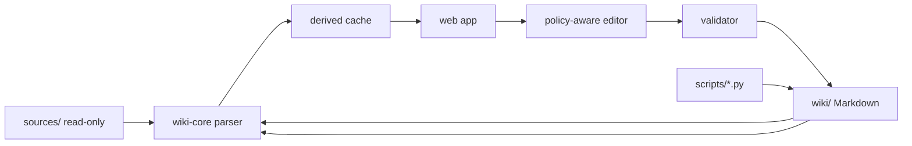

# Web Application Implementation Plan

## 1. Executive Summary

The project is no longer just a folder of notes. It is a bilingual, schema-governed knowledge base for Robert McKee's *Story*, with immutable source material, mirrored EN/ZH wiki trees, structured frontmatter, canonical terminology, atomized quotes, graph diagrams, operation logs, and deterministic maintenance scripts.

The web application should not replace the Markdown wiki. It should make the existing repository easier for humans to manage by adding a visual, validated, searchable, local-first interface over the current files. Markdown remains the source of truth; the app builds a derived index/cache, exposes rich reading and editing views, runs the existing maintenance workflows safely, and prevents the common mistakes that the current `CLAUDE.md`/`AGENTS.md` policies warn about.

Recommended direction: build a local-first Next.js/React app under a new `app/` directory, backed by a Node filesystem adapter and a deterministic `wiki-core` parser/validator package. Use a derived cache for speed, but write all durable content back to the existing Markdown files.

## 2. Current Project Understanding

### 2.1 Repository Roles

The repository has three active knowledge layers:

| Layer | Path | Role | Write Policy |
|---|---|---|---|
| Raw sources | `sources/` | Immutable human-curated source material: chapter notes, supplementary essays, film material, assets | App must never modify |
| Generated wiki | `wiki/` | Bilingual, interlinked, LLM-maintained knowledge base | App may edit only through policy-aware workflows |
| Schema/tooling | `AGENTS.md`, `CLAUDE.md`, `wiki/CANONICAL.md`, `scripts/` | Operating contract, terminology, authorship rules, deterministic helpers | App should read and enforce |

There is also an older `implementation-plan.md`. Treat it as historical context for the original LLM Wiki concept. The new `plan.md` supersedes it for the web application.

### 2.2 Current Wiki Shape

Current manifest state, excluding `index.md`, `log.md`, and `MAP.md`:

| Dimension | EN | ZH |
|---|---:|---:|
| Total pages | 224 | 224 |
| Mirrored relative paths | Complete | Complete |
| `author: claude` pages | 213 | 213 |
| `author: user` note pages | 11 | 11 |
| Required Mermaid blocks | Present | Present |

Page type distribution per language:

| Type | Count |
|---|---:|
| `application` | 3 |
| `chapter-summary` | 19 |
| `comparison` | 7 |
| `concept` | 74 |
| `entity` | 16 |
| `note` | 11 |
| `overview` | 1 |
| `principle` | 16 |
| `quote` | 68 |
| `structure` | 9 |

Importance distribution per language is centered on retrieval:

| Importance | Meaning | Count |
|---|---|---:|
| 5 | Foundational concepts and hubs | 23 |
| 4 | Major secondary pages | 55-56 |
| 3 | Standard wiki pages and most quotes/entities/chapters | 134-135 |
| 2 | User notes | 11 |

### 2.3 Content Model

The wiki is not flat Markdown. Important relationships are encoded in several ways:

1. Filesystem path: `wiki/{en,zh}/{type-dir}/{slug}.md`.
2. Frontmatter: `type`, `lang`, `chapter_refs`, `canonical_chapter`, `importance`, `author`, `last_verified`, `related`, `film_examples`, etc.
3. Wikilinks: `[[slug]]` and aliased forms.
4. Language toggles: EN pages link to `wiki/zh/...`; ZH pages link to `wiki/en/...`.
5. Mermaid diagrams: required on concepts, structures, principles, chapter summaries, comparisons, and overview pages.
6. Indexes: human-facing `index.md` and agent-facing `MAP.md`.
7. Logs: operation history in both languages.
8. Quote atoms: one quote per file in `wiki/{en,zh}/quotes/`.
9. Canonical reference: `wiki/CANONICAL.md` controls terminology, canonical chapters, conflict resolution, and authorship boundaries.

### 2.4 Operating Invariants

The app must enforce these invariants:

1. `sources/` is read-only.
2. Every wiki page must exist in EN and ZH with the same relative path.
3. Same-language wikilinks stay inside the current language tree.
4. The language toggle is the only normal cross-language link.
5. `wiki/{en,zh}/notes/` pages are `author: user`; substantive edits require explicit confirmation.
6. Non-note wiki pages are generated/maintained pages and can be edited by policy-aware workflows.
7. Page frontmatter must remain valid and complete.
8. Required page types must include Mermaid diagrams.
9. EN/ZH Mermaid topology should match even when labels differ.
10. `index.md`, `log.md`, and `MAP.md` must stay synchronized when structure changes.
11. `canonical_chapter` is the single source of definitional ownership for conflicts.
12. `importance` controls retrieval and ranking.
13. `last_verified` is distinct from `last_updated` and should be compared against source mtimes.
14. Kebab-case English filenames are mandatory.

### 2.5 Existing Scripts

The app should wrap, not duplicate blindly, existing deterministic scripts:

| Script | Current Role | Web App Use |
|---|---|---|
| `scripts/regen_map.py` | Regenerates EN/ZH `MAP.md` from frontmatter | Run after create/delete or importance/canonical changes |
| `scripts/atomize_quotes.py` | Extracts chapter notable quotes into quote pages | Run after chapter ingest or quote section updates |
| `scripts/update_frontmatter.py` | Bulk-adds required metadata fields | Reference logic for default importance/author/canonical values |
| `scripts/patch_canonicals.py` | One-off canonical patch | Historical migration only |

## 3. Product Goal

Build a web application for human knowledge management over this wiki.

The primary job is not "make a prettier Obsidian." It is to make the rules and relationships visible, searchable, and safe to change.

Core outcomes:

1. Humans can browse the McKee knowledge system by chapter, concept, structure, film, quote, application, and graph.
2. Humans can understand why a page exists: source, canonical chapter, related concepts, examples, diagrams, quotes, and logs.
3. Humans can edit wiki pages without breaking bilingual sync, frontmatter, wikilinks, Mermaid requirements, or authorship boundaries.
4. Humans can see quality problems before they accumulate: stale verification, dead links, missing mirrored page, missing quote translation, MAP drift, index drift, and diagram mismatch.
5. Humans can run safe maintenance operations from a UI: lint, regenerate maps, atomize quotes, append logs, and review proposed changes.

## 4. Target Users and Workflows

### 4.1 Human Reader

Wants to study McKee's framework.

Key workflows:

- Open a chapter and see its key concepts, examples, quotes, and cross-links.
- Switch EN/ZH instantly.
- Follow concept relationships without losing place.
- Search "gap", "鸿沟", "antagonism", or "对抗" and get weighted results.
- Browse all film examples that illustrate a concept.
- Read quote atoms anchored to the relevant chapter and concept.

### 4.2 Human Maintainer

Wants to keep the wiki clean as sources and notes grow.

Key workflows:

- See a dashboard of sync/validation health.
- Create a new paired EN/ZH page from a type template.
- Edit frontmatter through a form instead of raw YAML when possible.
- Preview Markdown, wikilinks, and Mermaid diagrams.
- Run lint and review fixes before writing.
- Regenerate `MAP.md` after structural changes.
- Append bilingual logs from a guided form.

### 4.3 Human Author

Wants to preserve personal notes while benefiting from generated synthesis.

Key workflows:

- View `author: user` note pages clearly marked as protected.
- Allow typo or dead-link fixes, but require confirmation for substantive note rewrites.
- Compare a personal note with generated concept pages it references.
- Convert a note insight into a proposed concept/application page without overwriting the note.

### 4.4 Agent/LLM Operator

Wants operational visibility.

Key workflows:

- Read `MAP.md` in app form.
- Inspect high-importance pages quickly.
- Find pages affected by a planned ingest.
- See canonical terminology while drafting.
- Produce proposed file patches for human review.

## 5. UX Plan

### 5.1 Information Architecture

Primary app areas:

1. Dashboard
2. Library
3. Reader
4. Search
5. Graph
6. Editor
7. Operations
8. Canonical
9. Sources

Suggested navigation:

```text
Dashboard
Library
  Chapters
  Concepts
  Structures
  Principles
  Characters
  Entities
  Comparisons
  Applications
  Quotes
  Notes
Search
Graph
Sources
Canonical
Operations
```

### 5.2 Dashboard

Show the current health of the knowledge base:

- Page count by language and type.
- EN/ZH mirror status.
- Missing required fields.
- Missing language toggles.
- Missing Mermaid blocks.
- Mermaid topology mismatches.
- Stale `last_verified` pages.
- Pages with source file newer than `last_verified`.
- Quote atoms with TODO translations.
- MAP/index/log drift.
- Recent operations from both logs.
- High-importance hubs.

Dashboard should be quiet and operational, not marketing-style. The first screen should answer: "Is the wiki healthy, and where should I work next?"

### 5.3 Library

The Library is a typed file browser with knowledge-specific filters:

- Type
- Chapter
- Importance
- Author
- Language
- Canonical chapter
- Last updated
- Last verified
- Has Mermaid
- Has film examples
- Has TODOs
- Has source

Each page row/card should show:

- Title
- Slug/path
- Type
- Canonical chapter
- Importance
- Last verified
- EN/ZH pair status
- Link count in/out
- Source link if available

### 5.4 Reader

Reader page features:

- Rendered Markdown.
- Side-by-side or toggle EN/ZH view.
- Sticky table of contents.
- Frontmatter inspector.
- Related concepts panel.
- Inbound links panel.
- Outbound links panel.
- Quotes anchored to this page/chapter/concept.
- Film examples.
- Source references.
- Mermaid diagram rendering.
- "Open raw Markdown" mode.
- "Edit" action gated by authorship policy.

Important reader behavior:

- `[[slug]]` links should resolve in the current language by default.
- Cross-language toggle should preserve the relative path.
- Broken links should render visibly, not fail silently.
- Concept aliases should be searchable and displayed.

### 5.5 Search

Implement weighted local search over the derived index.

Ranking inputs:

- Exact slug/title match.
- Alias match.
- Frontmatter fields.
- Headings.
- Body text.
- Quote text.
- `importance`.
- Canonical chapter.
- Page type.
- Language.

Search filters:

- Language: EN, ZH, both.
- Type.
- Chapter.
- Importance.
- Author.
- Source-backed only.
- Quote-only.
- User notes only.

Search results should show short context snippets, type, importance, chapter, and matching fields.

Recommended library: `MiniSearch` or `FlexSearch` for MVP. The corpus is small enough for client-side search after loading a prebuilt JSON index.

### 5.6 Graph

The graph should visualize multiple relationship classes:

1. Wikilinks from page body.
2. `related` frontmatter links.
3. `film_examples`.
4. `key_concepts`.
5. `concepts_illustrated`.
6. `chapter_refs`.
7. Quote anchors.
8. Canonical chapter ownership.

Graph features:

- Filter by type, chapter, importance, and language.
- Highlight high-importance hubs.
- Toggle edge classes.
- Show page details on node click.
- Open Reader from node.
- Identify orphans and weakly connected pages.
- Show a chapter-centered subgraph.
- Show a concept-centered ego graph.

Recommended library: `React Flow` for controlled node layouts or `Cytoscape.js` for graph analysis. For MVP, `Cytoscape.js` is a better fit because graph metrics and filtering matter more than manual diagram editing.

### 5.7 Editor

The Editor should be policy-aware, not a raw textarea alone.

Required editor capabilities:

- Paired EN/ZH editing workflow.
- Raw Markdown mode.
- Frontmatter form mode.
- Markdown preview.
- Mermaid preview.
- Wikilink autocomplete.
- Slug/path picker.
- Section template insertion by page type.
- Diff preview before save.
- Validation panel before save.
- "Update both indexes/logs/MAP" reminder or guided operation when structural changes occur.

Authorship gates:

- For `author: user` notes, allow safe typo/dead-link edits.
- For substantive note edits, require explicit confirmation with a warning.
- For generated pages, allow normal edits but validate against schema.

Save strategy:

- Use atomic writes.
- Preserve line endings and frontmatter formatting as much as possible.
- Never write outside `wiki/`.
- Never write inside `sources/`.
- After structural save, run validators and optionally `scripts/regen_map.py`.

### 5.8 Operations

Operations console:

- Run full lint.
- Run targeted lint for selected pages.
- Regenerate `MAP.md`.
- Atomize quotes.
- Generate missing page pair stubs.
- Append bilingual logs from a form.
- Compare generated index/MAP with checked-in versions.
- Show command output and changed files.

Operations must be review-first:

- Dry run by default for any bulk operation.
- Show planned changes.
- Require confirmation for writes.
- Never run destructive commands.

### 5.9 Canonical

Canonical view:

- Render `wiki/CANONICAL.md`.
- Extract terminology table into searchable rows.
- Show each term's canonical chapter.
- Link terms to corresponding concept pages when possible.
- Surface pages whose `canonical_chapter` conflicts with canonical table rules.
- Provide a workflow to propose new terminology rows.

### 5.10 Sources

Sources view:

- Read-only tree for `sources/`.
- Render Markdown/HTML sources.
- Show source file mtime.
- Show wiki pages that cite each source.
- Show pages whose `last_verified` is older than source mtime.
- Provide "start ingest plan" action, but do not modify sources.

## 6. Technical Architecture

### 6.1 Recommended Stack

Use a TypeScript monorepo-style app:

```text
app/
  package.json
  next.config.ts
  src/
    app/
    components/
    features/
    lib/
      wiki-core/
      wiki-server/
      wiki-ui/
    tests/
```

Recommended dependencies:

- Framework: Next.js + React + TypeScript.
- Markdown parsing: `unified`, `remark-parse`, `remark-gfm`, `remark-frontmatter`, `remark-rehype`.
- Frontmatter: `gray-matter` plus YAML schema validation.
- Markdown rendering: `react-markdown` or compiled MD AST pipeline.
- Mermaid rendering: `mermaid` client-side with sanitized code.
- Search: `MiniSearch` or `FlexSearch`.
- Graph: `Cytoscape.js`.
- File watching: `chokidar`.
- Validation: `zod`.
- Testing: `vitest`, `playwright`.

### 6.2 Source of Truth

Markdown files remain authoritative.

Derived cache options:

1. MVP: `.wiki-cache/index.json`, regenerated on startup and file changes.
2. Later: SQLite cache for faster graph/search queries and operation history.

Do not store app-only authoritative copies of page content. The cache is disposable.

### 6.3 Data Flow



### 6.4 Core Modules

#### `wiki-core`

Pure parsing and validation. No React, no filesystem writes.

Responsibilities:

- Parse frontmatter.
- Parse headings.
- Parse wikilinks.
- Parse language toggles.
- Parse Mermaid blocks.
- Normalize page records.
- Build page pair records.
- Build graph edges.
- Build search documents.
- Run invariant checks.

#### `wiki-server`

Node-only filesystem and operation layer.

Responsibilities:

- Read allowed files.
- Watch file changes.
- Write Markdown atomically.
- Run scripts through controlled commands.
- Produce diffs.
- Enforce path allowlists.
- Prevent `sources/` writes.

#### `wiki-ui`

Reusable UI components.

Responsibilities:

- Page cards.
- Frontmatter inspector/editor.
- Markdown renderer.
- Mermaid renderer.
- Graph view.
- Search result list.
- Validation issue list.
- Diff viewer.

## 7. Data Model

Use explicit typed records.

```ts
type WikiLang = "en" | "zh";

type WikiPageType =
  | "application"
  | "chapter-summary"
  | "comparison"
  | "concept"
  | "entity"
  | "genre"
  | "index"
  | "log"
  | "note"
  | "overview"
  | "principle"
  | "quote"
  | "structure";

interface WikiPage {
  id: string;
  slug: string;
  lang: WikiLang;
  type: WikiPageType;
  relativePath: string;
  absolutePath: string;
  title: string;
  frontmatter: Record<string, unknown>;
  headings: Heading[];
  wikilinks: WikiLink[];
  mermaidBlocks: MermaidBlock[];
  body: string;
  stats: PageStats;
}

interface WikiPagePair {
  relativePath: string;
  en?: WikiPage;
  zh?: WikiPage;
  status: "complete" | "missing-en" | "missing-zh" | "mismatch";
}

interface WikiEdge {
  from: string;
  to: string;
  lang: WikiLang;
  kind:
    | "wikilink"
    | "related"
    | "film-example"
    | "key-concept"
    | "concept-illustrated"
    | "quote-anchor"
    | "canonical-chapter";
  source: "body" | "frontmatter" | "derived";
}

interface ValidationIssue {
  id: string;
  severity: "error" | "warning" | "info";
  code: string;
  message: string;
  relativePath?: string;
  field?: string;
  autofixAvailable: boolean;
}
```

## 8. Validation Plan

Validation is a first-class product feature.

### 8.1 File and Pair Validation

Checks:

- EN/ZH mirrored relative paths.
- Kebab-case filename.
- Allowed directory for page type.
- No wiki page missing frontmatter.
- `lang` matches tree.
- Language toggle exists and points to counterpart.
- `sources/` never modified by app operations.

### 8.2 Frontmatter Validation

Checks:

- Required keys: `title`, `type`, `lang`, `last_updated`, `last_verified`, `author`, `importance`, `canonical_chapter`, `tags`.
- Type-specific fields by page type.
- `author` is `user` for notes and generated author for non-notes.
- `importance` is 1-5.
- `canonical_chapter` is integer or explicit null.
- `chapter_refs` and `canonical_chapter` do not contradict.
- `source` path exists when provided.

### 8.3 Link Validation

Checks:

- Body wikilinks resolve within the same language tree.
- Cross-language wikilinks are limited to language toggles.
- Aliased wikilinks resolve correctly.
- Inbound/outbound graph can be built.
- Orphans are surfaced.

Important implementation note: do not treat Mermaid node labels as wikilinks unless they use actual `[[slug]]` syntax in Markdown outside fenced code. A naive regex will over-report false dead links from diagram labels.

### 8.4 Mermaid Validation

Checks:

- Required page types have at least one Mermaid block.
- Mermaid parses.
- EN/ZH counterpart diagrams have matching topology.
- `related` frontmatter entries appear in the diagram when required by policy.

Topology comparison should normalize:

- Node IDs.
- Edge count.
- Edge direction.
- Edge labels only if policy requires exact match.
- Ignore translated display labels.

### 8.5 Source Freshness Validation

Checks:

- If a page has `source`, compare source mtime to `last_verified`.
- If source is newer, mark stale.
- Chapter summary pages must cite a source.
- Quote pages should anchor to chapter pages.

### 8.6 Index and MAP Validation

Checks:

- Generated `MAP.md` equals disk version.
- `index.md` includes all non-quote/non-log pages expected by type.
- Structural changes trigger map regeneration.
- Logs exist in both languages.

## 9. Implementation Phases

### Phase 0: Preflight and Fixtures

Goal: establish the app workspace without changing wiki content.

Tasks:

- Create `app/` with Next.js, TypeScript, linting, formatting, and tests.
- Add `wiki-core` parser package.
- Build a fixture loader pointed at the current repo.
- Parse all current pages and reproduce baseline counts:
  - 224 EN pages.
  - 224 ZH pages.
  - 10 page types.
  - 68 quote atoms per language.
- Add tests for representative pages:
  - `wiki/en/concepts/the-gap.md`
  - `wiki/zh/concepts/the-gap.md`
  - `wiki/en/chapters/chapter-14-the-principle-of-antagonism.md`
  - `wiki/en/quotes/q-ch14-01.md`
  - one `notes/` page.

Exit criteria:

- App starts locally.
- Parser returns typed records for the full wiki.
- Baseline counts match.
- No files are written.

### Phase 1: Read-Only Human Browser

Goal: make the current wiki pleasant to read and navigate.

Tasks:

- Dashboard with counts and recent log summaries.
- Library view with filters.
- Reader view with Markdown, frontmatter, links, and Mermaid.
- EN/ZH toggle.
- Search index and result page.
- Basic graph view.
- Source read-only browser.

Exit criteria:

- A human can browse the entire wiki without Obsidian.
- `[[wikilinks]]` resolve in app.
- Search handles EN/ZH.
- Mermaid diagrams render.

### Phase 2: Validation and Operations Console

Goal: make wiki health visible and actionable.

Tasks:

- Implement validation checks listed in Section 8.
- Add validation dashboard.
- Add issue details with file/line references when available.
- Add dry-run wrappers for:
  - `scripts/regen_map.py`
  - `scripts/atomize_quotes.py`
- Add generated-vs-disk diff for MAP/index.
- Add stale source verification report.

Exit criteria:

- Full lint runs from UI.
- Issues are grouped by severity and type.
- MAP drift can be detected.
- No write operation runs without confirmation.

### Phase 3: Safe Editing

Goal: allow humans to edit pages without breaking project rules.

Tasks:

- Raw Markdown editor.
- Frontmatter form editor.
- Diff preview.
- Atomic save.
- Per-page validation before save.
- Paired EN/ZH workflow.
- New paired page wizard using page templates.
- Guided bilingual log appender.
- Confirm gate for `author: user` note edits.
- Wikilink autocomplete.
- Slug conflict prevention.

Exit criteria:

- User can edit a generated concept page and save valid Markdown.
- User can create paired EN/ZH stub pages.
- App refuses unsafe `sources/` writes.
- App warns before substantive note edits.
- Structural changes prompt MAP regeneration.

### Phase 4: Knowledge Workbench

Goal: support higher-level management and extension.

Tasks:

- Concept-centered workspace: definition, related pages, quotes, examples, source links, graph.
- Chapter ingest preparation view: source file, existing pages, candidate pages to update.
- Quote management view: chapter quote list, atom page status, missing ZH translations.
- Canonical terminology admin view.
- Comparison builder for creating paired comparison pages.
- Application/checklist builder for turning concepts into writing workflows.

Exit criteria:

- Human can plan an ingest from the app.
- Human can inspect all knowledge around a concept in one place.
- Quote translation TODOs are easy to find and fix.

### Phase 5: Agent-Assisted Drafting

Goal: make LLM-assisted changes reviewable rather than silent.

Tasks:

- Add "draft operation" model for proposed changes.
- Store proposed patches separately before applying.
- Show affected pages, diffs, validation issues, and log entries.
- Integrate with local LLM/agent workflow only after deterministic validation exists.
- Add rollback guidance using git diffs, not destructive commands.

Exit criteria:

- Agent-generated wiki updates can be reviewed in the web app.
- Human can accept/reject file-level changes.
- Validation runs before and after applying.

## 10. Testing Strategy

### 10.1 Unit Tests

Cover:

- Frontmatter parsing.
- Wikilink parsing.
- Language toggle parsing.
- Mermaid extraction.
- Type-specific schema validation.
- Path normalization.
- Search document generation.
- Graph edge generation.

### 10.2 Integration Tests

Cover:

- Full repository scan.
- Full validation pass.
- MAP generation parity with `scripts/regen_map.py`.
- Quote atomization dry-run behavior.
- Paired page creation in a temp fixture.
- Atomic save rollback on validation failure.

### 10.3 Browser Tests

Use Playwright for:

- Dashboard loads.
- Search returns `the-gap`.
- Reader renders EN/ZH pair.
- Mermaid diagram is visible.
- Graph is non-empty.
- Editor refuses invalid frontmatter.
- Note edit confirmation appears.

### 10.4 Regression Fixtures

Keep small fixture copies of:

- A concept pair.
- A chapter pair.
- A quote pair.
- A note pair.
- A malformed page.
- A missing counterpart page.
- A stale source page.
- A Mermaid topology mismatch pair.

## 11. Security and Safety

This is a local knowledge-management app, but filesystem safety still matters.

Rules:

- Restrict all writes to `wiki/` and app-owned cache files.
- Treat `sources/` as read-only.
- Use path allowlists and normalized paths to prevent traversal.
- Sanitize rendered Markdown and Mermaid.
- Disable arbitrary shell command execution from the UI.
- Only expose whitelisted maintenance scripts.
- Dry-run bulk operations by default.
- Preserve git visibility: every write should leave normal file diffs.

## 12. Performance Plan

The current corpus is small, so correctness matters more than premature optimization.

MVP approach:

- Parse on startup.
- Watch for file changes.
- Rebuild derived JSON cache incrementally if feasible, fully if not.
- Load search index client-side.
- Render graph with filtered subsets by default.

Expected scale:

- 224 pages per language today.
- Hundreds to low thousands of pages remain manageable with JSON cache and client-side search.
- If corpus grows beyond that, move derived cache to SQLite.

## 13. Open Decisions

These should be decided before implementation starts:

1. Should the app be local-only, or eventually support hosted multi-user access?
2. Should app code live in `app/` inside this repository or in a separate repository?
3. Should the MVP include editing, or ship read-only + validation first?
4. Should generated quote translations be editable in a dedicated quote workflow?
5. Should the app invoke LLMs directly, or remain a deterministic interface for external agents?

Recommended defaults:

1. Local-only first.
2. Put code in `app/` in this repo.
3. Ship read-only + validation before editing.
4. Include quote translation workflow in Phase 4.
5. Keep LLM invocation out of MVP; support reviewable patches later.

## 14. Risks and Mitigations

| Risk | Impact | Mitigation |
|---|---|---|
| App becomes a second source of truth | Wiki drift and data loss | Markdown remains authoritative; cache is disposable |
| Raw regex creates false dead-link reports | User loses trust in lint | Use Markdown AST and ignore fenced code |
| Editing breaks EN/ZH sync | Bilingual contract weakens | Paired-page model and pre-save validation |
| Notes are overwritten | User trust violation | `author: user` gate and explicit confirmation |
| MAP/index drift | Agents retrieve stale context | Automatic drift detection and regen workflow |
| Mermaid topology comparison is brittle | False positives | Normalize topology and ignore translated labels |
| Source freshness is ignored | Claims become stale | Compare `last_verified` with source mtime |
| LLM actions become opaque | Hard-to-review changes | Draft patch workflow with diffs and validation |

## 15. MVP Deliverables

The minimum useful product should include:

- `app/` Next.js workspace.
- `wiki-core` parser.
- Derived JSON cache.
- Dashboard.
- Library.
- Reader.
- Search.
- Basic graph.
- Full validation report.
- Read-only source browser.
- No content writes except cache files.

This MVP already makes the wiki easier to manage because it turns hidden structure into visible health, navigation, and retrieval.

## 16. Post-MVP Deliverables

After the read-only/validation foundation is stable:

- Safe Markdown editor.
- Frontmatter form editor.
- Paired EN/ZH page creation.
- Bilingual log appender.
- MAP regeneration UI.
- Quote atom management.
- Canonical terminology admin.
- Agent-assisted draft patch review.

## 17. Implementation Order

Recommended concrete order:

1. Create `app/` scaffold.
2. Build `wiki-core` parser and tests.
3. Build cache generator and baseline stats test.
4. Build Dashboard.
5. Build Library.
6. Build Reader.
7. Build Search.
8. Build Graph.
9. Build validator.
10. Build Operations dry-run UI.
11. Add safe editing only after validation is reliable.

## 18. Success Criteria

The implementation is successful when:

- A human can understand the whole wiki structure from the dashboard in under one minute.
- A human can move from any concept to its chapter, examples, quotes, and related concepts in one or two clicks.
- EN/ZH pair status is obvious everywhere.
- Lint issues are visible before they affect agent work.
- Structural edits cannot silently skip indexes, logs, or MAP regeneration.
- User-authored notes cannot be silently rewritten.
- The app improves management without weakening the existing Markdown/Obsidian workflow.

## 19. Product Principles

The application should be designed around a few hard constraints from this project rather than generic wiki assumptions.

### 19.1 Markdown Is the Database

The app reads and writes Markdown. It may generate indexes, caches, search documents, graph records, and preview ASTs, but those are disposable derivatives.

Implications:

- Do not introduce a database that stores canonical page bodies.
- Do not require a migration step before the wiki is usable in Obsidian.
- Do not make edits that obscure normal git diffs.
- Preserve human-readable Markdown formatting wherever possible.

### 19.2 Bilingual Parity Is a First-Class Object

The app should model page pairs, not isolated pages.

Implications:

- Library rows should default to pair records.
- Reader should be able to show EN, ZH, or paired comparison.
- Create/delete/rename workflows should operate on both languages.
- Validation issues should be grouped by page pair when relevant.

### 19.3 Rules Should Be Visible Before They Are Enforced

The project has many rules. A good management app does not surprise the user with opaque errors.

Implications:

- Show page type requirements near the editor.
- Explain why a note page is protected.
- Show the canonical chapter rule next to `canonical_chapter`.
- Explain why MAP/index/log regeneration is required.
- Provide dry-run previews for bulk actions.

### 19.4 Read-Only Confidence Before Write Power

Editing should come after parsing, rendering, graphing, search, and validation are trustworthy.

Implications:

- Phase 1 should not write wiki content.
- Phase 2 should run validators and operations in dry-run mode.
- Phase 3 can add writes after the validator has real coverage.

### 19.5 The App Is an Operations Surface

This app is partly a knowledge reader and partly a cockpit for maintaining a structured corpus.

Implications:

- Health status matters as much as aesthetics.
- Every operation should report affected files.
- Errors should be actionable and file-specific.
- The user should always know whether a change affects EN, ZH, both, or generated indexes.

## 20. Detailed Route Map

Assuming Next.js App Router, use routes that mirror human tasks rather than raw filesystem paths.

| Route | Purpose | MVP |
|---|---|---|
| `/` | Dashboard and wiki health summary | Yes |
| `/library` | All page pairs with filters | Yes |
| `/library/:type` | Type-specific library view | Yes |
| `/page/:lang/:path*` | Reader for one page | Yes |
| `/pair/:path*` | Side-by-side EN/ZH reader | Yes |
| `/search` | Search interface | Yes |
| `/graph` | Global graph | Yes |
| `/graph/chapter/:chapter` | Chapter-centered graph | Later |
| `/graph/page/:lang/:path*` | Ego graph around a page | Later |
| `/sources` | Read-only source browser | Yes |
| `/sources/:path*` | Source reader | Yes |
| `/canonical` | Canonical reference and terminology table | Yes |
| `/operations` | Lint, dry-runs, script wrappers | Yes |
| `/operations/lint` | Full validation report | Yes |
| `/operations/maps` | MAP/index drift and regeneration | Later |
| `/operations/quotes` | Quote atomization and translation TODOs | Later |
| `/edit/:lang/:path*` | Single-page editor | Phase 3 |
| `/edit-pair/:path*` | Paired EN/ZH editor | Phase 3 |
| `/new/:type` | Paired page creation wizard | Phase 3 |
| `/logs/new` | Guided bilingual log append | Phase 3 |
| `/drafts` | Proposed patch review | Phase 5 |

### 20.1 Reader URL Resolution

The app should accept a relative path, not just a slug, because the same slug could theoretically exist under different page types later.

Examples:

- `/page/en/concepts/the-gap.md`
- `/page/zh/concepts/the-gap.md`
- `/pair/concepts/the-gap.md`

For convenience, support slug redirects:

- `/slug/the-gap` resolves to the best match by title/slug/importance.
- If multiple matches exist, show a chooser.

### 20.2 Search URL State

Search filters should live in URL query params so results can be shared:

```text
/search?q=gap&lang=both&type=concept&chapter=7&minImportance=4
```

### 20.3 Graph URL State

Graph state should also be URL-serializable:

```text
/graph?lang=en&type=concept,principle&minImportance=4&edge=wikilink,related
```

## 21. API Surface

These endpoints assume local-only operation and no public network exposure. They still need input validation.

### 21.1 Read APIs

| Endpoint | Method | Description |
|---|---|---|
| `/api/wiki/summary` | GET | Counts, latest logs, health summary |
| `/api/wiki/pages` | GET | List pages or page pairs with filters |
| `/api/wiki/page` | GET | Return one page record by `lang` and `path` |
| `/api/wiki/pair` | GET | Return EN/ZH pair by relative path |
| `/api/wiki/search` | GET | Search documents with filters |
| `/api/wiki/graph` | GET | Return graph nodes and edges |
| `/api/wiki/sources` | GET | List source files read-only |
| `/api/wiki/source` | GET | Return source content read-only |
| `/api/wiki/canonical` | GET | Parsed canonical terminology and policy sections |
| `/api/wiki/validation` | GET | Full or filtered validation report |
| `/api/wiki/cache/status` | GET | Cache generation timestamp and file counts |

### 21.2 Write APIs

Only add these after Phase 2 is stable.

| Endpoint | Method | Description |
|---|---|---|
| `/api/wiki/page/validate` | POST | Validate proposed page content without writing |
| `/api/wiki/page/diff` | POST | Return diff between disk and proposed content |
| `/api/wiki/page/save` | POST | Save one page after validation and confirmation |
| `/api/wiki/pair/save` | POST | Save EN/ZH pair as one transaction |
| `/api/wiki/page/create-pair` | POST | Create paired page from template |
| `/api/wiki/logs/append` | POST | Append bilingual log entry |
| `/api/wiki/operations/regen-map` | POST | Dry-run or run `scripts/regen_map.py` |
| `/api/wiki/operations/atomize-quotes` | POST | Dry-run or run quote atomization |
| `/api/wiki/drafts/apply` | POST | Apply reviewed draft patch |

### 21.3 API Response Shape

Use predictable responses:

```ts
interface ApiResult<T> {
  ok: boolean;
  data?: T;
  issues?: ValidationIssue[];
  error?: {
    code: string;
    message: string;
    details?: unknown;
  };
}
```

### 21.4 Write Request Requirements

Every write request should include:

- Target language and path, or paired relative path.
- Original file hash from read time.
- Proposed content.
- User confirmation flags when required.
- Whether to run post-write operations.

The original hash prevents overwriting files changed by another process after the editor opened.

## 22. Parser Specification

The parser is the foundation. It must be stricter than the renderer and more precise than ad hoc regex.

### 22.1 Markdown Parsing Pipeline

Recommended pipeline:

1. Read file as UTF-8.
2. Parse frontmatter with `gray-matter`.
3. Parse Markdown AST with `remark-parse` and `remark-gfm`.
4. Extract headings from AST.
5. Extract fenced code blocks where `lang === "mermaid"`.
6. Extract wikilinks from text nodes, excluding code, inline code, and fenced blocks.
7. Extract body sections by heading.
8. Normalize frontmatter with `zod`.
9. Build typed `WikiPage`.

### 22.2 Wikilink Parser

Support:

| Form | Meaning |
|---|---|
| `[[the-gap]]` | Slug link |
| `[[the-gap|The Gap]]` | Slug with alias text |
| `[[chapter-07-the-substance-of-story#Summary]]` | Section link |
| `[[wiki/zh/concepts/the-gap|中文]]` | Language toggle/cross-tree link |

Parsed shape:

```ts
interface WikiLink {
  raw: string;
  target: string;
  alias?: string;
  section?: string;
  isCrossLanguage: boolean;
  sourcePosition?: SourcePosition;
}
```

Rules:

- Ignore wikilink-like text inside fenced code, including Mermaid.
- Normalize `target` by stripping aliases and headings.
- Resolve same-language links first by slug.
- Resolve cross-language links only if they match language-toggle patterns or explicit allowed forms.

### 22.3 Frontmatter Normalization

Normalize fields without losing original raw values:

```ts
interface NormalizedFrontmatter {
  title: string;
  type: WikiPageType;
  lang: WikiLang;
  last_updated?: string;
  last_verified?: string;
  author?: "claude" | "Codex" | "user";
  importance?: number;
  canonical_chapter?: number | null;
  tags: string[];
  chapter?: number;
  chapter_refs?: number[];
  related?: string[];
  film_examples?: string[];
  source?: string;
}
```

Important compatibility note: project docs mention `author: Codex`, while current files use `author: claude` and `author: user`. The app should accept both generated-author values but preserve the existing on-disk value unless the user chooses a migration.

### 22.4 Mermaid Extraction

Store both raw Mermaid and derived topology:

```ts
interface MermaidBlock {
  index: number;
  raw: string;
  normalizedTopology?: MermaidTopology;
  parseError?: string;
}

interface MermaidTopology {
  nodeIds: string[];
  edges: Array<{
    from: string;
    to: string;
    direction: "directed" | "undirected" | "dotted" | "unknown";
    label?: string;
  }>;
}
```

Do not block page rendering if Mermaid topology extraction fails. Rendering and validation should report the issue separately.

## 23. Cache and Index Design

### 23.1 Cache Files

Use a cache directory outside `wiki/`:

```text
app/.wiki-cache/
  pages.json
  pairs.json
  graph.json
  search.json
  validation.json
  manifest.json
```

Do not put cache files under `wiki/`, because that would pollute the knowledge corpus.

### 23.2 Cache Manifest

```ts
interface CacheManifest {
  generatedAt: string;
  repoRoot: string;
  wikiRoot: string;
  sourceRoot: string;
  fileCount: number;
  pageCountByLang: Record<WikiLang, number>;
  contentHash: string;
  parserVersion: string;
}
```

### 23.3 Incremental Rebuild Strategy

MVP can fully rebuild cache on startup. Later:

1. Watch `wiki/**/*.md`, `wiki/CANONICAL.md`, and selected scripts.
2. On page change, reparse that page.
3. Rebuild affected pair.
4. Recompute graph edges touching that page.
5. Rebuild search document for that page.
6. Re-run targeted validation.

Full validation can remain a manual operation if incremental validation is complex.

## 24. Validation Rule Catalog

Every validation issue should have a stable code. Stable codes make tests, filtering, and documentation easier.

### 24.1 File Rules

| Code | Severity | Description | Autofix |
|---|---|---|---|
| `FILE_MISSING_PAIR` | error | EN or ZH counterpart is missing | Create stub with confirmation |
| `FILE_BAD_CASE` | error | Filename is not kebab-case | Rename pair with confirmation |
| `FILE_WRONG_TREE_LANG` | error | `lang` does not match `wiki/en` or `wiki/zh` | Yes |
| `FILE_UNKNOWN_DIR` | warning | Page lives in unexpected directory | Maybe |
| `FILE_SOURCE_WRITE_ATTEMPT` | error | Operation tries to write `sources/` | No |

### 24.2 Frontmatter Rules

| Code | Severity | Description | Autofix |
|---|---|---|---|
| `FM_MISSING_REQUIRED` | error | Required field missing | Some fields |
| `FM_BAD_TYPE` | error | `type` not in allowed enum | No |
| `FM_BAD_LANG` | error | `lang` not `en` or `zh` | Yes if tree is clear |
| `FM_BAD_IMPORTANCE` | error | Importance not integer 1-5 | No |
| `FM_MISSING_CANONICAL` | warning | `canonical_chapter` absent | Maybe |
| `FM_AUTHOR_BOUNDARY` | error | Notes not `author: user` or non-notes marked user unexpectedly | Maybe |
| `FM_SOURCE_MISSING` | warning | `source` path does not exist | No |
| `FM_CHAPTER_CONFLICT` | warning | `canonical_chapter` inconsistent with chapter refs | No |

### 24.3 Link Rules

| Code | Severity | Description | Autofix |
|---|---|---|---|
| `LINK_DEAD` | warning | Wikilink target not found | No |
| `LINK_CROSS_LANG_BODY` | warning | Cross-language link outside toggle | No |
| `LINK_MISSING_TOGGLE` | error | Language toggle missing | Yes |
| `LINK_BAD_TOGGLE_TARGET` | error | Toggle points to wrong counterpart | Yes |
| `LINK_ALIAS_EMPTY` | info | Alias delimiter present but empty | Maybe |

### 24.4 Mermaid Rules

| Code | Severity | Description | Autofix |
|---|---|---|---|
| `MERMAID_REQUIRED_MISSING` | error | Required page type lacks Mermaid | No |
| `MERMAID_PARSE_ERROR` | warning | Mermaid block cannot be parsed | No |
| `MERMAID_TOPOLOGY_MISMATCH` | warning | EN/ZH topology differs | No |
| `MERMAID_RELATED_DRIFT` | info | `related` frontmatter absent from diagram | No |

### 24.5 Operations Rules

| Code | Severity | Description | Autofix |
|---|---|---|---|
| `OPS_MAP_DRIFT` | warning | Regenerated MAP differs from disk | Yes |
| `OPS_INDEX_MISSING_PAGE` | warning | Human index omits page | No |
| `OPS_LOG_UNPAIRED` | warning | EN/ZH logs not both updated for operation | No |
| `OPS_QUOTE_TODO_ZH` | info | Quote atom has missing Chinese translation TODO | No |
| `OPS_STALE_VERIFICATION` | warning | Source mtime newer than `last_verified` | No |

## 25. Write Transaction Model

Editing Markdown directly from a web app is risky unless writes are modeled as transactions.

### 25.1 Single-Page Save

Steps:

1. Read page and compute hash.
2. User edits content.
3. Client sends original hash and proposed content.
4. Server checks current disk hash.
5. Server validates proposed content.
6. Server returns diff and validation issues.
7. User confirms save.
8. Server writes to temp file.
9. Server renames temp file over target atomically.
10. Server reparses page and returns new record.

### 25.2 Paired Save

Steps:

1. Read EN and ZH pair with hashes.
2. User edits one or both sides.
3. Server validates both proposed files together.
4. Server checks pair-level invariants.
5. Server writes both temp files.
6. Server atomically commits both writes where filesystem permits.
7. If second write fails, restore from backup temp copy.
8. Reparse pair and return issues.

### 25.3 Structural Save

Structural saves include create, delete, rename, type change, canonical change, and importance change.

Additional requirements:

- Update both indexes or flag as required.
- Regenerate MAP or flag as required.
- Append logs or flag as required.
- Rebuild cache.
- Show affected links before rename/delete.

### 25.4 Note Edit Gate

For `author: user` notes, classify proposed changes:

| Change Type | Examples | Required Action |
|---|---|---|
| Safe mechanical | Fix broken wikilink target, typo, frontmatter lang mismatch | Allow with notice |
| Ambiguous | Rephrasing sentence, moving section | Ask explicit confirmation |
| Substantive | Adding synthesis, deleting reflection, changing interpretation | Block until explicit confirmation |

The app does not need perfect semantic classification. It can conservatively warn whenever note body text changes beyond small mechanical edits.

## 26. Page Creation Workflows

### 26.1 New Concept Page

Required inputs:

- Slug.
- EN title.
- ZH title.
- Canonical chapter.
- Importance.
- Related pages.
- Film examples or TODO.
- Source or source chapter.

Generated outputs:

- `wiki/en/concepts/{slug}.md`
- `wiki/zh/concepts/{slug}.md`
- Required frontmatter.
- Required sections.
- Mermaid placeholder with identical topology.
- Language toggles.
- Optional index/log update draft.

### 26.2 New Quote Atom

Normally quote atoms come from `scripts/atomize_quotes.py`, but the app can support manual creation.

Required inputs:

- Chapter.
- Quote text.
- ZH translation or TODO.
- Anchored chapter page.
- Concept refs.
- Film refs.
- Importance.

Generated outputs:

- `wiki/en/quotes/q-chNN-MM.md`
- `wiki/zh/quotes/q-chNN-MM.md`

Need collision handling for quote numbering.

### 26.3 New Comparison Page

Required inputs:

- Subjects.
- Canonical chapter.
- EN/ZH titles.
- Shared graph topology.
- Table rows.
- Film examples.

Comparison pages are important because they synthesize across existing pages. The app should show candidate subject links and require both language versions.

### 26.4 New User Note

User note creation is different:

- `author: user`.
- `importance: 2` by default.
- Substantive content belongs to the human.
- App can provide structure but should not generate interpretive content unless asked.

## 27. UI Component Inventory

Core components:

| Component | Purpose |
|---|---|
| `AppShell` | Navigation and layout |
| `HealthSummary` | Dashboard status cards |
| `IssueList` | Validation issues with filters |
| `PagePairTable` | Library list |
| `PageTypeBadge` | Visual type label |
| `ImportanceBadge` | Retrieval weight label |
| `ChapterBadge` | Canonical/chapter refs |
| `AuthorBadge` | Generated vs user authored |
| `LanguageToggle` | EN/ZH pair switch |
| `MarkdownViewer` | Rendered Markdown |
| `WikilinkRenderer` | Link resolver |
| `MermaidBlock` | Diagram renderer |
| `FrontmatterPanel` | Read-only metadata |
| `FrontmatterEditor` | Structured metadata edit |
| `MarkdownEditor` | Raw body edit |
| `DiffViewer` | Proposed changes |
| `GraphCanvas` | Network visualization |
| `SearchBox` | Query input |
| `SearchFilters` | Type/chapter/lang filters |
| `SearchResults` | Ranked results |
| `SourceTree` | Read-only source navigation |
| `CanonicalTable` | Terminology browser |
| `OperationRunner` | Dry-run and confirmed operations |
| `LogEntryForm` | Bilingual log appender |

Design notes:

- Keep the interface dense and operational.
- Use tabs for Reader panels: Content, Metadata, Links, Quotes, Issues.
- Use split panes for paired EN/ZH reading and editing.
- Use badges and tables for status rather than decorative cards.
- Use icons for actions such as edit, preview, run, refresh, graph, and search.

## 28. Detailed MVP Backlog

### 28.1 Setup

- Initialize `app/package.json`.
- Configure TypeScript.
- Configure lint/test scripts.
- Add root-aware config for locating repo root.
- Add `.gitignore` entries for app cache/build outputs if needed.

### 28.2 `wiki-core`

- Implement `loadWikiFiles(root)`.
- Implement `parseWikiPage(file)`.
- Implement frontmatter schema.
- Implement wikilink extraction.
- Implement heading extraction.
- Implement Mermaid extraction.
- Implement page-pair grouping.
- Implement graph edge builder.
- Implement search document builder.
- Implement baseline stats.

### 28.3 UI MVP

- App shell.
- Dashboard.
- Library table.
- Reader.
- Search.
- Graph.
- Source browser.
- Canonical browser.
- Validation report.

### 28.4 Validation MVP

- Mirror check.
- Required frontmatter check.
- Language toggle check.
- Link resolution check.
- Mermaid-required check.
- Source freshness check.
- MAP drift check by invoking script in temp output mode or by reproducing generator logic.

### 28.5 Tests MVP

- Parser fixture tests.
- Full corpus parse test.
- Full corpus count test.
- Validator tests for synthetic bad pages.
- Basic Playwright smoke tests.

## 29. Non-MVP Backlog

After MVP:

- Paired editor.
- Frontmatter form editor.
- Draft patch review.
- Quote translation workflow.
- Graph analytics.
- Canonical terminology proposal workflow.
- Index regeneration from structured page registry.
- Obsidian URI integration if useful.
- Static export mode for read-only browsing.
- SQLite cache.
- LLM-assisted ingest drafts.

## 30. Development Commands

Recommended commands once the app exists:

```bash
cd app
npm install
npm run dev
npm run test
npm run lint
npm run build
npm run validate:wiki
```

Root-level script wrappers can be added later:

```bash
npm --prefix app run dev
npm --prefix app run validate:wiki
python3 scripts/regen_map.py
python3 scripts/atomize_quotes.py
```

## 31. Definition of Done by Phase

### Phase 0 Done

- App scaffold exists.
- Full wiki can be parsed without writes.
- Current corpus counts are reproduced.
- Representative fixtures are covered.

### Phase 1 Done

- Reader, Library, Search, Graph, Sources, and Canonical views are usable.
- EN/ZH toggles work.
- Mermaid renders.
- Broken links are visible.

### Phase 2 Done

- Full validation report runs from UI.
- Issues have stable codes.
- Dry-run operations report affected files.
- MAP drift is detected.

### Phase 3 Done

- Single-page and paired-page saves are transactional.
- Frontmatter validation blocks invalid saves.
- Note edits require confirmation.
- Structural edits prompt map/index/log handling.

### Phase 4 Done

- Concept workbench is available.
- Quote TODO workflow is available.
- Ingest preparation view is available.
- Canonical terminology is searchable and cross-linked.

### Phase 5 Done

- LLM/agent proposed changes are stored as drafts.
- Drafts show diffs and validation issues before apply.
- Human can accept or reject file-level changes.

## 32. Recommended First Implementation Sprint

Sprint goal: prove that the app can understand the existing wiki.

Tasks:

1. Scaffold `app/`.
2. Build parser.
3. Build page-pair registry.
4. Build baseline stats test.
5. Build a minimal dashboard from parsed cache.
6. Build a minimal reader for `the-gap`.
7. Build link resolution for `[[slug]]`.
8. Build one validation report page with three checks: mirrored paths, required frontmatter, missing Mermaid.

Acceptance:

- `npm run dev` starts the app.
- Dashboard shows 224 EN pages and 224 ZH pages.
- `the-gap` renders in EN and ZH.
- `[[risk]]` and related links navigate correctly.
- Validation report completes without touching files.

## 33. Future Design Opportunity

Once the app is stable, the strongest product direction is a "knowledge workbench" rather than a generic Markdown CMS.

For this specific wiki, the workbench should let a human ask:

- What is this concept's canonical definition?
- Which chapter owns it?
- Which later chapters elaborate it?
- Which films illustrate it?
- Which McKee quotes anchor it?
- Which personal notes touch it?
- Which pages depend on it?
- Is the EN/ZH pair aligned?
- Is the page still verified against its source?

That is the management layer Obsidian does not provide by default, and it is the layer that makes this project easier for humans to maintain as the corpus grows.
