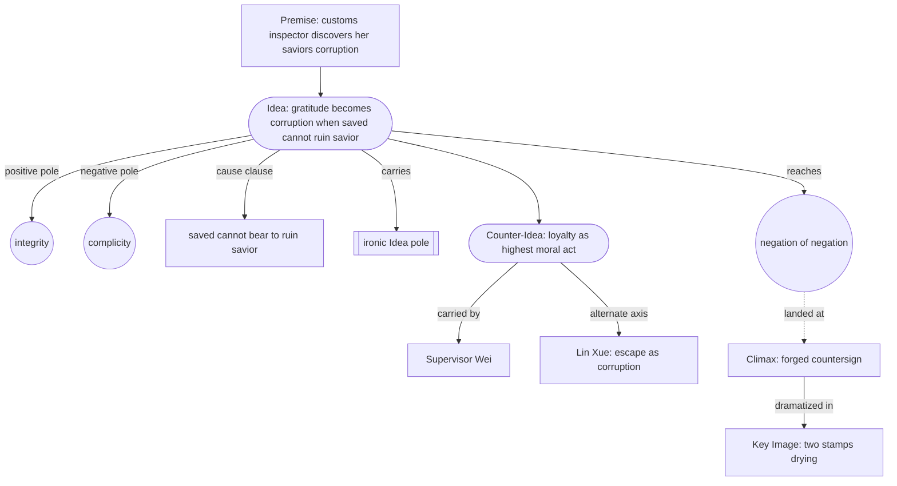

# Controlling Idea Case Study — The Third Day

> 中文版：[[wiki/zh/application/controlling-idea-the-third-day|中文]]

## Overview

A worked case study of the [[controlling-idea]] forging process, applied to a feature-length crime/institutional drama. The project, *The Third Day*, is set in a Dalian customs house in autumn 1989; its protagonist Yu Min is a young inspector whose supervisor — the man who saved her family during the Cultural Revolution — runs a smuggling-protection racket. The Idea forged for this project demonstrates how an **ironic** controlling idea is built (not merely stated), how its [[idea-vs-counter-idea]] matrix is populated with persuasive carriers, and how the [[negation-of-the-negation]] is reached.

## The Idea sentence

> **Gratitude becomes its own corruption when the saved cannot bear to ruin the savior.**

Tagging: **ironic** · **closed**.

The sentence satisfies McKee's [[controlling-idea]] requirements (Ch.6):

- **Names a value** at its closing pole: *corrupted gratitude* — the value of integrity inverted by the very virtue (gratitude) that should sustain it.
- **Names a cause** through action: *the saved cannot bear to ruin the savior* — a behavioral claim, dramatizable in scene.
- **Climax-shaped**: the sentence describes what happens at the [[climax|Climax]] (a forged countersign on a falsified manifest), not at the [[inciting-incident|Inciting Incident]] or midpoint.
- **Falsifiable on the page**: a viewer who saw only the Climax + Resolution — Yu Min pressing two seals, walking out empty-handed at the 18:00 whistle, then six months later countersigning a new young inspector's clean report — would receive the Idea without it being spoken.
- **Argues, not lectures**: no character ever states the Idea in dialogue.
- **Counter-Idea is alive**: see matrix below.

## The Idea / Counter-Idea matrix

| Pole | Statement | Carrier | Climax behavior that proves it |
|---|---|---|---|
| **Idea** | Gratitude becomes its own corruption when the saved cannot bear to ruin the savior. | Yu Min (protagonist; enacts the corruption) | Files falsified manifest under her own seal; walks out empty-handed |
| **Counter-Idea** | Loyalty to the one who saved you is the highest moral act, more sacred than the law. | Supervisor Wei (sustained, persuasive — never pleads, never weakens into villainy) | Tells Yu Min her father's letter from 1969: *"I will not thank you, because thanks would put me in your debt; I will simply do my work."* Offers the moral pattern without demanding silence. The Counter-Idea is *embodied*, not argued. |
| **[[negation-of-the-negation\|Negation of the Negation]]** | Gratitude that ruins the saved is mistaken for the highest virtue by everyone who sees it, including the saved herself. | Yu Min in Resolution coda — six months later, countersigning a new inspector's clean report; the corruption now perpetuating through her hand | Resolution coda final image: two stamps side by side, identical to the Climax composition; the new inspector copies the angle of Yu Min's seal pad. The system replicates. |

## Why this Idea forbids and demands

McKee's discipline (Ch.6): a Controlling Idea, once locked, must *forbid* certain plot moves and *demand* others. This is what makes the Idea a usable engineering constraint, not a slogan.

**Forbids**:

1. Yu Min cannot win cleanly — the professional victory *is* the corruption.
2. Wei cannot be a flat villain — a flat villain collapses the irony into [[melodrama]].
3. The racket cannot be revealed by an outside agent — the dilemma must be hers.
4. The Idea cannot be stated in dialogue — the audience must read it in the seal.
5. The three-day clock cannot be extended — the clock is the antagonism.
6. There can be no recovery beat after the Climax.

**Demands**:

1. A [[scene|scene]] of Wei's sustained moral seriousness — by [[crisis|Crisis]], the audience must want him saved, against the law.
2. A scene where Yu Min is offered a clean way out and refuses it — the [[false-ending|False Ending]].
3. The Crisis as a moment of *recognition* (per Ch.13's [[crisis|Crisis]] discipline), not deliberation.
4. A Climax act that is small in scale and total in consequence.
5. A Resolution image of *perpetuation* — the [[key-image|Key Image]] recomposed in the coda.

## Lessons demonstrated

1. **An ironic Idea requires a worthy Counter-Idea carrier.** The case shows what happens when the Counter-Idea is given a morally serious human carrier (Wei) who never pleads — the [[principle-of-antagonism|Principle of Antagonism]] is satisfied without resort to villainy. Cross-reference: [[forces-of-antagonism]].
2. **Negation of the Negation lands by way of the protagonist's *highest virtue*, not her lowest.** Yu Min's professional precision (her clean seal) is exactly what enables the forged countersign to be perfect. The Idea uses the protagonist's strength against her — McKee's signature ironic move.
3. **The Idea's value pole and cause clause must both be visible at Climax.** The two-stamps Key Image carries both: the *forged seal* (value), and the *direction of the forgery* (cause: she signs *for* him, not *against* him).
4. **The Idea constrains scene work everywhere downstream.** The Idea forbids the Beijing-inspector escape, the courtroom resolution, and the public reckoning — three structural escapes the writer would otherwise consider. By foreclosing them at Idea-lock, the [[spine|spine]] is forced toward the Crisis dilemma.

## Sources

- McKee, *Story* — Ch.6 (Structure and Meaning), Ch.13 (Crisis, Climax, Resolution), Ch.14 (Principle of Antagonism). See also [[chapter-06-structure-and-meaning]], [[chapter-13-crisis-climax-resolution]], [[chapter-14-the-principle-of-antagonism]].
- Project artifacts (in `drafts/the-third-day/`): `controlling-idea.md`, `crisis-climax-audit.md`, `antagonism-test.md`. The artifacts were produced by the project's bespoke agent fleet under `.claude/agents/`.
- Comparable ironic-pole exemplars: *Chinatown* (1974), *The Lives of Others* (2006), *A Hero* (Ghahreman, 2021).
