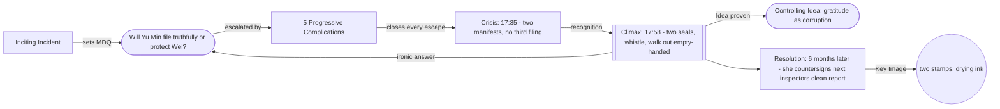

# Crisis-Climax Case Study — The Third Day

> 中文版：[[wiki/zh/application/crisis-climax-the-third-day|中文]]

## Overview

A worked case study of the final-quarter audit — [[crisis|Crisis]] · [[story-climax|Climax]] · [[resolution|Resolution]] — applied to a feature-length crime/institutional drama with an **ironic** Controlling Idea (see [[controlling-idea-the-third-day]]). This page demonstrates how each of the twelve landing-audit points is satisfied when the spine, cast, and Idea contracts have been forged with discipline. It also shows what is *unusual* about this case: a Climax of *concealment* rather than revelation, an answer to the [[major-dramatic-question|Major Dramatic Question]] that is delivered ironically (the protagonist "wins" by becoming the corruption), and a Resolution whose [[key-image|Key Image]] is the *replication* of the Climax composition.

## The dilemma at Crisis (the load-bearing test)

Per Ch.13, a [[crisis|Crisis]] is a true [[dilemma|dilemma]] — an irreducible choice between two irreconcilable goods, or the lesser of two evils. The test: *removing either horn destroys the meaning of the other*.

| Option A — File the truthful manifest | Option B — File the falsified manifest |
|---|---|
| The racket ends. | The racket continues. |
| Wei is exposed; he loses his career and possibly his freedom. | Wei is preserved; he keeps his career and his moral standing in the family. |
| Yu Min's professional integrity is preserved. | Yu Min's integrity is forged-over in a single signature. |
| The saving-story (twenty years of family identity) is destroyed. | The saving-story is preserved by Yu Min becoming its next chapter. |
| Yu Min becomes the daughter who ruined the man who saved her family. | Yu Min becomes Wei. |

**Test passed.** Each cost is irreplaceable. Removing Option A leaves Option B as a corrupt drift, not a moral choice; removing Option B leaves Option A as the inevitable path, not a decision.

The dilemma is created by the Progressive Complications, which close every other escape:

- **PC1** closes *the institutional escape* (Lin Xue: "The office already knows; not knowing is the rule.")
- **PC2** closes *the personal-cost escape* (the mother accidentally redoubles the saving-story to Wei).
- **PC3** closes *direct confrontation* (Wei refuses to give the dialogue she came for; he signs her endorsement and uses her childhood name once).
- **PC4** closes *flight* (Lin Xue's transfer offer is the [[false-ending|False Ending]]; her line "they escape themselves" reveals that the offered escape is itself the corruption Lin Xue chose).
- **PC5** closes *the timeline* (the bureau security officer asks at 14:00 whether any reports are outstanding from the past 48 hours; the 18:00 whistle becomes the deadline).

By Crisis at 17:35, no third filing exists. The protagonist's cleverness has been pre-spent; the trap is moral, not procedural.

## The Climax — concealment as obligatory scene

The [[genre-conventions|genre]] here is institutional/political crime drama, with a [[mixing-genres|secondary]] punitive plot. A genre-conventional crime climax delivers *revelation*; this story's Climax delivers *concealment* — Yu Min files the falsified manifest under her own seal, forging Wei's countersign by re-using paper from his earlier endorsement letter. The 18:00 whistle sounds as the second seal lands.

This is a **paid-for anti-convention** (see Genre Contract §8 in `drafts/the-third-day/genre-contract.md`):

- *Cost*: loss of the genre's classic catharsis; audience may feel cheated of justice.
- *Compensation*: the concealment is *legible* — the audience sees the forgery happen in real time, drying ink and all; the Resolution coda's replication image then deepens, rather than dissipates, the missing catharsis.

The Climax satisfies all four [[story-climax|Climax]] requirements:

1. **Caused by the Crisis decision** — no [[coincidence|coincidence]], no rescue. The causal chain runs PC5 → Crisis recognition → Climactic action without break.
2. **Genre-honoring** — fulfills the obligatory scene of the seal landing, even though it inverts the convention of revelation.
3. **[[inevitable-and-unexpected|Inevitable and unexpected]]** — value flip foreseen by the audience (they know she will not file truthfully); *form* unexpected (the existence of a third document, a forged countersign of one specific person by another, lands as the surprise).
4. **Discharge of the [[major-dramatic-question|MDQ]]** — *Will Yu Min file the truthful manifest report and end Wei's racket — or will she protect him at the cost of becoming the new face of the corruption?* Answered ironically: she "protects" him by *taking the racket onto herself*. The answer is delivered at the second-seal-and-whistle convergence.

## Why the Controlling Idea is dramatized, not stated

A Climax that *states* the Controlling Idea via dialogue is the cheapest possible delivery (Ch.6). This Climax avoids that failure:

- The **value pole** (corrupted gratitude) is dramatized by the *forged seal* — a signature of one person made by another, the literal definition of corruption in institutional grammar.
- The **cause clause** (the saved cannot bear to ruin the savior) is dramatized by the *direction* of the forgery — Yu Min signs *for* Wei, not *against* him; she has not refused his protection (which would have ruined him), nor exposed him (which would have ruined him differently); she has *taken his act onto herself*.
- The **arc state** (negative arc landing at its lowest pole *via the protagonist's highest professional virtue*) is dramatized by the *care* of the forgery — the seal is placed precisely; the corruption is competent. The audience reads the irony in the precision.

No character speaks the Idea. The audience reads it in the seal chronology: pen → seal → seal → whistle → walk out empty-handed.

## Resolution — replication as Key Image

Per Ch.13's discipline on [[resolution|Resolution]]: the spillover settles, every active subplot is answered, and the [[key-image|Key Image]] is delivered. Here, the Resolution is brief — a single scene plus a cut-to, six months after the Climax.

The Key Image **recomposes** the Climax:

- *Climax composition*: two stamps side by side on a single page beneath fluorescent third-floor light; Yu Min's seal and a forged countersign of Wei's; the second seal's ink drying.
- *Resolution composition*: two stamps side by side on a single page beneath the same fluorescent light; Yu Min's seal and the new young inspector's clean countersign; the new inspector watches the angle of Yu Min's seal pad and copies it.

The frames are visually identical. The change is in Yu Min's gaze — she watches the new inspector's hand instead of her own. The audience reads the difference in the gaze, not in the frame. The system perpetuates; the next inspector is becoming Yu Min, the way Yu Min became Wei.

This is the [[negation-of-the-negation|Negation of the Negation]] landed visually: corruption mistaken for virtue by everyone who sees it, including the next person being trained into it.

## Lessons demonstrated

1. **A true dilemma is created by antagonism, not by writer fiat.** Five PCs close five different escape routes. By Crisis, the protagonist's cleverness has been pre-spent; the choice is moral, not tactical. This is the difference between a *dilemma* and a *hard choice*.
2. **An anti-convention Climax pays for itself by being legible.** Concealment-as-Climax can replace revelation-as-Climax if the audience sees the concealment in granular detail. Vagueness or off-page concealment would have broken the genre contract.
3. **The Climax can deliver an ironic answer to the MDQ even when the spine is archplot.** The MDQ is answered (yes, she protects him; *and* yes, she becomes the corruption — the conjunction is the irony). Causality remains intact; only the value-charge interpretation inverts.
4. **The Key Image lives in the Resolution's recomposition, not in a single frame.** A Key Image that recurs across acts and *recomposes itself* in the Resolution coda gathers more meaning than one delivered only at Climax. Cross-reference: [[image-systems]].

## Sources

- McKee, *Story* — Ch.13 (Crisis, Climax, Resolution) is the load-bearing chapter; Ch.6 (Structure and Meaning) supplies the Idea-dramatization discipline; Ch.14 (Principle of Antagonism) supplies the dilemma test. See [[chapter-13-crisis-climax-resolution]], [[chapter-06-structure-and-meaning]], [[chapter-14-the-principle-of-antagonism]].
- Project artifacts (in `drafts/the-third-day/`): `crisis-climax-audit.md`, `spine.md`, `act-design.md`, `key-image.md`, `antagonism-test.md`. The artifacts were produced by the project's bespoke agent fleet under `.claude/agents/`.
- Anti-convention Climax exemplars: *Chinatown* (1974, Climax of failure), *The Lives of Others* (2006, Climax of redacted-not-revealed).
