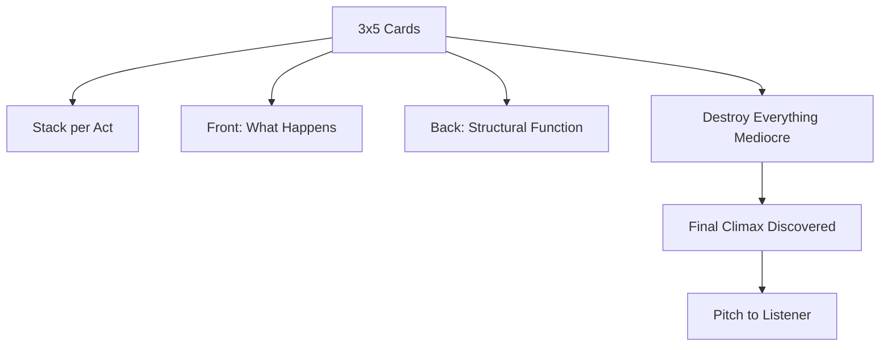

# Step-Outline

> 中文版：[[wiki/zh/application/step-outline|中文]]

## Overview
A **step-outline** is the entire story told in steps, scene by scene, on index cards. Each card states in one or two sentences what happens and how it builds and turns. On the back, the writer notes the step's function in the overall design (set-up to the Inciting Incident, act climax, and so on). Stacks represent acts.

McKee has writers live inside this outline for *months* — typically four of the six they spend on a screenplay — because 90% of what they will invent is mediocre and must be destroyed to find quality.

## Steps
1. **Gather fuel separately.** Biographies, world history, thematic notes, images, vocabulary go into a file cabinet. Keep the outline lean.
2. **Write every scene on a card.** One or two sentences. "He enters expecting to find her at home, but instead discovers her note saying she's left for good."
3. **Label function on the back.** Set-up to Inciting Incident? Inciting Incident? Mid-Act Climax? Act climax? Subplot reversal?
4. **Generate and destroy.** Sketch each scene many ways. Throw out the idea of scenes that don't live up to the stack. A writer secure in talent knows there's no limit to what he can create.
5. **Find the Climax last.** Discover the Story Climax during outlining, then rework backward from it.
6. **Pitch to people.** Not a screenplay read; a ten-minute spoken story. Watch their eyes. The test of readiness is silence — the listener goes quiet with pleasure.

## Checklist
- [ ] Every scene on a card, in one or two sentences.
- [ ] Stacks by act; functional notes on the back.
- [ ] Inciting Incident identified; act climaxes identified; Story Climax identified.
- [ ] Subplots tracked on their own cards.
- [ ] Outline pitches in ten minutes, hooks, holds, and moves listeners.
- [ ] Only then move to [[treatment]].

## Based On
- [[writing-from-the-inside-out]] at project scale.
- Each card is a [[story-event]] headed for a [[turning-point]].
- Precedes [[treatment]] in [[a-writers-method]].

## Sources
- *Story* Chapter 19
