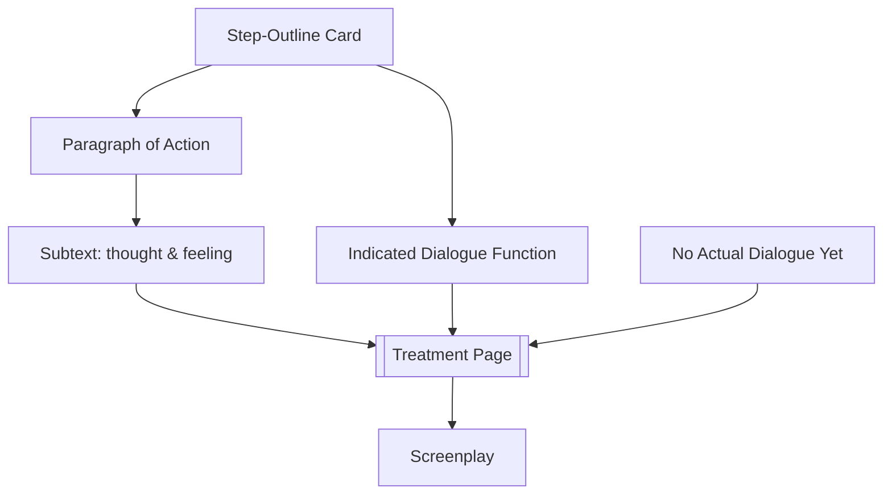

# Treatment

> 中文版：[[wiki/zh/application/treatment|中文]]

## Overview
A **treatment** is the expansion of each scene in the [[step-outline]] into a paragraph of present-tense, moment-by-moment description — **with subtext** but **without dialogue**. Typical length for a feature: 60–90 double-spaced pages. In the studio era, treatments ran 200–300 pages so "nothing would be overlooked or unthought."

## Steps
1. **Take the outline as scaffolding.** Each card becomes a paragraph.
2. **Describe action in the present tense.** "Jack walks in. Tosses his briefcase on the Chippendale chair…"
3. **Indicate what is said, never write dialogue.** "He wants her to do this; she refuses." Subtext carries the line, not the line itself.
4. **Write the subtext.** The true thoughts and feelings under what is said and done. "He's finally alone. Good. He drops his briefcase on her precious chair. She hates him for scratching her antiques; today he doesn't give a damn."
5. **Rework freely.** The overall design holds (it worked every pitch), but individual scenes may be cut, added, reordered. Research and imagination never stop.
6. **Graduate to screenplay only when the treatment lives.** Then every moment already has text and subtext; the screenplay becomes description + dialogue, written at 5–10 pages a day.

## Checklist
- [ ] Every card becomes a paragraph in present tense.
- [ ] Subtext stated explicitly for every beat; no dialogue typed.
- [ ] Typical length 60–90 pages for a feature.
- [ ] Turning Points readable on the page.
- [ ] Research outside the treatment feeds in as needed.
- [ ] Only then begin screenplay; dialogue is added in that final stage.

## Based On
- [[step-outline]] expanded.
- [[writing-from-the-inside-out]] at the scene level.
- [[text-and-subtext]] made explicit for every moment.

## Sources
- *Story* Chapter 19
