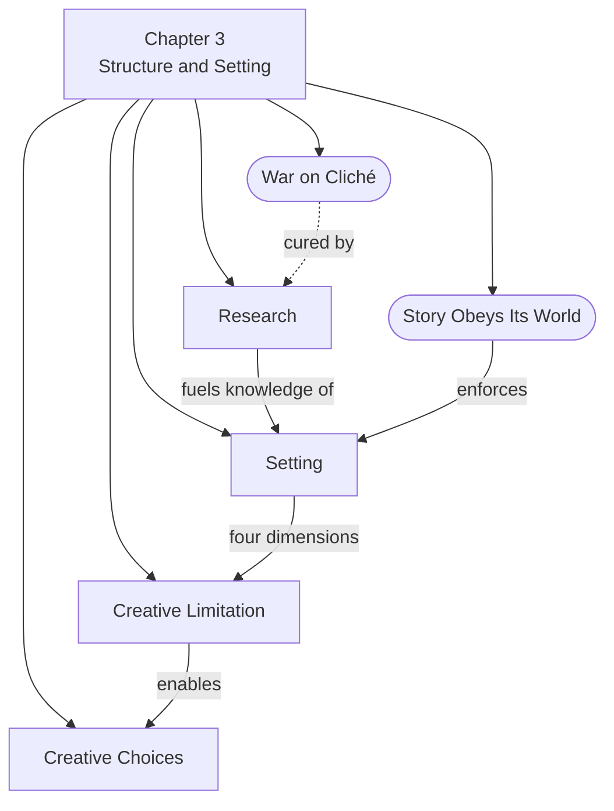

# Chapter 3: Structure and Setting

> 中文版：[[wiki/zh/chapters/chapter-03-structure-and-setting|中文]]

## Summary

McKee opens with a diagnosis: the root cause of all cliché is that the writer does not know the world of his story. When writers lack deep knowledge of their fictional universe, they inevitably borrow from other films and novels, serving up recycled material that bores the audience. The antidote is mastery of [[setting]].

A story's setting is four-dimensional — [[setting|Period, Duration, Location, and Level of Conflict]] — and it sharply limits what events are possible within the narrative. This constraint is not a burden but a gift: the Principle of [[creative-limitation|Creative Limitation]] holds that the smaller and more knowable the world, the greater the writer's creative choices, and the more original the story. Vast, vaguely defined worlds dilute knowledge and breed cliché; tight, deeply researched worlds produce originality.

McKee then prescribes three modes of [[research]] — memory, imagination, and fact — as the writer's weapons against cliché and writer's block. Finally, he describes the discipline of [[creative-choices]]: generating far more material than needed (ten to one, even twenty to one), then selecting only the best, burning the rest. Genius is not just creation but the taste and judgment to destroy what is mediocre.

## Chapter Concept Map

## Key Concepts Introduced

- **[[setting]]** — The four-dimensional world of a story: Period, Duration, Location, and Level of Conflict
- **[[creative-limitation]]** — The principle that constraints inspire rather than inhibit creativity
- **[[research]]** — Three methods of acquiring story knowledge: memory, imagination, and fact
- **[[creative-choices]]** — The discipline of overproduction and rigorous selection

## Key Examples

- **Dr. Strangelove** — Three sets, eight characters, yet climaxes in planetary annihilation — proof that a "small" world can contain enormous stakes
- **The Usual Suspects** — A gritty realism that allows leaps in logic through the "law" of free association
- **Crime and Punishment** — McKee's example of a "microscopic" world that achieves depth through limitation
- **War and Peace** — Despite its vast backdrop, focused on a handful of characters and interrelated families

## McKee's Core Argument

The war on cliché is won through knowledge. A story's setting constrains its possibilities, but this constraint is the writer's greatest ally. The smaller and more deeply known the world, the more original the creative choices available. Writers must research exhaustively — through memory, imagination, and fact — then generate material at ratios of ten or twenty to one, selecting only the finest work and discarding the rest.

## Connections to Other Chapters

- Builds on [[chapter-02-the-structure-spectrum]] by showing how [[structure]] is shaped and limited by the world in which it operates
- Sets up [[chapter-04-structure-and-genre]] by establishing that creative limitation applies not just to setting but to genre conventions

## Notable Quotes

- "The source of all clichés can be traced to one thing and one thing alone: The writer does not know the world of his story." (Ch. 3)
- "The larger the world, the more diluted the knowledge of the writer, therefore the fewer his creative choices and the more clichéd the story. The smaller the world, the more complete the knowledge of the writer, therefore the greater his creative choices." (Ch. 3)
- "Genius consists not only of the power to create expressive beats and scenes, but of the taste, judgment, and will to weed out and destroy banalities, conceits, false notes, and lies." (Ch. 3)
