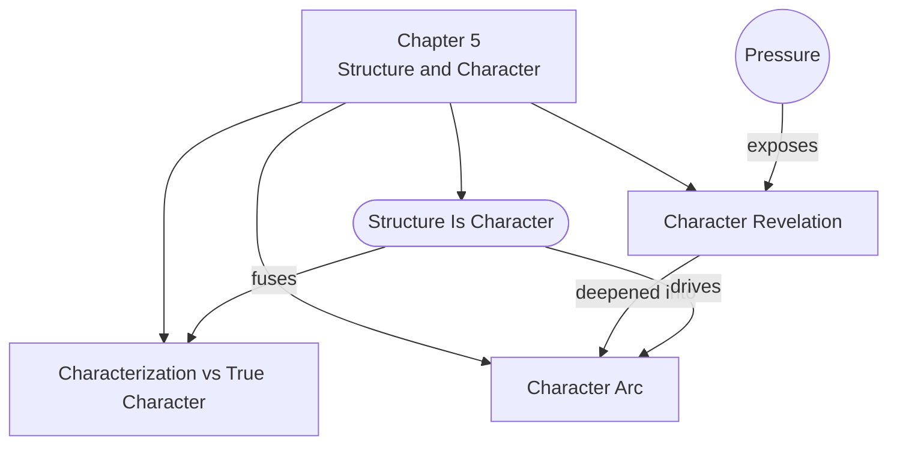

# Chapter 5: Structure and Character

> 中文版：[[wiki/zh/chapters/chapter-05-structure-and-character|中文]]

## Summary

McKee resolves the ancient debate of "plot vs. character" with a single declaration: structure *is* character; character *is* structure. They are the same thing seen from two points of view. The confusion persists because writers conflate two very different concepts: **characterization** (the sum of observable traits) and **true character** (what is revealed through choices under pressure).

Characterization is the mask — age, appearance, education, occupation, personality. True character is what lies beneath, exposed only when a human being faces a dilemma and must choose. The greater the pressure, the deeper the revelation. McKee illustrates this with a vivid thought experiment: a housekeeper and a neurosurgeon confronting a burning school bus, where escalating pressure strips away surface differences to reveal (or contradict) their deepest natures.

The finest storytelling goes further: it doesn't just reveal true character but **arcs** it — changes the inner nature for better or worse over the course of the telling. McKee traces this five-step pattern through Hamlet and Frank Galvin in [[the-verdict|The Verdict]]. Finally, he argues that the climax of the last act is the writer's supreme task — 75% of all creative labor goes into designing it — because "movies are about their last twenty minutes."

## Chapter Concept Map

## Key Concepts Introduced

- **[[characterization-vs-true-character]]** — The fundamental distinction: observable traits vs. choices under pressure
- **[[character-arc]]** — The change of inner nature over the course of the story
- **[[character-revelation]]** — True character revealed in contrast or contradiction to characterization

## Key Examples

- **[[the-verdict]]** — Frank Galvin's arc from corrupt, self-destructive drunk to sober, ethical attorney fighting for his soul
- **Hamlet** — McKee traces the five-step character/structure dynamic: characterization → true character revealed → contrast with outer self → escalating pressure → profound change
- **James Bond vs. Rambo** — Bond endures because his true character (thinking man's Rambo) contradicts his characterization (lounge lizard). Rambo collapsed when characterization and true character merged into one-dimensional flatness.
- **Greed (1924)** — Von Stroheim's Mojave Desert climax: ultimate choices that profoundly delineate character, requiring all characterization to serve the credibility of that climactic action

## McKee's Core Argument

The phrase "character-driven story" is redundant — all stories are character-driven because event design and character design mirror each other. Structure provides progressively building pressures that force characters into difficult choices, revealing their true natures. Characters bring the qualities of characterization necessary to credibly act out those choices. Change one, you change the other. The climax of the last act is where this interlock reaches its highest expression, and it demands the vast majority of the writer's creative effort.

## Connections to Other Chapters

- Builds on [[chapter-02-the-structure-spectrum]]: the story hierarchy (beat → scene → act → climax) now has a character dimension — each level forces deeper choices
- Builds on [[chapter-03-structure-and-setting]]: character complexity must be appropriate to [[genre]] — Action demands simplicity, Education Plots demand depth
- Sets up [[chapter-06-structure-and-meaning]]: the climax that reveals character also expresses the story's meaning

## Notable Quotes

- "We cannot ask which is more important, structure or character, because structure *is* character; character *is* structure." (Ch. 5)
- "TRUE CHARACTER is revealed in the choices a human being makes under pressure — the greater the pressure, the deeper the revelation, the truer the choice to the character's essential nature." (Ch. 5)
- "Movies are about their last twenty minutes." (Ch. 5)
- "Thou shalt save the best for last." (Ch. 5)
