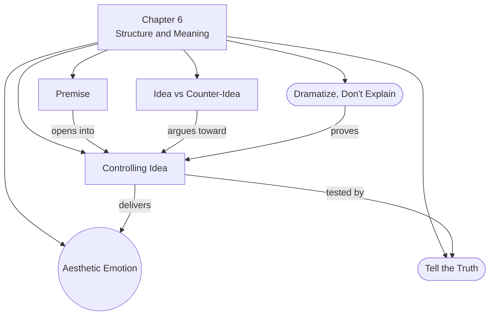

# Chapter 6: Structure and Meaning

> 中文版：[[wiki/zh/chapters/chapter-06-structure-and-meaning|中文]]

## Summary

McKee explores how stories create meaning. He begins with **aesthetic emotion** — the simultaneous encounter of thought and feeling that art produces and life rarely does. In life, idea and emotion come separately; in art, they are fused. Story is the instrument that creates this fusion at will.

Two ideas bracket the creative process: **Premise** (the open-ended "What if...?" that inspires) and **Controlling Idea** (the story's ultimate meaning expressed through the last act's climax). The Controlling Idea has two components: **Value** (the positive or negative charge at climax) plus **Cause** (the chief reason for that change). It must be expressible in a single sentence describing how and why life changes from beginning to end.

McKee then reveals the engine that drives stories toward their Controlling Idea: the dialectic of **Idea vs. Counter-Idea**. Progressions build by moving dynamically between positive and negative charges. Each sequence argues one side, then the other, until at Crisis they collide and one wins at Climax.

The chapter categorizes writers as **Idealists** (up-endings), **Pessimists** (down-endings), or **Ironists** (up/down-endings expressing life's dual nature). McKee warns against **didacticism** — the death of art through zealous preaching — and concludes that the artist's only responsibility is to tell the truth.

## Chapter Concept Map

## Key Concepts Introduced

- **[[aesthetic-emotion]]** — The simultaneous encounter of thought and feeling; what art provides that life cannot
- **[[premise]]** — The open-ended inspiration ("What if...?") that begins the creative process
- **[[controlling-idea]]** — The story's irreducible meaning: Value + Cause, expressed through the climax
- **[[idea-vs-counter-idea]]** — The dialectical engine: positive and negative charges arguing through sequences to climax

## Key Examples

- **[[chinatown]]** — Pessimistic Controlling Idea: "Evil triumphs because it's part of human nature"
- **Dirty Harry** — "Justice triumphs because the protagonist is more violent than the criminals" — the Controlling Idea guides what is appropriate (violence) vs. inappropriate (Sherlock Holmes deduction)
- **Kubrick's antiwar trilogy** (*Paths of Glory, Dr. Strangelove, Full Metal Jacket*) — Masterful balance: explores the Counter-Idea (humanity loves to fight) so deeply that the antiwar message becomes convincing rather than didactic

## McKee's Core Argument

Master storytellers never explain — they dramatize. A story's meaning must be proven through the dynamics of its events, not asserted through dialogue. The Controlling Idea emerges from the climax; the story tells you its meaning, you don't dictate it. The creative process alternates Idea and Counter-Idea in a dialectical debate until one wins at climax. The artist's sole responsibility is truth: "In a world of lies and liars, an honest work of art is always an act of social responsibility."

## Connections to Other Chapters

- Builds on [[chapter-05-structure-and-character]]: the climax that reveals and arcs character also expresses the story's Controlling Idea
- Builds on [[chapter-02-the-structure-spectrum]]: [[story-values]] are now given a precise function — they form the Value component of the Controlling Idea
- Extends [[chapter-04-structure-and-genre]]: genre determines the kind of aesthetic emotion and the typical Value charge at climax

## Notable Quotes

- "Life on its own, without art to shape it, leaves you in confusion and chaos, but aesthetic emotion harmonizes what you know with what you feel." (Ch. 6)
- "STORYTELLING is the creative demonstration of truth. A story is the living proof of an idea, the conversion of idea to action." (Ch. 6)
- "The story tells you its meaning; you do not dictate meaning to the story." (Ch. 6)
- "In a world of lies and liars, an honest work of art is always an act of social responsibility." (Ch. 6)
