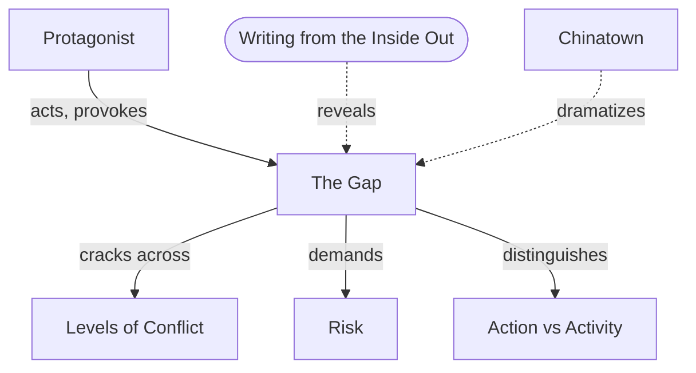

# Chapter 7: The Substance of Story

> 中文版：[[wiki/zh/chapters/chapter-07-the-substance-of-story|中文]]

## Summary
McKee opens Part Two ("The Elements of Story") by asking: what is the raw material of story? Not words. Language is only a medium. The *substance* of story is **the gap** — the rupture between what a character expects when he acts and what the world actually returns. Stories are built at this fracture between probability and necessity, between the subjective self and the objective world.

To reach that gap, the writer must work **from the inside out**, using Stanislavski's "Magic If" — asking "if I were this character in these circumstances, what would I do?" — and then asking dialectically, "what is the opposite of that?" This chapter introduces the [[protagonist]] as the axis of the substance: a willful character with conscious (and possibly contradictory unconscious) desire, the capacity to pursue it to the human limit, and the empathetic link to the audience. Every action the protagonist takes is minimal and conservative *from his point of view*; the gap only opens when reality refuses to cooperate. Each gap raises the stakes, raises the [[risk]], and drives the story to the end of the line.

## Key Concepts Introduced
- **[[the-gap]]** — The rift between expectation and result; the nucleus of story energy.
- **[[protagonist]]** — A willful character with conscious (and possibly unconscious) desire, the capacity to pursue it to the limit, and an empathetic bond with the audience.
- **[[levels-of-conflict]]** — Three concentric rings of antagonism: inner, personal, and extra-personal.
- **[[risk]]** — The measure of a desire's value is proportional to what the character will risk to pursue it.
- **[[action-vs-activity]]** — True action opens a gap and creates change; activity generates no change.
- **[[minimum-conservative-action]]** — Characters always take the least costly action *from their own point of view*.

## Key Examples
- **[[chinatown]]** — The Act Two climax (Gittes confronts Evelyn) is McKee's extended demonstration of writing from the inside out, shifting POV beat by beat and opening gap after gap.
- *A Streetcar Named Desire* — Blanche DuBois: apparent passivity masking a powerful unconscious will to escape reality.
- *Macbeth* — Shakespeare building empathy for a monstrous character by giving him a conscience.
- *Interview with a Vampire* — A failure of the audience bond because Louis's whining has no empathetic anchor.

## McKee's Core Argument
Story is not language; story is the gap. Between what the character expects from his world and what the world returns, reality splits open, and through that fissure the writer finds emotional truth, rising risk, and the pattern of escalating action that carries a story to its limit. The only reliable way to find these gaps is to live inside the character and then, dialectically, to ask what is the opposite of what he expects.

## Connections to Other Chapters
- Builds on [[chapter-05-structure-and-character]] — the protagonist embodies the principle that true character is revealed through choice under pressure; the gap *is* that pressure.
- Builds on [[chapter-06-structure-and-meaning]] — the gap is where [[aesthetic-emotion]] is ignited in the audience.
- Sets up [[chapter-08-the-inciting-incident]] — the first and largest gap is the [[inciting-incident]] itself.
- Sets up [[chapter-09-act-design]] — [[progressive-complications]] is the systematic escalation of gaps.

## Notable Quotes
- "Story is born in that place where the subjective and objective realms touch."
- "The measure of the value of a character's desire is in direct proportion to the risk he's willing to take to achieve it."
- "The spirit of creation is the spirit of contradiction — the breakthrough of appearances toward an unknown reality." (Cocteau, via McKee)
