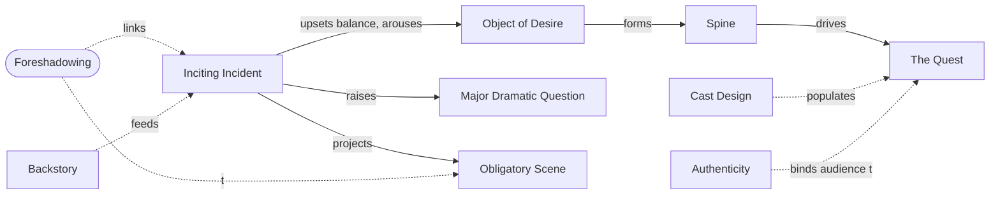

# Chapter 8: The Inciting Incident

> 中文版：[[wiki/zh/chapters/chapter-08-the-inciting-incident|中文]]

## Summary
Before launching the story McKee returns to [[setting]] and demands deeper research: the writer must know the work, politics, rituals, values, biographies, [[backstory]], and [[cast-design]] of the world. Saturation yields **authorship** — the three virtues of *author, authority, authenticity*. The audience enters through two gates: [[empathy]] and [[authenticity]]; the moment either fails, involvement collapses.

McKee then defines the [[inciting-incident]]: the first major event of the telling, which *radically upsets the balance of forces in the protagonist's life* and arouses the desire to restore balance. From this rupture emerges an [[object-of-desire]] and a [[the-quest|quest]]. The deep desire, often unconscious, becomes the [[spine]] of the story. Witnessing the inciting incident provokes the [[major-dramatic-question]] ("how will this turn out?") and projects into the audience's imagination the [[obligatory-scene]] — the climactic confrontation with the forces of antagonism that the storyteller is now contractually bound to deliver. This is the chapter's deep structural claim: **every story is a Quest**, launched by a single radical event, oriented toward an obligatory confrontation, and unified by the spine of desire.

## Key Concepts Introduced
- **[[inciting-incident]]** — The first major event; radically upsets balance, arouses desire, propels quest.
- **[[object-of-desire]]** — The specific thing the protagonist feels will restore balance.
- **[[spine]]** — The deep, often unconscious desire that unifies every story element.
- **[[the-quest]]** — The universal form of story: a character pursues an object of desire through antagonism.
- **[[major-dramatic-question]]** — The "how will this turn out?" that grips audience attention.
- **[[obligatory-scene]]** — The climactic confrontation with the most powerful forces of antagonism; promised by the inciting incident, owed by the writer.
- **[[foreshadowing]]** — The arrangement of early events to prepare later ones; links inciting incident to crisis.
- **[[cast-design]]** — Every role exists by design; the first principle is polarization of attitudes.
- **[[authenticity]]** — Internal consistency that earns the audience's willing suspension of disbelief.
- **[[backstory]]** — Significant past events used to build the story's progressions (not biography).

## Key Examples
- **[[kramer-vs-kramer]]** — Mrs. Kramer walking out on her husband and child: an inciting incident requiring no setup.
- **[[jaws]]** — Shark-eats-swimmer (setup) + sheriff-finds-body (payoff): a two-event inciting incident.
- **[[ordinary-people]]** — The French toast scraped into the disposal: an archetypal "small" inciting incident.
- **[[rocky]]** — A late-arriving inciting incident (30 min.) that becomes the Act One Climax, set up by the Adrian/Rocky love subplot.
- **[[chinatown]]** — The Gittes adultery-investigation subplot holds us while the Central Plot's inciting incident ripens.
- *Alien* — Dan O'Bannon's "acid blood" detail as an example of research-driven authenticity.

## McKee's Core Argument
All stories are one story: the Quest. A single, radical event pitches a protagonist's life out of balance, arousing the conscious and/or unconscious desire that becomes the story's Spine, and pointing toward the obligatory confrontation. This event must occur onscreen, must arrive "as soon as possible but not before the moment is ripe," and its quality must be germane to the world — but it can be as small as "a woman putting her hand on the table and looking at you that certain way."

## Connections to Other Chapters
- Builds on [[chapter-03-structure-and-setting]] — the research demands of [[setting]] return here as the precondition for authenticity and cast design.
- Builds on [[chapter-07-the-substance-of-story]] — the inciting incident is the first and largest [[the-gap|gap]].
- Sets up [[chapter-09-act-design]] — the Inciting Incident begins a chain of [[progressive-complications]] culminating in the Obligatory Scene and Climax.

## Notable Quotes
- "The Inciting Incident radically upsets the balance of forces in the protagonist's life."
- "All stories take the form of a Quest."
- "Bring in the Central Plot's Inciting Incident as soon as possible… but not until the moment is ripe."
- "A convincing impossibility is preferable to an unconvincing possibility." (Aristotle, via McKee)
