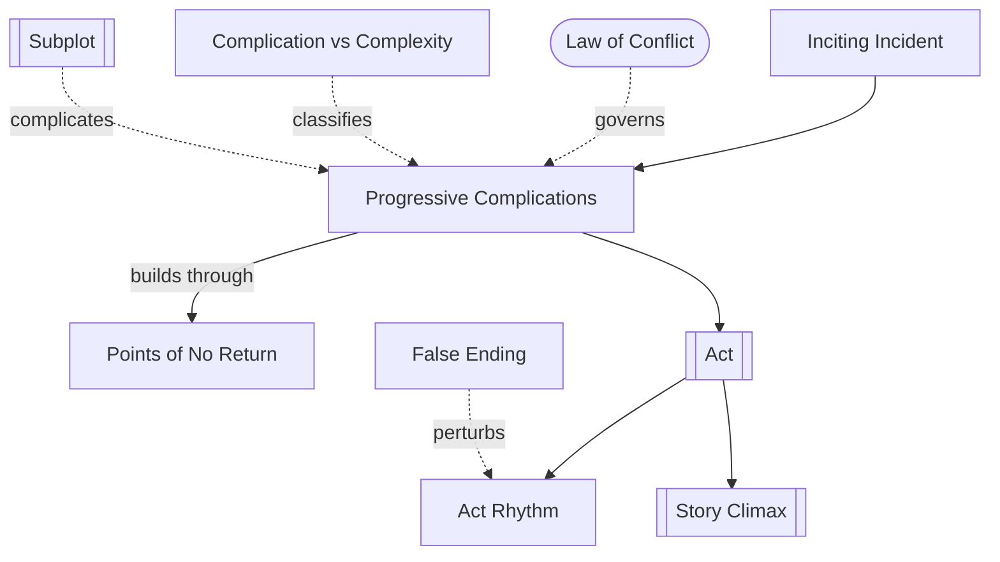

# Chapter 9: Act Design

> 中文版：[[wiki/zh/chapters/chapter-09-act-design|中文]]

## Summary
From the [[inciting-incident]] the story enters the long body of [[progressive-complications]]: the escalation of conflict by *successive* [[points-of-no-return]] that forever cancel lesser actions. This body is governed by the **Law of Conflict**: *nothing moves forward in a story except through conflict.* The quantity of conflict is constant across a life; only its level shifts. McKee distinguishes **complication** (conflict on one level — *Action*, *Soap Opera*, *Stream of Consciousness*) from **complexity** (conflict on all three [[levels-of-conflict]] simultaneously — exemplified by the French toast scene in *Kramer vs. Kramer*).

He then prescribes act structure: a full-length work requires a minimum of *three* acts — three major reversals — because two is never enough for the audience to feel it has reached the limit. Variations follow: the Mid-Act Climax rescuing the long second act, four- to eight-act designs, and [[subplot]]s as the usual alternative to multiplying acts. He closes with four uses of subplot — *contradict* the Controlling Idea (irony), *resonate* it (variation), *set up* the inciting incident, or *complicate* the central plot — and with [[act-rhythm]], the rule that the Penultimate and Ultimate Climaxes must carry opposite value-charges. The [[false-ending]] is a calculated exception within this rhythm.

## Key Concepts Introduced
- **[[progressive-complications]]** — The escalating body of story from Inciting Incident to Crisis/Climax.
- **[[points-of-no-return]]** — Each gap cancels actions of that magnitude forever; the story cannot retreat.
- **[[law-of-conflict]]** — Nothing moves forward in a story except through conflict.
- **[[complication-vs-complexity]]** — Complication = conflict on one level; complexity = conflict on all three simultaneously.
- **[[subplot]]** — A lesser plot line that contradicts, resonates, sets up, or complicates the Central Plot.
- **[[act-rhythm]]** — The Penultimate and Ultimate Act Climaxes must carry opposite value-charges.
- **[[false-ending]]** — A scene so complete we think the story is over — usually in *Action* genres.

## Key Examples
- **[[kramer-vs-kramer]]** — The French toast scene as the canonical demonstration of complexity (conflict on all three levels simultaneously).
- **[[rocky]]** — The Adrian/Rocky love subplot as a *setup subplot* for a late-arriving Central Plot.
- **[[casablanca]]** — Five setup subplots carrying the opening before Rick's Central Plot ripens.
- *Raiders of the Lost Ark* (7 acts), *The Cook, The Thief, His Wife & Her Lover* (8 acts) — multi-act designs.
- *The River* — Misplaced Inciting Incident as a cautionary tale.

## McKee's Core Argument
A story is built as a ladder of points of no return, each rung canceling the ones below. The three-act design is a minimum, not a formula: it exists because two reversals can never reach the limit of experience. Complexity — not mere complication — distinguishes lasting stories, and subplots (not more acts) are the safer cure for the soft belly of Act Two. Act rhythm demands alternation: you cannot set up a positive climax with another positive climax.

## Connections to Other Chapters
- Builds on [[chapter-02-the-structure-spectrum]] — [[act]], [[sequence]], [[scene]], [[beat]] now gain their macro-architecture.
- Builds on [[chapter-07-the-substance-of-story]] — progressive complications are gaps systematically arranged.
- Builds on [[chapter-08-the-inciting-incident]] — act structure begins where the inciting incident ends.
- Sets up later chapters on Crisis, Climax, and Resolution.

## Notable Quotes
- "Nothing moves forward in a story except through conflict."
- "The music of story is conflict."
- "You're free to break or bend convention, but for one reason only: to put something more important in its place."
- "The three-act design is the minimum. … In our effort to satisfy the audience's need, two major reversals are never enough."
