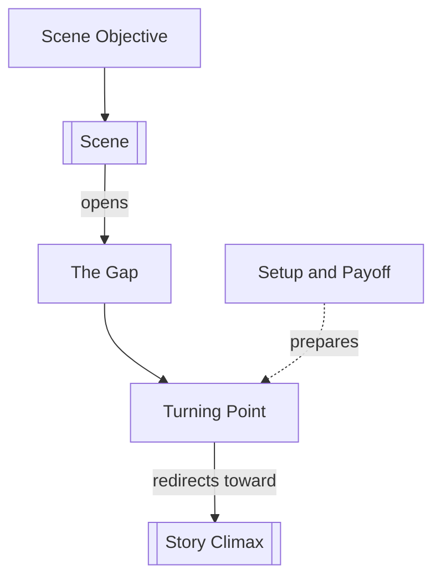

# Chapter 10: Scene Design

> 中文版：[[wiki/zh/chapters/chapter-10-scene-design|中文]]

## Summary
McKee shifts from macro-architecture to scene craft. A [[scene]] is a story in miniature: a character pursues a [[scene-objective]] aligned with the [[spine]], encounters unexpected resistance, opens a [[the-gap|gap]], and ends on a changed value. The ideal is not exposition but turn after turn — minor, moderate, or major.

The chapter organizes scene design around four levers. [[turning-point|Turning Points]] create surprise, curiosity, insight, and new direction. [[setup-and-payoff|Setups and payoffs]] layer knowledge so that revelations feel both earned and surprising. Emotional movement comes from value transitions, not ornamental prose, and choice under pressure is the hinge that makes a scene dramatic rather than static.

## Key Concepts Introduced
- **[[turning-point]]** — The gap-driven shift that turns a scene's value.
- **[[scene-objective]]** — The immediate desire pursued in the here-and-now of a scene.
- **[[setup-and-payoff]]** — Layered knowledge that makes later reversals click into place.

## Key Examples
- **[[trading-places]]** — A comic turning point that flips Billy Ray from beggar to broker.
- **[[wall-street]]** — A moral turning point where Bud Fox chooses corruption.
- **[[chinatown]]** — The confession scene as the model of setup, payoff, and new direction.

## McKee's Core Argument
Writers do not truly express themselves through decorative language but through the unique way they turn scenes. A scene earns attention when it jolts the audience into re-reading what came before and anticipating what comes next.

## Connections to Other Chapters
- Builds on [[chapter-07-the-substance-of-story]] — the gap now becomes scene mechanics.
- Builds on [[chapter-08-the-inciting-incident]] — the scene objective is a local expression of the spine.
- Builds on [[chapter-09-act-design]] — act progressions are built from scene-level turns.
- Sets up [[chapter-11-scene-analysis]] by defining the parts later chapters diagnose.

## Notable Quotes
- "A scene is a story in miniature."
- "First, last, and always, self-expression occurs in the flood of insight that pours out of a Turning Point."

