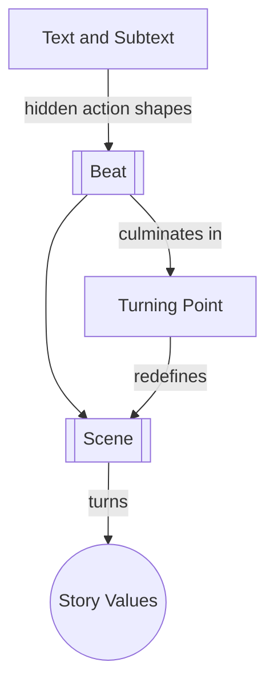

# Chapter 11: Scene Analysis

> 中文版：[[wiki/zh/chapters/chapter-11-scene-analysis|中文]]

## Summary
If a scene falls flat, McKee says the problem is rarely the dialogue on the surface. The real issue is usually the hidden action underneath it: the relation between [[text-and-subtext|text and subtext]], the arc of [[beat|beats]], and whether the scene actually turns a value.

He proposes a five-step diagnostic method: define the conflicting desires, note the opening value, divide the scene into beats, compare the closing value to the opening value, and locate the exact [[turning-point]]. Scene analysis slows the moment down until the writer can see whether behavior is alive or merely busy.

## Key Concepts Introduced
- **[[text-and-subtext]]** — The surface and the concealed inner life must run simultaneously.
- **[[beat]]** — The action/reaction exchanges that reveal whether a scene is alive.
- **[[turning-point]]** — The precise moment when expectation and result split apart.

## Key Examples
- **[[casablanca]]** — The bazaar scene reveals Rick and Ilsa's conflict through layered subtext.
- **[[kramer-vs-kramer]]** — The breakfast scene shows how beats expose character failure and growth.

## McKee's Core Argument
Nothing in life is only what it appears to be, and therefore nothing in story should be either. A playable scene always contains an inner life for actors and an inferential pleasure for the audience.

## Connections to Other Chapters
- Builds on [[chapter-10-scene-design]] — analysis tests whether scene design actually works.
- Builds on [[chapter-05-structure-and-character]] — true character emerges through pressure and subtext.
- Sets up [[chapter-12-composition]] by moving from single-scene craft to the ordering of scenes.

## Notable Quotes
- "Nothing is what it seems."
- "If the scene is about what the scene is about, you're in deep shit."

