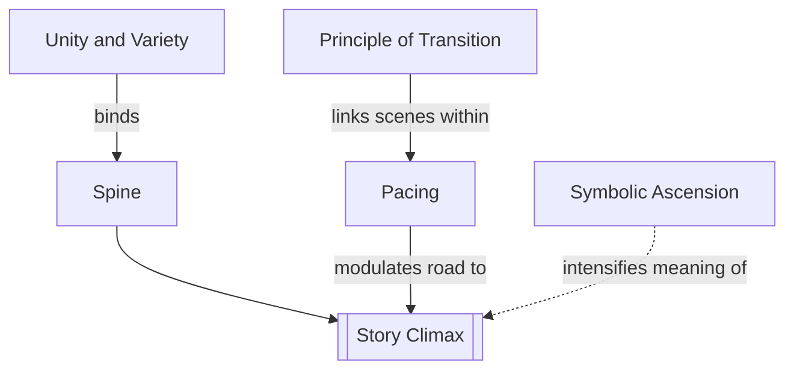

# Chapter 12: Composition

> 中文版：[[wiki/zh/chapters/chapter-12-composition|中文]]

## Summary
Composition is the ordering and linking of scenes so that a story feels both inevitable and varied. McKee names several canons: [[unity-and-variety]], [[pacing]], the management of rhythm and tempo, widening or deepening progressions, symbolic and ironic ascent, and the [[principle-of-transition]] that links one scene to the next.

This chapter argues that story progression must be felt, not merely asserted. Tension must tighten and release like lived experience; imagery can rise from the ordinary to the archetypal; and transitions must carry the audience across cuts with continuity or counterpoint. Composition is where the screenplay begins to think like cinema.

## Key Concepts Introduced
- **[[unity-and-variety]]** — The causal lock of the whole plus freshness inside it.
- **[[pacing]]** — The alternation of pressure and release across the story.
- **[[symbolic-ascension]]** — The rise from literal image to archetypal charge.
- **[[principle-of-transition]]** — The hinge linking the end of one scene to the start of the next.

## Key Examples
- **[[casablanca]]** — Unity through Rick's choice, variety through romance, politics, comedy, and music.
- **[[the-deer-hunter]]** — Symbolic escalation from workers to hunters to sacrificial image.
- **[[the-terminator]]** — The city gradually becomes a mythic labyrinth.

## McKee's Core Argument
Good stories do not simply "continue"; they compose themselves into waves, contrasts, and echoes. A screenplay that ignores composition leaves its shape to editing and loses expressive control.

## Connections to Other Chapters
- Builds on [[chapter-09-act-design]] — composition is how progressive complications are orchestrated.
- Builds on [[chapter-10-scene-design]] — scenes must not only turn individually but accumulate musically.
- Sets up [[chapter-13-crisis-climax-resolution]] by preparing the final movement.

## Notable Quotes
- "Because of the Inciting Incident, the Climax had to happen."
- "We must earn the pause."

