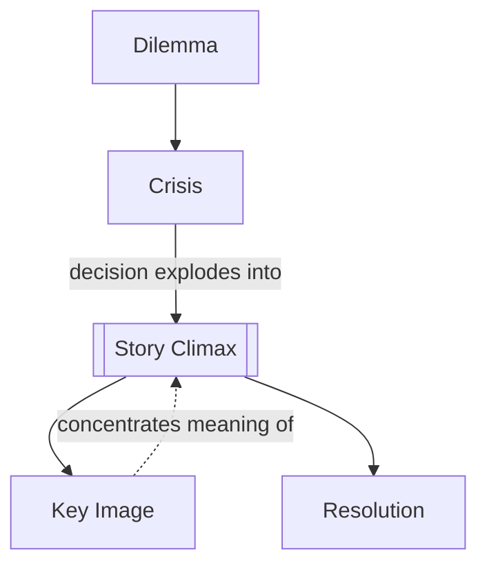

# Chapter 13: Crisis, Climax, Resolution

> 中文版：[[wiki/zh/chapters/chapter-13-crisis-climax-resolution|中文]]

## Summary
McKee defines the final movement of story as a sequence of decision, action, and aftermath. [[crisis|Crisis]] is the ultimate decision under maximum pressure; it is the story's true [[obligatory-scene]]. [[story-climax|Climax]] is the irreversible major reversal that expresses meaning, and [[resolution]] is the material that settles what's left and lets the audience breathe.

The chapter sharpens one of McKee's strongest claims: true choice is not good versus evil but [[dilemma]] — irreconcilable goods or the lesser of two evils. A great ending feels both inevitable and surprising, often because the climax hides one last turning point and crystallizes everything in a [[key-image]].

## Key Concepts Introduced
- **[[crisis]]** — The last decision before the final action.
- **[[dilemma]]** — The shape of true choice.
- **[[resolution]]** — The after-climax material that settles remaining movement.
- **[[key-image]]** — The final image that condenses meaning and emotion.

## Key Examples
- **[[star-wars]]** — Luke's crisis between trust in the machine and trust in the Force.
- **[[the-empire-strikes-back]]** — A climax filled with repeated gaps and new crisis decisions.
- **[[thelma-louise]]** — A masterfully delayed crisis that detonates immediately into climax.

## McKee's Core Argument
Meaning produces emotion. The ending works not because it is loud or expensive, but because it forces a character into the deepest choice of the story and then reveals the irreversible truth of that choice.

## Connections to Other Chapters
- Builds on [[chapter-08-the-inciting-incident]] — the obligatory scene promised there is fulfilled here.
- Builds on [[chapter-09-act-design]] — points of no return culminate in the ultimate decision.
- Builds on [[chapter-10-scene-design]] — a great ending still turns like a scene, only at maximum charge.

## Notable Quotes
- "Meaning produces emotion."
- "The ending must be both inevitable and unexpected."
