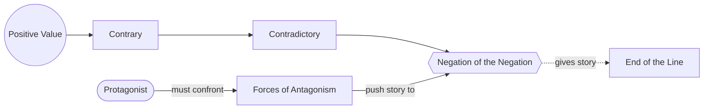

# Chapter 14: The Principle of Antagonism

> 中文版：[[wiki/zh/chapters/chapter-14-the-principle-of-antagonism|中文]]

## Summary
McKee calls antagonism "the most important and least understood precept in story design," and makes it the engine of everything a writer does on the positive side. A [[protagonist]] and story can only rise to the intellectual fascination and emotional power that the [[forces-of-antagonism]] force them to reach. Weak negation guarantees a weak film.

The chapter introduces a tool for diagnosing negative power: a four-stage [[value-progression]] — Positive → Contrary → Contradictory → [[negation-of-the-negation|Negation of the Negation]] — that runs any story's central value to the limit of human experience. The Negation of the Negation is not merely "the opposite" but a compound, qualitatively worse state (tyranny beneath injustice, self-loathing beneath hatred, self-deception beneath the lie).

## Key Concepts Introduced
- **[[principle-of-antagonism]]** — The governing law: protagonist and story rise only as far as their antagonism forces them.
- **[[forces-of-antagonism]]** — The sum of all inner, personal, and extra-personal opposition, not merely a villain.
- **[[value-progression]]** — The declension from Positive through Contrary and Contradictory to Negation of the Negation.
- **[[negation-of-the-negation]]** — The compound negative at the limit of human experience.

## Key Examples
- **[[chinatown]]** — The Negation of the Negation of sanctioned natural sex is incest with the offspring of incest; this is why Cross is the abyss.
- **[[casablanca]]** — Opens *at* the Negation of the Negation (fascist tyranny, self-hatred, self-deception) and works back to the Positive.
- *Missing* — Moves from unfairness (Contrary) to injustice (Contradictory) to tyranny (Negation of the Negation).
- *And Justice for All* — A black comedy that drives through tyranny and comes back out the other side.
- *Big* — Jumps immediately to the Negation of the Negation and illuminates degrees of immaturity.

## McKee's Core Argument
"All other factors of talent, craft, and knowledge being equal, greatness is found in the writer's treatment of the negative side." Rather than trying to make the protagonist more likable, build the antagonism more powerful: the positive side is forced to respond in kind. A story that stops at the Contradictory can satisfy; only one that reaches the Negation of the Negation becomes sublime.

## Connections to Other Chapters
- Extends [[chapter-07-the-substance-of-story]] — the [[levels-of-conflict]] now serve as a catalog of forces.
- Completes [[chapter-09-act-design]] — [[progressive-complications]] progress by moving down this declension, not by piling on homogeneous setbacks.
- Feeds [[chapter-13-crisis-climax-resolution]] — the [[dilemma]] at Crisis is most powerful when the story has reached the Negation of the Negation.
- Sets up [[chapter-17-character]] — a protagonist's dimensions only fully manifest under pressure this deep.

## Notable Quotes
- "A protagonist and his story can only be as intellectually fascinating and emotionally compelling as the forces of antagonism make them."
- "In life two negatives don't make a positive… things just get worse and worse and worse."
- "The end of the line must be reached."
