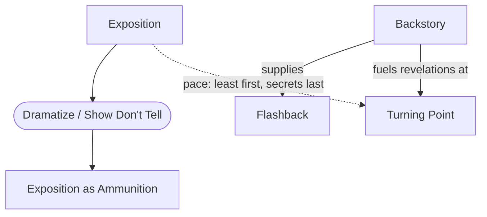

# Chapter 15: Exposition

> 中文版：[[wiki/zh/chapters/chapter-15-exposition|中文]]

## Summary
[[exposition|Exposition]] is the information about setting, biography, and characterization the audience needs to follow the events. McKee's diagnostic: you can judge a writer's craft by the first few pages of a screenplay simply by watching how they handle exposition. Skill means making it *invisible*.

The chapter resolves the "Show, don't tell" maxim into an operational rule: **convert exposition to ammunition** ([[exposition-as-ammunition]]). Characters use what they know to fight for what they want; the audience picks up facts *as a byproduct* of immediate conflict. Pace the exposition: least important facts first, critical facts last, and save the deepest secrets — from the [[backstory]] — for the major [[turning-point|turning points]] and act climaxes.

[[flashback|Flashbacks]], dream sequences, montage, and voice-over are all forms of exposition. Done well they dramatize; done badly they become "table dusting" or a "Classic Comic Book" of pictures narrated in prose.

## Key Concepts Introduced
- **[[exposition]]** — What the audience must know, handled invisibly.
- **[[exposition-as-ammunition]]** — Characters weaponize shared knowledge in conflict.
- **[[flashback]]** — Exposition dramatized as a minidrama with its own inciting incident, progression, and turn.
- Deepened: **[[backstory]]** — The reservoir from which revelations at Turning Points are drawn.
- Deepened: [[principles/dramatize-dont-explain]] — now operationalized as "convert exposition to ammunition."

## Key Examples
- **[[casablanca]]** — The Paris flashback at the opening of Act Two: audience is already burning with curiosity before the flashback starts, so it accelerates rather than slows the pace.
- **[[chinatown]]** — "She's my sister and my daughter" is backstory saved to turn the Act Two Climax.
- **[[the-empire-strikes-back]]** — "I am your father" is exposition reserved for the greatest possible Turning Point.
- *Reservoir Dogs* — Tarantino withholds the first half of the inciting incident (the botched heist) and flashes back to it whenever the present-tense scene needs pace.

## McKee's Core Argument
Never include anything the audience can reasonably assume has happened, and never pass on exposition unless its absence would cause confusion. Create *need and desire to know* by arousing curiosity, then reward the audience with honest revelations. The first principle of temporal art: **save the best for last.**

## Connections to Other Chapters
- Extends [[chapter-08-the-inciting-incident]] — the [[backstory]] introduced there is now operationalized.
- Powers [[chapter-10-scene-design]] and [[chapter-11-scene-analysis]] — revelations are one of the two ways a scene can turn (the other is action).
- Prepares [[chapter-18-the-text]] — dialogue's surface carries invisible exposition as subtext.
- Counterpoints [[chapter-06-structure-and-meaning]] — dramatization is the price of meaning.

## Notable Quotes
- "Skill in exposition means making it *invisible.*"
- "Convert exposition to ammunition."
- "You do not keep the audience's interest by giving it information, but by *withholding* information, except that which is absolutely necessary for comprehension."
- "Save the best for last."
