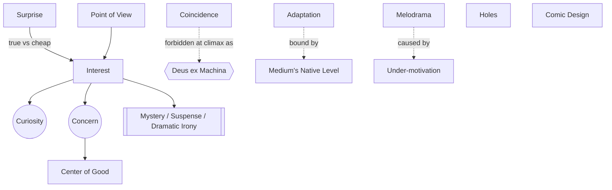

# Chapter 16: Problems and Solutions

> 中文版：[[wiki/zh/chapters/chapter-16-problems-and-solutions|中文]]

## Summary
McKee catalogues eight enduring problems — interest, surprise, coincidence, comedy, point of view, adaptation, melodrama, and holes — and supplies craft-level solutions for each.

Interest requires engaging both sides of human nature: *curiosity* (intellect) and *concern* (emotion). The audience searches the story for the [[center-of-good]], the positive focus toward which emotion flows. Interest is then modulated through three story/audience relationships: [[mystery-suspense-dramatic-irony|Mystery, Suspense, and Dramatic Irony]]. [[surprise|Surprise]] must be true (revealing a buried truth), not cheap (a jolt without insight). [[coincidence|Coincidence]] is welcome early, forbidden at the climax — that sin is *deus ex machina*. [[point-of-view|Point of view]] — writer's, not camera's — is a creative discipline: sticking to the [[protagonist]] earns depth. [[adaptation|Adaptation]] is governed by medium: "the purer the novel, the purer the play, the worse the film." [[melodrama]] is under-motivation, not over-expression. Holes in logic can be forged shut, skimmed over, or admitted and denied. [[comic-design|Comic design]] depends on finding the writer's anger, the comic character's obsession, and the widening gap between expectation and result.

## Key Concepts Introduced
- **[[center-of-good]]** — The positive focal point that captures audience empathy.
- **[[mystery-suspense-dramatic-irony]]** — Three story/audience relationships by which interest is modulated.
- **[[surprise]]** — True surprise exposes a Gap with insight; cheap surprise shocks without meaning.
- **[[coincidence]]** — Usable early to build meaning, fatal at the climax (*deus ex machina*).
- **[[point-of-view]]** — The writer's imagined position, not the camera's shot.
- **[[adaptation]]** — Each medium's power sits on a different level of conflict; translation means reinvention.
- **[[melodrama]]** — Not too much feeling, but too little motivation behind the feeling.
- **[[hole]]** — A logic gap; forge it shut, or admit it.
- **[[comic-design]]** — Angry at society; obsessed characters; scene turns that explode as laughter.

## Key Examples
- *The Godfather*, *White Heat*, *Silence of the Lambs* — [[center-of-good]] located in ostensibly "bad" characters by contrast with worse surroundings.
- *Casablanca*, *Reservoir Dogs*, *Sunset Boulevard* — Mixing the three audience relationships.
- *Jaws* — Coincidence at the Inciting Incident that gathers meaning by staying in the story.
- *Jurassic Park*, *Elephant Walk* — Deus ex machina endings that erase meaning.
- *Casablanca*, [[the-terminator|*The Terminator*]] — Admitted holes that the film denies by naming them.
- *A Fish Called Wanda* — Comic characters defined by their obsessions.

## McKee's Core Argument
Each "problem" of the craft is not an exception to the principles laid out earlier; it is a stress test of them. The solutions do not abandon Turning Points, the Gap, value shift, or dramatization — they apply those principles more rigorously under special pressure.

## Connections to Other Chapters
- Extends [[chapter-14-the-principle-of-antagonism]] — the Center of Good is a mirror of negative force; stronger antagonism deepens it.
- Extends [[chapter-15-exposition]] — audience/story relationships decide *when* to reveal.
- Sharpens [[chapter-10-scene-design]] — comic scene turns exploit the Gap just as dramatic turns do, at a higher pitch.
- Informs [[chapter-19-a-writers-method]] — the adaptation section argues for treatment before dialogue.

## Notable Quotes
- "Above all, we make the audience wait."
- "Melodrama is not the result of overexpression, but of under motivation."
- "Deus ex machina not only erases all meaning and emotion, it's an insult to the audience."
- "Anything human beings can do, they have already done."
