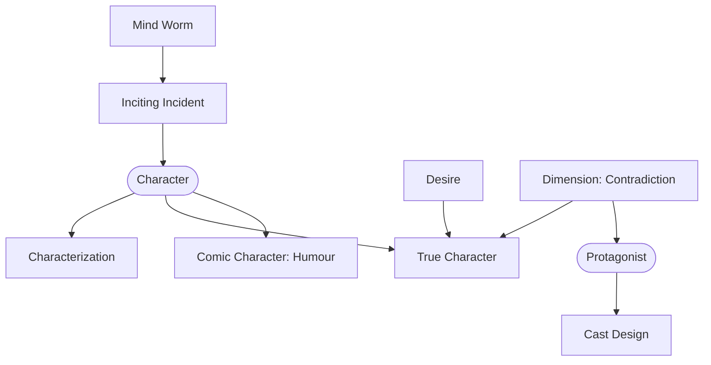

# Chapter 17: Character

> 中文版：[[wiki/zh/chapters/chapter-17-character|中文]]

## Summary
Characters are not human beings; they are works of art — metaphors for human nature, clearer and more knowable than our friends. Chapter 17 assembles the full character toolkit. The writer is a **[[mind-worm]]**, burrowing into a character to craft an [[inciting-incident]] tailored to his unique nature.

McKee sharpens the core distinction: **[[characterization-vs-true-character|characterization]]** is observable (dress, speech, job, personality); **true character** is revealed through **choice in dilemma**, and the pressure of that choice is the deeper the truer. The engine of character is **desire**, conscious and unconscious; the key to motivation is *not* to pin it to a single mono-explanation (childhood trauma is the current cliché), but to leave some mystery.

**[[character-dimension|Dimension]]** — the least understood concept — is **contradiction**, either inside the deep character (guilt-ridden ambition) or between characterization and deep character (the charming thief). These contradictions must be consistent. The protagonist must be the most dimensional character in the cast, or the [[center-of-good]] decenters. **[[cast-design|Cast design]]** is a solar system: supporting characters orbit the protagonist, each drawing out different dimensions of his contradictions.

**[[comic-character|Comic characters]]** are marked by a blind obsession ("humour") they cannot see; recognizing it ends the comedy. Three final tips: leave room for the actor; fall in love with all your characters (especially the villains); and remember that character is self-knowledge.

## Key Concepts Introduced
- **[[mind-worm]]** — The writer's role: burrow into a character, engineer the inciting event that fits him alone.
- **[[character-dimension]]** — Dimension = consistent contradiction; the protagonist must be the most dimensional.
- **[[comic-character]]** — The humour-ridden character who cannot see his obsession.
- Extended: **[[cast-design]]** — The solar-system model of supporting characters.
- Extended: **[[characterization-vs-true-character]]**, **[[protagonist]]** — Sharpened by the dimension rule.

## Key Examples
- *Macbeth* — Ambition contradicted by guilt; the contradiction is the character.
- *Hamlet* — A dozen-plus dimensions; the most complex character ever written.
- [[the-terminator|*The Terminator*]] — Machine/human contradiction in a single supporting role.
- *Blade Runner* — Cautionary example: Roy Batty's dimensionality pulls the [[center-of-good]] away from Deckard.
- *A Fish Called Wanda*, *A Shot in the Dark* — Comic characters defined by their humours.

## McKee's Core Argument
"A character is no more a human being than the Venus de Milo is a real woman." Build the protagonist around a specific desire and a specific contradiction; construct a cast that reflects his dimensions back at him; write from self-knowledge. Love all your creations, or you cannot write them.

## Connections to Other Chapters
- Completes [[chapter-05-structure-and-character]] — structure is character, now anatomized.
- Governed by [[chapter-14-the-principle-of-antagonism]] — dimensions only manifest under pressure this deep.
- Feeds [[chapter-18-the-text]] — character-specific voices come only from in-depth preparation.
- Prepared by [[chapter-08-the-inciting-incident]] — [[cast-design]] first appeared there; here it becomes the whole system.

## Notable Quotes
- "True character can only be expressed through choice in dilemma."
- "Dimension means contradiction."
- "Everything I learned about human nature I learned from me." — Chekhov
- "A character is the choices he makes to take the actions he takes."
