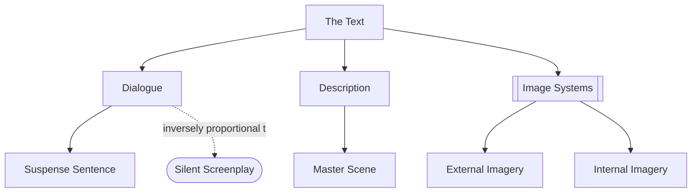

# Chapter 18: The Text

> 中文版：[[wiki/zh/chapters/chapter-18-the-text|中文]]

## Summary
All story design is finally realized on the page. Chapter 18 examines the three layers of the text: **[[dialogue]]**, **[[description]]**, and the poetics of **[[image-systems]]**.

**Dialogue is not conversation.** Where real talk "keeps the channel open," screen dialogue requires compression, direction, and purpose, while sounding natural. It favors short simple sentences — noun, verb, object — and the **[[suspense-sentence]]**, whose meaning is delayed until the last word. Long speeches are broken by action/reaction. The best dialogue is often *no dialogue* — Bergman's waiter-seduction scene (*The Silence*) shows the principle of the **[[silent-screenplay|silent screenplay]]**: image first, dialogue a regretful second choice.

**Description** puts a film in the reader's head — only what can be photographed, in the *vivid present*, in specific nouns and active verbs, with "is/are," "we see/we hear," and most camera notations stripped out. The modern screenplay is a **Master Scene** document: angles are *suggested* by paragraph breaks, not labeled with camera directions.

**Image Systems** are the poetics of cinema: a strategy of motifs, a category of imagery embedded and varied through the film as subliminal communication. Two kinds — **External** (brings in meanings the world already assigns; the student-film hallmark) and **Internal** (invents new meaning for the symbols *within this film alone*). *Les Diaboliques* reverses water's universal positive valence; *Casablanca* weaves imprisonment, America/world, and pairs linked/separated; *Chinatown* orchestrates blind seeing, corrupt contract, water/drought, sexual cruelty/love. An image system *must be subliminal* — recognized symbols go neutral.

Finally: title. To title is to name — something actually in the story (character, setting, theme, or genre), ideally two or more at once.

## Key Concepts Introduced
- **[[dialogue]]** — Screen speech: compressed, directional, purposeful, natural, ideally short.
- **[[description]]** — Vivid present-tense prose capturing only what is on screen.
- **[[image-systems]]** — Subliminal poetics of repeating motifs.
- **[[suspense-sentence]]** — The periodic sentence form that delays meaning.
- **[[silent-screenplay]]** — The principle that image precedes and outranks dialogue.

## Key Examples
- **[[casablanca]]** — Three image systems: imprisonment, America-as-world, linked/separated pairs.
- **[[chinatown]]** — Four image systems: blind seeing, corrupt contract, water/drought, sexual cruelty/love.
- *Les Diaboliques* — Water as a reversed internal symbol.
- *Amadeus* — Salieri's confession as a masterclass in broken long speech.
- *Aliens* — Motherhood image system built from the *Alien* horror system's reinvention.

## McKee's Core Argument
The page must project a film into the reader's imagination. Image outranks speech; dialogue is the *last* layer, added after images and subtext are in place. Poetics — image systems — are not decoration but a depth channel running below the conscious mind. Symbolism that the audience notices as symbolism goes neutral.

## Connections to Other Chapters
- Operationalizes [[chapter-11-scene-analysis]]'s text/subtext — [[dialogue]] is the surface; subtext is what poetry and image carry.
- Executes [[chapter-15-exposition]]'s "invisible exposition" and [[chapter-19-a-writers-method]]'s "dialogue last" rule.
- Completes [[chapter-06-structure-and-meaning]] at the poetic level: [[controlling-idea]] is argued out loud; Image Systems argue in the unconscious.

## Notable Quotes
- "Dialogue is not conversation."
- "Speak as common people do, but think as wise men do." — Aristotle, quoted
- "The best advice for writing film dialogue is *don't.*"
- "An Image System *must be* subliminal. The audience is not to be aware of it."
- "In film, a tree is a tree." — Forman
