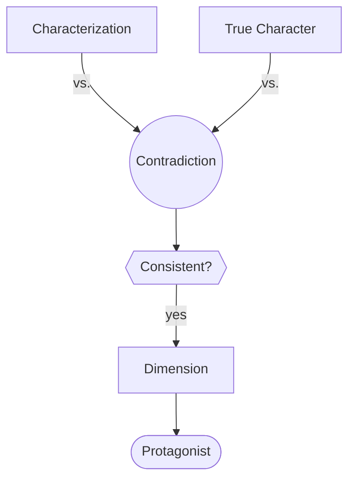

# Character Dimension

> 中文版：[[wiki/zh/characters/character-dimension|中文]]

## Definition
A **dimension** is a *consistent contradiction* in a character, either inside the deep character itself (guilt-ridden ambition) or between the outer characterization and the deep character (a charming thief). Dimensionality is what rivets audience attention. The [[protagonist]] must be the most dimensional character in the cast.

## McKee's Argument
"Dimension" is the least understood concept in character. It is not:
- A list of skills and eccentricities (karate, sax, finance) — that is a decorated name.
- A single dominant trait (Macbeth's ambition alone) — trait theory is "dead wrong." Macbeth without guilt is no play.

Dimension is *contradiction*. Guilt vs. ambition; compassion vs. cruelty; courage vs. fear — held together in a single human being. The contradictions must be consistent (a kind man who kicks a cat in one scene is an accident, not a dimension). Hamlet is ten or twelve dimensions stacked into contradiction; the depth of the role is the depth of those oppositions.

## How It Works
- **Contradict across or within.** Either between what the character appears to be and who they really are, or within the deep character itself.
- **Keep it consistent.** The contradiction must hold across the whole story; sporadic contradictions read as errors.
- **Scale with role.** Protagonist = most dimensional; supporting roles may be one- or two-dimensional; bit parts should be flat but freshly observed.
- **Do not over-dress bit parts.** Giving a cab driver two dimensions makes the audience wait for him to return; if he is a one-scene cameo, keep him flat.
- **Protect the center.** If a supporting character becomes more dimensional than the protagonist, the [[center-of-good]] decenters (the *Blade Runner* / Roy Batty problem).

## Film Examples
- *Macbeth* — Ambition vs. guilt.
- *Hamlet* — Spiritual/blasphemous; tender/sadistic; courageous/cowardly; cautious/impulsive; compassionate/ruthless — a dozen-plus live contradictions.
- *Casablanca* — Rick: cynical/principled; cold/loyal; self-hating/honorable.
- **[[the-terminator]]** — A single-dimension villain done to perfection: machine vs. human.
- *Blade Runner* — Counter-example of a misplaced center: Roy Batty's dimensionality eclipses Deckard's.

## Relationship to Other Concepts
- Built atop the [[characterization-vs-true-character]] distinction.
- Delivered through the [[character-arc]] over time.
- Supported by [[cast-design]]: supporting characters delineate the protagonist's dimensions by acting and reacting.
- Holds the [[center-of-good]] at the protagonist.
- For comedy, dimensionality often pivots on a hidden obsession — see [[comic-character]].

## Common Mistakes
- Confusing traits or quirks with dimensions.
- Choosing a dominant trait and calling it depth.
- Making a contradiction appear once and vanish.
- Over-dimensioning a bit part and creating false anticipation.
- Letting a supporting role out-dimension the protagonist.

## Sources
- *Story* Chapter 17
- *Story* Chapter 5 (foundational true character / characterization distinction)
