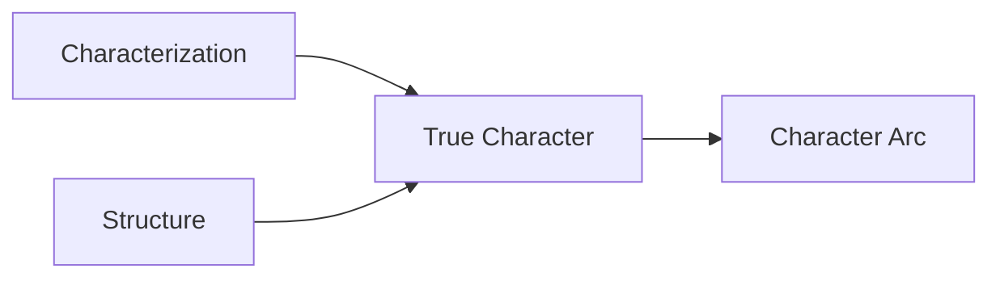

# Characterization vs. True Character

> 中文版：[[wiki/zh/characters/characterization-vs-true-character|中文]]

## Definition

**Characterization** is the sum of all observable qualities — age, IQ, sex, style, education, occupation, personality, values, attitudes. It is the mask, the surface. Every person's unique combination of traits makes their characterization singular.

**True Character** is revealed in the choices a human being makes under pressure. The greater the pressure, the deeper the revelation, the truer the choice to the character's essential nature. Beneath the surface of characterization, regardless of appearances — who is this person? Loving or cruel? Generous or selfish? Strong or weak? The *only* way to know is to witness choices under pressure.

## McKee's Argument

This distinction resolves the "plot vs. character" debate. The confusion exists because people conflate characterization (surface traits) with character (deep nature). Structure *is* character because structure creates the pressure that forces choices. Character *is* structure because choices drive events.

Pressure is essential. Choices made when nothing is at risk mean little. If a character tells the truth when lying would gain nothing, the moment is trivial. But if the same character insists on truth when a lie would save his life, we sense honesty is at his core.

## How It Works

McKee's burning bus thought experiment: a housekeeper (illegal alien, shy, sole family support) and a neurosurgeon (brilliant, wealthy) face a school bus in flames. Each escalating choice — stop or drive by? Call for help or rush in? Save one last child... which one? — strips away the characterization and reveals (or contradicts) what lies beneath. At the deepest level, even unconscious prejudices of gender or ethnicity may surface while performing acts of saintlike courage.

## Film Examples

- **James Bond** — Characterization: lounge lizard in a tuxedo. True character: thinking man's Rambo. The contradiction is an endless pleasure.
- **Rambo** — In *First Blood*, compelling: characterization (Vietnam loner) contradicted by true character (unstoppable killer). In sequels, the two merged into one-dimensional flatness — less dimension than a cartoon.
- **[[the-verdict]]** — Characterization: handsome Boston attorney. True character (first revealed): corrupt, bankrupt, self-destructive drunk. True character (arced): a man willing to fight the establishment for his soul.

## Relationship to Other Concepts

- [[character-arc]] — Arc goes further than revelation: it *changes* the true character
- [[character-revelation]] — The moment when true character contradicts characterization
- [[structure]] — Structure creates the pressure that forces character-revealing choices

## Common Mistakes

- Making characterization and true character match — "like a block of cement, of one substance" — producing boring, predictable roles
- Confusing interesting characterization (quirky traits, colorful backstory) with deep character
- Believing "character-driven" means "characterization-driven" — tissue-thin portraiture with unexpressed deep character

## Sources

- *Story* Chapter 5, "Character versus Characterization"
