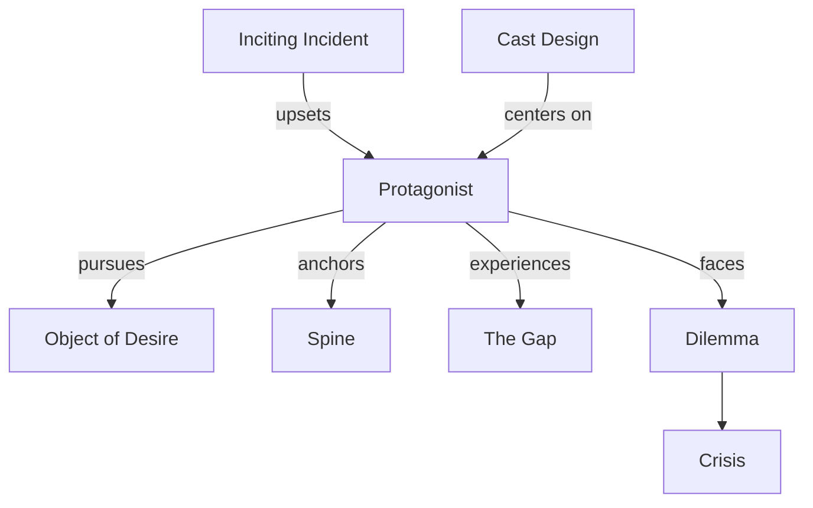

# Protagonist

> 中文版：[[wiki/zh/characters/protagonist|中文]]

## Definition
The **Protagonist** is the willful character with a conscious (and often unconscious) desire who drives the story by pursuing an [[object-of-desire]] against the forces of antagonism. The protagonist need not be a single person — it can be a plural protagonist (a group sharing one desire) or a multi-protagonist story (parallel desires).

## McKee's Argument
McKee defines the protagonist by willpower, conscious desire, possible unconscious desire, capacity to pursue, and empathy. Chapters 10–13 sharpen this further: the protagonist is also the character whose choices under maximum pressure shape the scene turns, the [[dilemma]], and the final [[crisis]]. The story's [[spine]] is the line of that pursuit; the ending reveals what the pursuit has made of the self.

## Variants
- **Single protagonist** — Most common (*Chinatown*, *Kramer vs. Kramer*).
- **Plural protagonist** — A group with one shared desire (*Seven Samurai*).
- **Multi-protagonist** — Parallel stories with separate desires (*Hannah and Her Sisters*, *Pulp Fiction*).

## Film Examples
- *Chinatown* — Jake Gittes: conscious investigation, unconscious self-redemption.
- **[[star-wars]]** — Luke Skywalker is ultimately defined by the quality of his last choice.
- *Tootsie* — Michael Dorsey: conscious desire for work, unconscious desire for integrity in relationship.

## Relationship to Other Concepts
- [[the-gap]] — Opens every time the protagonist acts.
- [[object-of-desire]] — What the protagonist pursues.
- [[spine]] — The line of the protagonist's pursuit.
- [[inciting-incident]] — Radically upsets the protagonist's life balance.
- [[cast-design]] — Is designed around the protagonist.
- [[dilemma]] — Reveals the protagonist's deepest humanity.
- [[crisis]] — The final decision that exposes who the protagonist really is.

## Common Mistakes
- A passive protagonist who is acted upon rather than acts.
- A protagonist with no unconscious depth — flat will.
- Splitting will between two co-leads without choosing a structural protagonist.

## Sources
- *Story* Chapters 7–9 and 13
