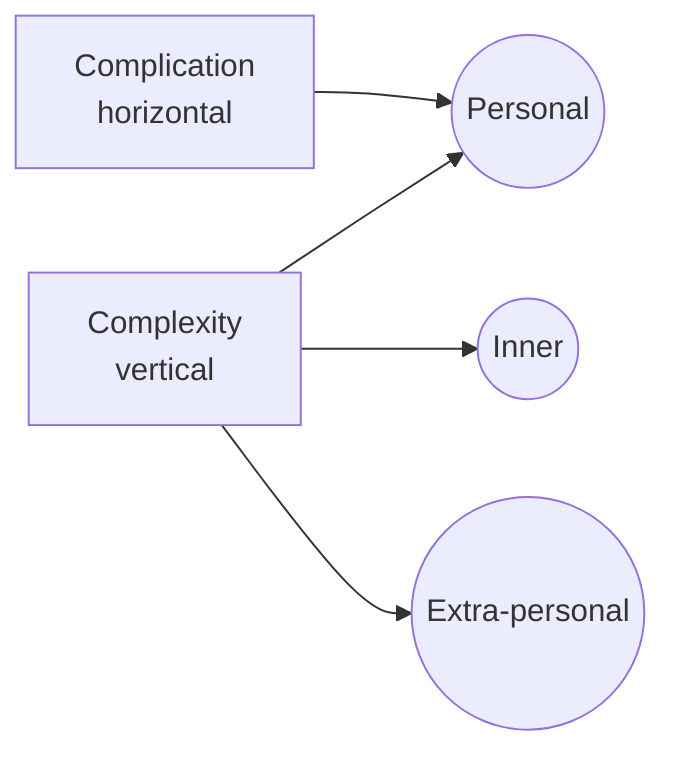

# Complication vs. Complexity

> 中文版：[[wiki/zh/comparisons/complication-vs-complexity|中文]]

## Overview
McKee draws a sharp line between two words often confused: **complication** (horizontal piling-on of obstacles at a single level of conflict) and **complexity** (vertical orchestration of conflict across multiple levels simultaneously).

## Key Differences

| Dimension | Complication | Complexity |
|---|---|---|
| Axis | Horizontal (more of the same) | Vertical (across levels) |
| Source | Piling antagonism on one plane | Antagonism at inner, personal, and extra-personal [[levels-of-conflict]] at once |
| Effect on audience | Exhaustion | Engagement |
| Story form it fits | Action pictures (at their shallowest) | Classical drama |
| Example | Chase after chase, gun after gun | A scene that is simultaneously an inner crisis, a marital crisis, and a societal stake |

## McKee's Position
McKee strongly favors **complexity**. Mere complication, he argues, produces fatigue, not depth. A story earns its length only by orchestrating conflict across all three levels — otherwise it is long, not rich.

## Film Examples
- **Complication (thin):** Many action sequels stack fights without deepening inner or personal stakes.
- **Complexity (rich):** *Chinatown* runs inner guilt, personal romance, and societal corruption through every scene.

## Synthesis
Good [[progressive-complications]] are progressive in *complexity*, not merely in *complication*. The axis that rises across acts is the vertical one.
