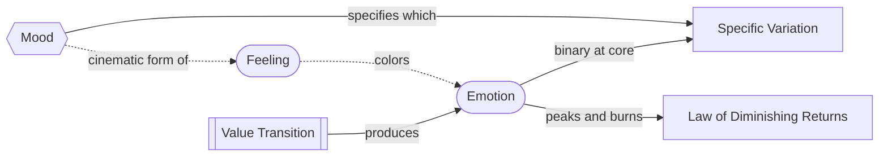

# Emotion vs. Feeling vs. Mood

> 中文版：[[wiki/zh/comparisons/emotion-feeling-mood|中文]]

## Overview

McKee's three concepts are layered, not parallel. **Emotion** is generated by a value transition. **Feeling** is the ongoing inner climate of a life. **Mood** is feeling's cinematic incarnation — light, color, tempo, casting, score. The arc gives the audience the *charge*; the mood gives them the *flavor*; alternation gives them the *rhythm*.

## Key Differences

| Concept | Timescale | Source | Job |
|---|---|---|---|
| **Emotion** | Short — peaks and burns | A value transition in the story | Delivers the basic charge (+ or −) |
| **Feeling** | Long — colors days, weeks, a life | A character's ongoing inner climate | Determines which variation of + or − is felt |
| **Mood** | Pervasive within a scene/sequence | The film's text — light, color, tempo, score, casting | The cinematic form of feeling; specifies emotion |

## McKee's Position

There are only **two emotions** at the core: pleasure and pain. Every other named emotion (ecstasy, dread, anguish, bliss, humiliation) is a *variation*. The basic valence comes from one mechanism — a value [[turning-point|turn]]. The specific flavor comes from another — feeling, expressed in film as mood.

This produces three rules:

1. **No transition, no emotion.** Mood cannot substitute for arc. A scene with rich mood and no value change is decoration, not story.
2. **Mood without arc is a perfume commercial.** A scene with rich mood and no [[turning-point|turn]] feels gorgeous and dead. Cf. [[dramatize-dont-explain]].
3. **Repetition burns the charge.** See [[law-of-diminishing-returns]] — three sad scenes in a row become comic.

## Film Examples

- **The Shawshank Redemption** — *Andy's escape*. The arc carries the emotion: Andy moves from doubly-negative (filth, imprisonment) to ironically positive (freedom, rebirth). Rain, score, narration are mood; the *power* of the moment is the value transition. Strip the mood — same charge, different flavor. Strip the transition — pretty rain, no story.
- **Schindler's List** — *the girl in the red coat*. The arc is Schindler shifting from detachment to implication (negative). The black-and-white mood + the single red coat *specifies* this pain as individuated grief rather than statistical. Different mood = different variation of the same arc.
- **The Godfather** — *the baptism montage*. The arc is positive *for Michael* (consolidating power). The sacred mood (Latin liturgy, organ, candles) flips that triumph into damnation. Mood is so powerful it can specify an emotion the audience almost doesn't want to feel.
- **Inception** — *the four-layer climax*. Same arc (rescue) repeats four times, but each layer has a different mood: van = urgency, hotel = weightless strangeness, snow fortress = tactical clarity, limbo = grief. Mood diversifies what [[law-of-diminishing-returns]] would otherwise burn out.
- **Fight Club** — *the condo explosion*. Same arc (loss) under Fincher's deadpan mood becomes dark liberation rather than grief. Mood contaminates the variation.
- **Inception** — *the final shot*. Arc is positive (Cobb home with kids); mood (held shot on totem, music cut mid-phrase) specifies a pleasure shadowed by uncertainty. Mood can pull *against* the arc that produced it.

## Synthesis

The arc gives the **charge**; the mood gives the **flavor**; alternation gives the **rhythm**.

A diagnostic for any powerful scene: ask first **what value transitioned** (that is the emotion); then ask **what textures colored it** (that is the mood). If you can identify both, you have located the two-part machine. If you can identify only mood, you are watching a perfume commercial.

[[melodrama]] is the failure mode: mood cranked up over a missing arc — feeling without earned cause. The corrective is always [[meaning-produces-emotion|meaning produces emotion]].

## Sources
- *Story* Chapter 6 ([[aesthetic-emotion]])
- *Story* Chapter 13 ([[meaning-produces-emotion]])
- *Story* Chapter 18 ([[image-systems]], mood as text)
- `sources/supplementary/Emotion, feeling, and mood in screenwriting.html`
