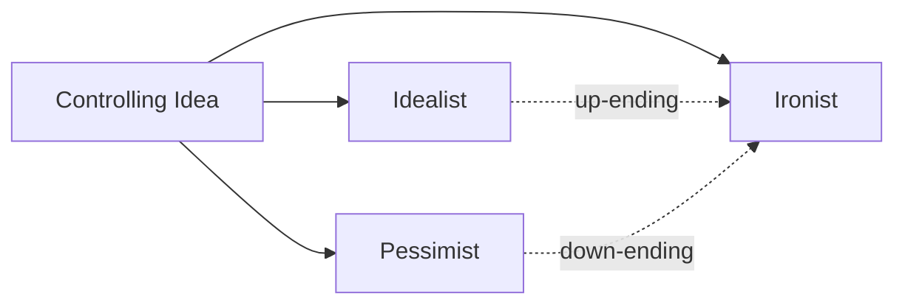

# Idealist vs. Pessimist vs. Ironist

> 中文版：[[wiki/zh/comparisons/idealist-vs-pessimist-vs-ironist|中文]]

## Overview

McKee categorizes writers and their stories into three grand categories based on the emotional charge of their [[controlling-idea|Controlling Idea]]. This framework illuminates how different visions of life produce different kinds of endings and meanings.

## Key Differences

| Dimension | Idealist | Pessimist | Ironist |
|---|---|---|---|
| Ending charge | Positive ("up-ending") | Negative ("down-ending") | Both ("up/down-ending") |
| Vision of life | Optimism, hope, dreams | Cynicism, loss, misfortune | Complexity, duality |
| Life as... | We wish it to be | We dread it to be | It most completely is |
| Difficulty to write | Challenging | Challenging | Most difficult of all |
| Longevity | Variable | Variable | Tends to last longest |

## McKee's Position

McKee does not favor one over another — all three are legitimate — but notes that ironic endings tend to last the longest, travel the widest, and draw the greatest respect. This is because reality is relentlessly ironic: "From the worst of experiences something positive can be gained; for the richest of experiences a great price must be paid."

Irony is the hardest to write for three reasons: (1) a single climactic action must make both a positive and negative statement; (2) both must be *clear* — irony is not ambiguity; (3) the two charges must remain separated in the audience's experience without canceling each other out.

## Film Examples

- **Idealist:** *Hannah and Her Sisters* — "Love fills our lives when we conquer intellectual illusions and follow our instincts"
- **Pessimist:** *Chinatown* — "Evil triumphs because it's part of human nature"
- **Ironist (positive):** *Kramer vs. Kramer*, *Out of Africa*, *Terms of Endearment* — "The compulsive pursuit of contemporary values will destroy you, but if you see this truth in time and throw away your obsession, you can redeem yourself"
- **Ironist (negative):** *Wall Street*, *Nixon*, *All That Jazz* — "If you cling to your obsession, your ruthless pursuit will achieve your desire, then destroy you"

## Synthesis

The three categories reveal McKee's deepest conviction about storytelling and truth: the finest stories hold competing truths in tension. Idealism alone is naive; pessimism alone is incomplete; irony, by embracing both, mirrors the relentless duality of human experience. The ironic Controlling Idea — saying both "and yet" — is the hardest achievement and the most rewarding.
