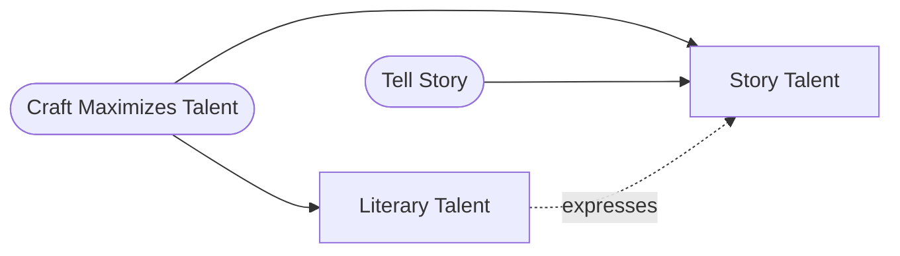

# Literary Talent vs. Story Talent

> 中文版：[[wiki/zh/comparisons/literary-talent-vs-story-talent|中文]]

## Overview

McKee distinguishes two essential but unrelated talents that writers need. Having a mountain of one does not guarantee a grain of the other.

## Key Differences

| Dimension | Literary Talent | Story Talent |
|---|---|---|
| Definition | Creative conversion of ordinary language into higher, more expressive form | Creative conversion of life itself into more powerful, clearer, more meaningful experience |
| Material | Words | Life itself |
| Rarity | Common | Rare |
| Output | Vivid descriptions, captured voices, beautiful prose | Compelling narratives that reshape life into meaning |
| Medium-dependent? | Yes (words) | No (stories can be told through any medium) |

## McKee's Position

Story talent is primary; literary talent is secondary but essential. This principle is "absolute in film and television, and truer for stage and page than most playwrights and novelists wish to admit." Stories don't need to be *written* to be told—they can be expressed through theatre, film, opera, mime, poetry, dance. The material of literary talent is words; the material of story talent is life itself.

However, both are needed. A writer who tells brilliant stories in crude language, or who writes beautiful prose around empty narratives, is incomplete.

## Film Examples

- The coffee machine raconteur: Trivial material ("How I Put My Kids on the School Bus") told brilliantly holds everyone rapt, while profound material (a mother's death) told badly bores the room
- "Given the choice between trivial material brilliantly told versus profound material badly told, an audience will always choose the trivial told brilliantly"

## Synthesis

The distinction reveals McKee's foundational hierarchy: story first, language second. But [[craft-maximizes-talent]]—whatever talent you have, craft is the engine that channels it. The implication: study story craft with the same rigor a musician studies composition.
