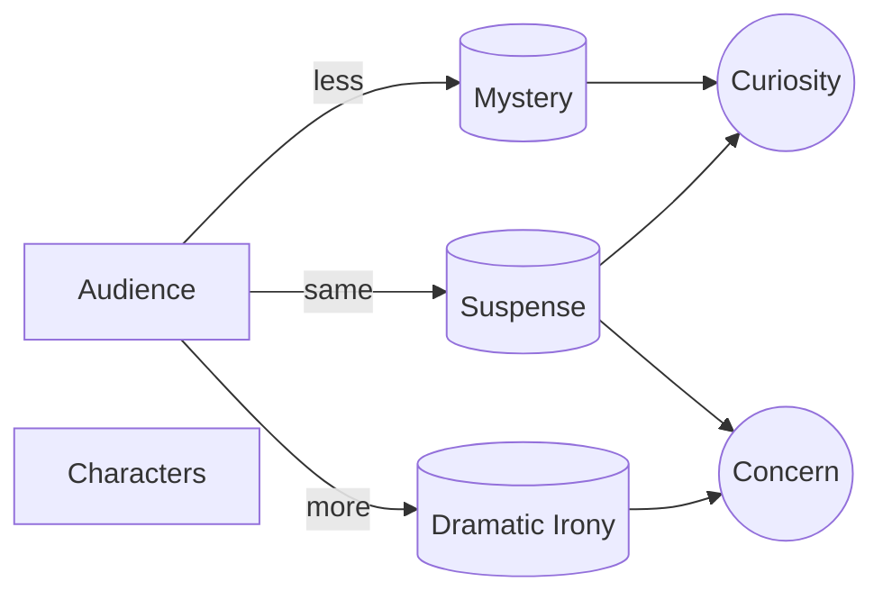

# Mystery vs. Suspense vs. Dramatic Irony

> 中文版：[[wiki/zh/comparisons/mystery-suspense-dramatic-irony|中文]]

## Overview
McKee distinguishes three **story/audience relationships** by which interest is held. They are not genres; they describe the asymmetry of knowledge between characters and audience.

- **Mystery** — Audience knows *less* than the characters. Interest via **curiosity alone**.
- **Suspense** — Audience and characters know the *same* things. Interest via **curiosity + concern**.
- **Dramatic Irony** — Audience knows *more* than the characters. Interest via **concern alone**.

## Key Differences

| Dimension | Mystery | Suspense | Dramatic Irony |
|---|---|---|---|
| Audience vs. character knowledge | Audience behind | Equal | Audience ahead |
| Engine of interest | Curiosity | Curiosity + Concern | Concern |
| Dominant emotion | Puzzle-solving | Anxiety, identification | Dread, compassion |
| Ending can be | Always "up" (detective wins) | Up / Down / Ironic | Up / Down / Ironic |
| Empathy | Sympathy only (detective too perfect) | Full identification | Compassion (we watch them walk in) |
| Relationship to facts | Hides facts (red herrings) | Reveals with characters | Reveals facts upfront, then dramatizes |
| Natural genre | Murder Mystery | Majority of films | Often opens with ending (*Sunset Boulevard*, *Betrayal*) |

## McKee's Position
Ninety percent of films — comedy and drama — operate in **Suspense**. Pure Mystery fits only one genre (the Murder Mystery, in its Closed and Open variants). Dramatic Irony is the least used and most underrated; it trades cheap shock for emotional depth. Most films are Suspense overall but enrich themselves by **mixing**: sequences of Mystery raise curiosity about a fact; sequences of Dramatic Irony draw compassion.

## Film Examples
- **Mystery:** The Closed Mystery of Agatha Christie; the Open Mystery of *Columbo*; *The Usual Suspects* parodies the Closed form.
- **Suspense:** Most of [[chinatown|*Chinatown*]], most of *Jaws*, most action films.
- **Dramatic Irony:** *Sunset Boulevard* (opens with the corpse), *Betrayal* (reverse chronology), and Hitchcock's device of letting us see the bomb under the table.
- **Mixed:** [[casablanca|*Casablanca*]] — Mystery in Act One (who is Rick?), Dramatic Irony in the Paris flashback (we know the ending), Mystery again in Act Three (what has Rick decided?).

## Synthesis
Choose the relationship that maximizes the emotion you want at each moment. When fact matters, hide it (Mystery). When outcome matters, share the facts (Suspense). When inevitability matters and you want the audience to watch a character walk toward what cannot be prevented, give the ending away (Dramatic Irony).

## Sources
- *Story* Chapter 16
