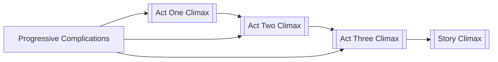

# Act Rhythm

> 中文版：[[wiki/zh/concepts/act-rhythm|中文]]

## Definition
**Act Rhythm** is the pattern by which successive acts rise in intensity and reversal-power so that no act climax repeats the charge of the one before it.

## McKee's Argument
No two consecutive act climaxes can express the same value charge with the same intensity — otherwise the second feels redundant. Classical design orchestrates charges so that each act climax surpasses or sharply reverses its predecessor, and the final act delivers the strongest reversal of all.

## Film Examples
- *Star Wars* — Each act climax (escape from Tatooine, escape from the Death Star, destruction of the Death Star) escalates in stakes and reversal.
- *Tootsie* — Comic reversals intensify act by act toward the on-air reveal.

## Relationship to Other Concepts
- [[act]] — Rhythm is the relation between acts.
- [[progressive-complications]] — Rhythm is the macro shape of progression.
- [[story-climax]] — The last act's climax must be the most powerful.

## Common Mistakes
- Two consecutive acts climaxing on the same value at the same intensity.
- A third act weaker than the second.

## Sources
- *Story* Chapter 9
