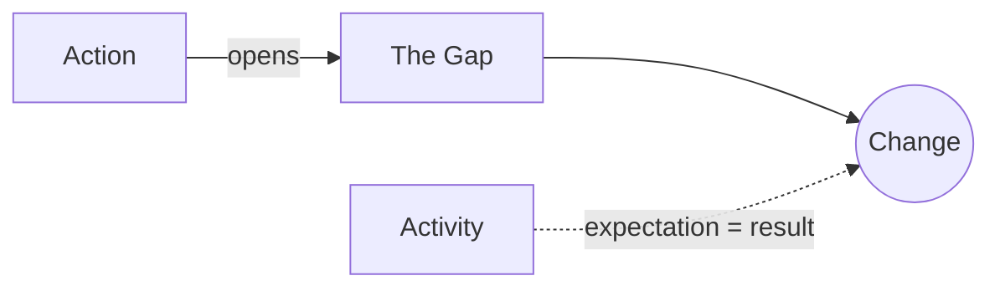

# Action vs. Activity

> 中文版：[[wiki/zh/concepts/action-vs-activity|中文]]

## Definition
**True action** is physical, vocal, or mental movement that opens a [[the-gap|gap]] in expectation and creates significant change. Mere **activity** is behavior in which what is expected happens, generating no change or trivial change.

## McKee's Argument
Fine writing emphasizes **reactions**. What happens is often predictable by genre convention; what matters is to *whom*, *why*, and *how* — the reaction that reveals character and provokes the next gap. An "activity" scene — knock on door, door opens politely, enter — is a "pointless pace killer" any editor would cut.

## Film Examples
- **[[chinatown]]** — Gittes banging on the door is action; if Khan had opened it politely, it would be activity.

## Relationship to Other Concepts
- [[the-gap]] — The test of action: does it open a gap?
- [[story-event]] — A story event is action that changes value-charge.
- [[no-scene-that-doesnt-turn]] — Scenes made only of activity do not turn.

## Common Mistakes
- Filming procedural accuracy for its own sake — "these are eight dead seconds."
- Writing big physical movement that closes no gap (chases that change nothing).

## Sources
- *Story* Chapter 7
