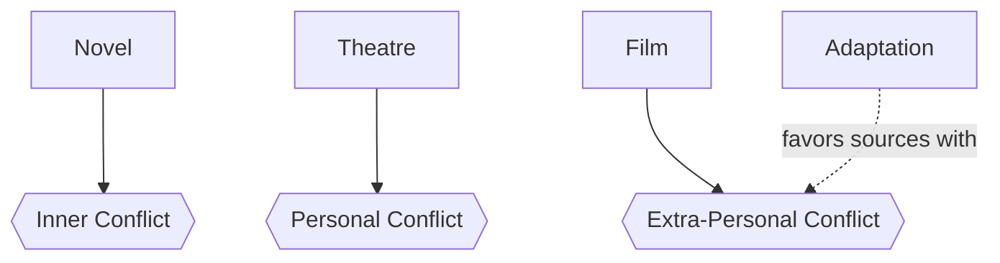

# Adaptation

> 中文版：[[wiki/zh/concepts/adaptation|中文]]

## Definition
**Adaptation** is the translation of a story from one medium to another — typically prose or stage to screen. Each medium does one of the three [[levels-of-conflict]] best, and adaptation is governed by this native-level asymmetry. Good adaptation is closer to **reinvention** than to translation.

## McKee's Argument
- Novels dramatize **inner conflict** through linguistic interior access.
- Theatre dramatizes **personal conflict** through elevated dialogue and live voice.
- Cinema dramatizes **extra-personal conflict** — society, environment, action.

From this: **"The purer the novel, the purer the play, the worse the film."** A novel that lives entirely in inner conflict (Joyce's *Ulysses*) or a play that lives entirely in poetic personal talk (Eliot's *The Cocktail Party*) has no visual equivalence; the adaptation will either collapse or dilute to student-film imitation of a Fellini or Bergman. Works with conflict distributed across all three levels, weighted toward the extra-personal, translate well.

## How It Works
- **Read without notes** until you feel the spirit of the original.
- **Reduce to events.** One or two sentences per event, no psychology.
- **Stress-test the story.** Nine times out of ten, even a beloved novel is not well told as drama; a great novel may be too large for a feature.
- **Reinvent.** Reorder events chronologically, cut, compress, invent scenes. Turn the mental into the physical.
- **Accept deviation.** If reinvention produces an excellent film, the critics forgive departures from the source; if it butchers the original without replacing it with something equal or better, the writer is rightly damned.

## Film Examples
- *The Bridge on the River Kwai* — Boulle's novel spreads conflict across all three levels with an extra-personal emphasis; Foreman's screenplay becomes one of David Lean's finest.
- *Dangerous Liaisons*, *Pelle the Conqueror* — Reinvention radical enough to silence "not like the book" critics.
- Ruth Prawer Jhabvala's Jean Rhys / Forster / Henry James adaptations — the masters of reinvention working on social novelists who already lean toward extra-personal conflict.
- *The Scarlet Letter*, *The Bonfire of the Vanities* — Adaptations that butcher without replacing.

## Relationship to Other Concepts
- Governed by the [[levels-of-conflict]] and each medium's native strength.
- A form of [[creative-limitation]] — the discipline of a fixed-length film around existing material.
- Produces [[text-and-subtext]] by forcing mental life into visual expression.

## Common Mistakes
- Choosing a "pure" literary work expecting cinematic equivalence.
- Trying to translate prose free-association into flutter cuts and voice-over.
- Refusing to cut, invent, or restructure out of reverence for the source.
- Stacking voice-over narration so the film becomes an illustrated audiobook.

## Sources
- *Story* Chapter 16
