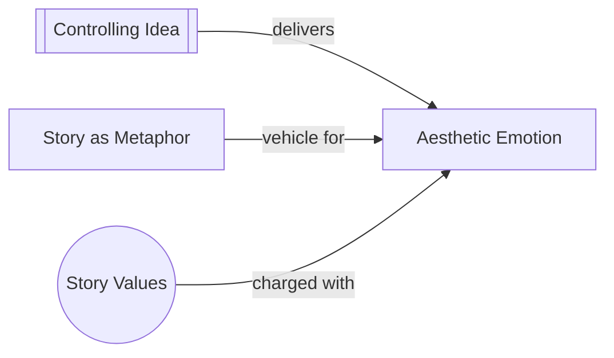

# Aesthetic Emotion

> 中文版：[[wiki/zh/concepts/aesthetic-emotion|中文]]

## Definition

Aesthetic emotion is the simultaneous encounter of thought and feeling — the fusion of idea and emotion that art creates and life rarely does. In life, experiences become meaningful with reflection in time; in art, they are meaningful *now, at the instant they happen.*

## Concept Map

## McKee's Argument

Aristotle asked: why do we react differently to death in the street versus death in Homer? Because in life, mind and passions revolve in different spheres, rarely coordinated. Your intellectual life prepares you for emotional experiences that then urge fresh perceptions — but first one, then the other. Moments that blaze with a fusion of idea and emotion are so rare in life that when they happen, you think you're having a religious experience.

Art unites what life separates. When an idea wraps itself around an emotional charge, it becomes more powerful, more profound, more memorable. "You might forget the day you saw a dead body in the street, but the death of Hamlet haunts you forever."

Story is first, last, and always the experience of aesthetic emotion. It does not express ideas in dry intellectual arguments (not anti-intellectual, but nonintellectual). The exchange between artist and audience works directly through senses, perception, intuition, and emotion — no mediator needed.

## How It Works

- A well-told story triumphs in the marriage of the rational with the irrational
- It gives you what life cannot: meaningful emotional experience *in the moment*
- Neither purely emotional nor purely intellectual — it calls upon sympathy, empathy, premonition, discernment, and our innate sensitivity to truth

## Film Examples

<!-- TODO: add specific film example — McKee discusses this concept at a philosophical level rather than through specific films -->

## Relationship to Other Concepts

- [[controlling-idea]] — The Controlling Idea is the specific meaning delivered through aesthetic emotion at climax
- [[story-as-metaphor]] — Story as metaphor for life produces aesthetic emotion by harmonizing what we know with what we feel
- [[story-values]] — Values provide the emotional charge that fuses with the idea

## Sources

- *Story* Chapter 6, "Aesthetic Emotion"
