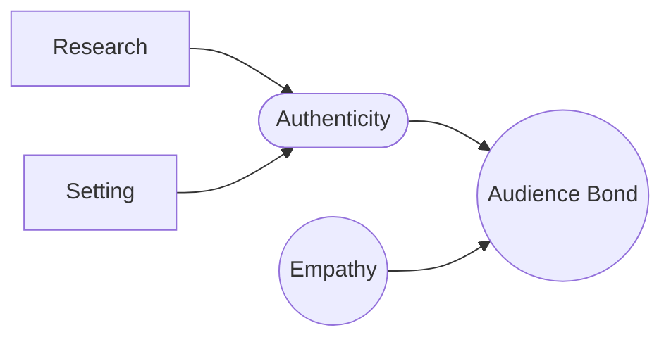

# Authenticity

> 中文版：[[wiki/zh/concepts/authenticity|中文]]

## Definition
**Authenticity** is the internal consistency of a story's world — true to itself in scope, depth, and detail — that earns the audience's willing suspension of disbelief.

## McKee's Argument
The audience enters every story through two gates: **empathy** (with the [[protagonist]]) and **authenticity** (of the world). The moment authenticity fails, empathy dissolves. Authenticity is *not* actuality: a story set in a world that could never exist can be absolutely authentic (*Alien*). The key is the **telling detail** — a few selected details that let the audience's imagination supply the rest. Authorship breeds authority, and authority breeds authenticity: "*This writer knows.*"

## Film Examples
- *Alien* — The "truck driver" crew, the acid blood: O'Bannon's research of his creature and its world yields complete authenticity.
- Bergman, *Through a Glass Darkly* — Extreme economy; trust in the urbane audience to fill in.

## Relationship to Other Concepts
- [[setting]] — The field in which authenticity is built.
- [[research]] — How authenticity is earned.
- [[war-on-cliche]] — Cliché is the failure of authenticity.
- [[story-obeys-its-world]] — The principle that authenticity obeys.

## Common Mistakes
- Literal "realism" that over-researches surface to no thematic end.
- Over-exposition that buries the telling detail in clutter.

## Sources
- *Story* Chapter 8
