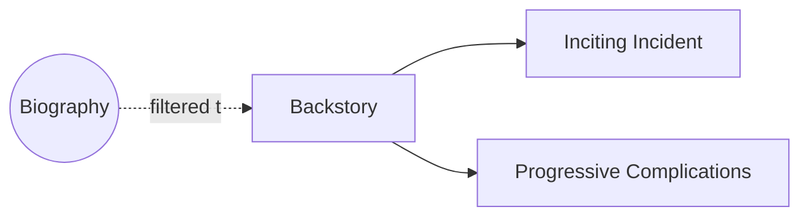

# Backstory

> 中文版：[[wiki/zh/concepts/backstory|中文]]

## Definition
**Backstory** is the set of significant events that occurred in the characters' past that the writer can *use* to build the story's progressions. It is **not** biography or life history.

## McKee's Argument
Characters don't arrive from a void — they arrive from a landscape of past events. But only events the writer will later *harvest* belong in the backstory. The distinction matters: biography is a warehouse, backstory is a tool chest.

## Film Examples
- *Chinatown* — Gittes's past failure in Chinatown is the backstory that gives the climax its weight.
- *Ordinary People* — The elder son's drowning and Beth's response is the backstory that shapes the entire drama.

## Relationship to Other Concepts
- [[inciting-incident]] — The Central Plot's inciting incident must be onscreen, but subplots' incidents and backstory events are in the past.
- [[authenticity]] — Backstory depth feeds the world's credibility.
- [[foreshadowing]] — Backstory events are often the material of foreshadowing.

## Common Mistakes
- Dumping biography as exposition.
- Building backstory with events you never intend to harvest.

## Sources
- *Story* Chapter 8
