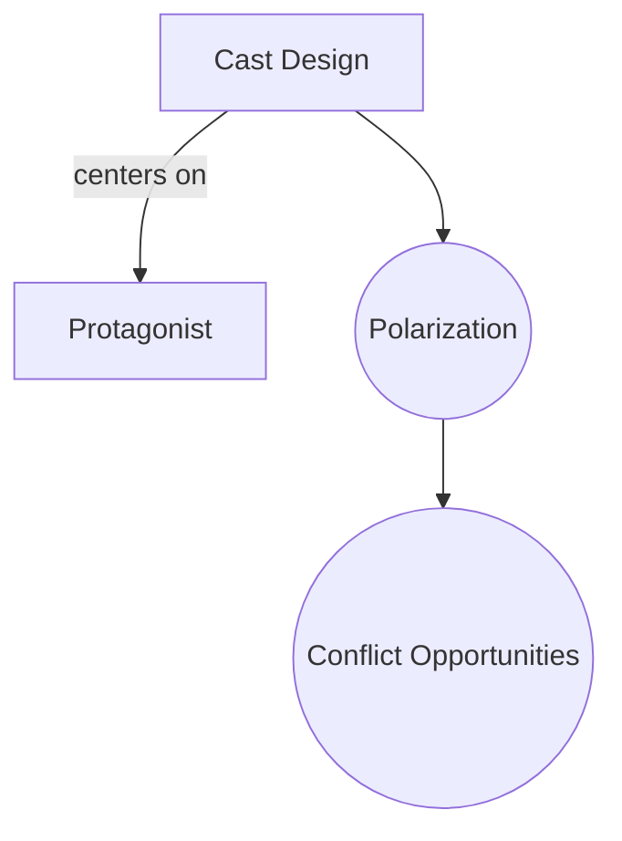

# Cast Design

> 中文版：[[wiki/zh/concepts/cast-design|中文]]

## Definition
**Cast Design** is the deliberate construction of a story's ensemble so that each role exists by purpose. The first principle is **polarization** — a network of contrasting or contradictory attitudes among characters.

## McKee's Argument
If two characters share the same attitude and react the same way, one must be collapsed into the other or expelled; otherwise conflict opportunities are minimized. The ideal cast, seated at dinner, produces a separate and distinct reaction from each character to the same event. McKee's Iowa-family-vs-Hollywood thought experiment: the unanimous polite family yields no scenes; the polarized family yields three.

## Film Examples
- *The Breakfast Club* — Each archetype reacts differently to the same detention.
- *Hannah and Her Sisters* — Polarized attitudes among the sisters generate distinct plotlines.

## Relationship to Other Concepts
- [[protagonist]] — The axis of cast design.
- [[authenticity]] — Polarized reactions make the world feel real.
- [[setting]] — Drives what attitudes are available.

## Common Mistakes
- "Yes-men" supporting characters who react in concert with the protagonist.
- Splitting one attitude across two characters.

## Sources
- *Story* Chapter 8
