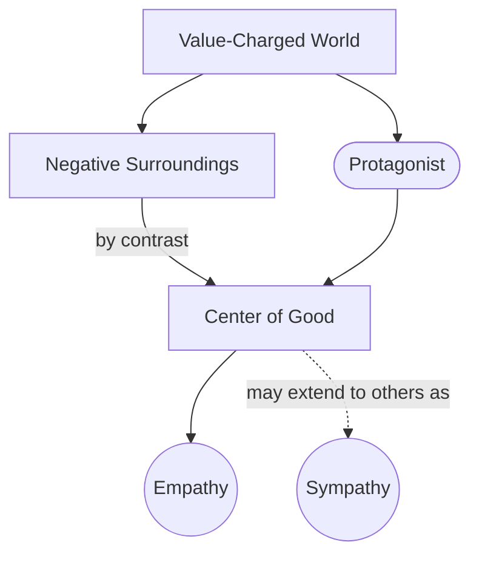

# Center of Good

> 中文版：[[wiki/zh/concepts/center-of-good|中文]]

## Definition
The **Center of Good** is the positive focal point an audience instinctively seeks as it scans a story's value-charged landscape. Emotion flows to this center. Empathy *must* attach to the [[protagonist]] here; sympathy may spread to others.

## McKee's Argument
Each of us believes our own heart is in the right place, however flawed our behavior. Hitler believed he was saving Europe. An audience enters every story looking for the positive — not "the good guy," but the focal point that is *good relative to the rest of this world.* "Good" is defined as much by what surrounds it as by what it is. Accordingly, the Center of Good can be placed in gangsters, psychopaths, or lovers born of a death camp, provided the universe around them is rendered even more negative.

## How It Works
- **Build the negative world first.** The Center of Good is relational. Dark surroundings are what make the positive legible.
- **Locate the positive quality.** One redeeming virtue is enough: loyalty (*The Godfather*), humor and calm (Hannibal Lecter), genuine love (*The Night Porter*), leadership (Cody Jarrett).
- **Concentrate it in the protagonist.** Empathy must attach to the protagonist; other characters can become secondary centers of good (e.g., a dual center in *Silence of the Lambs*).
- **Avoid "niceness."** The Center of Good is about valuation, not pleasantness. A pleasant hero in a pleasant world is weightless.
- **Let it be tested.** The Center of Good is what the [[forces-of-antagonism]] drive toward — the final proving of its value.

## Film Examples
- *The Godfather* — Loyalty locates the Corleones as the relative center of good in a universe of betrayers.
- *White Heat* — Cody Jarrett's leadership, wit, and familial love mark him as the center of good among weak-willed allies and lackluster pursuers.
- *Silence of the Lambs* — Dual center: Clarice's courage and Lecter's calm intelligence. Both are positively charged against a depraved surround.
- **[[casablanca]]** — Rick's integrity becomes visible because of the fascist tyranny around him.

## Relationship to Other Concepts
- Anchors audience interest via **concern** (the emotional pole of the Curiosity/Concern pair).
- Complement to the [[forces-of-antagonism]] — the two define each other.
- Expressed through the [[protagonist]]'s [[characterization-vs-true-character|true character]], not through niceness.
- Governed by the [[principle-of-antagonism]]: stronger antagonism lets a more extreme center be plausibly positive.

## Common Mistakes
- Equating Center of Good with likability.
- Placing the Center of Good in a supporting character without realizing empathy is leaking away from the protagonist (the *Blade Runner* problem with Roy Batty).
- Leaving the surrounding world too bright; the positive focus has nothing to define it against.

## Sources
- *Story* Chapter 16
