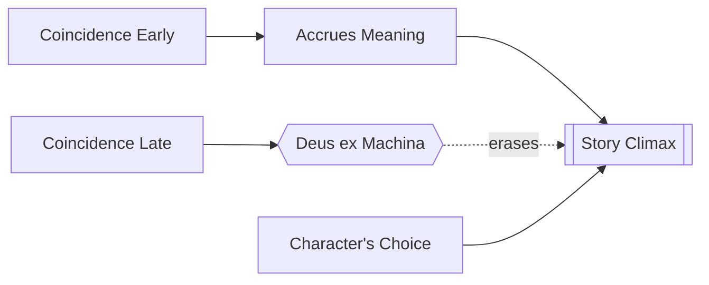

# Coincidence

> 中文版：[[wiki/zh/concepts/coincidence|中文]]

## Definition
**Coincidence** is the random, absurd collision of things in the universe — meaningless in itself. In story, its role is heavily regulated: usable to *start* meaning, forbidden as the means to *end* it. Ending on coincidence is the writer's greatest sin: *deus ex machina.*

## McKee's Argument
Story creates meaning; coincidence, meaningless, would seem the enemy. Yet coincidence is a part of life. The solution is to dramatize how a coincidence enters meaninglessly and **accrues meaning** as it stays in the story. Coincidence introduced early can gather significance; coincidence at the climax erases the moral weight of the whole film, because it releases the protagonist from the responsibility of choice.

## How It Works
- **Bring coincidence in early.** Let it stay and gather meaning through the protagonist's struggle with it.
- **Do not dismiss coincidence.** A coincidence that pops in, turns a scene, and pops out registers as authorial convenience.
- **Rule of thumb: no coincidence beyond the midpoint.** From there, put the story in the hands of the characters and their choices.
- **Never end on coincidence.** Climaxes must come from character action under pressure.
- **Antistructure exception.** Antiplot films may substitute coincidence for causality end to end; the meaning generated is precisely "life is absurd" — a legitimate [[controlling-idea]].
- **Comedy tolerates more.** A comic climax may use coincidence if (a) the protagonist has suffered enough, and (b) he never despairs. The audience is then willing to grant him a break.

## Film Examples
- **[[jaws]]** — The shark eating a swimmer is a coincidence at the Inciting Incident. It stays in the story, takes on intent, and becomes an icon of malice.
- *Jurassic Park*, *Hurricane*, *Elephant Walk*, *The Postman Always Rings Twice*, *The Unbearable Lightness of Being* — Climactic coincidences that erase meaning.
- *The Gold Rush* — A permissible comic coincidence (the blizzard drops Chaplin onto a gold mine) because of prior suffering and relentless hope.
- *Weekend*, *After Hours* — Antiplot films that run on coincidence by design.

## Relationship to Other Concepts
- Managed against the [[story-climax]] — climactic meaning must come from character under pressure, not from random event.
- Bears on the [[inciting-incident]] — coincidence there is fine if it then stays and gathers meaning.
- Must not short-circuit the [[law-of-conflict]] — coincidence cannot substitute for antagonism.
- Governs what [[controlling-idea]] a film is allowed to make: a deus ex machina ending cannot argue anything coherent.

## Common Mistakes
- Deus ex machina at the climax, dressed up as an "act of god."
- Drop-in coincidences used to solve structural problems in the middle acts.
- Confusing coincidence with surprise — surprise must come from the Gap, not from randomness.

## Sources
- *Story* Chapter 16
