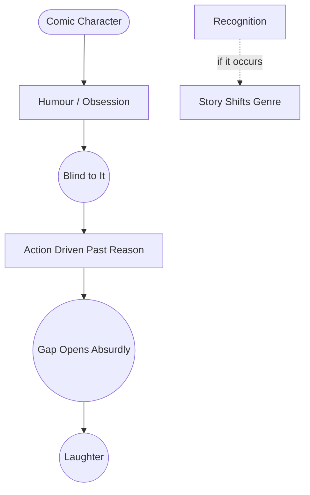

# Comic Character

> 中文版：[[wiki/zh/concepts/comic-character|中文]]

## Definition
A **comic character** is a character defined by a **blind obsession** — a Renaissance-era "humour" — that he does not see. The comic character pursues desire in the same way the dramatic character does, but he cannot step back from risk to ask, "this could get me killed." His obsession drives him past the point of self-preservation and into the comic scene turn.

## McKee's Argument
When the Aristophanic and Menandrian comic traditions ebbed, Renaissance writers — Molière, Shakespeare, Jonson, later Shaw, Wilde, Chaplin, Allen — rediscovered that a **humour** is the key. A comic protagonist has one obsession he cannot see: avarice (*The Miser*), hypochondria (*The Imaginary Invalid*), misanthropy (*The Misanthrope*), the fear of embarrassment (Archie Leach in *A Fish Called Wanda*).

The most important rule: **the moment the comic character recognizes his obsession, the comedy ends.** When Archie names his fear of embarrassment, he transforms from comic protagonist to romantic lead ("Cary Grant"). If Archie Bunker were to turn to a neighbor and say "You know, I am a racist hate monger," *All in the Family* would become a drama.

## How It Works
- **Assign one humour.** A single blind obsession fits the whole character's life.
- **Keep him blind.** The character must not see his own obsession; others may.
- **Let the obsession drive.** Where a dramatic character might step back, the comic character leans in.
- **Contrast humours.** Multiple comic characters each with a distinct humour create the orchestra (*A Fish Called Wanda*: language, intellect, animals, embarrassment).
- **Only recognize deliberately.** Recognition is available as a tool to end the comedy and switch genres; do not trip into it by accident.

## Film Examples
- *A Fish Called Wanda* — Four humours in opposition.
- *A Shot in the Dark* — Clouseau's humour: belief he is the world's perfect detective.
- Molière's *The Miser, The Imaginary Invalid, The Misanthrope* — The humour structure perfected on stage.
- *All in the Family* — Archie Bunker's buffoon-bigotry humour, never recognized.

## Relationship to Other Concepts
- The character half of [[comic-design]].
- A special form of [[character-dimension]]: the contradiction is between what the character does and what he refuses to see.
- Lives in the gap between [[characterization-vs-true-character|characterization and true character]], with true character hidden not from the audience but from the character himself.
- Widens [[the-gap]] between expectation and result into laughter.

## Common Mistakes
- Creating a wacky character with a list of quirks instead of a single binding humour.
- Allowing the comic protagonist to narrate his own self-awareness.
- Mixing in dramatic self-reflection that kills the obsession's momentum.
- Assigning multiple humours to one character, diffusing the comedy.

## Sources
- *Story* Chapter 17 (The Comic Character)
- *Story* Chapter 16 (Problem of Comedy)
