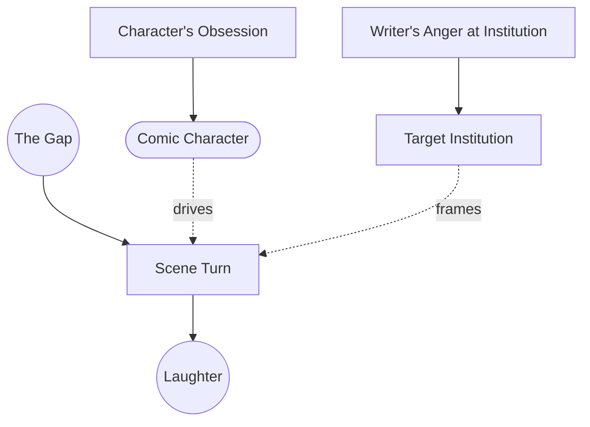

# Comic Design

> 中文版：[[wiki/zh/concepts/comic-design|中文]]

## Definition
**Comic design** is the craft of a story built to produce laughter. It obeys the same structural principles as drama — turning points, Gap, value change — but adds three distinctive attributes: social-institutional target, obsessed characters, and scene turns that burst the Gap wide open for laughs.

## McKee's Argument
The comic sensibility is the frustrated idealist: the world *should* be perfect, but it is greedy, corrupt, and absurd. To fix weak comedy the writer asks, "What am I angry about?" and picks the social institution whose hypocrisy heats the blood. Titles frequently name the target: *The Ruling Class*, *M\*A\*S\*H*, *Animal House*, *Network*, *Dr. Strangelove*.

Comic *characters*, unlike dramatic characters, possess a blind obsession — a **humour** — that they cannot see. The moment a comic character recognizes his obsession, the comedy ends (Archie Leach in *A Fish Called Wanda* turns from comic protagonist to romantic lead once he names his fear of embarrassment).

Comic *structure* tolerates more than dramatic structure does. Scenes may exist just for the laugh with no story function; some coincidence is allowed; even a deus ex machina is permissible if the protagonist has suffered enough and never despairs. But the turn of a scene is identical to drama: the Gap cracks open, only instead of insight it erupts as laughter.

## How It Works
- **Find the anger.** Identify the institution whose folly provokes you; write against it.
- **Give the protagonist a humour.** One blind obsession that he cannot see.
- **Design every scene to turn.** Ask for each action, "What's the opposite of that? Now what's off-the-wall from that?"
- **Build the Gap wider and more absurd.** Comedy is drama at a higher pitch of expectation/result mismatch.
- **Permit narrative intrusions.** If a sketch is drop-dead funny and adds nothing to the plot, it may still belong — so long as the film remains a *story*, not a sketch reel.
- **Test by pitching.** A true comedy makes listeners laugh *while you pitch the story*, without quoting dialogue. If they don't laugh, you have written a dramedy, a crimedy, or something else — not a comedy.

## Film Examples
- [[trading-places|*Trading Places*]] — Attacks the ruling class; its comedy lives in a widening Gap.
- *A Fish Called Wanda* — Four obsessions orchestrated against each other: language, intellect, animals, embarrassment.
- *The Miser*, *The Imaginary Invalid* — Molière's humour-based design.
- *Little Shop of Horrors* — The dentist-and-masochist scene: no plot function, pure comic turn.
- *The Gold Rush* — Permissible comic deus ex machina after sufficient suffering.

## Relationship to Other Concepts
- Built on [[the-gap]] and the [[turning-point]] at higher amplitude.
- Requires the [[comic-character]] with a humour.
- Can still carry a [[controlling-idea]] — the angry idealist's argument against a specific social folly.

## Common Mistakes
- Writing jokes in search of a story, rather than a story that turns into jokes.
- Letting the comic protagonist see his obsession too early.
- Mistaking wit for comic design — *Annie Hall* (Dramedy) and *Lethal Weapon* (Crimedy) are hybrids, not true comedies.
- Attempting a "nice" comedy with no angry target — the laughter has nothing to push against.

## Sources
- *Story* Chapter 16 (Problem of Comedy)
- *Story* Chapter 17 (Comic Character)
